<table>
<tr>
<Table>
  <tr>
    <td><a href= "https://gerandofalcoes.com//"></td>
    <td>
      
    </td>
  </tr>
</table>

# Nome do Projeto

## Nome do Grupo

## :student: Integrantes:

- <a href="https://www.linkedin.com/in/username/">Nome</a>
- <a href="https://www.linkedin.com/in/username/">Nome</a>
- <a href="https://www.linkedin.com/in/username/">Nome</a>
- <a href="https://www.linkedin.com/in/username/">Nome</a>
- <a href="https://www.linkedin.com/in/username/">Nome</a>
- <a href="https://www.linkedin.com/in/username/">Nome</a>

## Sumário

- [Nome do Projeto](#nome-do-projeto)
  - [Nome do Grupo](#nome-do-grupo)
  - [:student: Integrantes:](#student-integrantes)
  - [Sumário](#sumário)
- [1. Termos e Abreviações](#1-termos-e-abreviações)
- [2. Visão Geral do Projeto](#2-visão-geral-do-projeto)
  - [2.1 Entendimento da Demanda](#21-entendimento-da-demanda)
    - [2.1.1 Partes Interessadas](#211-partes-interessadas)
    - [2.1.2 Análise da Indústria](#212-análise-da-indústria)
  - 
  - 
      - [2.1.2.1 Contexto da Indústria](#2121-contexto-da-indústria)
      - [2.1.2.2 Modelo de Negócio](#2122-modelo-de-negócio)
      - [2.1.2.3 Tendências](#2123-tendências)
  - [2.2 Problema](#22-problema)
    - [2.2.1 Análise do Problema](#221-análise-do-problema)
    - [2.2.2 Análise do Cenário (Matriz SWOT - FOFA)](#222-análise-do-cenário-matriz-swot---fofa)
    - [2.2.3 Matriz de Porter](#223-matriz-de-porter)
  - 
- [3. Proposta da Solução](#3-proposta-da-solução)
  - [3.1 Descritivo Geral da Solução](#31-descritivo-geral-da-solução)
  - [3.2 Proposta Tecnológica e Benefícios](#32-proposta-tecnológica-e-benefícios)
    - [3.2.1 Tipo de arquitetura de nuvem escolhida](#321-tipo-de-arquitetura-de-nuvem-escolhida)
    - [3.2.2 Arquitetura de nuvem escolhida](#322-arquitetura-de-nuvem-escolhida)
    - [3.2.3 Benefícios trazidos pela arquitetura de nuvem proposta](#323-benefícios-trazidos-pela-arquitetura-de-nuvem-proposta)
  - [3.3 Proposta de Valor (Value Proposition Canvas)](#33-proposta-de-valor-value-proposition-canvas)
  - [3.4 Matriz de Risco](#34-matriz-de-risco)
- [4. Análise de experiência do usuário](#4-análise-de-experiência-do-usuário)
  - [4.1 Perfis de Usuários](#41-perfis-de-usuários)
  - 
  - 
  - 
  - [4.2 Personas](#42-personas)
  - 
  - 
  - [4.3 Mapa de jornada do usuário](#43-mapa-de-jornada-do-usuário)
- [5. Requisitos](#5-requisitos)
  - [5.1 Requisitos Funcionais](#51-requisitos-funcionais)
  - [5.2 Requisitos não Funcionais](#52-requisitos-não-funcionais)
  - [5.3 Casos de Uso](#53-casos-de-uso)
    - [5.3.1 Histórias de Usuário](#531-histórias-de-usuário)
- [6. Projeto de Solução](#6-projeto-de-solução)
  - [6.1 Diagrama de Classes](#61-diagrama-de-classes)
    - [6.1.1 Diagrama de Classes de Domínio](#611-diagrama-de-classes-de-domínio)
    - [6.1.2 Diagrama de Classes de Implementação](#612-diagrama-de-classes-de-implementação)
  - [6.2 Diagrama de Componentes da Arquitetura](#62-diagrama-de-componentes-da-arquitetura)
  - [6.3 Diagrama de Implantação](#63-diagrama-de-implantação)
  - [6.4 Tecnologias e Ferramentas](#64-tecnologias-e-ferramentas)
- [7. Interface](#7-interface)
  - [7.1 Design System](#71-design-system)
  - [7.2 Projeto de Interface (Wireframes)](#72-projeto-de-interface-wireframes)
  - [7.3 Frontend](#73-frontend)
- [8. Projeto de Banco de Dados](#8-projeto-de-banco-de-dados)
  - [8.1 Modelo Conceitual](#81-modelo-conceitual)
  - [8.2 Modelo Lógico](#82-modelo-lógico)
- [9. Testes de Software](#9-testes-de-software)
  - [9.1 Demonstração da integração](#91-demonstração-da-integração)
  - [9.2 Teste de Integração](#92-teste-de-integração)
  - [9.3 Testes automatizados](#93-testes-automatizados)
  - [9.4 Testes de Usabilidade](#94-testes-de-usabilidade)
  - [9.5 Testes de Requisitos Não Funcionais](#95-testes-de-requisitos-não-funcionais)
- [10. Procedimento de Implantação da Solução](#10-procedimento-de-implantação-da-solução)
  - [10.1 Procedimento de Implantação do Sistema](#101-procedimento-de-implantação-do-sistema)
  - [10.2 Procedimento de Implantação do Banco de Dados](#102-procedimento-de-implantação-do-banco-de-dados)
  - [10.3 Documentação Automática do Sistema (Swagger)](#103-documentação-automática-do-sistema-swagger)
- [Referências](#referências)
- [Apêndice](#apêndice)

# 1. Termos e Abreviações
<conteúdo>
# 2. Visão Geral do Projeto

&nbsp;&nbsp;&nbsp;&nbsp;Considerando a problemática relacionada à gestão deficiente e à presença de dados desatualizados ou incorretos na rede de franquias de ONGs vinculada à Gerando Falcões, identificou-se a oportunidade de implementar soluções automatizadas. Essa necessidade emergiu como um desafio a ser enfrentado, levando à proposição da criação de uma plataforma web pelo grupo de desenvolvimento.

&nbsp;&nbsp;&nbsp;&nbsp;A tarefa designada ao grupo consiste no desenvolvimento de uma solução tecnológica dedicada a lidar especificamente com a problemática de gestão e dados. Essa iniciativa busca proporcionar uma abordagem mais eficiente e precisa para a administração das operações das ONGs franqueadas, visando superar as limitações associadas à falta de adoção de tecnologias de gerenciamento administrativo por parte dos líderes.

## 2.1 Entendimento da Demanda
&nbsp;&nbsp;&nbsp;&nbsp;O atual contexto da franquia de ONGs vinculada à Gerando Falcões revela uma demanda premente por soluções eficientes de gerenciamento administrativo. A maioria dos líderes na rede, responsáveis por conduzir as operações locais, demonstra uma taxa de adoção inferior a 20% em relação a ferramentas tecnológicas para a gestão de atendimentos e dados. Este cenário compromete a capacidade das organizações em mensurar de maneira abrangente o impacto real de suas atividades nos territórios atendidos.

&nbsp;&nbsp;&nbsp;&nbsp;A falta de letramento digital e tempo por parte dos líderes, predominantemente voltados para a assistência direta às comunidades, evidencia a necessidade de uma abordagem simplificada e eficaz para o gerenciamento administrativo. A ausência de dados precisos sobre a quantidade de atendidos, seus perfis, necessidades e a frequência dos serviços prestados cria uma lacuna significativa na compreensão e otimização das atividades desenvolvidas pela Gerando Falcões.

&nbsp;&nbsp;&nbsp;&nbsp;A demanda, portanto, concentra-se no desenvolvimento de um SaaS(*Software as a service*) ou sistema web, acessível e intuitivo, capaz de atender às especificidades das ONGs franqueadas, aliviando a carga administrativa sobre os líderes e permitindo uma gestão mais eficiente e transparente. Essa abordagem visa não apenas preencher a lacuna operacional, mas também potencializar o impacto positivo da organização, possibilitando que os líderes concentrem seus esforços na assistência direta às comunidades em situação de vulnerabilidade.

### 2.1.1 Partes Interessadas
&nbsp;&nbsp;&nbsp;&nbsp;Nesta seção, destacamos as partes envolvidas que desempenham papéis cruciais no projeto. A empresa parceira Gerando Falcões assume a responsabilidade de identificar os desafios e preencher o TAPI (Termo de Abertura de Projeto). O corpo docente e o escritório de projetos da instituição INTELI desempenham um papel central na negociação com a empresa parceira, oferecendo assistência durante o desenvolvimento do projeto e atuando como a ligação entre os alunos e as empresas reais. Essa ponte facilita a identificação de problemas a serem resolvidos. O grupo de desenvolvimento Asas Solidárias contribui ativamente com sua experiência técnica e soluções inovadoras, trazendo uma perspectiva valiosa ao projeto. A colaboração sinérgica entre essas partes interessadas é crucial para garantir o sucesso e o alinhamento do projeto com seus objetivos.

### 2.1.2 Análise da Indústria
&nbsp;&nbsp;&nbsp;&nbsp; Pesquisamos a respeito de três players da indústria das organizações sem fins lucrativos. De certa forma, elas não competem entre si, pois suas atividades envolvem voluntários e democratização da educação, saúde, alimentação e recursos para necessitados.

- Médicos Sem Fronteiras (MSF) Brasil: MSF é uma organização médica internacional que fornece ajuda humanitária em todo o mundo. Eles trabalham em áreas de conflito, epidemias e crises humanitárias, fornecendo cuidados médicos essenciais. No Brasil, a MSF tem uma presença ativa e realiza projetos de ajuda humanitária. Na pandemia, teve forte presença com a contribuição de alimentos, mascáras e roupas. Entretanto, seu principal objetivo é promover a saúde em casos de castástrofes, epidemias, fome e exclusão social. Sua presença é maior em países que vivem em conflito armado e regiões de fome e extrema pobreza.

  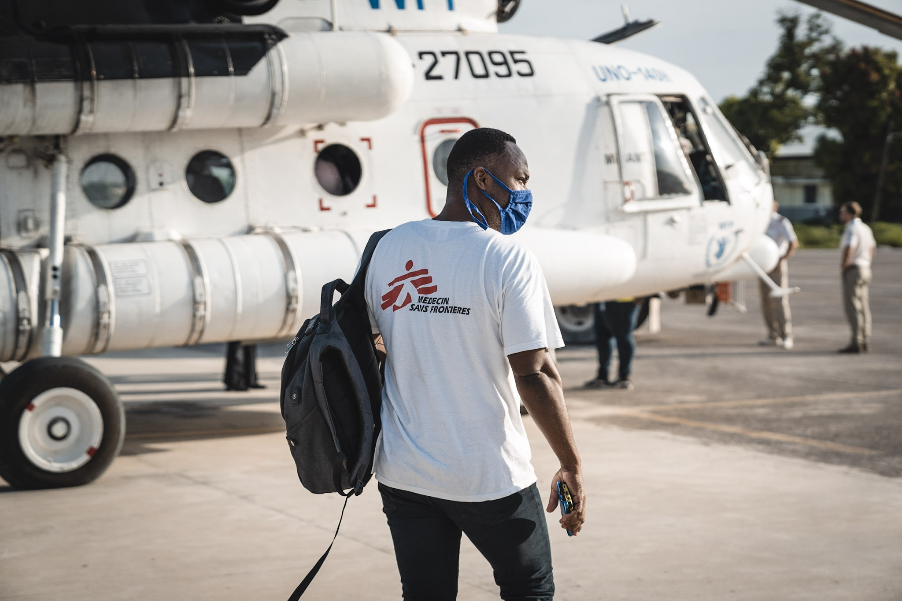

##
- Greenpeace Brasil: Greenpeace é uma organização ambiental global que trabalha para promover a paz, proteger o meio ambiente e enfrentar questões relacionadas às mudanças climáticas. A filial brasileira do Greenpeace está envolvida em diversas campanhas ambientais, visando a conservação da biodiversidade e a promoção de práticas sustentáveis. No Brasil, atua principalmente na luta pela preservação da floresta Amazônica e da mata atlântica. Conta principalmente com o apoio do governo local, ONGs associadas e campanhas que que transitam principalmente em escolas e univerdades.

  

##
- Cruz Vermelha Brasileira: A Cruz Vermelha é uma organização humanitária presente em diversos países, incluindo o Brasil. Ela atua em situações de emergência, desastres naturais e conflitos, prestando assistência médica e fornecendo ajuda humanitária para comunidades afetadas. Essa organização atua em parceria com a MSF, promovendo apoio para locais extremos. A contribuição não se limita a assistência médica, pois a Cruz Vermelha contribui principalmente com a colaboração de psicólogos para fornecer apoio e estruturação mental em meio à cenários catastróficos.

  

  
 
#### 2.1.2.1 Contexto da Indústria 

&nbsp;&nbsp;&nbsp;&nbsp;A Gerando Falcões é um ecossistema de desenvolvimento social nascido e aprimorado nas favelas do Brasil. Indo contra o estigma social que todos os jovens nascidos e criados na favela estão associados à criminalidade e falta de ambição, a Gerando Falcões acredita no potencial do jovem da favela, o inserindo em um ecossistema que o impulsione a ser um líder transformador em sua comunidade através do acesso a uma educação socioemocional, educação profissional, acesso ao trabalho e tecnologias. 
&nbsp;&nbsp;&nbsp;&nbsp;Quando se fala em impacto social a longo prazo, a Rede é uma das mais relevantes no meio social. A ONG nasceu em 2011 e 10 anos depois, alcançou um aumento de 510% no número de favelas onde atua, totalizando 1.700 favelas - equivalente a 13,1% desses núcleos em território nacional - no ano de 2021.
&nbsp;&nbsp;&nbsp;&nbsp; Em matéria para Exame, Edu Lyra - fundador da ONG - conta que a ONG foi fundada em 2011, na Cidade Kemel, bairro periférico de Poá, contudo, a história da Gerando Falcões começou com uma iniciativa que oferecia atividades extracurriculares para crianças e adolescentes, além de qualificação profissional para jovens e adultos dos entornos. 

#### 2.1.2.2 Modelo de Negócio

&nbsp;&nbsp;&nbsp;&nbsp;Diferentemente de ONG's que têm o seu modelo de negócios focado em doações ou Lei de Incentivo - renúncia fiscal por parte do Poder Executivo de recursos que deveriam ser arrecadados de pessoas e empresas, ou seja, o governo abre mão de receber parte dos impostos para incentovar projetos sociais - a Gerando Falcões trabalha no modelo similar ao de franquias. A ideia é replicar o modelo de ONG em outros territórios brasileiros para apoiar mais famílias. Em 2018, em entrevista para Veja São Paulo, Lyra afirma que garantiu apoio de quatro investidores para a expansão de 10 unidades de ONG's em 5 anos, que são: Carlos Wizard Martins, dono de marcas como Mundo Verde e Taco Bell; Jorge Paulo Lemann, da Kraft Heinz e da Ambev; Daniel Castanho, presidente da Ânima Educação; e Flávio Augusto, proprietário da Wise Up e do Orlando City Soccer Club. 
&nbsp;&nbsp;&nbsp;&nbsp;Aprofundando um pouco mais no modelo de negócios da Gerando Falcões, seu pilar de sustentação financeira engloba alguns eixos, como:
* Parcerias;
* Doação PF e PJ;
* Bazar Gerando Falcões;
* MArca Própria/Loja Oficial;
* Investimento Privado;
* Órgãos Governamentais (Leis de Incentivo). 
&nbsp;&nbsp;&nbsp;&nbsp;A prática da diversificação monetária é importante pela diminuição dos riscos de perder capital em alguma modalidade e eleva a chance do dinheiro trabalhar em favor do seu negócio resultando em eficiência. 
&nbsp;&nbsp;&nbsp;&nbsp;Desta forma, a ONG não trabalha somente na diversificação monetária com o intuito de proteger o capital de seu negócio de terceiro setor, como também diversifica os trabalhos realizados dentro de suas operações para alcançar e desenvolver diferentes públicos e pessoas dentro das favelas do Brasil. De acordo com o próprio site da Gerando Falcões, pode-se encontrar as frentes trabalhadas nas favelas, sendo elas:
* Favela 3D - Tranformação das favelas em ambientes dignos, digitais e desenvolvidos;
* Falcons University - Capacitação de lideranças com grandes nomes do mercado em uma universidade de ensino da favela para a favela;
* Bazar GF - Arrecadação de diversos itens para serem revendidos em um Bazar com preço acessível; 
* Rede de Líderes - Lideranças focadas em expandir as unidades próprias e aceleradas da ONG. 
&nbsp;&nbsp;&nbsp;&nbsp;Percebe-se a eficiência do modelo de negócios da Gerando Falcões quando o IDIS, Instituto para o Desenvolvimento Social, foi responsável pela Avaliação de Impacto das Oficinas de Esporte e Cultura com crianças e adolescentes e do Programa de Qualificação Profissional com jovens e adultos realizado na Gerando Falcões entre 2020 e 2021. Utilizando a metodologia SROI, *Social Return on Investment*, foi demonstrado que a cada R$ 1,00 investido nas iniciativas, R$ 3,50 são gerados na forma de benefício para a sociedade. Também foi identificado que o investimento da Gerando Falcões “paga-se socialmente” (payback) já no 2º ano após o investimento. Sendo assim, os resultados não refletem somente a quantidade de atividades oferecidas, mas a qualidade e adequação aos públicos e territórios. 

#### 2.1.2.3 Tendências

&nbsp;&nbsp;&nbsp;&nbsp;Se faz comum a prática das inovações e tendências de mercado para que cada vez os empreendimentos sejam mais competitivos e agreguem mais valor de mercado com base no seu produto ou serviço. Desta maneira, será abordada algumas tendências que a Gerando Falcões utiliza em seu modelo de negócios ou que está caminhando para serem implementadas. 

1. ONG's Autossustentáveis:

&nbsp;&nbsp;&nbsp;&nbsp;Assim como a Fundação Estudar, outro modelo de ONG que impacta de forma extremamente positiva o Brasil, as organizações têm mudado sua forma de captação de recurso, pois a prática de recursos beneficentes por meio de doações momentâneas é um sistema falho, pois não garante a perenidade e planejamento financeiro devido. A Rede Filantropia, plataforma de disseminação de conhecimento técnico para o Terceiro Setor, fala sobre o assunto e como a tendência de unificar o empreendedorismo, a visão de negócio, planejamento e gestão ao Terceiro Setor leva à organização um novo nível para manter as suas atividades. 

2. Eventos de Gala: 

&nbsp;&nbsp;&nbsp;&nbsp;Uma prática que está cada vez mais se tornando comum no meio do Terceiro Setor são os jantares ou eventos de Gala, que reúnem pessoas de classes sociais de poder econômico mais elevadas para serem agentes transformadores, mobilizando capital ou doação intelectual como consultorias e mentorias para as organizações. Anualmente, a Gerando Falcões realiza o Favela Gala que reúne empresários e celebridades para realizar leilões com objetivo principal de captar doações visando inserção do capital nos projetos sociais da ONG. Em 2023, o evento arrecadou o valor recorde de R$ 34 milhões, superando o valor de R$ 20 milhões em 2022, segundo reportagem da CNN Brasil. 

3. Conexão entre Empresas, Governo e Terceiro setor:

&nbsp;&nbsp;&nbsp;&nbsp;A própria Gerando Falcões, em janeiro de 2024, no último workshop da primeira semana no Inteli, alegou que existe uma boa prática no Terceiro para entender com quais Instituições as ONG's e pessoas impactadas estão inseridas e absorvendo auxílio, seja este educacional, profissional ou emocional. Além disso, a Gerando Falcões está cada vez mais próxima de empresas e governo para impactar positivamente as populações da favela, como o caso da Favela 3D.  
&nbsp;&nbsp;&nbsp;&nbsp;O slogan "Juntos vamos transformar a pobreza das favelas em peça de museu, antes de Marte ser colonizado" demonstra a priorização da sociedade moderna em financiar diversas pesquisas tecnológicas voltadas à colonização de Marte pela perspectiva de término da Terra. Contudo, Edu Lyra retoma a corrida social para cuidar do planeta e garantir o fim da desigualdade social. Desta forma, o intuito é trazer diversos atores e lideranças empresariais, governamentais e sociais para discutir e trabalhar uma favela inovadora e digna com a construção de moradias e revitalização urbana. 
&nbsp;&nbsp;&nbsp;&nbsp;Um grande exemplo é a comunidade de 200 famílias em Ferraz de Vasconcelos que foi revitalizada pelo projeto Favela 3D, recebendo representantes do governo, sociedade civil e do terceiro setor. Foi investido R$ 5 milhões da Sabesp na comunidade para instalação de rede de coleta e tratamento de esgotos. Além disso, a iniciativa proporcionou capacitação profissional e acesso a empregos, acesso gratuito à internet Wi-Fi, serviços de telemedicina, CEP digital, ecopontos, novas moradias e iluminação sustentável, entre outras melhorias de fortalecimento social e econômico, segundo artigo do Portal do Governo São Paulo. A flexibilidade do governo na tomada de decisões e empresas apoiando-as financeiramente, faz com que milhares de vidas sejam impactadas pelas atividades exercidas na Gerando Falcões e em outras ONG's apoiadas pela organização. 

## 2.2 Problema

&nbsp;&nbsp;&nbsp;&nbsp;Atualmente, a organização parceira Gerando Falcões enfrenta o desafio crítico em que mais de 80% dos líderes em sua rede de ONG's não utilizam uma solução tecnológica para gerir seus atendimentos locais. Essa lacuna tem impactos significativos na gestão das ONGs, bem como na avaliação precisa do impacto da Gerando Falcões nos territórios em que atuam. A ausência de uma solução eficaz prejudica a capacidade de responder perguntas essenciais sobre os atendidos pela ONG, incluindo quantidade, identidade, perfil de atendimento e frequência, gerando regularmente dados defasados ou que não ilustram a realidade.

### 2.2.1 Análise do Problema

&nbsp;&nbsp;&nbsp;&nbsp;Considerando que a organização parceira configura-se como uma rede de ONGs, na qual as abrangidas recebem apoio financeiro, material e treinamentos da Gerando Falcões, a ausência de dados referentes a essas parceiras surge como uma preocupação prioritária. Este cenário adquire relevância, uma vez que a sede depende de informações e métricas para quantificar a extensão dos parceiros, as pessoas impactadas e direcionar seus recursos de maneira eficiente. A falta de uma solução tecnológica para o gerenciamento administrativo por mais de 80% dos líderes na rede resulta em uma deficiência significativa na gestão operacional das ONGs, comprometendo a capacidade de avaliar o impacto real no território. 

&nbsp;&nbsp;&nbsp;&nbsp;A carência de respostas para questões essenciais, como a quantidade de atendidos, suas identidades, perfis de atendimento e frequência, cria uma lacuna significativa na compreensão e otimização das atividades da Gerando Falcões. Além disso, para compreender o motivo deste problema é importante considerar o perfil da persona líder nesse contexto. Muitas vezes, esses líderes são indivíduos altamente comprometidos com a causa social e dedicam a maior parte de seu tempo e energia ao trabalho direto com as comunidades assistidas pela ONG. Eles podem não possuir letramento digital ou tempo disponível para se envolver em tarefas administrativas que demandam habilidades técnicas específicas. Para eles, o foco principal está em oferecer suporte e assistência às pessoas em situação de vulnerabilidade, e não em lidar com aspectos burocráticos ou tecnológicos da gestão.

&nbsp;&nbsp;&nbsp;&nbsp;Essa preferência em priorizar o contato direto com os beneficiários em detrimento da gestão administrativa pode resultar em uma subutilização dos recursos disponíveis e uma falta de transparência na prestação de contas. Portanto, é crucial encontrar maneiras de simplificar e automatizar os processos administrativos, garantindo que os líderes das ONGs possam concentrar seus esforços naquilo que mais importa: o apoio e a transformação das vidas daqueles que atendem.

### 2.2.2 Análise do Cenário (Matriz SWOT - FOFA)
&nbsp;&nbsp;&nbsp;&nbsp; A análise SWOT é uma ferramenta capaz de descrever características sociais, econômicas e políticas que influenciam em relação ao mercado no qual atua. Nesse caso, a Gerando Falcões, uma instituição sem fins lucrativos que atua no setor social e cultural, promovendo atividades recreativas e agregando valor dentro das favelas do Brasil. A matriz SWOT tem papel fundamental na construção da análise estratégica das ONGs por estabelecer bases formídaveis da visão futura da instiuição. Apontando as forças, fraquezas, oportunidades e ameaças (FOFA) do mercado. Sendo assim, toda visão estratégica pode ser aplicada e distribuída dentro dessas análises, de modo que o time enxergue o mesmo propósito, vantagens e desvantagens do setor de atuação.

  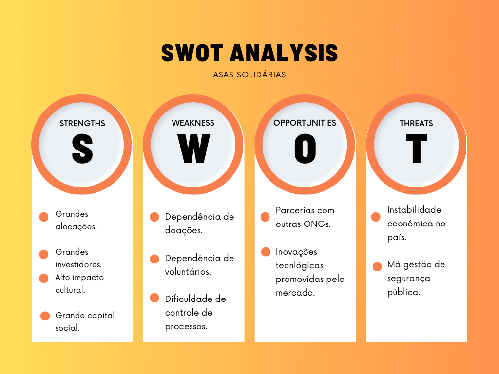

&nbsp;&nbsp;&nbsp;&nbsp; Strengths:
- Um número grande de locações onde eles se encontram,atendendo muitas favelas no Brasil todo.
Experiência de atuação: a Gerando Falcões atua no “mercado” desde 2011 e é considerado uma  grande ONG, tendo atuado em diferentes cenários.
- Possui grandes colaboradores e investidores: Google, Fundação Telles, Pizza Hut, Havaianas, Subway entre outros grandes nomes.
- Alto impacto cultural: a Gerando Falcões já trabalhou em mais de 5558 favelas alcançadas, evidenciando excelência e profissionalismo.
- Alto capital social: a GF tem uma grande rede de networking social que facilita a troca de parcerias e investidores.

&nbsp;&nbsp;&nbsp;&nbsp; Weaknesses: 
- Dependência de doações - instituição sem fins lucrativos
- Dependência de voluntários de serviço ou colaborações
- Falta de conhecimento na captação de recursos: algumas ongs podem enfrentar problemas financeiros por não conhecerem as melhores estratégias de captação de recursos derivados de doações ou fundos de arrecadação. 
- Dificuldade no controle de processos: por possuir muitas ONGs assosicadas, a GF não possuí o controle total dos processos que ocorrem entre alunos e professores.

&nbsp;&nbsp;&nbsp;&nbsp; Opportunites:
- A GF promover parcerias com outras ONGs, instituições públicas ou privadas e doadores para aumentar o alcance e o engajamento nas comunidades. Promovendo maiores recursos financeiros e alcance social.
- O mercado promover inovações tecnológicas que facilitam os processos internos das ONGs.

&nbsp;&nbsp;&nbsp;&nbsp; Threats:
- Instabilidade e recesso econômico que geram desafios de doações e parcerias para a GF.
- Má gestão da segurança pública que pode gerar riscos para a atuação da GF e outros ONGs associadas nas comunidades. 

### 2.2.3 Matriz de Porter
&nbsp;&nbsp;&nbsp;&nbsp; Contextualização:
 A Matriz 5 Forças nos permite analisar quem são os concorrentes da GF, o poder dos clientes e fornecedores, e oportunidades que podem aparecer com tempo. As 5 forças, nos permite ter uma visão mais ampla do ambiente em que a empresa está inserida, identificando potenciais ameaças e oportunidades que podem não ser imediatamente óbvias.

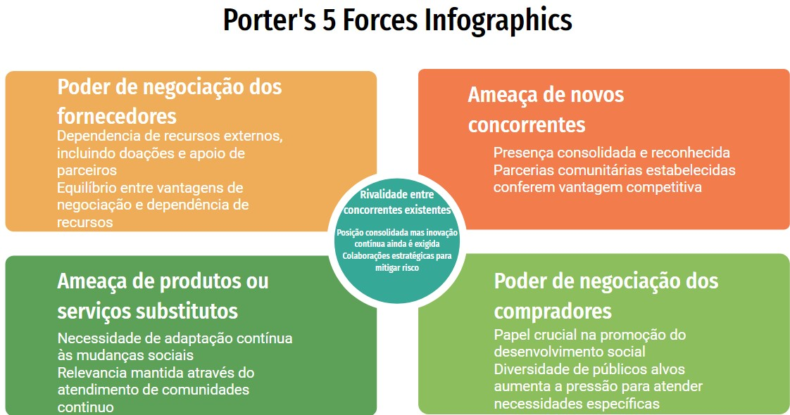

&nbsp;&nbsp;&nbsp;&nbsp; **Ameaça de Novos Concorrentes: Baixa**

A Gerando Falcões possui uma presença consolidada e reconhecida sendo uma ONG que atua em comunidades a muito tempo. A ameaça de novos concorrentes é baixa, sendo uma organização muito bem estabelecida e cheia de parceiros e doadores, e seu estilo de ajudar ONGs menores a se desenvolverem acabam colocando a GF em uma posição muito boa e competitivamente díficil de alcançar.

&nbsp;&nbsp;&nbsp;&nbsp; **Poder de Negociação dos Fornecedores: Moderada**

A Gerando Falcões, ao estabelecer um sistema de parcerias doadores, empresas e instituições, possui poder de negociação moderado. A dependência de recursos externos e a necessidade de cooperação podem limitar a flexibilidade nas negociações.

&nbsp;&nbsp;&nbsp;&nbsp; **Poder de Negociação dos Compradores: Alto**

Dado o papel crucial da organização na promoção do desenvolvimento social, a pressão para atender às necessidades específicas das comunidades e ONGs podem ser altas. A diversidade de clientes e suas demandas específicas aumenta a complexidade das operações e a dificuldade em atender a todos de maneira eficaz.

&nbsp;&nbsp;&nbsp;&nbsp; **Ameaça de Produtos ou Serviços Substitutos: Alta**

A constante evolução das necessidades e desafios nas comunidades e ONGs carentes cria uma ameaça significativa de substituição para os serviços oferecidos pela Gerando Falcões. A organização precisa se manter atualizada com as mudanças nas dinâmicas sociais e explorar novas abordagens para garantir sua relevância.

&nbsp;&nbsp;&nbsp;&nbsp; **Rivalidade entre os Concorrentes Existentes: Baixa**

Embora a rivalidade direta possa ser baixa devido à posição consolidada da Gerando Falcões, sua atuação através de parcerias, outras ONGs e seus parceiros diminuem ainda mais o risco.
##
&emsp;&emsp; Compreendendo a análise das Cinco Forças de Porter para a Gerando Falcões, observa-se que o equilíbrio entre as diversas forças competitivas desempenha um papel significativo na configuração do ambiente estratégico da organização. A ameaça moderada de novos concorrentes e a pressão considerável do poder de negociação dos compradores e de produtos substitutos ressaltam a importância contínua de inovação e adaptação para a ONG. A aplicação das Cinco Forças de Porter é crucial para a compreensão do cenário competitivo, fornecendo orientação na formulação de estratégias eficazes que estejam alinhadas com os desafios e oportunidades específicos do contexto em que a Gerando Falcões atua.

# 3. Proposta da Solução
&emsp; A proposta de solução apresenta uma visão ampla das estratégias e abordagens escolhidas para atender às necessidades do parceiro Gerando Falcões. As informações apresentadas nos tópicos a seguir demonstrarão uma compreensão do planejamento construído para o desenvolvimento do projeto, explorando as principais funcionalidades planejadas, tecnologias que serão utilizadas, valor proporcionado pelo produto para o cliente final e a análise dos riscos do projeto.
## 3.1 Descritivo Geral da Solução
&emsp; Com o intuito de abordar os desafios identificados na seção 2.2 e atender às necessidades da organização Gerando Falcões, será desenvolvido uma plataforma web conectada à nuvem. Esta plataforma proporcionará às ONGs o controle integral de sua gestão, tornando viável administrar seus membros, designando-os para oficinas e aulas, além de receber alertas para monitorar eventos incomuns, como a frequente ausência de um aluno. 

&emsp; Além disso, as ONGs conseguirão criar suas próprias oficinas, inserindo detalhes e formando turmas, o que permitirá que o sistema crie automaticamente as aulas. Dentro de cada encontro, os facilitadores encontrarão campos para anotar observações, registrar fotos e realizar a presença dos alunos.

&emsp; A solução também incluirá uma página dedicada às estatísticas, onde tanto as ONGs quanto a Gerando Falcões terão acesso às métricas relevantes dispostas em dashboard. Esta seção oferecerá a funcionalidade de filtragem, permitindo uma análise detalhada das estatísticas por gênero, faixa etária, raça, estado e período.

&emsp; O planejamento desse projeto foi cuidadosamente realizado levando em consideração as demandas da Gerando Falcões e suas organizações parceiras. Ao fornecer ferramentas simples e intuitivas, a solução visa facilitar e engajar os processos realizados pelas ONGs, incentivando a manter uma gestão eficaz e aumentar seu impacto nas regiões atendidas.

## 3.2 Proposta Tecnológica e Benefícios

&nbsp;&nbsp;&nbsp;&nbsp;;O projeto desenvolvido em parceira com a ONG Gerando Falcões, trata-se de um sistema web SaaS (Software as a Service) que permite aos usuários se conectar e usar aplicativos baseados em nuvem pela Internet. Será desenvolvido em metodologia ágil, com o objetivo de utilizar tecnologia e facilitadores para suprir e eliminar uma dor real da organização parceira. 

&nbsp;&nbsp;&nbsp;&nbsp;A presente proposta detalha a *stack* tecnológica escolhida para o desenvolvimento do sistema, ou seja o conjunto de ferramentas tecnológicas que serão utilizadas no projeto Asas Solidárias, destacando seus benefícios e como ela atenderá às necessidades do projeto.

**Modelo de Deploy e Operação:**

&nbsp;&nbsp;&nbsp;&nbsp;A arquitetura do sistema é orientada para a nuvem pública AWS, utilizando imagens Docker buildadas com Alpine Linux para os containers. Essa abordagem garante escalabilidade, flexibilidade e portabilidade, empacotando a aplicação e suas dependências de maneira eficiente. Isso resulta em tempos de deploy ágeis e otimização do consumo de recursos.

**Back-end:**

&nbsp;&nbsp;&nbsp;&nbsp;O back-end será desenvolvido em Node.js, em conjunto com o framework Express. A escolha do Node.js se baseia na eficiência da sua call stack, ideal para aplicações de alta concorrência. O Express, por ser um framework leve e flexível, oferece uma estrutura robusta para a construção do back-end do sistema.

**Front-end:**

&nbsp;&nbsp;&nbsp;&nbsp;O front-end será implementado como uma aplicação de página única (SPA) utilizando a biblioteca React e TypeScript. A SPA proporciona uma experiência do usuário fluida, enquanto o React facilita a construção de interfaces de usuário dinâmicas e reativas. A integração do TypeScript garante segurança e tipagem estática ao código, aprimorando a manutenibilidade e a escalabilidade.

**Armazenamento de dados:**

&nbsp;&nbsp;&nbsp;&nbsp;O MongoDB será utilizado como banco de dados. Sua flexibilidade para lidar com dados não estruturados e a facilidade de escalabilidade horizontal o tornam ideal para aplicações modernas.

&nbsp;&nbsp;&nbsp;&nbsp;A escolha da stack tecnológica para o projeto Asas Solidárias, conhecida como MERN (MongoDB, Express, React, Node.js), oferece uma abordagem eficiente e amplamente adotada no mercado. Essa stack proporciona agilidade e flexibilidade no desenvolvimento e operação do sistema. A arquitetura na nuvem AWS, combinada com Docker e Alpine Linux, garante escalabilidade e tempos de deploy ágeis. No back-end, Node.js e Express oferecem eficiência na gestão de alta concorrência, enquanto o front-end com React e TypeScript proporciona uma experiência do usuário dinâmica e segura. O uso do MongoDB como banco de dados NoSQL destaca-se pela flexibilidade e escalabilidade horizontal, consolidando uma solução robusta para atender às demandas específicas do projeto. Essa stack, reconhecida e amplamente adotada, contribui para a entrega eficaz de soluções tecnológicas no cenário atual.

### 3.2.1 Tipo de arquitetura de nuvem escolhida

&nbsp;&nbsp;&nbsp;&nbsp;[1]“A computação em nuvem é a entrega de recursos de TI sob demanda por meio da Internet com definição de preço de pagamento conforme o uso. Em vez de comprar, ter e manter datacenters e servidores físicos, você pode acessar serviços de tecnologia, como capacidade computacional, armazenamento e bancos de dados, conforme a necessidade, usando um provedor de nuvem como a Amazon Web Services (AWS).” Amazon Web Services, Inc. [https://aws.amazon.com/pt/what-is-cloud-computing/](https://aws.amazon.com/pt/what-is-cloud-computing/).

&nbsp;&nbsp;&nbsp;&nbsp;No paradigma de computação em nuvem é possível implementar diversas arquiteturas de serviços e provedores distintos, porém para o escopo do projeto tendo em vista que se trata de um MVP e o provedor selecionado suprir integralmente todos os requisitos do sistema, será utilizado um tipo de arquitetura de nuvem pública onde recursos de computação em nuvem e infraestrutura física pertencentes e operados por um provedor de serviços de nuvem terceirizado, com uma plataforma mono nuvem os serviços e recursos estão centralizados no provedor AWS. Neste projeto, a arquitetura escolhida é nuvem pública e mono nuvem, com todos os serviços concentrados na plataforma AWS (*Amazon Web Services*). A Mono nuvem implica centralizar todos os recursos em um único provedor de serviços em nuvem, simplificando a administração, integração e segurança do ambiente.

&nbsp;&nbsp;&nbsp;&nbsp;A AWS oferece uma diversidade de serviços a preços competitivos, incluindo: AWS Lambda: Serviço de computação serverless, permitindo a execução de código sem a necessidade de provisionamento de servidores. Amazon RDS: Serviço de banco de dados relacional gerenciado, facilitando a administração e escalabilidade de bancos de dados. Amazon S3: Serviço para armazenamento escalável de objetos, adequado para manipulação eficiente de grandes volumes de dados. AWS CloudFormation: Ferramenta para automação da infraestrutura, possibilitando a criação e gestão de recursos de maneira programática.

&nbsp;&nbsp;&nbsp;&nbsp;A escolha de centralizar esses serviços na AWS visa otimizar a eficiência operacional, garantir a coesão na integração dos componentes e tirar proveito das ferramentas avançadas fornecidas pelo provedor para monitoramento, escalabilidade automática e segurança. Essa abordagem técnica visa simplificar a administração do MVP, proporcionando uma experiência consistente e robusta no desenvolvimento e implementação do projeto.

### 3.2.2 Arquitetura de nuvem escolhida

&nbsp;&nbsp;&nbsp;&nbsp;A arquitetura de nuvem selecionada para este projeto é estruturada com base em serviços da AWS, visando eficiência, escalabilidade e segurança. A estrutura será composta por uma VPC (*Virtual Private Cloud*), sendo uma rede virtual muito semelhante a uma rede clássica operada em um *datacenter* local. Após a criação da VPC, serão configuradas duas sub-redes distintas: uma pública e outra privada. A VPC oferece uma camada de isolamento lógico, permitindo a criação de sub-redes que representam intervalos de endereços IP na VPC, ou seja, uma camada lógica de abstração para criar áreas isoladas em uma rede virtual, criando assim uma segmentação lógica na rede, semelhante ao conceito de VLAN no contexto de *datacenter* local. Cada sub-rede deve residir em uma única zona de disponibilidade, contribuindo para a resiliência e disponibilidade dos recursos. A distinção entre subnet pública e privada se dá integralmente pela presença ou não de um endereço IPV4 público para a *subnet*.

&nbsp;&nbsp;&nbsp;&nbsp;Na subnet pública, será implementado o *Amazon CloudFront*, um serviço de *Content Delivery Network* (CDN) da AWS. O *CloudFront* atuará como um ponto de distribuição global, otimizando a entrega de conteúdo estático e dinâmico para os usuários finais. Esta configuração na subnet pública visa aprimorar a performance e a experiência do usuário, especialmente em termos de velocidade de carregamento de recursos. Além disso, o aplicativo adotará uma abordagem de CSR (*Client-Side Rendering*), permitindo que a renderização ocorra no navegador do cliente. Isso contribui para uma resposta mais rápida, uma vez que parte do processamento ocorre localmente, reduzindo a carga no servidor e melhorando ainda mais a eficiência do CloudFront na entrega de conteúdo dinâmico de forma ágil e responsiva.

**Na subnet privada, serão implantados dois componentes essenciais:**

1. EC2 com Backend Containerizado: Uma instância EC2 executando o *backend* da aplicação, containerizado para facilitar o desenvolvimento, a implantação e a escalabilidade. Esta instância será acessível apenas a partir da subnet pública, garantindo uma camada adicional de segurança.

2. Serviço de Banco de Dados NoSQL AWS:*Um serviço de banco de dados NoSQL da AWS, que oferece escalabilidade horizontal e desempenho eficiente para atender às demandas do aplicativo. Este serviço estará na subnet privada, sendo acessível apenas para hosts dentro da subnet privada, reforçando a segurança dos dados e permitindo que apenas o *backend* acesse o banco de dados de maneira segura.

&nbsp;&nbsp;&nbsp;&nbsp;A escolha dessa arquitetura busca otimizar a distribuição de conteúdo, garantir a segurança dos dados e proporcionar uma infraestrutura flexível para o desenvolvimento e escalabilidade da aplicação na nuvem.

### 3.2.3 Benefícios trazidos pela arquitetura de nuvem proposta

&nbsp;&nbsp;&nbsp;&nbsp;A arquitetura de nuvem proposta foi projetada para maximizar o consumo eficiente de recursos em ambientes em nuvem, com um enfoque claro na mono nuvem e na adoção da nuvem pública. Este desenho arquitetônico busca integrar benefícios técnicos fundamentais, alinhados às práticas de excelência em Site Reliability Engineering (SRE) e segurança, a fim de proporcionar uma infraestrutura robusta e adaptável.

&nbsp;&nbsp;&nbsp;&nbsp;Nesse contexto, é importante destacar que a arquitetura adota princípios alinhados com a norma ISO/IEC 27001, que estabelece padrões para sistemas de gestão de segurança da informação. A segregação de subnets, restrições de acesso e demais práticas implementadas contribuem para atender aos requisitos de controle e proteção de dados preconizados pela ISO/IEC 27001. Esta conformidade fortalece ainda mais a segurança do sistema, garantindo a integridade, confidencialidade e disponibilidade dos dados, além de evidenciar um comprometimento com as melhores práticas reconhecidas internacionalmente em segurança da informação.

&nbsp;&nbsp;&nbsp;&nbsp;Ao focalizar na mono nuvem, a arquitetura simplifica a administração ao consolidar todos os serviços e recursos em uma única plataforma, proporcionando uma visão unificada e eficiente da infraestrutura. A escolha da nuvem pública, com destaque para o Amazon CloudFront e serviços da AWS, é estratégica para explorar a escalabilidade dinâmica, otimização de desempenho e uma gama diversificada de ferramentas oferecidas por esse provedor líder de serviços em nuvem.

&nbsp;&nbsp;&nbsp;&nbsp;Este desenho arquitetônico também se destaca por sua ênfase em boas práticas de SRE, assegurando a confiabilidade e disponibilidade contínua do sistema. A utilização de subnets para isolamento, a implementação de estratégias de replicação e alta disponibilidade, bem como a incorporação de práticas avançadas de observabilidade, reforçam a abordagem proativa em relação à detecção e resolução de problemas operacionais.

&nbsp;&nbsp;&nbsp;&nbsp;Em conjunto, esta arquitetura simplificada busca atingir um equilíbrio entre eficiência operacional, segurança e escalabilidade, posicionando-se como uma base sólida para a implementação bem-sucedida do projeto em um ambiente de nuvem dinâmico e desafiador.

* **Desempenho Aprimorado com CDN e CSR:**
   - Aproveitamento do Amazon CloudFront para otimizar a entrega de conteúdo estático e dinâmico em uma infraestrutura de nuvem pública.
   - Implementação de CSR (Client-Side Rendering) para renderização eficiente no navegador do cliente, contribuindo para uma resposta rápida e reduzindo a carga no servidor.

* **Elasticidade e Escalabilidade Dinâmica:**
   - Adoção de uma arquitetura mono nuvem que simplifica a administração, monitoramento e escalabilidade dos recursos em uma única plataforma.
   - Benefícios de replicação e alta disponibilidade para lidar proativamente com picos de tráfego e demandas variáveis.

* **Segurança Reforçada com Isolamento de Subnets:**
   - Utilização de subnets pública e privada para reforçar a segurança, isolando camadas específicas da aplicação.
   - Restrição de acesso direto à EC2 com backend e ao banco de dados NoSQL, aprimorando a segurança dos dados sensíveis.

* **Observabilidade Facilitada pela Divisão de Subnets:**
   - A estrutura de subnets, com distinção clara entre pública e privada, facilita a observabilidade do sistema.
   - Essa divisão permite implementar práticas avançadas de observabilidade, incluindo logging, monitoramento e rastreamento, facilitando a identificação e resolução proativa de problemas operacionais.

Esses benefícios convergentes formam uma base técnica sólida, alinhada aos objetivos de eficiência operacional, segurança e otimização de custos em nuvem, além de fornecer uma visão detalhada e observável do sistema para uma administração mais eficaz.

## 3.3 Proposta de Valor (Value Proposition Canvas)

&emsp; O Value Proposition Canvas é uma ferramenta criada para auxiliar as empresas a compreenderem como os seus produtos e serviços proporcionam valor aos seus clientes. A estrutura deste instrumento é realizada por meio de dois blocos: o Perfil do Cliente e a Proposta de Valor. O segmento Perfil do Cliente, disposto à direita, inclui três campos destinados a entender as atividades realizadas pelos usuários, as dores ao executá-las e os ganhos esperados ao concluir tais ações. A seção Proposta de Valor, situada na esquerda, utiliza de outros três elementos para especificar o produto que está sendo oferecido e como ele resolverá as dificuldades enfrentadas pelo cliente, criando benefícios para atender suas expectativas e necessidades.

Figura - Value Proposition Canvas

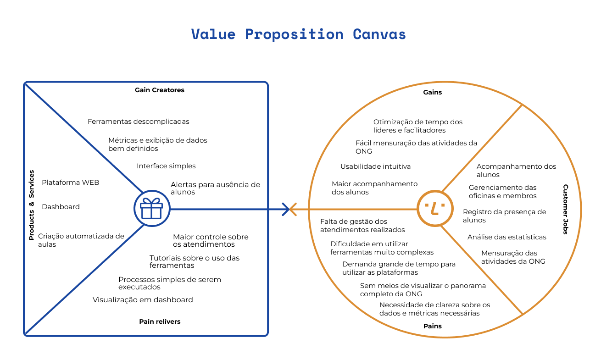

Fonte: Elaborado pelos autores

&emsp; O Value Proposition Canvas para o projeto da Gerando Falcões foi elaborado levando em conta as ONGs abrangidas pela rede, com o objetivo de entender como a solução proposta gerará valor para elas. Essa escolha foi feita considerando sua posição como usuárias finais, responsáveis por utilizar a plataforma diariamente e receber os benefícios diretos da solução. Além disso, desenvolver um produto que atenda melhor às necessidades das ONGs está alinhado e contribui para o alcance dos objetivos da Gerando Falcões. 

&emsp; Assim, a solução especificada consiste em uma plataforma web para gerenciar os atendimentos e as atividades feitas pelas ONGs, fornecendo as estatísticas e ferramentas necessárias. No bloco Perfil do Cliente, foram descritas as principais atividades realizadas, como a análise dos dados, gerenciamento das oficinas e mensuração do impacto da organização. Isso permite uma compreensão mais clara dos possíveis obstáculos e dificuldades, incluindo a falta de clareza sobre os dados necessários para visualizar o panorama da ONG, a complexidade das ferramentas e a grande demanda de tempo para utilizá-las. Os benefícios esperados pelos usuários são voltados para uma intuitiva usabilidade, otimização do tempo, melhor acompanhamento dos membros e fácil mensuração dos atendimentos. 

&emsp; Com uma análise acurada das dores e necessidades do cliente,  a seção Proposta de Valor descreve maneiras de aliviar esses problemas e alcançar os ganhos esperados. Dentro desses elementos, o desenvolvimento de  uma solução com processos simples de serem executados, acompanhados de tutoriais para guiar o usuário e uma apresentação visual em dashboard, são pontos fundamentais para auxiliar na resolução desses desafios. 

&emsp; Por consequência, as análises com base no Value Proposition Canvas permitem que as ONGs atendam suas necessidades ao utilizar ferramentas simples, com interfaces intuitivas e estatísticas eficazes.

## 3.4 Matriz de Risco

&nbsp;&nbsp;&nbsp;&nbsp;A matriz de risco é uma ferramenta utilizada no gerenciamento de riscos que visa identificar, avaliar e priorizar os potenciais riscos que podem ocorrer em um determinado projeto, processo ou atividade específica. 
&nbsp;&nbsp;&nbsp;&nbsp;Deste modo, o intuito ao inserir esse tipo de ferramente é mapear os tipos de riscos e oportunidades em relação à sua probabilidade e impacto sobre uma determinada ocorrência, facilitando a visualização geral de um projeto e possíveis caminhos que deverão ser seguidos por meio de tomada de decisão. 
&nbsp;&nbsp;&nbsp;&nbsp;Em relação à implementação de uma plataforma web com o foco em gerenciamento de ONGs de pequeo e médio porte, há as seguintes matrizes de risco e oportunidade, respectivamente:

 Figura x - Matriz de Risco 

 Fonte: Material produzido pelos autores (2024) 

| **Risco** | **Probabilidade** | **Impacto** | **Mitigação** |
| ---  | ---  | ---  | ---  |
| 001 - Falta de compreensão do sistema | Alta | Alto | Oferecer treinamentos e suporte contínuo para as ONGs, além de fornecer uma interface simples e intuitiva| 
| 002 - Dificuldade de adesão das ONG's | Média | Alto | Realizar workshops de demonstração do sistema e chamar outros líderes que aderiram para mostrar sua experiência pessoal | 
| 003 - Resistência à mudança | Alta | Médio | Demonstrar de maneira clara os benefícios de utilizar o sistema e como ele gera ganhos ao simplificar os processos manuais, além de adotar incentivos e reconhecimento às ONGs que aderirem o sistema em primeiro momento | 
| 004 - Falta de infraestrutura digital | Baixa | Muito Alto | Identificar os líderes que não possuem celulares e explorar opções de parcerias com empresas parceiras ou órgãos governamentais | 
| 005 - Falta de segurança de dados | Médio | Muito Alto | Implementar medidas robustas de segurança de dados, tais quais criptografia e controle de acesso |
| 006 - Dificuldade na manutenção | Baixo | Médio | Estabelecer um ponto de contato para suporte técnico contínuo às ONGs e planejar as atualizações do sistema com antecedência | 
| 007 - Interrupção temporária do sistema | Baixa | Baixo | Implementação de medidas de backup regulares para garantir a disponibilidade dos dados caso o sistema falhe e estabelecer protocolos de recuperação de desastres com o foco de restauração rápida do sistema | 

| **Oportunidade** | **Potencial de Impacto** | **Probabilidade** | **Estratégia de Aproveitamento** |
| ---  | ---  | ---  | ---  |
| 001 - Melhoria da eficiência operacional | Muito Alto | Médio | Automatizar os processos manuais e burocráticos |
| 002 - Ampliação do alcance e visibilidade | Alto | Médio | Utilizar sistema como ferramenta de marketing para atrair doadores e voluntários | 
| 003 - Fortalecer parceria e colaborações | Médio | Alto | Facilitar a comunicação e colaboração entre diversas ONG's do sistema e promover oportunidades de compartilhamento de oportunidades no próprio sistema | 
| 004 - Capacitação digital das ONG's | Alto | Alto | Oferecer treinamentos e recursos para melhorar o letramento digital dos Líderes e incentivar a troca de conhecimento e melhores práticas do uso do sistema entre as ONG's | 
| 005 - Explorar novas fontes de financiamento | Médio | Médio | Pesquisas oportunidades de financiamento para projetos de tecnologia social em meio privado e público, além de mostrar o sistema como forma de impacto e resultados para atração de potenciais financiadores | 

<conteúdo>
# 4. Análise de experiência do usuário
<conteúdo>
## 4.1 Perfis de Usuários
&nbsp;&nbsp;&nbsp;&nbsp; Perfis de usuário são pesquisas e definições dos responsáveis por entrarem em contato com nossa solução, seja diretamente ou indiretamente. Com essas pesquisas, conseguimos olhar o horizonte de perspectivas e ideias que cada usuário deseja, ainhando dores, desejos, objetivos e suas motivações. Essas perspectivas são muito importantes por contribuir com a análise de negócio como um todo, evidenciando de fato o que precisa ser solucionado e qual a dor a ser atendida. Para essa solução, descrevemos quatro perfis de usuário. Sendo eles:
1. Gerando Falcões:
&nbsp;&nbsp;&nbsp;&nbsp; A Gerando Falcões é uma organização sem fins lurativos que visa levar a educação, profissionalismo e recriação para todas as favelas do Brasil. Seu lema é "transformar a pobreza da favela em peça de museu". Com a contribuição voluntária de profissionais de diversas áreas, a GF já alcançou mais de 700 mil família em mais de 5000 favelas por todo o Brasil. 

&nbsp;&nbsp;&nbsp;&nbsp; Atividade principal: Realizar o engajamento dos moradores das favelas por meio de trabalho social e  atividades recreativas.
##
2.  Líderes:
&nbsp;&nbsp;&nbsp;&nbsp; O líder da ONG tem como papel  principal organizar as atividades da mesma e ter um controle total sobre as informações. É o responsável por gerenciar as tarefas da organização e garantir que tudo esteja em ordem e bem preservado. Geralmente, são pessoas voluntárias que possuem um capital de investimento inicial e está a disposição de contribuir com comunidades e ONGs maiores, como a Gerando Falcões.

&nbsp;&nbsp;&nbsp;&nbsp; Atividade principal: Contribuir com o gerenciamento e a organização da ONG associada à GF. Para isso, são feitos relatórios de presença, gerenciamento das atividades entregues e monitoramento de todo fluxo de pessoas e atividades dentro da ONG.
##
3.  Professores:
&nbsp;&nbsp;&nbsp;&nbsp; Os professores das ONGs são pessoas voluntárias que estão dispostas a contribuirem em pról de um bem maior, ajudar as comunidades e favelas com a educação. Possuem a tarefa de gerenciar os cursos e as aulas que a ONG disponibiliza e manter o controle de presença dos alunos inscritos nesses cursos. Muitas vezes, esses professore são pessoas que possuem um certo nível de experiência com o assunto trabalhado, como professores de futebol, inglês, teatro, dança, música entre outras atividades recreativas.

&nbsp;&nbsp;&nbsp;&nbsp; Atividade principal: Contribuir com aulas organizadas pela ONG e fazer o gerencimento dos alunos presentes nessas aulas. Além disso, contribuir com o relatório e histporico de atividades realizadas.
##
4.  Alunos:
&nbsp;&nbsp;&nbsp;&nbsp; Os alunos que frequentam essas ONGs são crianças, adolescentes e as vezes, adultos que vivem em comunidades e favelas. Fora do horário escolar, essas possuem as ONGs como alternativa para atividades extra curriculares e fuga de quaisquer atividades perigosas dentro das favelas. Famílias sem condições de pagarem um curso de inglês, aulas de futebol, entre outras, procuram essas ONGs como alternativa para um aprendizado e experiência de vida de qualidade.

&nbsp;&nbsp;&nbsp;&nbsp; Atividade principal: Aproveitar das atividades realizadas e manter-se engajado no projeto e cursos oferecidos pela ONG.

## 4.2 Personas

&nbsp;&nbsp;&nbsp;&nbsp; A persona nada mais é do que a descrição do "cliente ideal" da solução. Ela é baseada em dados reais dos clientes, como características econômicas, demográficas, sociais, físicas entre outras. As personas também apresentam a história da jornada pessoal desses clientes, exibindo suas motivações, objetivos, medos, desafios, preocupações e dúvidas. A persona é muito utilizada na análise de negócios por exibir, visualmente na maior das vezes, uma descrição dos clientes atendidos. Ou seja, toda a análise descritiva dosobejtivos, dores, motivações e comportamento dos clientes que serão impactados com o nosso desenvolvimento. Essa perspectiva torna-se muito importante em projetos de grande escala, pois permite que o time de desenvolvimento sempre se comunique na mesma língua e no mesmo propósito de solução. Ou seja, o entendimento para qual direção estamos indo, o por que, como e para quem. A seguir dividimos nossas personas em quatro. Sendo as três primeiras primárias, e a última secundária:

1.  Gerando Falcões (Organização principal):

  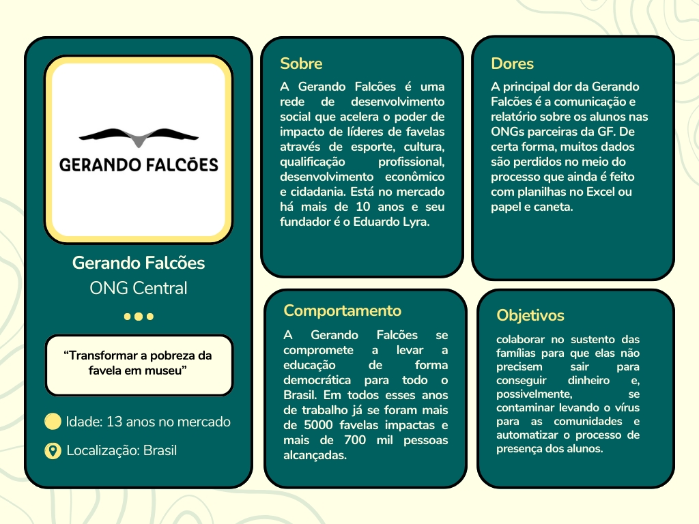

Nome: Gerando Falcões

Atuação: ONG central

Idade: 13 anos no mercado

Localização: Brasil

Sobre: A Gerando Falcões é uma rede de desenvolvimento social que acelera o poder de impacto de líderes de favelas através de esporte, cultura, qualificação profissional, desenvolvimento econômico e cidadania. Está no mercado há mais de 10 anos e seu fundador é o Eduardo Lyra.

Dores: A principal dor da Gerando Falcões é a comunicação e relatório sobre os alunos nas ONGs parceiras da GF. De certa forma, muitos dados são perdidos no meio do processo que ainda é feito com planilhas no Excel ou papel e caneta.

Comportamento: A Gerando Falcões se compromete a levar a educação de forma democrática para todo o Brasil. Em todos esses anos de trabalho já se foram mais de 5000 favelas impactas e mais de 700 mil pessoas alcançadas.

Objetivos: colaborar no sustento das famílias para que elas não precisem sair para conseguir dinheiro e, possivelmente, se contaminar levando o vírus para as comunidades e automatizar o processo de presença dos alunos.

2.  Guilherme dos Santos (Líder da ONG):

  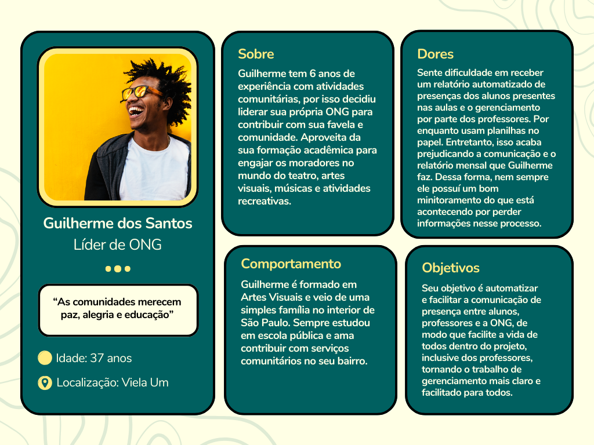

Nome: Guilherme dos Santos

Atuação: Líder da ONG

Idade: 37 anos

Localização: Favela Um

Sobre: Guilherme tem 6 anos de experiência com atividades comunitárias, por isso decidiu liderar sua própria ONG para contribuir com sua favela e comunidade. Aproveita da sua formação acadêmica para engajar os moradores no mundo do teatro, artes visuais, músicas e atividades recreativas.

Dores: Sente dificuldade em receber um relatório automatizado de presenças dos alunos presentes nas aulas da ONG. Por enquanto usam planilhas no papel. Entretanto, isso acaba prejudicando a comunicação e o relatório mensal que Guilherme faz. Dessa forma, nem sempre ele possuí um bom minitoramento do que está acontecendo.

Comportamento: Guilherme é formado em Artes Visuais e veio de uma simples família no interior de São Paulo. Sempre estudou em escola pública e ama contribuir com serviços comunitários no seu bairro.

Objetivos: Seu objetivo é automatizar e facilitar a comunicação de presença entre alunos, professores e a ONG, de modo que facilite a vida de todos dentro do projeto. Tornando os dados mais claros e facilitados.
##

3.  Sandra Covas (Professora da ONG):

  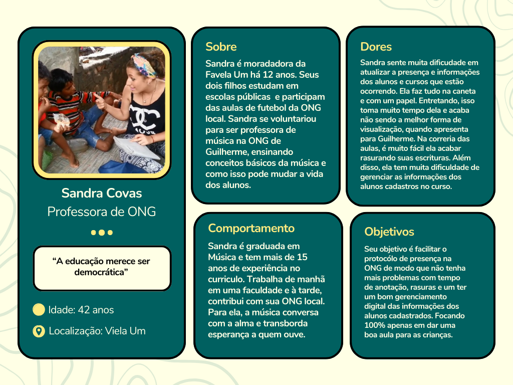

Nome: Sandra Covas

Atuação: Professora de música

Idade: 42 anos

Localização: Favela Um

Sobre: Sandra é moradadora da Favela Um há 12 anos. Seus dois filhos estudam em escolas públicas  e participam das aulas de futebol da ONG local. Sandra se voluntariou para ser professora de música na ONG de Guilherme, ensinando conceitos básicos da música e como isso pode mudar a vida dos alunos.

Dores: Sandra sente muita dificudade em atualizar a presença e informações dos alunos e cursos da ONG. Ela faz tudo na caneta e com um papel, entretando, isso toma muito tempo dela e acaba não sendo a melhor forma de visualização, quando apresenta para Guilherme. Na correria das aulas, é muito fácil ela acabar rasurando suas escrituras.

Comportamento: Sandra é graduada em Música e tem mais de 15 anos de experiência no curriculo. Trabalha de manhã em uma faculdade e à tarde, contribui com sua ONG local. Para ela, a música conversa com a alma e transborda esperança a quem ouve.

Objetivos: Seu objetivo é facilitar o protocólo de presença na ONG de modo que não tenha mais problemas com tempo de anotação, rasuras e falta de automatização nesse processo. Focando 100% apenas em dar uma boa aula para as crianças.

##

4.  Thiago Costa (Aluno da ONG):

  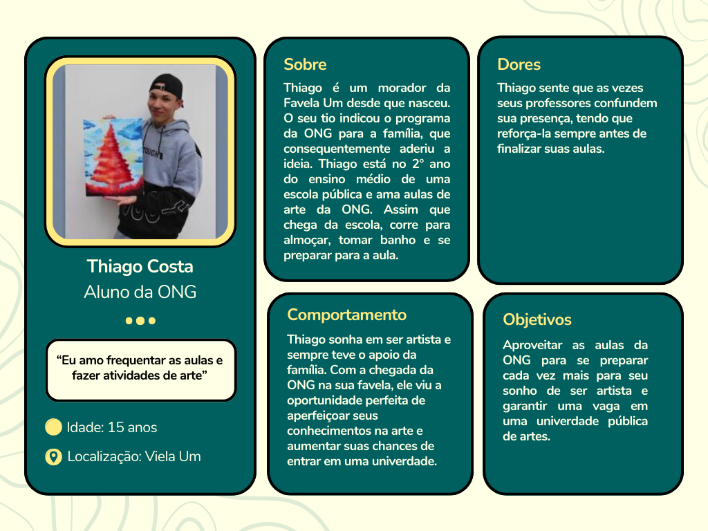

Nome: Thiago Costa

Atuação: Aluno

Idade: 15 anos

Localização: Favela Um

Sobre: Thiago é um morador da Favela Um desde que nasceu. O seu tio indicou o programa da ONG para a família, que consequentemente aderiu a ideia. Thiago está no 2° ano do ensino médio de uma escola pública e ama aulas de arte da ONG. Assim que chega da escola, corre para almoçar, tomar banho e se preparar para a aula.

Dores: Thiago sente que as vezes seus professores confundem sua presença, tendo que reforça-la sempre antes de finalizar suas aulas. 

Comportamento: Thiago sonha em ser artista e sempre teve o apoio da família. Com a chegada da ONG na sua favela, ele viu a oportunidade perfeita de aperfeiçoar seus conhecimentos na arte e aumnetar suas chances de entrar em uma univerdade.

Objetivos: Aproveitar as aulas da ONG para se preparar cada vez mais para seu sonho de ser artista e garantir uma vaga em uma univerdade pública de artes.

## 4.3 Mapa de jornada do usuário

  &nbsp;&nbsp;&nbsp;&nbsp;A jornada do usuário retrata um mapa visual que visa definir as fases pelas quais os usuários passam pelo sistema até a etapa de conclusão que pode se categorizar como uma compra, tomada de decisão ou aderência de algum serviço oferecido na aplicação. No caso da Gerando Falcões, temos serviços mais voltados para gestão interna das ONG's e tomadas de decisão através do dashboard. 
  &nbsp;&nbsp;&nbsp;&nbsp;Desta forma, a jornada descreve um passo a passo percorrido e detalhado de todos os pontos de contato e interações pela perspectiva do usuário. 
  &nbsp;&nbsp;&nbsp;&nbsp;Como trabalhamos com 4 personas diferentes, precisamos visualizar o ponto de vista de cada uma delas sobre a aplicação da solução que queremos viabilizar. Por esse motivo, validações e conversas com o parceiro entram no escopo de investigação com a finalidade de traçar a jornada do usuário de maneira apropriada. 

  

**Jornada da Joana Rodrigues (Gestora da GF)**

&nbsp;&nbsp;&nbsp;&nbsp;O perfil de gestora da Gerando falcões é retratada por Joana. Seu principal ponto de valor na plataforma é através de seu login como funcionária da GF, ser redirecionada para a visualização de métricas e realizar a exportação desses dados em JSON ou PDF para serem trabalhados pela equipe de Analytics interna. 

 Figura x - Jornada da Joana Rodrigues - Gestora da Gerando Falcões  
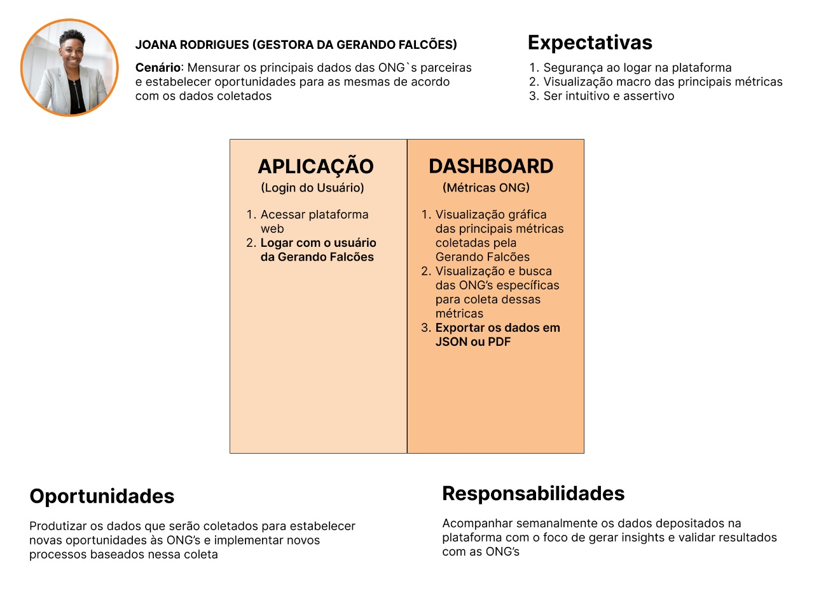

 Fonte: Material produzido pelos autores (2024) 

**Cenário:**  Mensurar os principais dados das ONG's parceiras e estabelcer oportunidades para as mesmas de acordo com os dados coletados

**Expectativas:** 
1. Segurança ao logar na plataforma
2. Visualização macro das principais méricas
3. Ser intuitivo e assertivo

**Oportunidades:** Produtizar os dados que serão coletados para estabelecer novas oportunidades às ONG's e implementar novos processos baseados nessa coleta 

**Responsabilidades:** Acompanhar semanalmente os dados depositados na plataforma com o foco de gerar insights e validar resultados com as ONG's 

 

**Jornada do Guilherme dos Santos (Líder)**

&nbsp;&nbsp;&nbsp;&nbsp;O perfil de Liderança das ONG's parceiras é retratado pelo Guilherme. Seu principal ponto de valor na plataforma é através de seu login como líder de sua ONG, tendo acesso rápido às telas principais da aplicação que para ele são:
1. Visualização, edição e situação dos membros da ONG com seus respectivos históricos;
2. Visualização gráfica das principais métricas coletadas pela Gerando Falcões;
3. Visualização do histórico de aulas com data, turma e situação. 

&nbsp;&nbsp;&nbsp;&nbsp;Ou seja, toda a parte organizacional e de poder de visualização macro de sua ONG é seu principal ponto de valor. 

 Figura x - Jornada do Guilherme dos Santos - Líder  

 Fonte: Material produzido pelos autores (2024) 

**Cenário:**  Gerir a sua ONG de uma maneira mais organizada e digital, além de organizar a presença dos alunos nas aulas das oficinas ofertadas

**Expectativas:** 
1. Ser intuitivo e simples
2. Melhorar a organização macro da ONG 
3. Estabelecer um sistema de presenças assertivo

**Oportunidades:** Trabalhar na estrutura organizacional da ONG e economizar tempo ao repassar as métricas à Gerando Falcões

**Responsabilidades:** Adicionar os dados necessários para estabelecer organização entre os membros da ONG e as atividades prestadas 

 

**Jornada da Sandra Covas (Facilitadora)**

&nbsp;&nbsp;&nbsp;&nbsp;O perfil de Facilitadora, ou mais conhecido como Professora, é retratada pela Sandra. Seu principal ponto de valor na plataforma é através de seu login como facilitadora, tendo como foco principal a visualização das oficinas e de realizar a lista de presença de cada aula criada automaticamente pela plataforma. Além disso, consegue visualizar as principais métricas, mas se atenta a de evasão de seus alunos para conseguir acompanhar o comparecimento deles antes dessa situação extrema ocorrer. Seu principal ponto de valor está no registro de presença dos seus alunos. 

 Figura x - Jornada da Sandra Covas - Facilitadora  
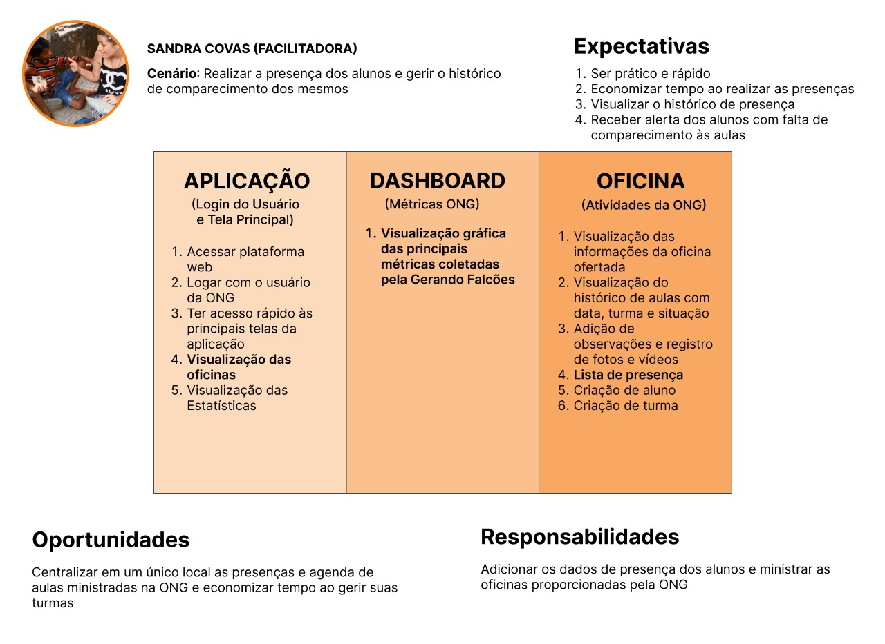

 Fonte: Material produzido pelos autores (2024) 

**Cenário:** Realizar a presença dos alunos e gerir o histórico de comparecimento dos mesmos

**Expectativas:** 
1. Ser prático e rápido
2. Economizar tempo ao realizar as presenças
3. Visualizar o histórico de presença
4. Receber alerta dos alunos com falta de comparecimento às aulas

**Oportunidades:** Centralizar em um único local as presenças e agenda de aulas minitradas na ONG e economizar tempo ao gerir suas turmas

**Responsabilidades:** Adicionar os dados de presença dos alunos e ministrar as oficinas proporcionadas pela ONG

 

**Jornada do Thiago Costa (Aluno)**

&nbsp;&nbsp;&nbsp;&nbsp;O perfil de Aluno é retratado pelo Thiago. Seu principal ponto de valor está fora da plataforma por se tratar de uma persona secundária, ou seja, que não tem implicação direta com o sistema, mas está envolvido de alguma forma. Nesse caso, ele será impactado pelas oficinas e acompanhado como um membro da ONG. Seu principal ponto de valor é ter a oportunidade de assistir gratuitamente as oficinas e ainda ter um acompanhamento ao longo de sua trajetória educacional com a ONG.  

 Figura x - Jornada do Thiago Costa - Aluno  

 Fonte: Material produzido pelos autores (2024) 

**Cenário:** Participar das oficinas oferecidas pela ONG e manter o seu engajamento de acordo com a frequência da oficina que participa

**Expectativas:** 
1. Aprender a matéria da oficina
2. Conhecer gente nova na aula 
3. Se sentir acolhido e pertencido

**Oportunidades:** Aprender uma matéria nova e usar isso como impulsionamento para uma profissão ou faculdade no futuro

**Responsabilidades:** Prestar atenção nas oficinas ministradas pela ONG e manter a sua participação e engajamento nas aulas

# 5. Requisitos

&nbsp;&nbsp;&nbsp;&nbsp;Nesta seção, exploramos os Requisitos do projeto, fundamentais para determinar as ações do sistema de acordo com os padrões de qualidade estabelecidos pela ISO/IEC 25000. Esta norma internacional desempenha um papel central na caracterização e medição da qualidade de produtos de software, orientando a definição de requisitos que garantem a conformidade do software com os mais elevados padrões de desempenho e funcionalidade. A análise minuciosa desses requisitos não apenas segue as normas estipuladas, mas também representa um passo crucial na construção de um produto de software de alta qualidade, alinhado com os requisitos internacionais de excelência.

## 5.1 Requisitos Funcionais

&nbsp;&nbsp;&nbsp;&nbsp;O documento de requisitos destina-se ao cliente interessado no projeto, haja-vista que trata-se de um documento vivo, o qual deve ser atualizado conforme o andamento do projeto. Entre as partes interessadas está a empresa parceira Gerando Falcões, time de desenvolvimento da equipe Asas Solidárias e corpo docente da instituição INTELI, tendo em vista que trata-se de um projeto com propósito acadêmico e social. Para fins de simplificação de entendimento do documento, cada tópico foi divido em funções, onde os requisitos estão ligados a uma persona e jornada de usuário presentes na seção [4.3 Mapa de jornada do usuário](#jornada-usuario). Cada usuário deve conseguir executar as ações descritas nos requisitos e avançar com sucesso os testes descritos nos requisitos.

**Requisito Funcional: Acessar Plataforma**
  
  * ID: RF-001
  
  **Descrição:** O usuário deve ter a capacidade de acessar a plataforma por meio de um sistema de autenticação seguro.

  **Detalhes:**
  
  O processo de acesso à plataforma deve garantir que o usuário possa entrar de maneira segura e eficiente. Isso inclui:

  - **Autenticação Segura (RF-001.1):** A plataforma deve oferecer um sistema de autenticação seguro, exigindo que o usuário forneça credenciais válidas, como nome de usuário e senha.
  
    - **Descrição do Teste:**
      - **Pré-condição:** A plataforma está operacional.
      - **Procedimento de Teste:** O usuário tenta acessar a plataforma inserindo credenciais válidas.
      - **Resultado Esperado:** O sistema permite o acesso bem-sucedido.
      - **Pós-condição:** O usuário é redirecionado para a página principal da plataforma.

  - **Redirecionamento Pós-Login (RF-001.2):** Após uma autenticação bem-sucedida, o usuário deve ser redirecionado para a página principal da plataforma, proporcionando uma experiência de usuário contínua.

    - **Descrição do Teste:**
      - **Pré-condição:** O usuário está autenticado.
      - **Procedimento de Teste:** O usuário realiza o login e observa o redirecionamento.
      - **Resultado Esperado:** O usuário é redirecionado para a página principal.
      - **Pós-condição:** A página principal é exibida corretamente.

  - **Proteção contra Acesso Não Autorizado (RF-001.3):** Mecanismos de segurança adequados devem ser implementados para prevenir acessos não autorizados, incluindo tentativas de login inválidas.

    - **Descrição do Teste:**
      - **Pré-condição:** O usuário não autenticado tenta acessar a plataforma.
      - **Procedimento de Teste:** Tentativa de login com credenciais inválidas.
      - **Resultado Esperado:** O sistema bloqueia o acesso e fornece uma mensagem de erro adequada.
      - **Pós-condição:** O acesso não autorizado é impedido.

  - **Feedback de Erros (RF-001.4):** Em caso de falha na autenticação, o sistema deve fornecer mensagens de erro claras e informativas para orientar o usuário
  -  sobre as ações corretivas necessárias.
    - **Descrição do Teste:**
      - **Pré-condição:** O usuário tenta acessar a plataforma com credenciais inválidas.
      - **Procedimento de Teste:** Inserção de credenciais incorretas durante o login.
      - **Resultado Esperado:** O sistema exibe uma mensagem de erro informativa.
      - **Pós-condição:** O usuário recebe orientações sobre as ações corretivas necessárias.

  **Critérios de Aceitação:**

-   O usuário deve conseguir acessar a plataforma utilizando credenciais válidas.
    
-   Após o login, o usuário deve ser redirecionado para a página principal da plataforma.
    
-   Mecanismos de segurança devem estar em vigor para proteger contra acessos não autorizados.
    
-   Mensagens de erro devem ser informativas e orientar o usuário em caso de falha na autenticação.

  
 **Requisito Funcional: Cadastro Pessoal (LÍDER)**
  
  * ID: RF-002
  
  **Descrição:** O líder deve poder realizar seu cadastro pessoal na plataforma, fornecendo informações necessárias, como nome, e-mail e senha.

  **Detalhes:**
  
  O processo de cadastro pessoal deve permitir que o líder insira informações essenciais para criar e gerenciar seu perfil na plataforma. Isso inclui:

  - **Preenchimento de Informações (RF-002.1):** O líder deve ser capaz de preencher os campos obrigatórios do formulário de cadastro pessoal, incluindo nome, e-mail e senha.
  
    - **Descrição do Teste:**
      - **Pré-condição:** O líder não possui um cadastro na plataforma.
      - **Procedimento de Teste:** O líder preenche todos os campos obrigatórios do formulário de cadastro.
      - **Resultado Esperado:** O sistema aceita as informações fornecidas e avança para a próxima etapa do cadastro.
      - **Pós-condição:** O líder é encaminhado para a próxima etapa do processo de cadastro.

  - **Validação de Informações (RF-002.2):** O sistema deve validar as informações inseridas pelo líder durante o cadastro, garantindo precisão e conformidade.

    - **Descrição do Teste:**
      - **Pré-condição:** O líder preenche os campos obrigatórios do formulário de cadastro.
      - **Procedimento de Teste:** Inserção de informações inválidas ou ausentes.
      - **Resultado Esperado:** O sistema rejeita informações inválidas, fornecendo mensagens de erro apropriadas.
      - **Pós-condição:** O líder recebe orientações sobre as correções necessárias.

  - **Criação do Perfil (RF-LIDER-002.3):** Após a conclusão bem-sucedida do cadastro, o sistema deve criar e associar um perfil ao líder na plataforma.

    - **Descrição do Teste:**
      - **Pré-condição:** O líder forneceu informações válidas durante o cadastro.
      - **Procedimento de Teste:** Conclusão do processo de cadastro.
      - **Resultado Esperado:** Um perfil é criado e associado ao líder na plataforma.
      - **Pós-condição:** O líder pode acessar sua conta com as credenciais recém-criadas.

  **Critérios de Aceitação:**
  -   Após a conclusão do cadastro, um perfil deve ser associado com sucesso ao líder. 
  -   O líder deve conseguir acessar sua conta utilizando as credenciais recém-criadas.

**Requisito Funcional: Cadastro da ONG (LÍDER)**
  
  * ID: RF-003
  
  **Descrição:** O líder deve ter a capacidade de cadastrar a ONG na plataforma, fornecendo informações relevantes sobre a organização.

  **Detalhes:**
  
  O processo de cadastro da ONG deve permitir que o líder forneça informações cruciais para registrar e gerenciar a entidade na plataforma. Isso inclui:

  - **Preenchimento de Informações (RF-003.1):** O líder deve ser capaz de preencher os campos obrigatórios do formulário de cadastro da ONG, incluindo nome da ONG, descrição, área de atuação, e contato.
  
    - **Descrição do Teste:**
      - **Pré-condição:** O líder está autenticado e deseja cadastrar a ONG.
      - **Procedimento de Teste:** O líder preenche todos os campos obrigatórios do formulário de cadastro da ONG.
      - **Resultado Esperado:** O sistema aceita as informações fornecidas e avança para a próxima etapa do cadastro.
      - **Pós-condição:** A ONG é registrada na plataforma.

    - **Critérios de Aceitação:**
      - O líder deve conseguir preencher todos os campos obrigatórios do formulário de cadastro da ONG.
      - O sistema deve aceitar as informações fornecidas sem erros.

  - **Validação de Informações (RF-LIDER-003.2):** O sistema deve validar as informações inseridas durante o cadastro da ONG, garantindo precisão e conformidade.

    - **Descrição do Teste:**
      - **Pré-condição:** O líder preenche os campos obrigatórios do formulário de cadastro da ONG.
      - **Procedimento de Teste:** Inserção de informações inválidas ou ausentes.
      - **Resultado Esperado:** O sistema rejeita informações inválidas, fornecendo mensagens de erro apropriadas.
      - **Pós-condição:** O líder recebe orientações sobre as correções necessárias.

    - **Critérios de Aceitação:**
      - O sistema deve identificar e rejeitar informações inválidas durante o cadastro da ONG.
      - Mensagens de erro devem ser claras e orientar o líder sobre as correções necessárias.

  - **Associação de Perfil (RF-003.3):** Após a conclusão bem-sucedida do cadastro, o sistema deve associar um perfil à ONG na plataforma.

    - **Descrição do Teste:**
      - **Pré-condição:** O líder forneceu informações válidas durante o cadastro da ONG.
      - **Procedimento de Teste:** Conclusão do processo de cadastro da ONG.
      - **Resultado Esperado:** Um perfil é criado e associado à ONG na plataforma.
      - **Pós-condição:** A ONG pode ser visualizada no perfil do líder.

    - **Critérios de Aceitação:**
      - Após a conclusão do cadastro, um perfil deve ser associado com sucesso à ONG.
      - A ONG deve ser visualizada no perfil do líder na plataforma.

**Requisito Funcional: Ver Estatísticas Globais (LÍDER)**
  
  * ID: RF-004
  
  **Descrição:** O líder deve poder visualizar estatísticas globais relacionadas às atividades da plataforma, incluindo presença da ONG e dados das aulas.

  **Detalhes:**
  
  O processo de visualização das estatísticas globais deve permitir que o líder obtenha informações abrangentes sobre as atividades da ONG e o desempenho das aulas. Isso inclui:

  - **Acesso às Estatísticas (RF-LIDER-004.1):** O líder deve conseguir acessar a seção de estatísticas globais na plataforma.
  
    - **Descrição do Teste:**
      - **Pré-condição:** O líder está autenticado e deseja visualizar as estatísticas globais.
      - **Procedimento de Teste:** O líder navega até a seção de estatísticas globais.
      - **Resultado Esperado:** A página de estatísticas globais é exibida corretamente.
      - **Pós-condição:** O líder tem acesso às informações estatísticas.

    - **Critérios de Aceitação:**
      - O líder deve conseguir acessar a seção de estatísticas globais.
      - A página de estatísticas globais deve ser exibida sem erros.

  - **Visualização de Presença da ONG (RF-004.2):** O líder deve poder visualizar estatísticas relacionadas à presença da ONG, incluindo dados sobre participação em atividades e eventos.

    - **Descrição do Teste:**
      - **Pré-condição:** O líder acessou a seção de estatísticas globais.
      - **Procedimento de Teste:** Navegação para a seção de presença da ONG.
      - **Resultado Esperado:** Gráficos ou tabelas com informações precisas sobre a presença da ONG são exibidos.
      - **Pós-condição:** O líder tem insights sobre a participação da ONG.

    - **Critérios de Aceitação:**
      - Gráficos ou tabelas de presença da ONG devem ser apresentados de forma clara e organizada.
      - As informações devem ser precisas e atualizadas.

  - **Visualização de Dados das Aulas (RF-004.3):** O líder deve poder visualizar estatísticas relacionadas ao desempenho das aulas, incluindo frequência dos alunos e avaliações.

    - **Descrição do Teste:**
      - **Pré-condição:** O líder acessou a seção de estatísticas globais.
      - **Procedimento de Teste:** Navegação para a seção de dados das aulas.
      - **Resultado Esperado:** Gráficos ou tabelas com informações precisas sobre as aulas são exibidos.
      - **Pós-condição:** O líder tem insights sobre o desempenho das aulas.

    - **Critérios de Aceitação:**
      - Gráficos ou tabelas de dados das aulas devem ser apresentados de forma clara e organizada.
      - As informações devem ser precisas e atualizadas.

  **Critérios de Aceitação Gerais:**
  -   Gráficos ou tabelas de dados das aulas devem ser apresentados de forma clara e organizada.
-   As informações devem ser precisas e atualizadas.

**Requisito Funcional: Ver, Criar e Editar Oficinas (LÍDER)**
  
  * ID: RF-0005
  
  **Descrição:** O líder deve ter a capacidade de visualizar, criar e editar oficinas na plataforma. Além disso, oficinas são consideradas tipos de aula, e o líder pode criar aulas dentro das oficinas.

  **Detalhes:**
  
  O processo de ver, criar e editar oficinas deve permitir que o líder gerencie esses recursos de forma eficiente. Isso inclui:

  - **Visualização de Oficinas (RF--0005.1):** O líder deve poder visualizar uma lista de todas as oficinas disponíveis na plataforma.
  
    - **Descrição do Teste:**
      - **Pré-condição:** O líder está autenticado e deseja visualizar oficinas.
      - **Procedimento de Teste:** O líder navega até a seção de oficinas.
      - **Resultado Esperado:** Uma lista de oficinas é exibida, mostrando detalhes básicos de cada uma.
      - **Pós-condição:** O líder tem acesso à visualização das oficinas.

    - **Critérios de Aceitação:**
      - O líder deve conseguir visualizar uma lista de oficinas na plataforma.
      - A lista de oficinas deve conter informações básicas, como nome e breve descrição.

  - **Criação de Oficinas (RF-LIDER-0005.2):** O líder deve poder criar novas oficinas, fornecendo informações essenciais, como nome, descrição e datas.
  
    - **Descrição do Teste:**
      - **Pré-condição:** O líder está autenticado e deseja criar uma nova oficina.
      - **Procedimento de Teste:** O líder preenche os campos obrigatórios para criar uma nova oficina.
      - **Resultado Esperado:** A nova oficina é criada com sucesso e aparece na lista de oficinas.
      - **Pós-condição:** A oficina está disponível para visualização e edição.

    - **Critérios de Aceitação:**
      - O líder deve conseguir preencher os campos obrigatórios para criar uma nova oficina.
      - A nova oficina deve ser visível na lista de oficinas após a criação.

  - **Edição de Oficinas (RF-LIDER-0005.3):** O líder deve poder editar informações de oficinas existentes, como nome, descrição e datas.
  
    - **Descrição do Teste:**
      - **Pré-condição:** O líder está autenticado e deseja editar uma oficina existente.
      - **Procedimento de Teste:** O líder acessa a opção de editar para a oficina desejada e faz as alterações necessárias.
      - **Resultado Esperado:** As alterações são salvas com sucesso, refletindo as atualizações na lista de oficinas.
      - **Pós-condição:** As informações da oficina estão atualizadas.

    - **Critérios de Aceitação:**
      - O líder deve conseguir acessar a opção de editar para uma oficina existente.
      - As alterações feitas na oficina devem ser refletidas na lista de oficinas.

  - **Criação de Aulas dentro de Oficinas (RF-LIDER-0005.4):** O líder deve poder criar novas aulas dentro de uma oficina, associando informações como data, horário e descrição.
  
    - **Descrição do Teste:**
      - **Pré-condição:** O líder está autenticado e deseja criar uma nova aula dentro de uma oficina.
      - **Procedimento de Teste:** O líder seleciona a oficina desejada, acessa a opção de criar aula e preenche os campos obrigatórios.
      - **Resultado Esperado:** A nova aula é criada com sucesso e aparece associada à oficina.
      - **Pós-condição:** A aula está disponível para visualização e edição dentro da oficina.

    - **Critérios de Aceitação:**
      - O líder deve conseguir selecionar uma oficina existente para criar uma nova aula.
      - A nova aula deve estar associada à oficina escolhida e visível na lista de aulas da oficina.

  **Critérios de Aceitação Gerais:**
	  - O líder é capaz de criar novas oficinas
	  - O líder é capaz de criar novas aulas dentro das oficinas 

**Requisito Funcional: Ver, Registrar, Atualizar, Excluir do Professor (LÍDER)**
  
  * ID: RF-0006
  
  **Descrição:** O líder deve ter a capacidade de visualizar, registrar, atualizar e excluir informações relacionadas aos professores na plataforma.

  **Detalhes:**
  
  O processo de ver, registrar, atualizar e excluir do professor deve permitir que o líder gerencie as informações dos professores de forma eficiente. Isso inclui:

  - **Visualização de Professores (RF-0006.1):** O líder deve poder visualizar uma lista de todos os professores cadastrados na plataforma.
  
    - **Descrição do Teste:**
      - **Pré-condição:** O líder está autenticado e deseja visualizar informações dos professores.
      - **Procedimento de Teste:** O líder navega até a seção de professores.
      - **Resultado Esperado:** Uma lista de professores é exibida, mostrando detalhes básicos de cada um.
      - **Pós-condição:** O líder tem acesso à visualização das informações dos professores.

    - **Critérios de Aceitação:**
      - O líder deve conseguir visualizar uma lista de professores na plataforma.
      - A lista de professores deve conter informações básicas, como nome, especialidade, e informações de contato.

  - **Registro de Novos Professores (RF-0006.2):** O líder deve poder registrar novos professores, fornecendo informações essenciais, como nome, especialidade, e informações de contato.
  
    - **Descrição do Teste:**
      - **Pré-condição:** O líder está autenticado e deseja registrar um novo professor.
      - **Procedimento de Teste:** O líder preenche os campos obrigatórios para registrar um novo professor.
      - **Resultado Esperado:** O novo professor é registrado com sucesso e aparece na lista de professores.
      - **Pós-condição:** As informações do novo professor estão disponíveis para visualização e edição.

    - **Critérios de Aceitação:**
      - O líder deve conseguir preencher os campos obrigatórios para registrar um novo professor.
      - O novo professor deve ser visível na lista de professores após o registro.

  - **Atualização de Informações do Professor (RF-0006.3):** O líder deve poder atualizar informações de professores existentes, como nome, especialidade e informações de contato.
  
    - **Descrição do Teste:**
      - **Pré-condição:** O líder está autenticado e deseja atualizar informações de um professor existente.
      - **Procedimento de Teste:** O líder acessa a opção de editar para o professor desejado e faz as alterações necessárias.
      - **Resultado Esperado:** As alterações são salvas com sucesso, refletindo as atualizações na lista de professores.
      - **Pós-condição:** As informações do professor estão atualizadas.

    - **Critérios de Aceitação:**
      - O líder deve conseguir acessar a opção de editar para um professor existente.
      - As alterações feitas nas informações do professor devem ser refletidas na lista de professores.

  - **Exclusão de Professores (RF-0006.4):** O líder deve poder excluir registros de professores existentes na plataforma.
  
    - **Descrição do Teste:**
      - **Pré-condição:** O líder está autenticado e deseja excluir um professor existente.
      - **Procedimento de Teste:** O líder seleciona a opção de excluir para o professor desejado.
      - **Resultado Esperado:** O professor é removido com sucesso e não aparece mais na lista de professores.
      - **Pós-condição:** As informações do professor são removidas da plataforma.

    - **Critérios de Aceitação:**
      - O líder deve conseguir selecionar a opção de excluir para um professor existente.
      - O professor excluído não deve aparecer mais na lista de professores.

  **Critérios de Aceitação Gerais:**
	  - O líder é capaz de gerenciar os professores

**Requisito Funcional: Atribuir um Professor a uma Aula (LÍDER)**
  
  * ID: RF-0007
  
  **Descrição:** O líder deve ter a capacidade de atribuir um professor a uma aula específica na plataforma.

  **Detalhes:**
  
  A atribuição de professores a aulas permite que o líder gerencie eficientemente as responsabilidades do corpo docente. Isso inclui:

  - **Atribuição de Professor a uma Aula (RF-0007.1):** O líder deve poder designar um professor específico para lecionar uma determinada aula, associando informações como data, horário e detalhes da aula.
  
    - **Descrição do Teste:**
      - **Pré-condição:** O líder está autenticado e deseja atribuir um professor a uma aula específica.
      - **Procedimento de Teste:** O líder seleciona a aula desejada, acessa a opção de atribuir professor e escolhe o professor correspondente.
      - **Resultado Esperado:** A atribuição é realizada com sucesso, mostrando o professor associado à aula na lista de aulas.
      - **Pós-condição:** A informação de atribuição é visível e pode ser editada conforme necessário.
      
  **Critérios de Aceitação Gerais:**
      - O líder deve conseguir selecionar uma aula específica para atribuir um professor.
      - O líder deve poder escolher o professor desejado para a aula.
      - A informação de atribuição deve ser refletida na lista de aulas, mostrando o professor associado.

**Requisito Funcional: Perfil do Aluno (LÍDER)**
  
  * ID: RF-0008
  
  **Descrição:** O líder deve ter a capacidade de visualizar, editar, registrar e excluir informações relacionadas aos perfis dos alunos na plataforma.

  **Detalhes:**
  
  O gerenciamento eficiente dos perfis dos alunos é fundamental para proporcionar uma experiência personalizada. Isso inclui:

  - **Visualização de Perfil do Aluno (RF-0008.1):** O líder deve poder visualizar os perfis individuais dos alunos cadastrados na plataforma.
  
    - **Descrição do Teste:**
      - **Pré-condição:** O líder está autenticado e deseja visualizar informações dos perfis dos alunos.
      - **Procedimento de Teste:** O líder navega até a seção de perfis dos alunos.
      - **Resultado Esperado:** Uma lista de perfis de alunos é exibida, mostrando detalhes básicos de cada um.
      - **Pós-condição:** O líder tem acesso à visualização das informações dos perfis dos alunos.

    - **Critérios de Aceitação:**
      - O líder deve conseguir visualizar uma lista de perfis de alunos na plataforma.
      - A lista de perfis de alunos deve conter informações básicas, como nome, curso e informações de contato.

  - **Edição de Informações do Perfil do Aluno (RF-0008.2):** O líder deve poder editar informações dos perfis dos alunos, como nome, curso e informações de contato.
  
    - **Descrição do Teste:**
      - **Pré-condição:** O líder está autenticado e deseja editar informações de um perfil de aluno existente.
      - **Procedimento de Teste:** O líder acessa a opção de editar para o perfil do aluno desejado e faz as alterações necessárias.
      - **Resultado Esperado:** As alterações são salvas com sucesso, refletindo as atualizações na lista de perfis de alunos.
      - **Pós-condição:** As informações do perfil do aluno estão atualizadas.

    - **Critérios de Aceitação:**
      - O líder deve conseguir acessar a opção de editar para um perfil de aluno existente.
      - As alterações feitas nas informações do perfil do aluno devem ser refletidas na lista de perfis de alunos.

  - **Registro de Novos Perfis de Alunos (RF-0008.3):** O líder deve poder registrar novos perfis de alunos, fornecendo informações essenciais, como nome, curso e informações de contato.
  
    - **Descrição do Teste:**
      - **Pré-condição:** O líder está autenticado e deseja registrar um novo perfil de aluno.
      - **Procedimento de Teste:** O líder preenche os campos obrigatórios para registrar um novo perfil de aluno.
      - **Resultado Esperado:** O novo perfil de aluno é registrado com sucesso e aparece na lista de perfis de alunos.
      - **Pós-condição:** As informações do novo perfil de aluno estão disponíveis para visualização e edição.

    - **Critérios de Aceitação:**
      - O líder deve conseguir preencher os campos obrigatórios para registrar um novo perfil de aluno.
      - O novo perfil de aluno deve ser visível na lista de perfis de alunos após o registro.

  - **Exclusão de Perfis de Alunos (RF-0008.4):** O líder deve poder excluir registros de perfis de alunos existentes na plataforma.
  
    - **Descrição do Teste:**
      - **Pré-condição:** O líder está autenticado e deseja excluir um perfil de aluno existente.
      - **Procedimento de Teste:** O líder seleciona a opção de excluir para o perfil de aluno desejado.
      - **Resultado Esperado:** O perfil de aluno é removido com sucesso e não aparece mais na lista de perfis de alunos.
      - **Pós-condição:** As informações do perfil de aluno são removidas da plataforma.

 - **Critérios de Aceitação Gerais:**
	 -  O líder deve conseguir selecionar a opção de excluir para um perfil de aluno existente.
	 -  O perfil de aluno excluído não deve aparecer mais na lista de perfis de alunos.

**Requisito Funcional: Acessar Histórico de Aulas e Dados (LÍDER)**
  
  * ID: RF-LIDER-0009
  
  **Descrição:** O líder deve ter a capacidade de acessar o histórico completo de aulas, incluindo informações sobre aulas passadas, presença dos alunos, dados dos alunos, alertas para alunos e cursos carentes, e informações de horário.

  **Detalhes:**
  
  O acesso ao histórico de aulas e dados é essencial para a avaliação e aprimoramento contínuo do desempenho do curso. Isso inclui:

  - **Visualização do Histórico de Aulas (RF-0009.1):** O líder deve poder visualizar todas as aulas passadas na plataforma, incluindo detalhes sobre datas, horários e conteúdos ministrados.
  
    - **Descrição do Teste:**
      - **Pré-condição:** O líder está autenticado e deseja visualizar o histórico de aulas.
      - **Procedimento de Teste:** O líder navega até a seção de histórico de aulas.
      - **Resultado Esperado:** Uma lista de aulas passadas é exibida, mostrando detalhes como data, horário e conteúdo.
      - **Pós-condição:** O líder tem acesso à visualização do histórico de aulas.

    - **Critérios de Aceitação:**
      - O líder deve conseguir visualizar uma lista de aulas passadas na plataforma.
      - A lista de aulas passadas deve conter detalhes como data, horário e conteúdo.

  - **Visualização de Presença dos Alunos (RF-0009.2):** O líder deve poder verificar a presença dos alunos em cada aula passada.
  
    - **Descrição do Teste:**
      - **Pré-condição:** O líder está autenticado e deseja verificar a presença dos alunos em uma aula passada específica.
      - **Procedimento de Teste:** O líder seleciona a aula desejada no histórico e acessa a opção de presença dos alunos.
      - **Resultado Esperado:** Uma lista de alunos presentes e ausentes na aula é exibida.
      - **Pós-condição:** O líder tem acesso à visualização da presença dos alunos.

    - **Critérios de Aceitação:**
      - O líder deve conseguir selecionar uma aula específica para verificar a presença dos alunos.
      - A lista de presença deve mostrar quais alunos estavam presentes e ausentes na aula.

  - **Visualização de Dados dos Alunos (RF-0009.3):** O líder deve poder acessar informações detalhadas sobre cada aluno, incluindo nome, curso, desempenho e histórico acadêmico.
  
    - **Descrição do Teste:**
      - **Pré-condição:** O líder está autenticado e deseja acessar os dados de um aluno específico.
      - **Procedimento de Teste:** O líder seleciona o aluno desejado no histórico e acessa a opção de dados do aluno.
      - **Resultado Esperado:** Uma página com informações detalhadas do aluno é exibida.
      - **Pós-condição:** O líder tem acesso à visualização dos dados do aluno.

    - **Critérios de Aceitação:**
      - O líder deve conseguir selecionar um aluno específico para acessar seus dados.
      - As informações do aluno devem incluir nome, curso, desempenho e histórico acadêmico.

  - **Alerta para Aluno e Curso Carentes (RF-0009.4):** O líder deve receber alertas para alunos e cursos que estão carentes, indicando a necessidade de intervenção.
  
    - **Descrição do Teste:**
      - **Pré-condição:** O líder está autenticado e deseja verificar os alertas para alunos e cursos carentes.
      - **Procedimento de Teste:** O líder acessa a seção de alertas no histórico.
      - **Resultado Esperado:** Uma lista de alertas é exibida, indicando alunos e cursos que estão carentes.
      - **Pós-condição:** O líder tem acesso à visualização dos alertas.

    - **Critérios de Aceitação:**
      - O líder deve conseguir acessar a seção de alertas no histórico.
      - A lista de alertas deve indicar claramente quais alunos e cursos estão carentes.

  - **Visualização de Informações de Horário (RF-0009.5):** O líder deve poder acessar informações detalhadas sobre o horário das aulas, incluindo datas, horários e locais.
  
    - **Descrição do Teste:**
      - **Pré-condição:** O líder está autenticado e deseja acessar informações de horário das aulas.
      - **Procedimento de Teste:** O líder navega até a seção de informações de horário no histórico.
      - **Resultado Esperado:** Uma tabela de horário é exibida, mostrando detalhes como datas, horários e locais das aulas.
      - **Pós-condição:** O líder tem acesso à visualização das informações de horário.

  - **Critérios de Aceitação Gerais:**
	  - O líder deve conseguir visualizar uma tabela de horário das aulas no histórico.
      - A tabela de horário deve incluir detalhes como datas, horários e locais das aulas.

**Requisito Funcional: Ver Oficinas (PROFESSOR)**
  
  * ID: RF-0010
  
  **Descrição:** O professor deve ter a capacidade de visualizar todas as oficinas disponíveis na plataforma.

  **Detalhes:**
  
  A visualização das oficinas permite que o professor esteja ciente das atividades disponíveis para os alunos. Isso inclui:

  - **Lista de Oficinas (RF-0010.1):** O professor deve poder acessar uma lista completa de oficinas disponíveis na plataforma.
  
    - **Descrição do Teste:**
      - **Pré-condição:** O professor está autenticado na plataforma e deseja visualizar as oficinas.
      - **Procedimento de Teste:** O professor navega até a seção de oficinas na plataforma.
      - **Resultado Esperado:** Uma lista de oficinas é exibida, mostrando detalhes como nome, descrição e datas disponíveis.
      - **Pós-condição:** O professor tem acesso à visualização das oficinas.

    - **Critérios de Aceitação Gerais**
      - O professor deve conseguir acessar a lista de oficinas na plataforma.
      - A lista de oficinas deve conter detalhes como nome, descrição e datas disponíveis.

**Requisito Funcional: Cadastrar e Ligar Aluno à Aula (PROFESSOR)**
  
  * ID: RF-0011
  
  **Descrição:** O professor deve ter a capacidade de cadastrar novos alunos e conectá-los a aulas específicas na plataforma.

  **Detalhes:**
  
  O cadastro e a conexão de alunos às aulas são atividades essenciais para o gerenciamento eficiente do curso. Isso inclui:

  - **Cadastro de Novos Alunos (RF-0011.1):** O professor deve poder cadastrar novos alunos na plataforma, fornecendo informações essenciais como nome, curso e dados de contato.
  
    - **Descrição do Teste:**
      - **Pré-condição:** O professor está autenticado na plataforma e deseja cadastrar um novo aluno.
      - **Procedimento de Teste:** O professor acessa a opção de cadastrar novo aluno, preenche os campos obrigatórios e salva as informações.
      - **Resultado Esperado:** O novo aluno é cadastrado com sucesso e aparece na lista de alunos da plataforma.
      - **Pós-condição:** As informações do novo aluno estão disponíveis para visualização e edição.

    - **Critérios de Aceitação:**
      - O professor deve conseguir preencher os campos obrigatórios para cadastrar um novo aluno.
      - O novo aluno deve ser visível na lista de alunos da plataforma após o cadastro.

  - **Conexão de Aluno à Aula (RF-0011.2):** O professor deve poder conectar alunos previamente cadastrados a aulas específicas na plataforma.
  
    - **Descrição do Teste:**
      - **Pré-condição:** O professor está autenticado na plataforma e deseja conectar um aluno a uma aula.
      - **Procedimento de Teste:** O professor seleciona a aula desejada, acessa a opção de conectar aluno e escolhe o aluno a ser conectado.
      - **Resultado Esperado:** O aluno é conectado com sucesso à aula específica, e a informação é registrada no sistema.
      - **Pós-condição:** A conexão entre o aluno e a aula é refletida na plataforma.

    - **Critérios de Aceitação Gerais**
      - O professor deve conseguir selecionar uma aula específica para conectar um aluno.
      - A plataforma deve registrar e mostrar a conexão entre o aluno e a aula.

**Requisito Funcional: Acessar Histórico de Aulas (PROFESSOR)**
  
  * ID: RF-0012
  
  **Descrição:** O professor deve ter a capacidade de acessar o histórico completo de aulas, incluindo informações sobre alunos, alertas para alunos e cursos carentes, e dados das aulas os quais esta registrado como professor.

  **Detalhes:**
  
  O acesso ao histórico de aulas é crucial para a análise e aprimoramento contínuo das atividades do curso. Isso inclui:

  - **Visualização do Histórico de Alunos (RF-0012.1):** O professor deve poder visualizar informações detalhadas sobre os alunos que participaram das aulas, incluindo seus nomes e desempenho.
  
    - **Descrição do Teste:**
      - **Pré-condição:** O professor está autenticado na plataforma e deseja visualizar o histórico de alunos de uma aula específica.
      - **Procedimento de Teste:** O professor seleciona a aula desejada e em que esta inscrito como professor no histórico e acessa a opção de visualizar alunos.
      - **Resultado Esperado:** Uma lista de alunos que participaram da aula é exibida, mostrando seus nomes e desempenho.
      - **Pós-condição:** O professor tem acesso à visualização do histórico de alunos.

    - **Critérios de Aceitação:**
      - O professor deve conseguir selecionar uma aula específica para visualizar o histórico de alunos.
      - A lista de alunos deve mostrar seus nomes e desempenho na aula.

  - **Alerta para Aluno e Curso Carentes (RF-0012.2):** O professor deve receber alertas para alunos e cursos que estão carentes, indicando a necessidade de intervenção.
  
    - **Descrição do Teste:**
      - **Pré-condição:** O professor está autenticado na plataforma e deseja verificar os alertas para alunos e cursos carentes.
      - **Procedimento de Teste:** O professor acessa a seção de alertas no histórico.
      - **Resultado Esperado:** Uma lista de alertas é exibida, indicando alunos e cursos que estão carentes.
      - **Pós-condição:** O professor tem acesso à visualização dos alertas.

    - **Critérios de Aceitação:**
      - O professor deve conseguir acessar a seção de alertas no histórico.
      - A lista de alertas deve indicar claramente quais alunos e cursos estão carentes.

  - **Visualização de Dados das Aulas (RF-0012.3):** O professor deve poder acessar informações detalhadas sobre cada aula, incluindo datas, horários, conteúdo ministrado e participação dos alunos.
  
    - **Descrição do Teste:**
      - **Pré-condição:** O professor está autenticado na plataforma e deseja acessar os dados de uma aula específica.
      - **Procedimento de Teste:** O professor seleciona a aula desejada no histórico e acessa a opção de visualizar dados da aula.
      - **Resultado Esperado:** Uma página com informações detalhadas da aula é exibida.
      - **Pós-condição:** O professor tem acesso à visualização dos dados da aula.

    - **Critérios de Aceitação Gerais:**
      - O professor deve conseguir selecionar uma aula específica para acessar seus dados.
      - As informações da aula devem incluir datas, horários, conteúdo ministrado e participação dos alunos.
  
 **Requisito Funcional: Acessar Histórico de Aulas e Dados (Gerando Falcões)**
  
  * ID: RF-0013
  
  **Descrição:** Os usuários Gerando Falcões devem ter a capacidade de acessar o histórico completo de aulas e dados relacionados, incluindo informações sobre quais aulas ocorreram, quem estava presente, dados dos alunos, alertas para alunos e cursos carentes, e horários.

  **Detalhes:**
  
  O acesso ao histórico de aulas e dados é crucial para a análise e o gerenciamento eficiente das atividades. Isso inclui:

  - **Visualização do Histórico de Aulas (RF-0013.1):** Os usuários responsáveis por gerar falcões devem poder visualizar informações detalhadas sobre as aulas ocorridas, incluindo datas, horários, conteúdo ministrado e participação dos alunos.
  
    - **Descrição do Teste:**
      - **Pré-condição:** O usuário Gerando Falcões está autenticado na plataforma e deseja visualizar o histórico de aulas.
      - **Procedimento de Teste:** O usuário acessa a seção de histórico, seleciona a aula desejada e visualiza as informações detalhadas.
      - **Resultado Esperado:** Uma página com informações detalhadas da aula é exibida.
      - **Pós-condição:** O usuário Gerando Falcões tem acesso à visualização do histórico de aulas.

    - **Critérios de Aceitação:**
      - O usuário deve conseguir selecionar uma aula específica para visualizar o histórico detalhado.
      - As informações da aula devem incluir datas, horários, conteúdo ministrado e participação dos alunos.

  - **Visualização de Dados Relacionados (RF-0013.2):** Os usuários devem poder acessar dados relacionados, como informações sobre alunos presentes, alertas para alunos e cursos carentes.
  
    - **Descrição do Teste:**
      - **Pré-condição:** O usuário Gerando Falcões está autenticado na plataforma e deseja acessar dados relacionados.
      - **Procedimento de Teste:** O usuário navega até a seção correspondente e visualiza os dados relacionados disponíveis.
      - **Resultado Esperado:** Uma lista de dados relacionados, incluindo informações sobre alunos, alertas e cursos carentes, é exibida.
      - **Pós-condição:** O usuário tem acesso à visualização dos dados relacionados.

    - **Critérios de Aceitação Gerais:**
      - O usuário deve conseguir navegar até a seção de dados relacionados na plataforma.
      - A lista de dados relacionados deve incluir informações sobre alunos, alertas e cursos carentes.

  

## 5.2 Requisitos não Funcionais

&nbsp;&nbsp;&nbsp;&nbsp;A pesquisa dos Requisitos não Funcionais (RNF) é de extrema importância para o desenvolvimento do projeto. Ao contrário dos requisitos funcionais (RF) que difinem o que o sistema pode fazer, os RNF definem como dever ser feito. Sendo assim, os RNF determinam conceitos ligados à qualidde do Software, desempenho, segurança e processo de fluxo.

&nbsp;&nbsp;&nbsp;&nbsp;A pesquisa dos RNF é baseada na norma ISO/IEC 25010 que define padrões de qualidade para Softwares desenvolvidos. Essa norma aborda conceitos relacionados à adequação funcional, eficiência de desempenho, compatibilidade, usabilidade, confiabilidade, segurança, capacidade de manutenção e portabiliade. 

&nbsp;&nbsp;&nbsp;&nbsp;A seguir, será abordado de forma detalhada alguns RNF do projeto associado à indústria em questão, à Gerando Falcões e principalmente, ao Software em desenvolvimento. Dessa forma, a pesquisa contribui com o entendimento e detalhamento de todas as funcionalidades do Software a ser desenvolvido.

| ID  | Descrição do Requisito Não Funcional | Como Testar | Relação com a ISO/IEC 25010 |
|----------|----------|----------|-----------|
| RNF1   | O sistema deve manter as informações dos usuários cadastrados de maneira segura e respeitando a LGPD. Essa segurança pode ser feita com a ajuda de algorítimos de criptografia e restrição de acesso ao banco de dados.   | Realizar testes de ataques simulados no próprio desenvolvimento. Avaliar o quão profundo está o nível de segurança de entrada ao sistema.   | Segurança - Confidencialidade e Integridade do sistema    |
| RNF2   | A solução deve atender à grandes níveis de escala de usuários, visto que a GF não limita o número de ONGs e usuários cadastrados no sistema.   | Realizar testes de estresse e carga ao sistema: aglomerando o máximo de usuários no mesmo instante.   | Eficiência de Performance - Capacidade do sistema. |
|RNF3 | Tempo do sistema para requisições como: criação de cursos, criação de aulas, atividades relacionadas aos alunos e navegação interna. | Realizar diversas requisições com o objetivo de estressar o sistema e analisar o tempo de espera. | Eficiência de Performance - Comportamento do Tempo |
| RNF4 |O sistema deve ser compátivel com qualquer tipo de dispositivo e responsivo em qualquer tela | Abrir o softaware em diferentes dispositivos e analisar a dimensão e responsividade dos componentes.| Compatibilidade - Coexistência e Interoperabilidade. |
| RNF5 | Criação dos cursos e aulas por parte dos líderes e professores | Testes manuais de criação de novos cursos e aulas dentro da plataforma. | Adequação funcional - Completude funcional. |
| RNF6 | O sistema deve permitir a exportação dos dados de presença dos alunos em formato "CSV" e "JSON" para análises fora da plataforma ou integração externa. | Avaliar se a opção de exportar dados está exportando os dados no formato desejado. | Portabilidade - Adaptabilidade.|
| RNF7 | O sistema deve estar hospedado na plataforma de Cloud da AWS. | Avaliar se todas as funcionalidade e o uso da plataforma está como o esperado | Eficiência de desempenho - Utilização de recursos.|
| RNF8 | O sistema deve diferenciar o tipo de usuário logado. | Avaliar as funcionalidades que cada usuário pode ter e interagir após o login. | Segurança - Responsabilidade.|
| RNF9 | A solução deve funcionar e persistir em cache os dados, informções e etapas realizadas sem o uso de Internet | Avaliar se é possível realizar qualquer tarefa sem o uso da Internet. | Portabilidade - Adaptabilidade.|
| RNF10 | O sistema deve ter uma interface simples e objetiva. | Avaliar o grau de complexidade de entendimento necessário para executar quaisquer tarefas dentro da plataforma. | Usabilidade - Capacidade de aprendizagem.|
| RNF11 | O sistema deve ter as informaões integradas ao serviço de banco de dados. | Avaliar se o sistema envia, atualiza, exlcui e lê (CRUD) informações do banco de dados. | Adequação funcional - Completude funcional.|

&nbsp;&nbsp;&nbsp;&nbsp;Seguindo as normas e as definições de qualidade da ISO/IEC 25010, o sistema deve  possuir os seguintes requisitos:

&nbsp;&nbsp;&nbsp;&nbsp;Adequação funcional: Essa característica representa o grau em que um produto atende as demandas espeficiadas em cituações pré-determinadas. No caso da Gerando Falcões, e para nosso Software, se enquadra as atividades de criação de cursos e aulas e a capacidade de monitorar todo o time do alunos.

&nbsp;&nbsp;&nbsp;&nbsp;Eficiência de desempenho: Essa característica aborda o quão capaz e eficiênte um sistema consegue ser em situações extremas. Nesse sentido, é abordado o tempo de espera das requisições, a capacitdade máxima de parâmetros suportados e o grau de atendimento dos requisitos.

&nbsp;&nbsp;&nbsp;&nbsp;Compatibilidade: Essa característica aborda a compatibilidade do sistema em relação à outros softwares e hardwares. Ou seja, o quanto o sistema pode desempenhar as funções exigidas de forma eficiente, ao mesmo tempo que partilha um ambiente e recursos comuns com outros produtos, sem impacto prejudicial em qualquer outro produto e o quanto o sistema consegue trabalhar em conjunto com outros componentes digitais, trocando informações sem perder nenhum dado importante.

&nbsp;&nbsp;&nbsp;&nbsp;Usabilidade: Grau em que um sistema pode ser utilizado para atingir objetivos específicos com eficácia, eficiência e satisfação em um contexto específico de uso. Entre as característica que compõem essa função, temos reconhecimento de adequação: grau em que os usuários podem reconhecer se um produto é eficaz ou não para suas necessidades; capacidade de aprendizagem: relação de tempo que os usuários precisam para aprender a manusear o sistema; operabilidade: grau em que um sistema possui atributos que facilitam o manuseio; proteção contra erros de usuário: grau em que sistema protege os usuários contra erros; estética de interface: interação agradável com os usuários; acessibilidade: graum em que um sistema funciona de forma eficaz com a mais ampla gama de características e capacidades das pessoas.

&nbsp;&nbsp;&nbsp;&nbsp;Confiabilidade: Grau em que um produto executa as tarefas no tempo determinado e de maneira correta. Sendo estabelecida pela maturidade do software: o quanto ele é capaz de executar bem e no tempo determinado; disponibilidade: o quão disponível os recursos estão para ser utilizados; tolerância à falhas: graum em que um sistema opera conforme o esperado, apesar de apresentar falhas de hardware ou software; recuperabilidade: grau de continuidade caso haja alguma queda do sistema durando o uso.

&nbsp;&nbsp;&nbsp;&nbsp;Segurança: Grau em que um produto ou sistema protege informações e dados para que pessoas ou outros produtos ou sistemas tenham o grau de acesso aos dados apropriado aos seus tipos e níveis de autorização. São características dessa base os seguintes tópicos: confiabilidade, integridade, não repúdio, autenticidade e privacidade da informação.

&nbsp;&nbsp;&nbsp;&nbsp;Capacidade de manutenção: Esta característica representa o grau de eficácia e eficiência com que um produto ou sistema pode ser modificado para melhorá-lo, corrigi-lo ou adaptá-lo às mudanças no ambiente e nos requisitos. Essa característica é composta pelas seguintes subcaracterísticas: modularidade, reutilização do sistema, analisabilidade, modificabilidade e testabilidade do software.

&nbsp;&nbsp;&nbsp;&nbsp;Portabilidade: Grau de eficácia e eficiência com que um sistema, produto ou componente pode ser transferido de um hardware, software ou outro ambiente operacional ou de uso para outro. Essa característica é composta pelas seguintes subcaracterísticas: adaptabilidade, instabilidade e substituibilidade do sistema.

## 5.3 Casos de Uso
&nbsp;&nbsp;&nbsp;&nbsp; Casos de uso são uma técnica fundamental para descrever como um sistema interage com seus usuários ou outros sistemas. Eles fornecem uma representação visual e textual das interações entre os usuários e o sistema, ajudando a entender e documentar os requisitos funcionais do sistema de forma clara e compreensível. Os casos de uso descrevem as principais funcionalidades do sistema do ponto de vista do usuário, identificando os diferentes caminhos ou cenários possíveis de uso.

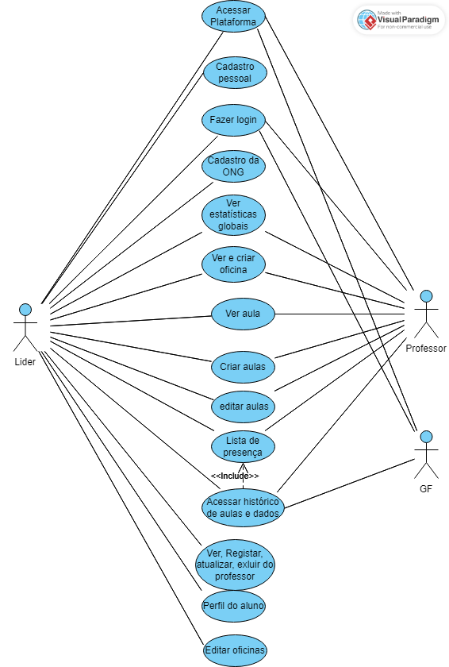

&nbsp;&nbsp;&nbsp;&nbsp;A plataforma Asas Solidárias  oferece uma maneira fácil de entrar, com acesso após um simples cadastro e login. O cadastro da ONG é fundamental, permitindo que líderes registrem informações importantes sobre suas organizações.

&nbsp;&nbsp;&nbsp;&nbsp;As estatísticas globais ajudam a entender o impacto das ações das ONGs parceiras, orientando tomadas de decisões estratégicas. Criar e editar oficinas, assim como lidar com aulas, dá flexibilidade para adaptar o planejamento às necessidades específicas das comunidades. Essas ferramentas, junto com a capacidade de automaticamente registrar a presença, são essenciais para avaliar o envolvimento dos alunos e fornecer dados cruciais para Líderes, Professores e a Gerando Falcões.

&nbsp;&nbsp;&nbsp;&nbsp;Continuando a linha de raciocínio, tanto o Líder quanto o Professor conseguem editar as aulas já que ambos necessitam desse controle perante as oficinas ministradas na ONG. Após a edição e visualização de aulas como um todo, segue a mesma sequência de preenchimento da lista de presença no dia da oficina pelo Professor ou edição por parte do Líder. Ao concluir as presenças dos alunos de acordo com suas respectivas turmas, o sistema irá gerar, automaticamente, o histórico de aulas comparecidas ou cabuladas pelo aluno, gerando dados valiosos para os Líderes, Professores e a Gerando Falcões para seus indicadores internos. O Líder tem acesso à todas aas funcionalidades de visualização, edição e validação de um professor ativo ou inativo como membro. Indo além, assim como o professor é um membro colaborador, os alunos são membros recebedores das ações fornecidas pela ONG, logo, o Líder poderá visualizar o perfil desse aluno para validação dos seus dados pessoais e realizar um acompanhamento deste mesmo nas oficinas e editar as oficinas de acordo com o planejamento organizacional e educacional de sua ONG.

### 5.3.1 Histórias de Usuário

&nbsp;&nbsp;&nbsp;&nbsp;A história de usuários são descrições curtas de linguagem simples para abordar a funcionalidade de um sistema pela perspectiva do usuário. 

&nbsp;&nbsp;&nbsp;&nbsp;A seguir, será demonstrada as principais User Stories desenvolvidas de acordo com o Caso de Uso acima:

| **User Story 1** | **Exemplo** | 
| --- | --- | 
| **Descrição** | Como facilitadora, eu quero conseguir registrar a presença dos alunos na minha aula, para monitorar sua participação na oficina |
| **Persona Envolvida** | Sandra Covas |
| **Critérios de Aceitação** | CR-01 - O site deve apresentar uma lista com o nome de todos os alunos registrados em uma aula, permitindo que marque se está presente ou ausente. CR-02 - Deve ser apresentado uma maneira de registrar todas presenças em processo único |
| **Prioridade** | Alta |
| **Estimativa de Esforço** | Média | 

 

| **User Story 2** | **Exemplo** | 
| --- | --- |  
| **Descrição** | Como facilitadora, eu quero conseguir olhar as informações da oficina em que leciono, incluindo as datas das próximas aulas, para poder planejar minhas atividades |
| **Persona Envolvida** | Sandra Covas |
| **Critérios de Aceitação** | CR-01 - O sistema deve informar os dados de cada oficina juntamente com as próximas aulas, indicando se elas estão marcadas, foram canceladas ou já foram concluídas |
| **Prioridade** | Média |
| **Estimativa de Esforço** | Média | 

 

| **User Story 3** | **Exemplo** | 
| --- | --- |  
| **Descrição** | Eu como Gestora da Gerando Falcões, quero ter uma ampla visualização dos principais dados das ONG's parceiras para exportá-los verificando indicadores e possíveis oportunidades voltadas para o crescimento das mesmas |
| **Persona Envolvida** | Joana Rodrigues |
| **Critérios de Aceitação** | O sistema deve permitir a coleta de dados a partir do back-end, sem a necessidade de imputar dados manualmente e demonstrá-los nos campos específicos das metrificações exigidas pela Gerando Falcões. Além disso, deve-se obter os dados de comparecimento dos alunos para registrar um gráfico de presença ao longo do tempo |
| **Prioridade** | Média |
| **Estimativa de Esforço** | Alta | 

 

| **User Story 4** | **Exemplo** | 
| --- | --- |  
| **Descrição** | Eu como aluno, quero participar das oficinas dispostas pela ONG e interagir com pessoas da minha comunidade enquanto participo das atividades para ter um impacto positivo na minha vida e mudar minha realidade |
| **Persona Envolvida** | Thiago Costa |
| **Critérios de Aceitação** | O aluno deverá ser cadastrado pelo Líder antes de iniciar as oficinas. Caso o aluno não tenha se registrado, o Facilitador deverá registrar o aluno |
| **Prioridade** | Alta |
| **Estimativa de Esforço** | Média | 

 

| **User Story 5** | **Exemplo** | 
| --- | --- |  
| **Descrição** | Como líder da ONG, quero um sistema de gerenciamento que permita a criação de alunos ou facilitadores vinculados à minha organização, de maneira prática e automática |
| **Persona Envolvida** | Guilherme do Santos |
| **Critérios de Aceitação** | O sistema deve permitir o registro de novos participantes, a organização e criação de oficinas e aulas. O sistema deve fornecer meios para gestão destes membros e oficinas. Deve haver um registro histórico, a fim de fornecer insumos de dados para inteligência |
| **Prioridade** | Alta |
| **Estimativa de Esforço** | Média | 

 

| **User Story 6** | **Exemplo** | 
| --- | --- |  
| **Descrição** |  Como líder da ONG, quero um sistema de gerenciamento equipado com ferramentas que me permita acompanhar a ocorrência das aulas e frequência de alunos |
| **Persona Envolvida** | Guilherme do Santos |
| **Critérios de Aceitação** | O sistema deve permitir o envio de informações referentes ao acontecimento das aulas e lista de chamada eletrônica para gerir presença de alunos. O sistema deve permitir a visualização da ocorrência das aulas e deve ser capaz de ilustrar de forma clara a presença individual de cada aluno |
| **Prioridade** | Alta |
| **Estimativa de Esforço** | Alta | 

# 6. Projeto de Solução

&nbsp;&nbsp;&nbsp;&nbsp;A solução proposta abrange a arquitetura de software de uma plataforma web dedicada ao gerenciamento de atendimentos e atividades de Organizações Não Governamentais (ONGs). Temos um frontend hospedado em um Amazon EC2, fornecendo uma interface de usuário intuitiva com a utilização de React.js e Typescript. O backend, também baseado em um EC2, gerencia a lógica de negócios, processamento de dados e integrações, utilizando tecnologias como Express e MongoDB. O banco de dados, acoplado em um EC2 ou Amazon RDS, armazena dados críticos, como registros de atendimentos e perfis de usuários. Além disso, a arquitetura incorpora serviços da AWS, como Amazon S3 para armazenamento das imagens que serão disponibilizadas pelos facilitadores e líderes.

&nbsp;&nbsp;&nbsp;&nbsp;Nos próximos parágrafos, serão apresentados de forma mais detalhada os diagramas que ilustram a estrutura e interações do sistema, assim como as tecnologias e ferramentas escolhidas para sua implementação.

## 6.1 Diagrama de Classes
&nbsp;&nbsp;&nbsp;&nbsp;Diagrama de classe é uma ferramenta que ajuda na modelagem de sistemas orientados a objetos, representando relações entre classes de um sistema. Tendo em mente que uma classe é uma estrutura que contém atributos e comportamentos. Os diagramas de classe são uma parte fundamental do modelo UML, e são amplamente utilizadas em desenvolvimento de software para representar a estrutura de um sistema, proporcionando uma visão clara da arquitetura do sistema, possibilitando uma visão clara, manutenção e evolução futura do software.

### 6.1.1 Diagrama de Classes de Domínio
&nbsp;&nbsp;&nbsp;&nbsp; O diagrama de classe de domínio é uma ferramenta poderosa no desenvolvimento de software orientado a objetos, pois oferece uma representação visual das entidades fundamentais dentro de um domínio específico. Este tipo de diagrama é frequentemente utilizado na fase de análise e design do ciclo de vida do desenvolvimento de software.

Ao se concentrar em um domínio particular, o diagrama de classe de domínio identifica e destaca as principais entidades, ou classes, que desempenham papéis essenciais nesse contexto. Cada classe é representada por um retângulo dividido em três compartimentos: o nome da classe, os atributos que a caracterizam e os métodos que ela pode executar.

Além disso, as linhas de associação conectam as classes no diagrama, indicando as relações e interações entre elas. Essas associações podem incluir relacionamentos como associações simples, agregações ou composições, dependendo da natureza da conexão entre as entidades.

A utilidade do diagrama de classe de domínio se estende além da mera representação visual. Ele desempenha um papel crucial na comunicação eficaz entre as equipes de desenvolvimento, analistas de sistemas e stakeholders, fornecendo uma linguagem comum para discutir e compreender a estrutura do sistema. Além disso, serve como um guia valioso para implementação, facilitando a tradução do design orientado a objetos em código executável.

Ao modelar um sistema por meio desse diagrama, os desenvolvedores podem entender melhor as interações entre as entidades, identificar padrões de comportamento e estruturar o código de maneira mais modular e flexível. Isso promove a reutilização de código e a manutenção eficiente do sistema ao longo do tempo.

 Figura x - Diagrama de classe de domínio 

 Fonte: Material produzido pelos autores (2024) 

&nbsp;&nbsp;&nbsp;&nbsp; A seguir, o detalhamento de cada domínio e seus significados:

- GF: Esse domínio representa os gestores da Gerando Falcões. Sendo assim, será armazenado apenas o Email (String) e Password (String).
- ONG: Esse domínio representa as ONGs cadastradas na plataforma. Sendo assim, será armazenado apenas Email_ONG (String), CNPJ (String), Tel (String), Data_fundado(String) e Endereço (String).
- Responsável: Esse domínio é responsável por representar os responsáveis dos alunos considerador menor de idade. Sendo assim, será armezanado apenas Nome(String), Gênero(String), Estado_civil(String), Raça(String), Data_nascimento(Date), RG(String), CPF(String), Email(String), Tel(String), Estado_geografico(String), Endereço(String) e Cidade(String).
- Professor: Esse domínio é responsável por representar os professores. Sendo assim, será armezanado apenas Nome(String), Gênero(String), Estado_civil(String), Raça(String), Data_nascimento(Date), RG(String), CPF(String), Email(String), Tel(String), Estado_geografico(String), Endereço(String) e Cidade(String).
- Líder: Esse domínio é responsável por representar os líderes das ONGs. Sendo assim, será armezanado apenas Nome(String), Email(String), Pass(String), Tel(String) e REF_ONG_ID.
- Oficina: Esse domínio é responsável por representar as oficinas  que estão cadastradas no sistema. Sendo assim, será armazenado apenas Nome(String), Duração(Date), Categoria(String) e Status(String).
- Turma: Esse domínio é responsável por representar as turmas que estão cadastradas no sistema. Será armazenado apenas Local(String), Periodo(String), Recorrencia(Array of Strings), horario(String) e aula {data(Date), REF_PROFESSOR_ID, Registros(BinData), Observações(String) e Status(String)}.
- Aluno: Esse domínio é responsável por representar os alunos cadastrados no sistema. Sendo assim, será armezanado apenas Nome(String), Gênero(String), Estado_civil(String), Raça(String), Data_nascimento(Date), RG(String), CPF(String), Email(String), Tel(String), Estado_geografico(String), Endereço(String), Cidade(String) e Presença{REF_TURMA_ID, Recorrencia(Array), REF_RESPONSAVEL_ID e Status(String)}.

### 6.1.2 Diagrama de Classes de Implementação
&nbsp;&nbsp;&nbsp;&nbsp; Um Diagrama de Classes de Implementação, é uma representação gráfica das classes que compõem um sistema e como elas se relacionam. É uma ferramenta que auxilia na modelagem orientada a objetos e é utilizada no desenvolvimento de software para visualizar a estrutura de um sistema.

No contexto de um Diagrama de Classes, as classes são os blocos de construção do sistema. Cada classe representa uma entidade ou um conceito, com seus atributos (dados relacionados) e métodos (funções ou ações que a entidade pode realizar).

 Figura x - Diagrama de classe de implementação 

 Fonte: Material produzido pelos autores (2024) 

&nbsp;&nbsp;&nbsp A seguir uma explicacao dos elementos principais de um diagrama de classe:

Classes: Cada retângulo no diagrama representa uma classe, que é uma entidade ou conceito dentro do sistema. Aqui, temos classes como GF, ONG, Oficina, Líder, Turma, Responsável, Professor e Aluno.

Atributos: São as características ou propriedades que cada classe possui. Eles representam informações que a classe armazena. Por exemplo, a classe ONG tem atributos como Email_ONG, CNPJ, Data_Fundacao e Endereco.

Métodos: São as operações ou funções que as classes podem executar. Eles geralmente representam comportamentos ou ações que a classe pode realizar. Por exemplo, a classe GF tem métodos como verifyLogin(), addOng(), listOngs() e updateOng().

Visibilidade: É indicada pelos símbolos + (público), - (privado), # (protegido). A visibilidade determina como os atributos e métodos podem ser acessados. Por exemplo, + antes de Email em ONG indica que Email é um atributo público.

Associações: As linhas que conectam as classes indicam que existe uma relação entre elas. As extremidades das linhas muitas vezes têm marcadores que indicam a cardinalidade da associação.

Um losango preenchido representa uma associação de composição, onde a parte não pode existir sem o todo.
Cardinalidade: Os números ou símbolos perto das associações indicam a quantidade de instâncias que podem se relacionar em cada lado da associação. Por exemplo:

1 indica uma relação um-para-um.
0..* indica que uma classe pode ter uma relação opcional com zero ou muitas instâncias da outra classe.

## 6.2 Diagrama de Componentes da Arquitetura
<conteúdo>

## 6.3 Diagrama de Implantação

&nbsp;&nbsp;&nbsp;&nbsp;O Diagrama de Implantação é uma representação visual que demonstra tanto os aspectos de hardware quanto de software de um sistema, fornecendo uma visão detalhada da execução da arquitetura. Ao contrário de outros diagramas UML, que se concentram principalmente nos componentes lógicos do sistema, os diagramas de implantação destacam a interação entre hardware e software, ajudando na modelagem da topologia completa de um sistema. Esses diagramas oferecem uma compreensão abrangente da infraestrutura física e virtual necessária para suportar a operação do sistema, facilitando a análise e o planejamento de implantações de software em ambientes reais.

 Figura x - Diagrama de Implantação 
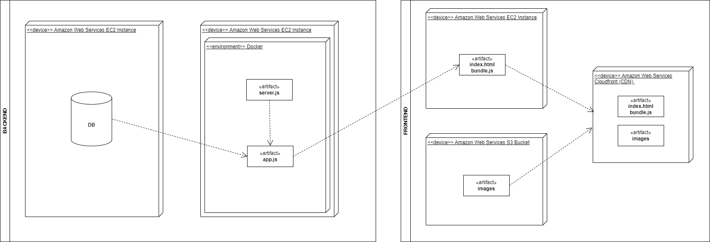

 Fonte: Material produzido pelos autores (2024) 

&nbsp;&nbsp;&nbsp;&nbsp; O servidor da aplicação está implantado sobre a infraestrutura de uma instância EC2 da AWS. Nessa instância o Docker foi utilizado para padronização do ambiente de execução em que são executados os arquivos do servidor, representados pelo server.js e app.js. 
&nbsp;&nbsp;&nbsp;&nbsp;Ao responder as requisições do cliente, a aplicação do servidor em app.js e server.js solicitará dados armazenados no Banco de Dados. O BD está apoiado em uma infraestrutura de uma instância EC2, também da AWS. 

&nbsp;&nbsp;&nbsp;&nbsp;Ao ser realizada a requisição do cliente, serão enviados os arquivos index.html que ao ser executado pelo navegador, realizará a solicitação para os arquivos bundle.js e as imagens. 

&nbsp;&nbsp;&nbsp;&nbsp;Esses arquivos estáticos serão retornados através do Cloudfront (CDN) que retornará os arquivos presentes em cache, onde na primeira requisição terão sido retornados a partir de uma instância EC2 que armazena os artefatos index.html e bundle.js e de um S3 Bucket que possui armazenamento das imagens. As requisições para o servidor serão feitas pelo arquivo bundle.js, ou seja, ele solicita os serviços do backend. 

## 6.4 Tecnologias e Ferramentas

&nbsp;&nbsp;&nbsp;&nbsp;No núcleo do projeto SaaS de gestão de ONS, a escolha do Node.js para o backend oferece benefícios significativos. A eficiência no tratamento de operações assíncronas é crucial para uma aplicação ágil e responsiva, a arquitetura de call stack não bloqueante do Node.js é ideal para lidar com várias requisições simultaneamente, proporcionando um desempenho excepcional em ambientes com alto tráfego. Isso é crucial para a responsividade e eficácia do sistema Asas Solidárias, especialmente em situações onde a resiliência e estabilidade do sistema mostra-se importante, enquanto o uso do framework Express.js simplifica a construção de APIs, proporcionando uma estrutura organizada para lidar com rotas, requisições e respostas. 

&nbsp;&nbsp;&nbsp;&nbsp;No lado do frontend, o React.js se destaca. Sua abordagem baseada em componentes e renderização no lado do cliente, simplifica o desenvolvimento e manutenção da interface do usuário. A reatividade e a capacidade de atualizar partes específicas da página sem recarregar a aplicação tornam o React ideal para oferecer uma experiência de usuário fluida e eficiente.

&nbsp;&nbsp;&nbsp;&nbsp;No que diz respeito ao armazenamento de dados, a escolha do MongoDB como banco de dados NoSQL é estratégica. A flexibilidade do modelo de documentos BSON permite adaptação fácil a mudanças nos requisitos, enquanto a escalabilidade horizontal atende às demandas de um sistema em constante expansão. A capacidade de lidar com grandes volumes de dados de forma eficiente faz do MongoDB uma escolha sólida para nosso SaaS.

&nbsp;&nbsp;&nbsp;&nbsp;Ao migrar para a nuvem com a AWS, a infraestrutura global da plataforma emerge como um benefício crucial. A presença global da AWS, com data centers distribuídos em diferentes regiões, permite uma entrega de conteúdo rápida e confiável em escala internacional. Essa infraestrutura robusta contribui para a diminuição da latência e proporciona uma experiência consistente aos usuários finais, independentemente da localização geográfica.

&nbsp;&nbsp;&nbsp;&nbsp;Em resumo, cada tecnologia nesta stack desempenha um papel crucial. Do lado do backend e frontend, do banco de dados à nuvem, cada escolha foi feita visando não apenas a funcionalidade, mas também a eficiência, escalabilidade e adaptabilidade, essenciais para um SaaS de gestão de ONS robusto e inovador.

# 7. Interface
<conteúdo>
## 7.1 Design System
<conteúdo>

## 7.2 Projeto de Interface (Wireframes)

&nbsp;&nbsp;&nbsp;&nbsp; Wireframes são representações visuais básicas de uma interface ou produto digital, que exibem a disposição do conteúdo e os caminhos que eles seguem. Ao fazer uso desses esquemas, é possível garantir uma usabilidade eficiente, bom fluxo de navegação e organização sem ter que depender de muitos detalhes.  
&nbsp;&nbsp;&nbsp;&nbsp; A seguir, serão apresentados os wireframes das telas, destacando os objetivos de cada uma e sua navegabilidade de acordo com as perspectivas dos usuários.

**Login e Cadastro**

 Figura x - Tela de Login 

 Fonte: Material produzido pelos autores (2024) 

 Figura x - Acesso 

 Fonte: Material produzido pelos autores (2024) 

&nbsp;&nbsp;&nbsp;&nbsp;A tela de login pode ser acessada por todos os usuários do sistema - Gestor da GF, Líder e Facilitador. Desta forma, não se faz necessários botões adicionais de acordo com o seu cargo, pois a validação ao realizar o login se dará pelo e-mail referente aos usuários e suas senhas. 

 Figura x - Cadastro 

 Fonte: Material produzido pelos autores (2024) 

&nbsp;&nbsp;&nbsp;&nbsp;Caso a ONG não tenha previamente um cadastro, será necessário fornecer alguns dados base para a abertura de uma conta na plataforma. 

**Tela Inicial**

 Figura x - Tela Inicial 
  

 Fonte: Material produzido pelos autores (2024) 

&nbsp;&nbsp;&nbsp;&nbsp;A tela inicial neste modelo é acessada somente pelo Líder. O Facilitador terá uma tela personalizada de acordo com os requisitos mais específicos que ele usará e restrição de acesso (demonstrada posteriormente) e o Gestor da GF será encaminhado diretamente para o dashboard (também demonstrado posteriormente). Essa página foca em demonstrar os Dados da ONG de maneira macro, seus membros ativos e inativos, sendo estes os facilitadores e os alunos, além da possibilidade de gerenciar e criar as oficinas fornecidas pela ONG. 

 Figura x - Tela Inicial Facilitador 

 Fonte: Material produzido pelos autores (2024) 

&nbsp;&nbsp;&nbsp;&nbsp;Diferentemente do Líder, o Facilitador terá acesso somente às suas oficinas concluídas e ministradas atualmente pelo membro. Desta forma, ocorrerá um controle de turma e presença dos alunos em suas respectivas aulas. Poderá também contemplar os dados macro da ONG, sem realizar quaisquer edições. 

**Membros**

 Figura x - Membros 

 Fonte: Material produzido pelos autores (2024) 

&nbsp;&nbsp;&nbsp;&nbsp;A tela de membros é composta por dois grandes blocos:
1. O primeiro da esquerda são as informações principais da ONG e o nome do Líder responsável pela instituição;
2. O segundo bloco da direita demonstra os membros da ONG com possibilidade de filtro e busca. 

 Figura x - Membros específicos

 Fonte: Material produzido pelos autores (2024) 

&nbsp;&nbsp;&nbsp;&nbsp;Ao clicar em um membro específico, seja ele aluno ou professor, o perfil dele será demonstrado com todos os dados pessoais necessários, seu histórico e a possibilidade de edição deste mesmo perfil. 

 Figura x - Modal do Histórico de Membro

 Fonte: Material produzido pelos autores (2024) 

**Cadastros**

&nbsp;&nbsp;&nbsp;&nbsp;Existem ao todo quatro criações diferentes de cadastros, sendo elas:
1. Criação de Aluno;
2. Criação de Facilitador;
3. Criação de Oficina;
4. Criação de Turma.

&nbsp;&nbsp;&nbsp;&nbsp;Como as telas são muito parecidas e ocorrem sempre por etapas, mostraremos somente a primeira tela principal do cadastro com os *steps* inclusos na própria página e na especificação posterior de cada tipo de cadastro. 

 Figura x - Criar Aluno (modelo para outras páginas de criação)

 Fonte: Material produzido pelos autores (2024) 

**Criação de Aluno**

&nbsp;&nbsp;&nbsp;&nbsp;O passo a passo para a criação de novos alunos é dado por:
1. Nome do aluno;
2. Dados pessoais (caso o aluno for menor de idade, será requisitado os dados do responsável);
3. Contatos como e-mail e celular;
4. Localidade de residência;
5. Oficinas que o aluno irá se matricular.

**Criação de Facilitador**

&nbsp;&nbsp;&nbsp;&nbsp;O passo a passo para a criação de novos facilitadores é dado por:
1. Nome do facilitador;
2. Dados pessoais;
3. Contatos como e-mail e celular;
4. Localidade de residência;
5. Oficinas que o facilitador irá ministrar.

**Criação de Oficina**

&nbsp;&nbsp;&nbsp;&nbsp;O passo a passo para a criação de novas oficinas é dada por:
1. Nome da oficina;
2. Facilitador responsável;
3. Localidade da oficina.

**Criação de Turma**

&nbsp;&nbsp;&nbsp;&nbsp;O passo a passo para a criação de novas turmas é dada por:
1. Facilitador responsável;
2. Dias e horários da turma;
3. Localidade das aulas que a turma irá participar;
4. Alunos da turma. 

&nbsp;&nbsp;&nbsp;&nbsp;Ao final de cada etapa, deverá aparecer na tela um modal de confirmação e um de validação que a criação foi realizada com sucesso. 

 Figura x - Confirmação 

 Fonte: Material produzido pelos autores (2024) 

 Figura x - Feedback de Criação com Sucesso 

 Fonte: Material produzido pelos autores (2024) 

**Oficinas**
&nbsp;&nbsp;&nbsp;&nbsp; A tela de oficina é o lugar que o usuário será direcionado sempre que clicar em um card com o nome de uma oficina na página inicial. A estrutura dessa página é semelhante a página de membros, onde possuímos dois blocos. Na esquerda, são exibidas as informações cruciais do curso, uma opção para cadastrar turmas e outra para ver e modificar os alunos do curso. Na direita, possuímos todas as aulas que uma determinada turma deve ter, conseguindo visualizar o dia, horário e se a aula foi concluída, cancelada ou está marcada para ocorrer. Também, é possível utilizar alguns filtros para ver apenas determinadas aulas, como turmas ou situações específicas.

 Figura x - Tela de Oficinas 

 Fonte: Material produzido pelos autores (2024) 

Acessando a opção "Alunos", é aberto um modal em que a ONG conseguirá ver todos o alunos dentro da oficina e atribuí-los a uma turma, assim como também podem mover os alunos de turma.

 Figura x - Modal de Alunos da oficina 
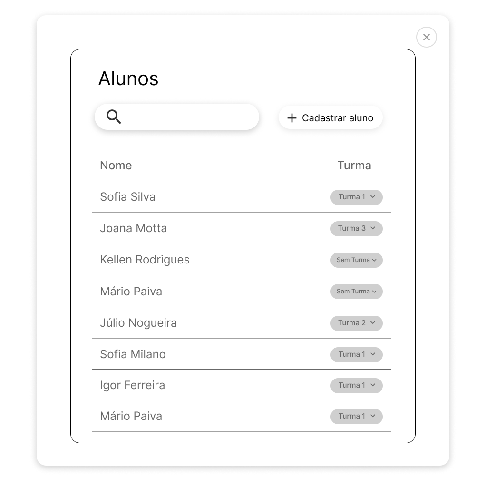

 Fonte: Material produzido pelos autores (2024) 

**Aulas**
&nbsp;&nbsp;&nbsp;&nbsp; Ao clicar em uma das aulas disponíveis, independentemente da sua situação, o usuário é redirecionado para a página dela. Assim, é possível conferir e mudar as informações sobre ela, editar a situação da aula, registrar observações e fotos.

 Figura x - Tela de Aula 
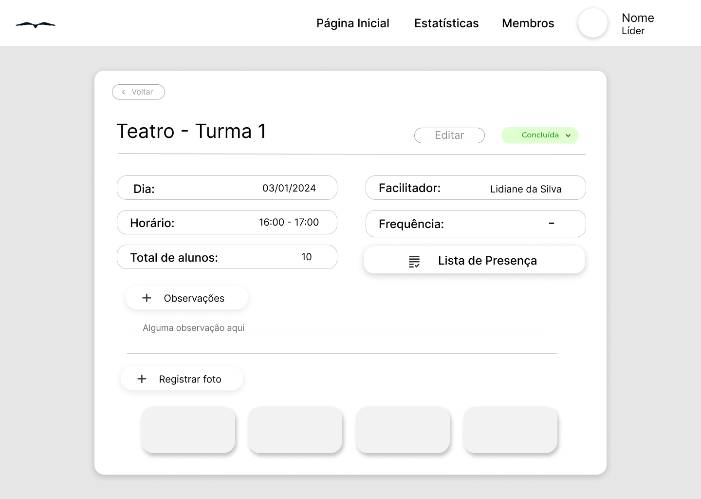

 Fonte: Material produzido pelos autores (2024) 

Ao clicar no botão "Lisa de Presença" será aberto um modal que o facilitador utilizará para marcar a presença dos participantes da atividade. Quando a aula é concluída, o campo de frequência contribui para informar quantos alunos foram atendidos.

 Figura x - Modal de presença 
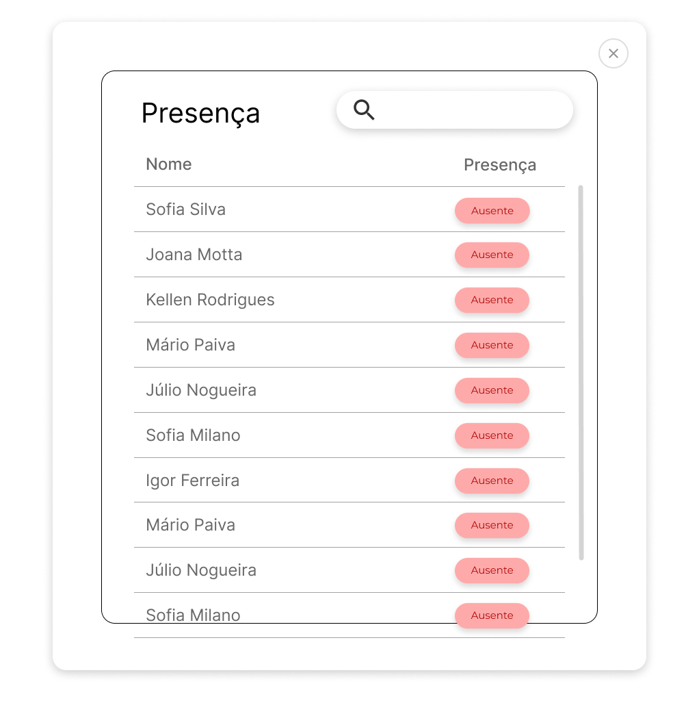

 Fonte: Material produzido pelos autores (2024) 

**Estatísticas - ONGs**
&nbsp;&nbsp;&nbsp;&nbsp; A aba de estatísticas pode facilmente ser acessada pela página inicial ou pela barra de navegação. Nela, as ONGs podem acompanhar seus resultados e dados que ajudam a aprimorar seus impactos, como o número de atendimentos e colaboradores. Além disso, é possível filtrar esses dados por gênero, idade, raça, estado e período.

 Figura x - Tela de Estatísticas da ONG 
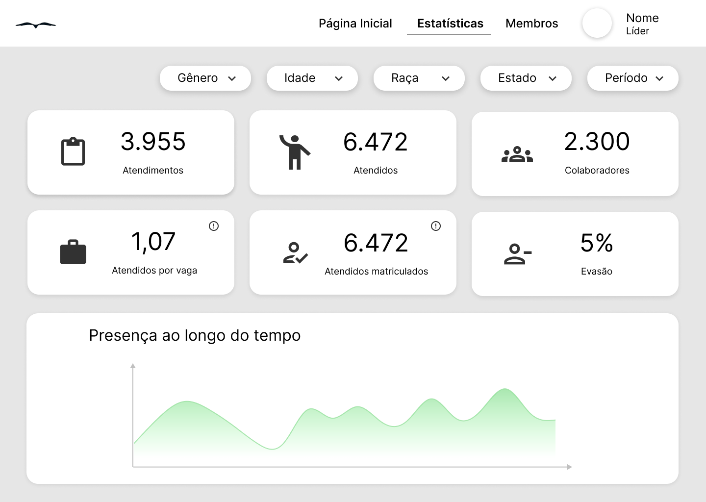

 Fonte: Material produzido pelos autores (2024) 

**Estatísticas - Gerando Falcões**
&nbsp;&nbsp;&nbsp;&nbsp; Como mencionado anteriormente, os gestores da Gerando Falcões possuem o acesso direto e exclusivo a uma outra páginas de estatística. Essa tela possui a mesma lógica da estrutura de blocos apresentada na área de oficinas e de membros. Situada na esquerda há uma lista com o nome de todas as ONGs englobadas pela rede, com seu nome e data de fundação. Na direita são exibidos 8 blocos que separam os dados para o gestor analisar, com o nome da ONG selecionada e um botão de filtros. Novamente, os resultados poderão ser personalizados para ver de um determinado gênero, idade, estado, período e raça.

Enquanto nenhuma ONG for selecionada, as informações apresentadas no campo serão da Gerando Falcões, o que permite estar ciente do panorama geral da rede. Se tratando dessa situação, os seguintes dados são exibidos: número de ONGs parceiras, de favelas atendidas, de colaboradores, porcentagem de evasão, quantidade de atendimentos, de atendidos gerais, atendidos em relação ao número de vagas e atendidos matriculados.

 Figura x - Tela de estatísticas da Gerando Falcões 
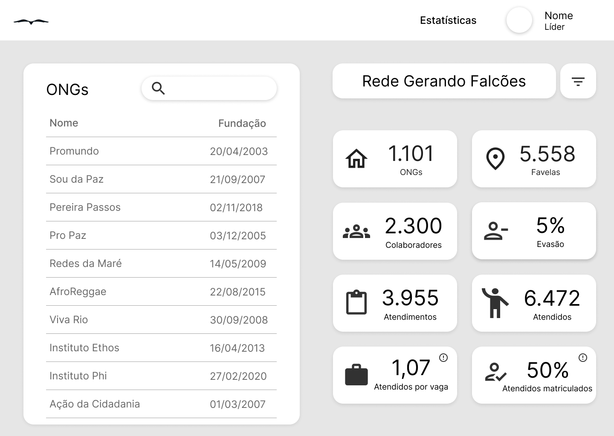

 Fonte: Material produzido pelos autores (2024) 

&emsp; Ao selecionar uma ONG, o nome dela será exibido no campo ao topo dos dados e suas informações irão preencher os blocos de estatísticas. Nessa situação, as métricas "número de ONGs parceiras" e "número de favelas atendidas" serão substituídas respectivamente por: quantidade de oficinas disponibilizadas pela ONG, média de presença dos membros nas atividades. Além disso, será apresentado um campo com o nome do líder da organização.

 Figura x - Tela de estatísticas da Gerando Falcões 
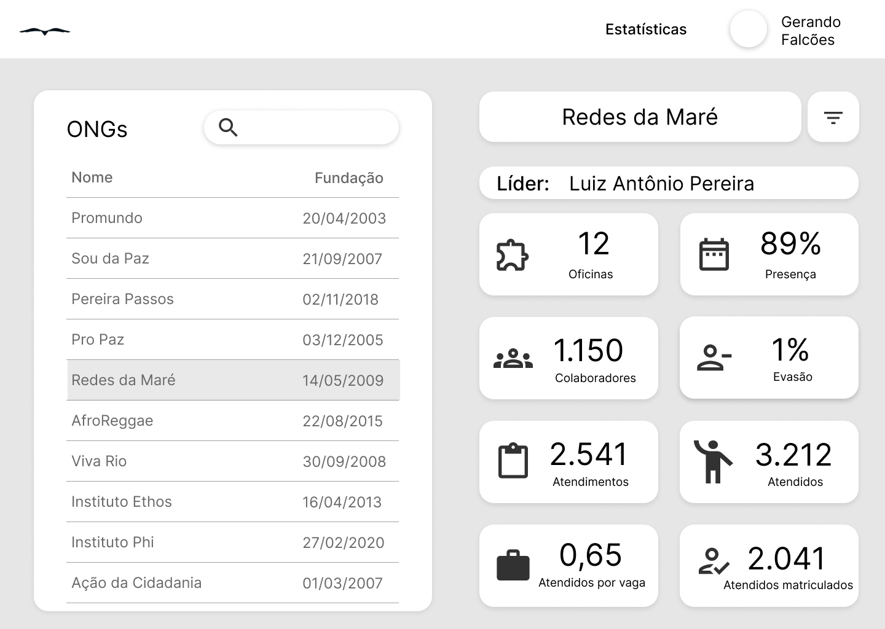

 Fonte: Material produzido pelos autores (2024) 

&emsp; Todas as telas apresentadas foram e serão elaboradas com base em um estudo do design system do parceiro Gerando Falcões. Com isso em mente, procurou-se seguir o tom de voz da marca em todas as menções de texto, refletindo um conteúdo humanizado e empático, com textos inclusivos e linguagem simples. Essa abordagem visa garantir que o público alvo se sinta confortável ao interagir com uma plataforma que se comunica na mesma linguagem que ele.

&emsp; Quanto ao design, pretende-se implementar a tipografia e cores já utilizadas pela Gerando Falcões, criando um ambiente mais familiar para todas as organizações parceiras e membros da Gerando Falcões. O wireframe foi criado considerando as cores neutras da paleta da organização como base e fundo da plataforma, complementadas pelo colorido da paleta “Cores GF”. Além disso, as páginas foram majoritariamente pensadas em blocos, seguindo a padronização de grid desktop, bordas e sombras existentes no design system do parceiro. Os espaçamentos, tanto "stack" quanto "inline", propostos no mesmo documento, serão respeitados, garantindo uma maior harmonia e coerência visual.

&emsp; Para reforçar os padrões já adotados, é fundamental a presença de componentes conhecidos pelos usuários, o que garante a consistência na usabilidade.  Assim, a barra de navegação da plataforma (menu) foi pensada com o mesmo visual e estados de hover e selecionado.  Também pretende-se seguir os tamanhos e estilos propostos para avatares, botões, dropdowns e filtros. Adicionalmente, todos os ícones utilizados são os mesmos dispostos no design system, reforçando os padrões já conhecidos pelo usuário. Por fim, as ilustrações representativas dispostas no documento serão implementadas para completar a interface e auxiliar o tom de voz na transmissão de uma mensagem mais humanizada.
 

&nbsp;&nbsp;&nbsp;&nbsp;Assim, todas as telas foram meticulosamente desenhadas visando uma percepção clara e simplificada aos olhos dos usuários, com a adição mínima de elementos para evitar sobrecarregar o espaço visual. Além disso, foi implementada uma padronização dos elementos em termos de tamanho, estilo de botão e disposição de cards para conteúdos, estabelecendo uma base mínima de tela. Isso permite que apenas as informações internas sejam modificadas, enquanto os usuários se familiarizam com o formato consistente das telas para ações específicas. Por exemplo, o processo de criação de alunos, facilitadores, oficinas ou turmas segue um padrão passo a passo, solicitando apenas as informações essenciais em cada tela, em vez de todas de uma vez. Desta forma, os componentes utilizados no wireframe demonstram uma grande adaptabilidade, sendo empregados várias vezes em diferentes contextos ao longo de toda a jornada do usuário. Além disso, nos inspiramos no Design System da Gerando Falcões, incorporando elementos como sombreados, ilustrações, ícones e a tipografia do parceiro. No geral, a integração consciente da marca e a capacidade de criar algo novo utilizando o Design System da GF evidenciam o trabalho colaborativo e contínuo de feedbacks com o parceiro, resultando na co-criação efetiva do projeto.

## 7.3 Frontend

&emsp; O frontend, ou parte visível da aplicação, é a interface direta entre os usuários e as funcionalidades oferecidas pelo sistema. Sua importância ultrapassa a apresentação de informações, ele é responsável por transmitir a experiência do usuário de maneira significativa. Uma interface bem projetada não apenas facilita a interação, mas também contribui para a compreensão intuitiva do sistema, promovendo uma utilização eficaz, uma vez que a parte visual da plataforma é a única área do produto onde o usuário consegue interagir. Apresentando de forma elegante e interativa as complexidades e abstrações de um sistema de dados e servidor robusto.

&emsp; As estratégias de design desempenham um papel crucial e cuidadosamente planejado no desenvolvimento da interface do SaaS, considerando especialmente a nossa abordagem voltada para usuários com baixo letramento digital. Nossa decisão de adotar um design minimalista e simples visa tornar a experiência do usuário mais acessível, intuitiva e fácil de compreender. Na busca pela clareza e usabilidade, cada elemento de design, desde a escolha de cores monocromáticas até a disposição dos componentes, passando pela tipografia e feedback visual, foi escolhido alinhadamente à filosofia de design seguida pelo time de desenvolvimento e design system da empresa parceira.

&emsp; A escolha de um design minimalista não apenas reduz a sobrecarga cognitiva para os usuários, haja vista que uma problemática atacada pelo projeto não é apenas a dificuldade de gestão por parte do líder da ONG, sendo a falta de tempo um ponto crucial a ser elevado, pensando alinhadamente ao problema a estética e filosofia minimalista, contendo apenas o necessário facilita a compreensão completa do sistema, promovendo uma compreensão mais rápida e eficaz do sistema. O grupo de desenvolvimento optou por um design simples e transparente no sentido de que todos os elementos estejam dispostos diretamente para o usuário, eliminando menus ocultos, elementos pequenos e também dropdowns extensos. 

&emsp;No contexto específico deste projeto, as decisões voltadas para a acessibilidade são numerosas e meticulosamente planejadas. A introdução de um sistema de navegação que viabiliza o acesso a qualquer ferramenta ou área do sistema com apenas três cliques representa uma escolha deliberada em prol da acessibilidade. Essa abordagem simplificada é especialmente projetada para aprimorar a interação de usuários com menor letramento digital, proporcionando uma experiência mais suave e intuitiva. A linguagem adotada segue uma abordagem simples, porém rica em detalhes, com o intuito de aproximar os usuários da plataforma. Reconhecendo que sistemas complexos podem intimidar novos usuários, essa decisão visa mitigar barreiras potenciais que poderiam resultar em uma baixa adoção do sistema. O uso de uma linguagem acessível é estratégico, promovendo a inclusão e incentivando uma participação mais ativa na plataforma, independentemente do nível de familiaridade do usuário com ambientes digitais. Além disso, a escolha estratégica de cores e contrastes, tamanhos de fonte ajustáveis e uma disposição cuidadosa dos elementos na interface são todas decisões que têm como objetivo direto melhorar a experiência de usuários com necessidades específicas, como baixa visão ou dificuldades cognitivas.

&emsp;Somada à estratégia de desenvolvimento do frontend voltado a experiência do usuário, foram priorizadas algumas funcionalidades para serem prioritariamente implementadas. Essa escolha foi tomada em alinhamento com as preponderâncias do parceiro em dar foco para a jornada dos professores. Assim, a tela inicial foi desenvolvida devido à sua importância para fornecer uma visão geral do sistema, que servirá de ponto de partida em todos os acessos. Essa tela permite acesso rápido as principais funcionalidades, como oficinas e dados da ONG.

&emsp;Nessa lógica, a tela de oficina também foi escolhida por proporcionar as principais atividades dos professores. Nesse local, eles podem acessar e cadastrar os alunos, visualizar suas aulas e as informações da oficina. Junto a essa tela, a página de aulas foi incluída por ser fundamental para completar a experiência do docente. É com ela que os professores poderão manter uma maior gestão dos atendidos, conseguindo registrar as presenças, observações e imagens da sua aula. 

&emsp;Todas essas páginas foram pensadas levando em consideração os estudos realizados para melhor atender o público alvo e seguindo a aprovação e feedbacks do wireframe. Desse modo, como o projeto de interface realizado foi pensado em média fidelidade, cada uma das telas citadas está documentada com maior profundidade na seção 7.2 desse documento.

# 8. Projeto de Banco de Dados
<conteúdo>
## 8.1 Modelo Conceitual
<conteúdo>
## 8.2 Modelo Lógico
<conteúdo>

# 9. Testes de Software

&nbsp;&nbsp;&nbsp;&nbsp; O teste de software e de endpoints representa uma abordagem integral no processo de garantia de qualidade de sistemas digitais. Enquanto o teste de software concentra-se na validação do funcionamento global de um programa, o teste de endpoints vai além, focalizando especificamente na verificação da interação entre o software e seus pontos de comunicação, conhecidos como endpoints. Esses endpoints podem incluir interfaces de programação de aplicativos (APIs), serviços web, dispositivos periféricos e outras formas de interconexão.

# 9.1 Demonstração da integração

### Class - Aulas

&nbsp;&nbsp;&nbsp;&nbsp; A routa de "Class" é responsável por todas as rotas das aulas cadastradas na plartaforma. Sendo assim, são manipulados datas das aulas, referência do professor da aula, observações e registro da aula.

- POST/ class
Esse endpoint cadastra novos professores na plataforma. Sendo assim, todos os campos são fundamentais para o novo cadastro.

- Caso de sucesso:

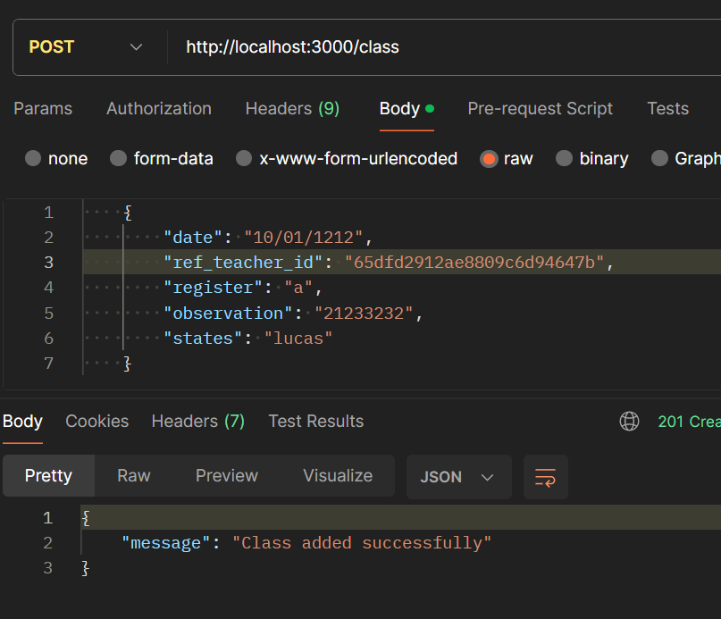

- Caso de falha:

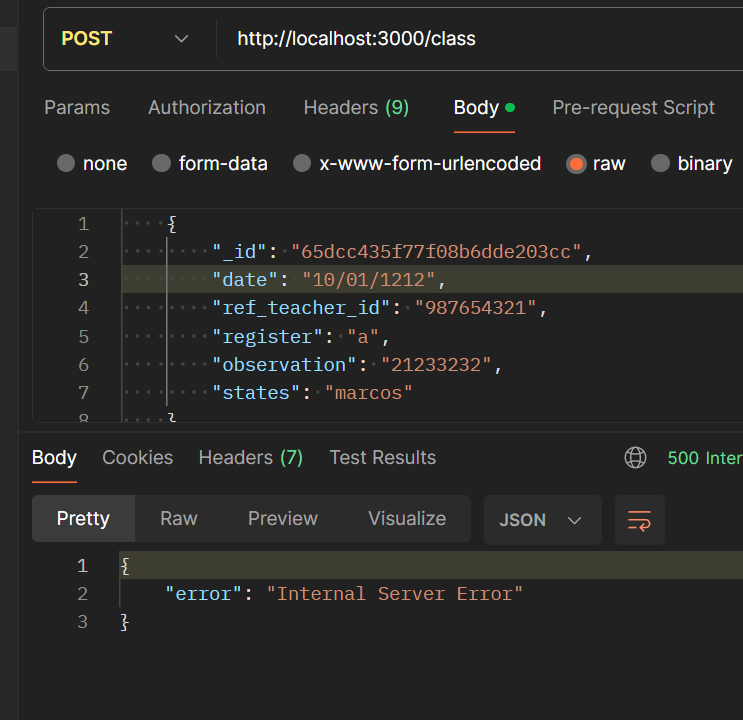

- GET/ class
Esse endpoint faz a leitura de todos os professores cadastrados. Sendo assim, nenhum campo precisa ser preenchido.

- Caso de sucesso:

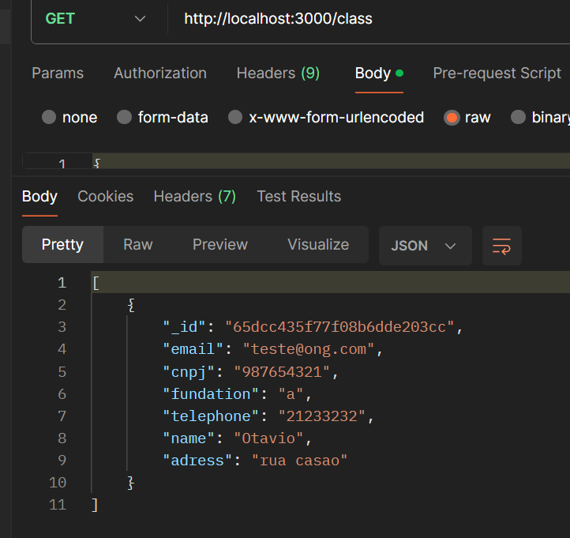

### Leaders - Líderes

As rotas de "Leaders" manipual os líderes das ONGs cadastradas. Sendo apresentado informações a respeito de email, telefone, nome e senha de cadastrado.

- GET/ leaders
A função responsável por essa rota é listLeader. Sendo necessário nenhum campo preenchido para essa requisição.

- Caso de sucesso:

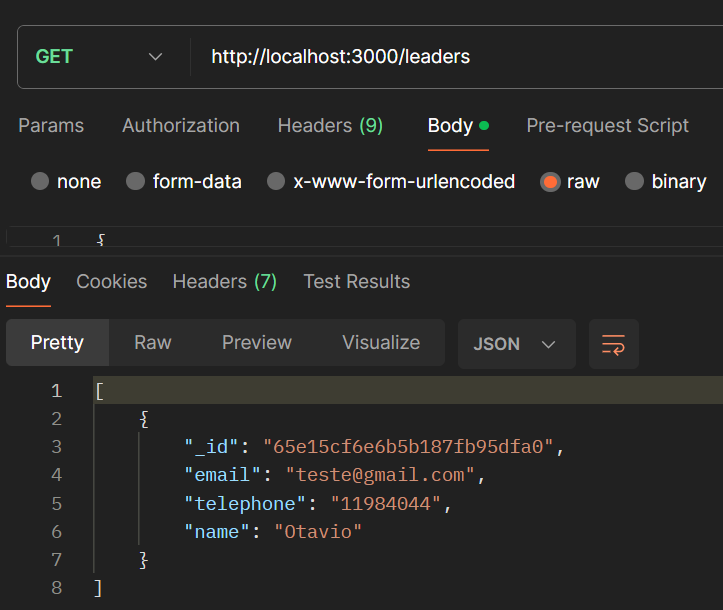

- POST/ leaders
A fuunção responsável por essa rota é "addLeader". Para essa função ser executada com sucesso todos os campos precisam ser preenchidos.

- Caso de sucesso:
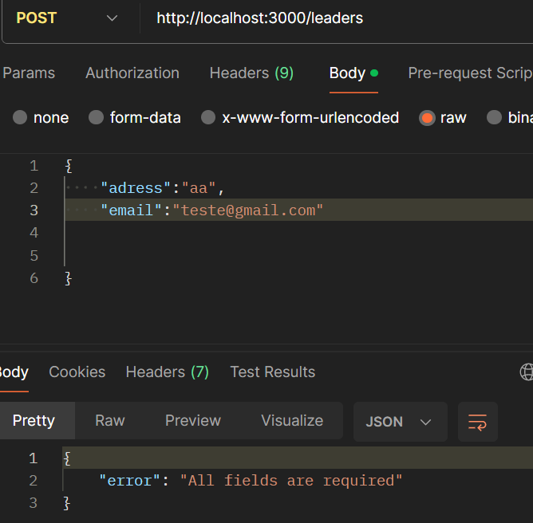

- Caso de falha:

- PATCH/ leaders
A função responsável por essa rota é a "updateLeader". Para atualizar algum campo na respectiva coleção você deve enviar o nome (name) de qual usuário (líder) deseja atualizar e os campos que deseja atualizar com as novas informações.

- Caso de falha:

- DELETE/ leaders
A função responsável por essa rota é "deleteLeaders". Para deletar algum líder da coleção, você precisa espeficiar aperas o nome de qual líder deseja deletar do banco de dados.

- Caso de sucesso:

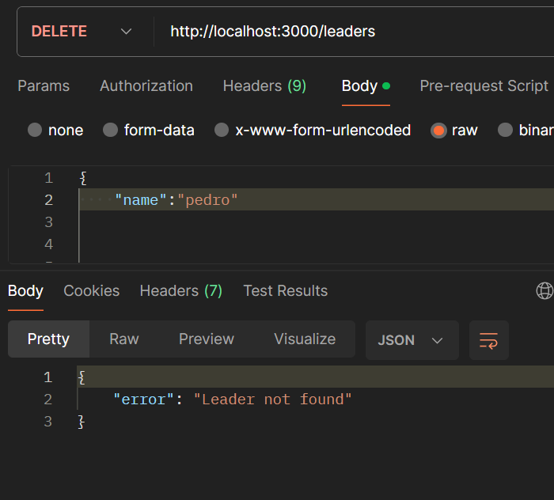

- Caso de falha:

### ONGs

As rotas de "ONGs" manipuala as ONGs cadastradas no sistema. Sendo assim, StartFragmentserá armazenado apenas Email_ONG (String), CNPJ (String), Tel (String), Data_fundado(String) e Endereço (String).EndFragment.

- GET/ ongs
A função responsável por essa rota é listOngs. Sendo necessário nenhum campo preenchido para essa requisição.

- Caso de sucesso:

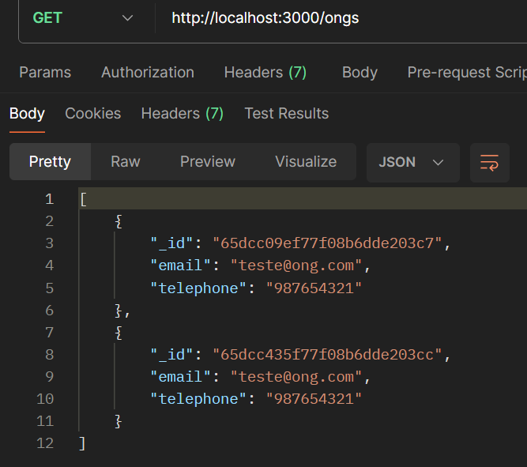

- POST/ ongs
A fuunção responsável por essa rota é "addOng". Para essa função ser executada com sucesso todos os campos precisam ser preenchidos.

- Caso de sucesso:

- Caso de falha:

UPDATE/ ongs
A função responsável por essa rota é a "updateOngs". Para atualizar algum campo na respectiva coleção você deve enviar o nome (name) de qual usuário (ONG) deseja atualizar e os campos que deseja atualizar com as novas informações.

- Caso de falha:

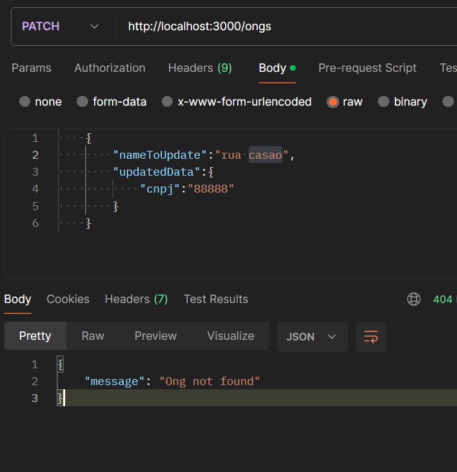

DELETE/ ongs
A função responsável por essa rota é "deleteOngs". Para deletar alguma ONG da coleção, você precisa espeficiar aperas o nome de qual ONG deseja deletar do banco de dados.

- Caso de sucesso:

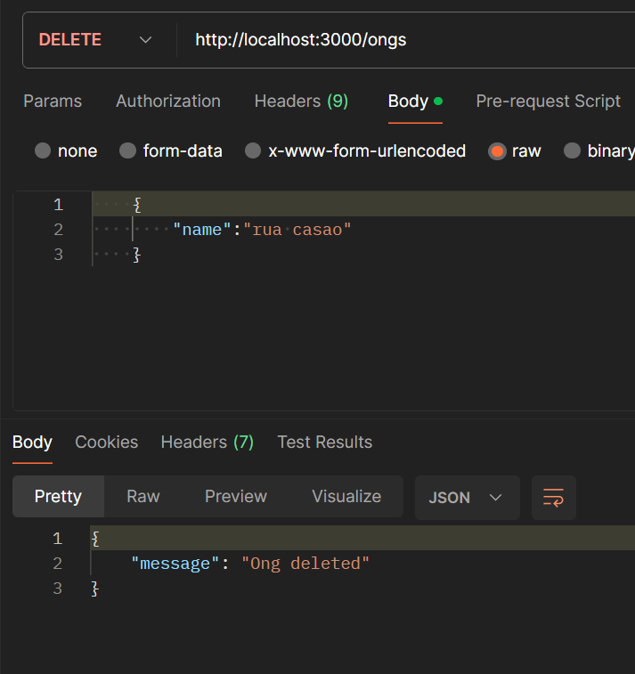

- Caso de falha:

### Responsible - Responsáveis
As rotas de "Responsible" manipuala os responsáveis cadastrados no sistema.StartFragment. Sendo assim, será armezanado apenas Nome(String), Gênero(String), Estado_civil(String), Raça(String), Data_nascimento(Date), RG(String), CPF(String), Email(String), Tel(String), Estado_geografico(String), Endereço(String) e Cidade(String).

GET/ responsibles
A função responsável por essa rota é "listResponsibles". Sendo necessário nenhum campo preenchido para essa requisição.

- Caso de sucesso:

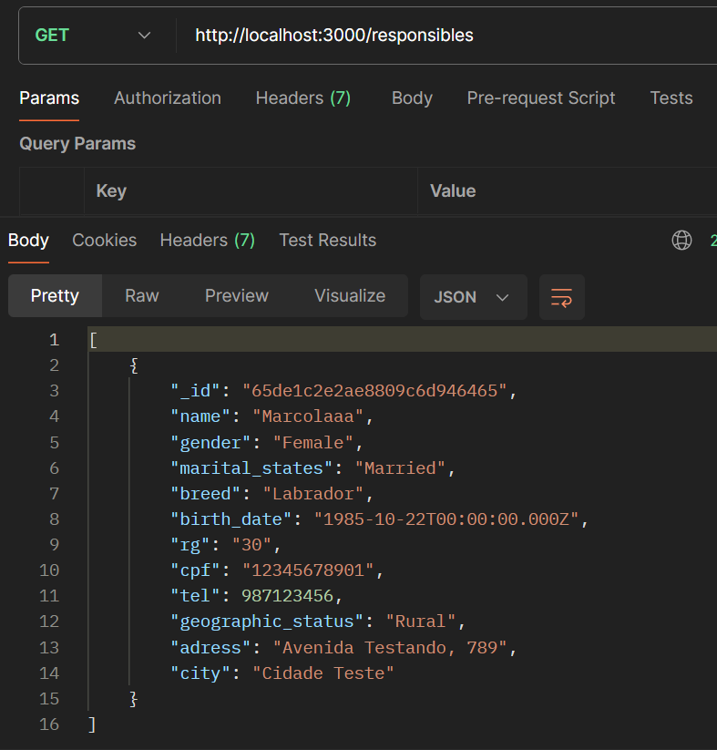

POST/ responsibles
A fuunção responsável por essa rota é "addResponsible". Para essa função ser executada com sucesso todos os campos precisam ser preenchidos.

- Caso de sucesso:

- Caso de falha:

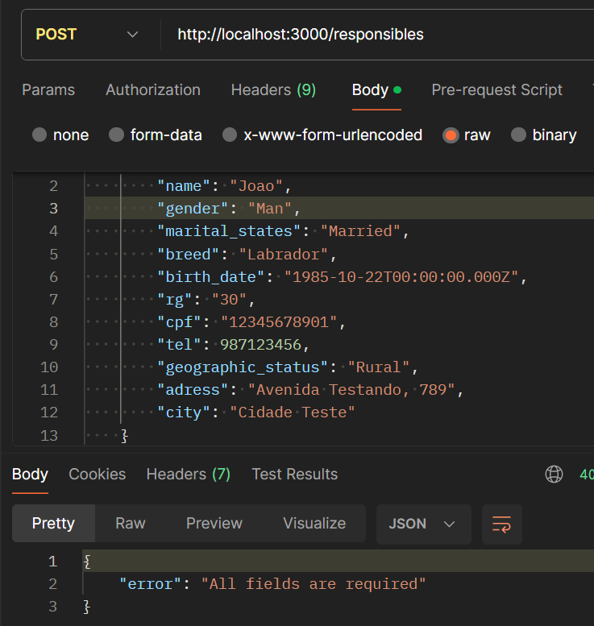

UPDATE/ responsibles
A função responsável por essa rota é a "updateResponsibles". Para atualizar algum campo na respectiva coleção você deve enviar o nome (name) de qual usuário (Responsible) deseja atualizar e os campos que deseja atualizar com as novas informações.

- Caso de sucesso:

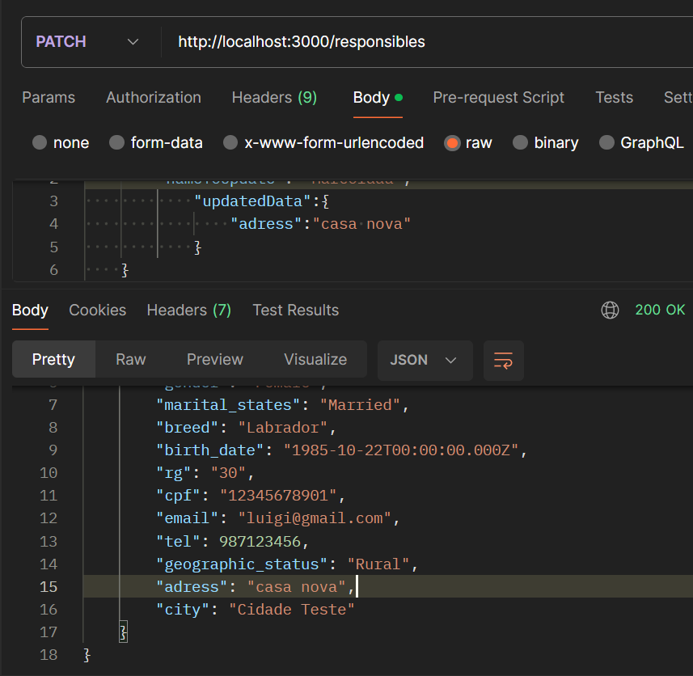

- Caso de falha:

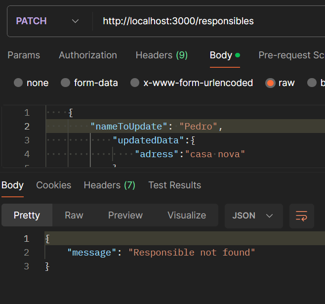

DELETE/ responsibles
A função responsável por essa rota é "deleteResponsibles". Para deletar algum responsável da coleção, você precisa espeficiar aperas o nome de qual responsáveldeseja deletar do banco de dados.

- Caso de sucesso:

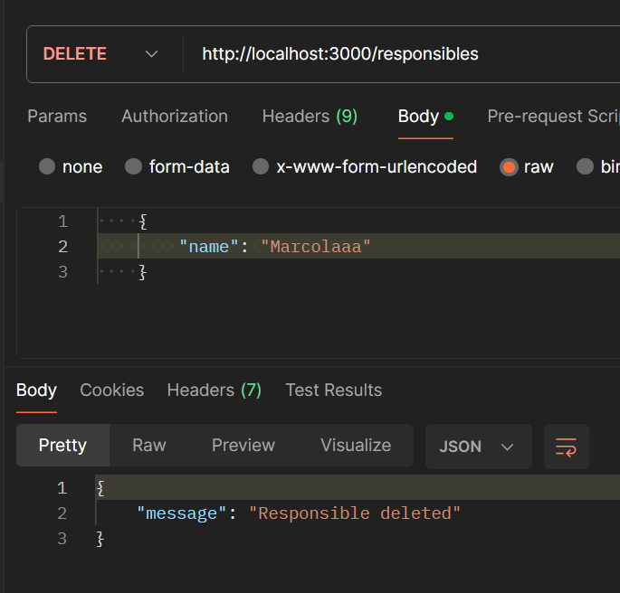

- Caso de falha:

### Student - Estudante
As rotas de "Students" manipuala os estudantes cadastrados no sistema. Sendo assim, será armezanado apenas Nome(String), Gênero(String), Estado_civil(String), Raça(String), Data_nascimento(Date), RG(String), CPF(String), Email(String), Tel(String), Estado_geografico(String), Endereço(String), Cidade(String) e Presença{REF_TURMA_ID, Recorrencia(Array), REF_RESPONSAVEL_ID e Status(String)}.

- GET/ students
A função responsável por essa rota é "listStudents". Sendo necessário nenhum campo preenchido para essa requisição.

- Caso de sucesso:

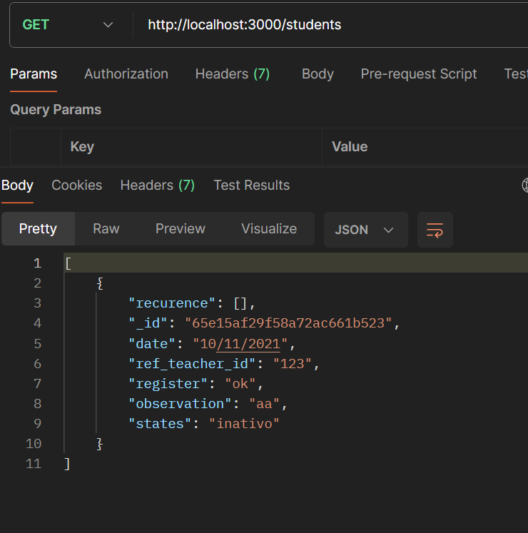

POST/ students
A fuunção responsável por essa rota é "addStudent". Para essa função ser executada com sucesso todos os campos precisam ser preenchidos.

- Caso de uso:

- Caso de falha:

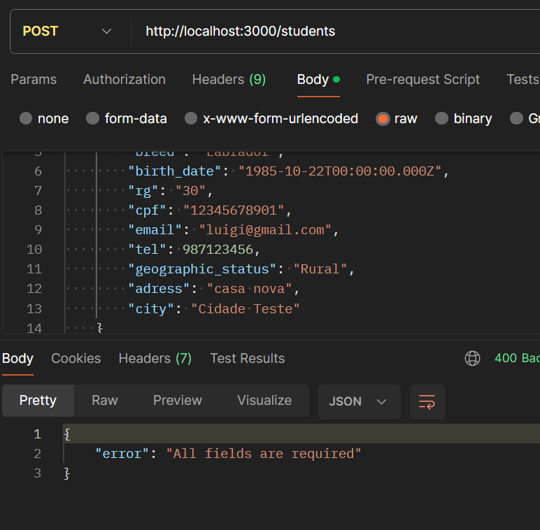

UPDATE/ students
A função responsável por essa rota é a "updateStudents". Para atualizar algum campo na respectiva coleção você deve enviar o nome (name) de qual usuário (student) deseja atualizar e os campos que deseja atualizar com as novas informações.

- Caso de sucesso:

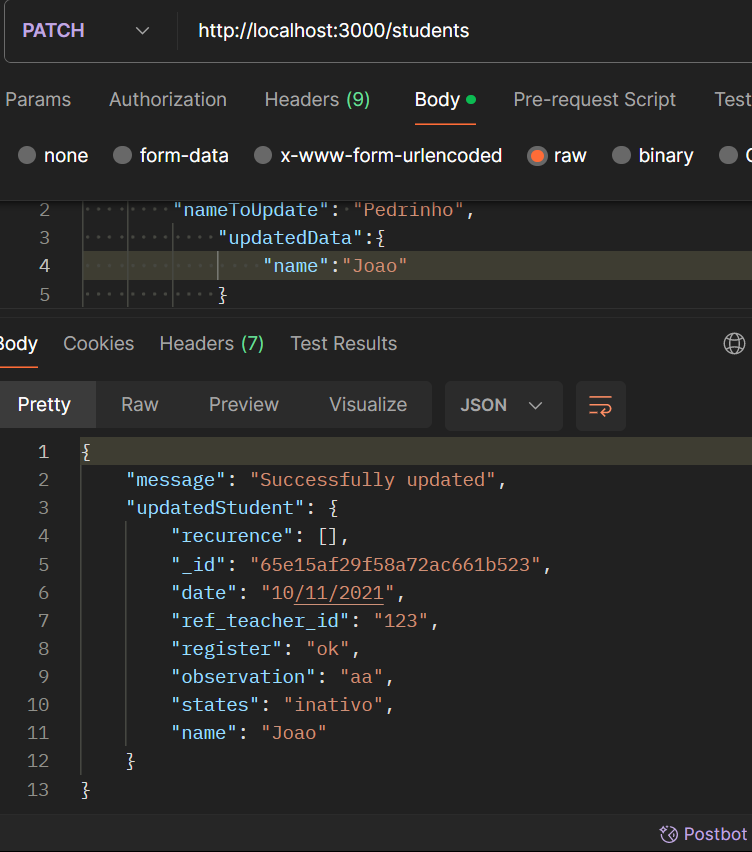

- Caso de falha:

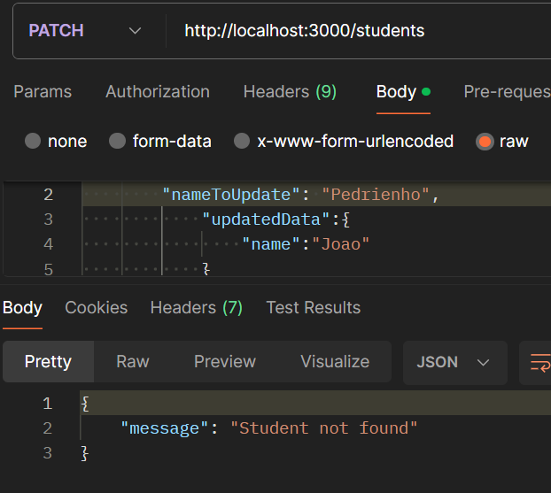

DELETE/ students
A função responsável por essa rota é "deleteStudents". Para deletar algum estudanteda coleção, você precisa espeficiar aperas o nome de qual estudante deseja deletar do banco de dados.

- Caso de sucesso:

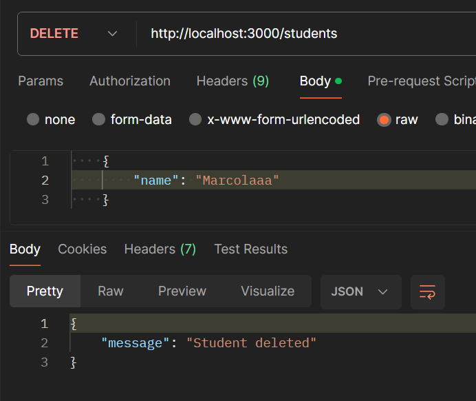

- Caso de falha:

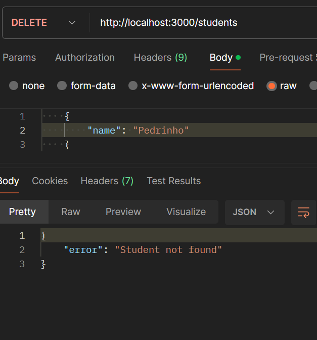

### Teacher - Professor
A função responsável por essa rota é "deleteStudents". Para deletar algum estudanteda coleção, você precisa espeficiar aperas o nome de qual estudante deseja deletar do banco de dados.

GET/ teachers
A função responsável por essa rota é "listTeachers". Sendo necessário nenhum campo preenchido para essa requisição.

- Caso de sucesso:

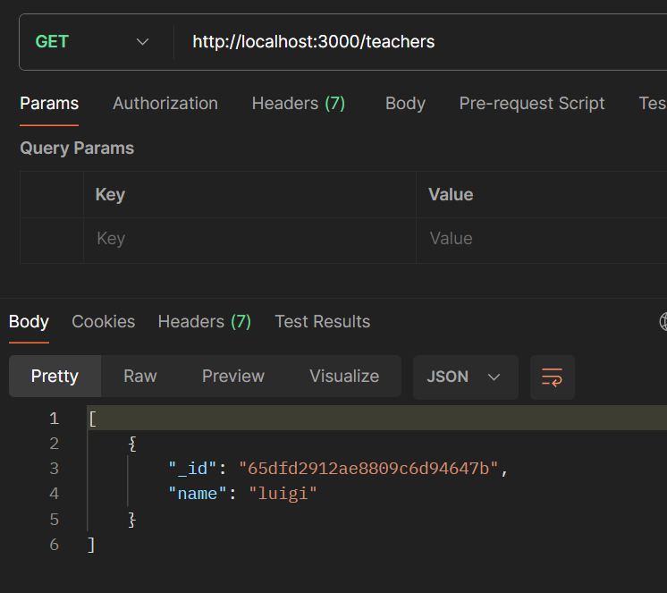

POST/ teachers
A fuunção responsável por essa rota é "addTeacher". Para essa função ser executada com sucesso todos os campos precisam ser preenchidos.

- Caso de sucesso:

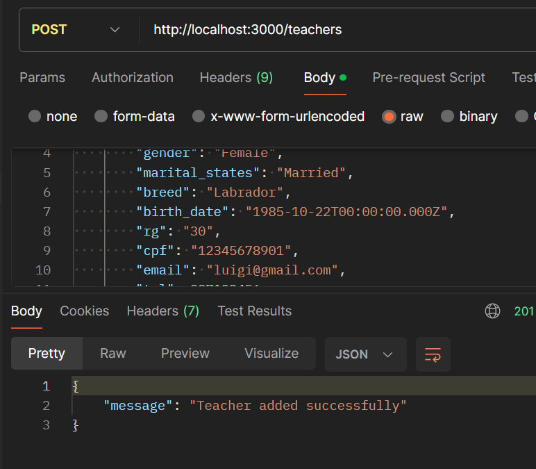

- Caso de falha:

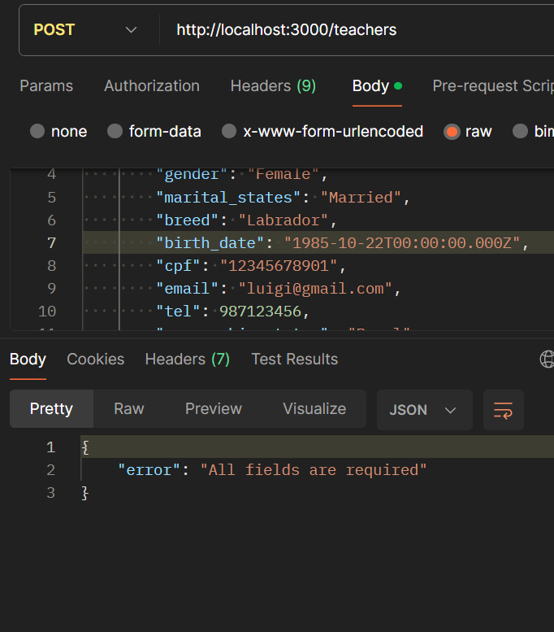

UPDATE/ teachers
A função responsável por essa rota é a "updateTeacher". Para atualizar algum campo na respectiva coleção você deve enviar o nome (name) de qual usuário (teacher) deseja atualizar e os campos que deseja atualizar com as novas informações.

- Caso de sucesso:

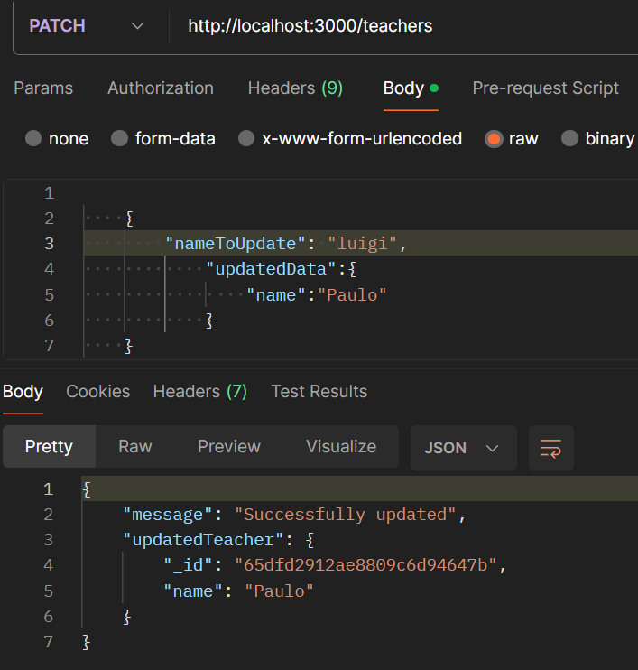

- Caso de falha:

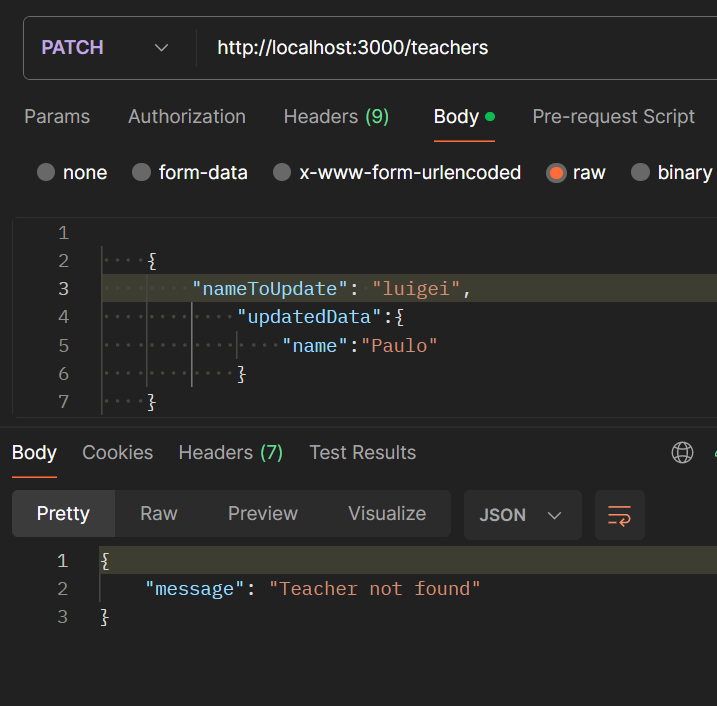

DELETE/ teachers
A função responsável por essa rota é "deleteTeachers". Para deletar algum professor da coleção, você precisa espeficiar aperas o nome de qual professor deseja deletar do banco de dados.

- Caso de sucesso:

- Caso de falha:

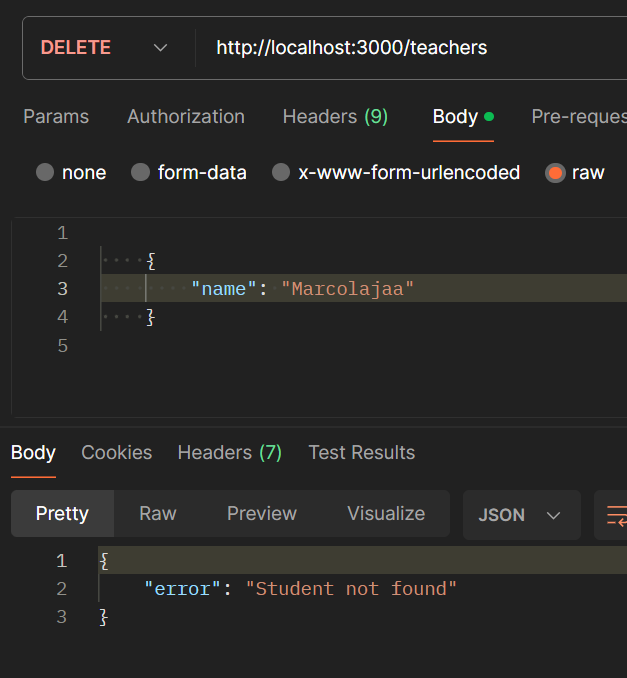

### Team - Turma
As rotas de "teams" manipualam as turmas cadastradas no sistema. Será armazenado apenas Local(String), Periodo(String), Recorrencia(Array of Strings), horario(String) e aula {data(Date), REF_PROFESSOR_ID, Registros(BinData), Observações(String) e Status(String)}.

GET/ teams
A função responsável por essa rota é "listTeams". Sendo necessário nenhum campo preenchido para essa requisição.

- Caso de sucesso:

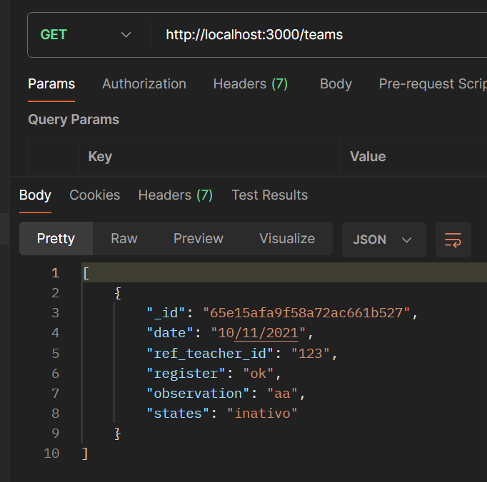

POST/ teams
A fuunção responsável por essa rota é "addTeacher". Para essa função ser executada com sucesso todos os campos precisam ser preenchidos.

- Caso de sucesso:

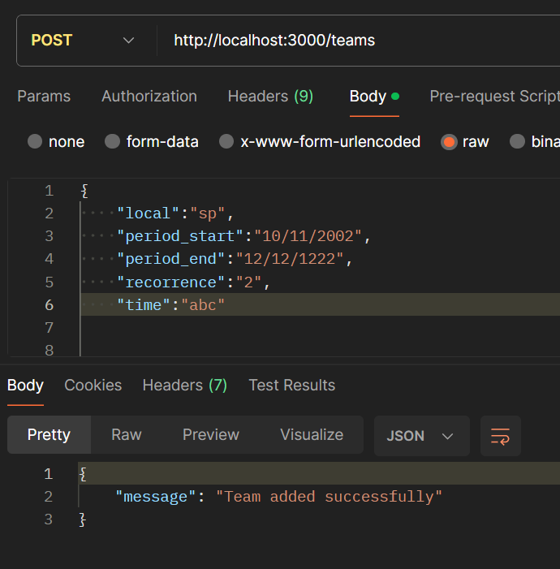

- Caso de falha:

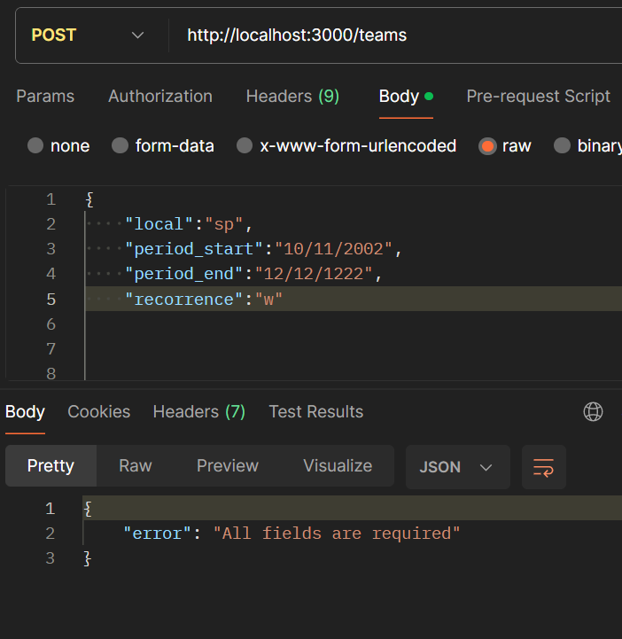

UPDATE/ teams
A função responsável por essa rota é a "updateTeam". Para atualizar algum campo na respectiva coleção você deve enviar o nome (name) de qual usuário (Turma) deseja atualizar e os campos que deseja atualizar com as novas informações.

DELETE/ teams
A função responsável por essa rota é "deleteTeam". Para deletar alguma turma da coleção, você precisa espeficiar aperas o nome de qual turma deseja deletar do banco de dados.

### User - Usuário
As rotas de "Users" manipuala as turmas cadastradas no sistema. Será armazenado apenas email(String) e a senha(String).

GET/ users
A função responsável por essa rota é "listUsers". Sendo necessário nenhum campo preenchido para essa requisição.

- Caso de sucesso:

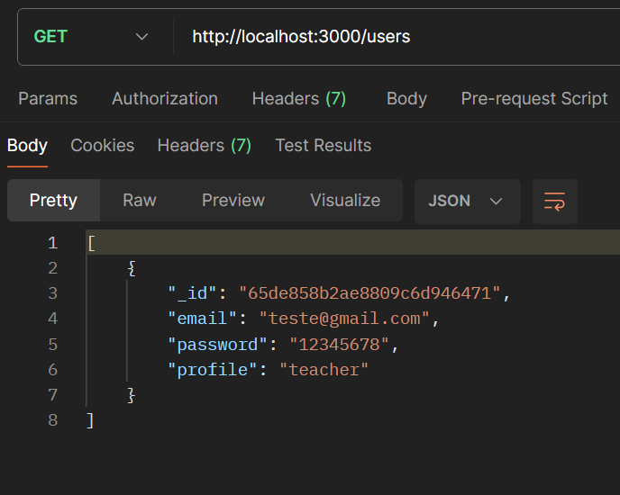

POST/ users
A fuunção responsável por essa rota é "addUser". Para essa função ser executada com sucesso todos os campos precisam ser preenchidos.

UPDATE/ users
A função responsável por essa rota é a "updateUser". Para atualizar algum campo na respectiva coleção você deve enviar o nome (name) de qual usuário (user) deseja atualizar e os campos que deseja atualizar com as novas informações.

DELETE/ users
A função responsável por essa rota é "deleteUsers". Para deletar alguma turma da coleção, você precisa espeficiar aperas o nome de qual usuário deseja deletar do banco de dados.

POST/ login
A função responsável por essa rota é "checkUser". Sendo necessário o email e a senha que deseja autenticar para um login com sucesso.

- Caso de sucesso:

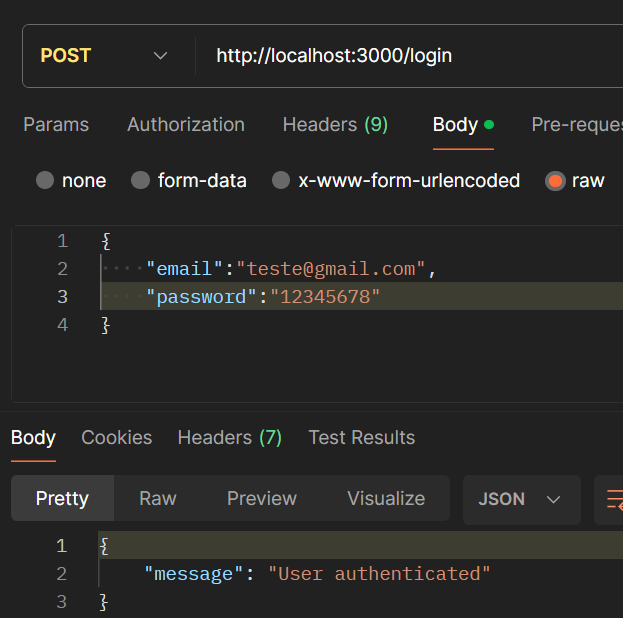

- Caso de falha:

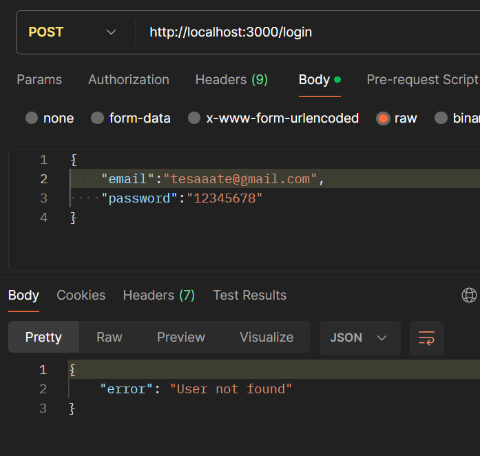

### Workshop - Oficinas
As rotas de "workshop" manipualam as oficnas cadastradas no sistema. Sendo assim, será armazenado apenas Nome(String), Duração(Date), Categoria(String) e Status(String).

GET/ workshops
A função responsável por essa rota é "listWorkshop". Sendo necessário nenhum campo preenchido para essa requisição.

- Caso de sucesso:

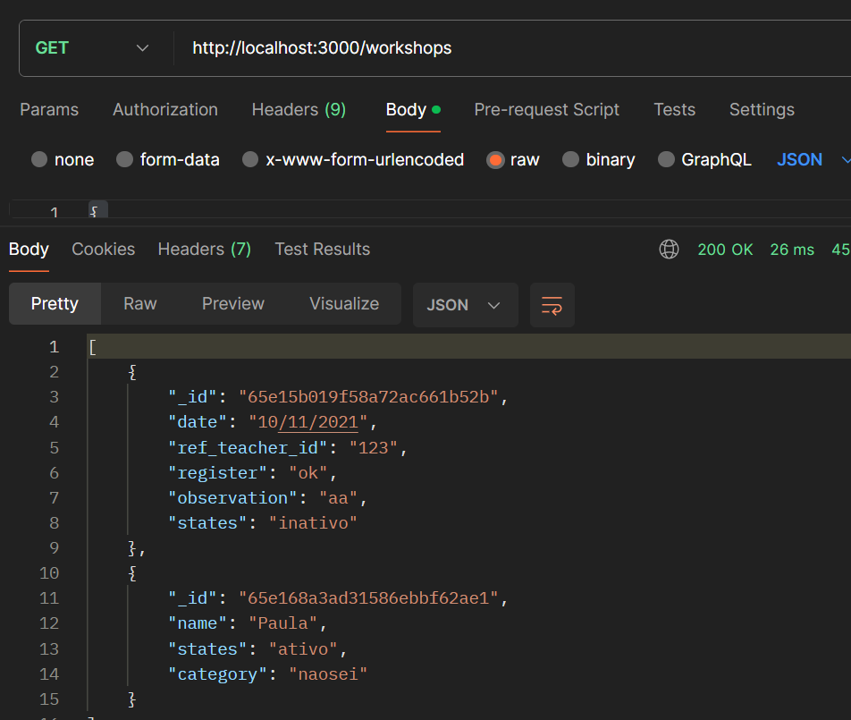

POST/ workshop
A fuunção responsável por essa rota é "addWorkshop". Para essa função ser executada com sucesso todos os campos precisam ser preenchidos.

- Caso de sucesso:

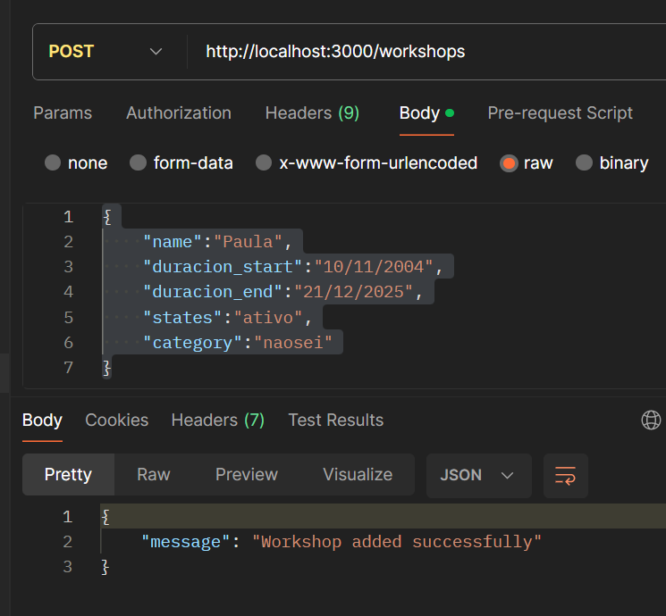

- Caso de falha:

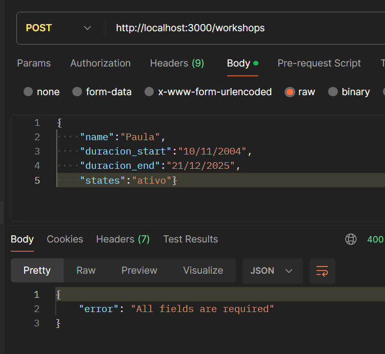

UPDATE/ workshop
A função responsável por essa rota é a "updateWorkshop". Para atualizar algum campo na respectiva coleção você deve enviar o nome (name) de qual usuário (Oficina) deseja atualizar e os campos que deseja atualizar com as novas informações.

- Caso de sucesso:

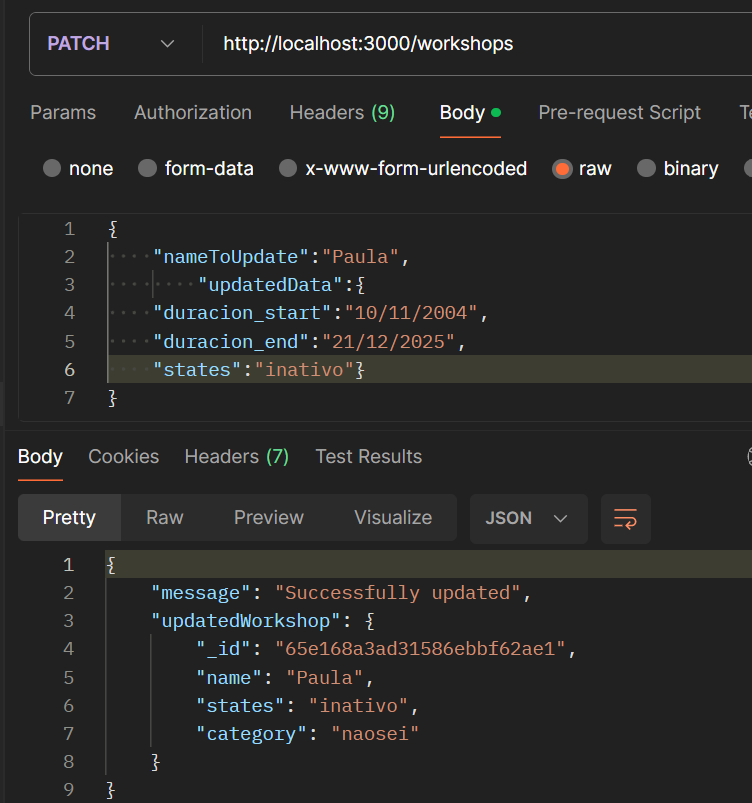

- Caso de falha:

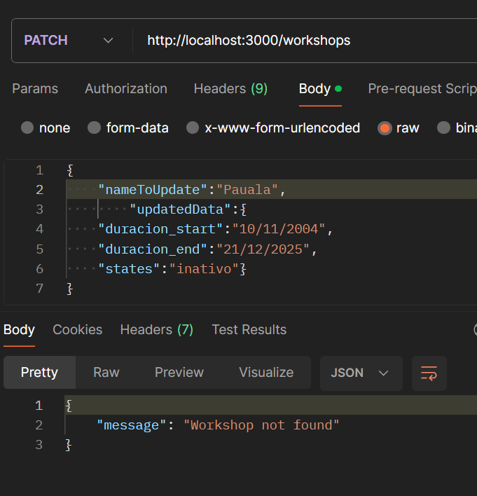

DELETE/ workshop
A função responsável por essa rota é "deleWorkshop". Para deletar alguma oficina da coleção, você precisa espeficiar aperas o nome de qual oficina deseja deletar do banco de dados.

- Caso de sucesso:

- Caso de falha:

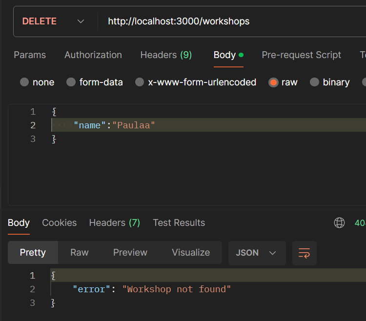

## 9.1.1 Demonstração da integração 

&emsp; Na segunda iteração do desenvolvimento do projeto, foram conduzidos testes iniciais, com o objetivo de assegurar a funcionalidade básica da aplicação. Esses testes foram fundamentais para garantir que a aplicação operasse conforme o esperado, atendendo aos requisitos iniciais estabelecidos.

&emsp; Nessa perspectiva, os principais testes foram centrados no backend da aplicação, utilizando a ferramenta Postman para avaliar as rotas da API. Foram realizados testes de requisições, visando verificar a integridade das rotas e a manipulação precisa dos dados. Adicionalmente, testes de validação de dados foram conduzidos para assegurar que a aplicação trata corretamente as informações fornecidas pelos usuários.

&emsp; Após a conclusão bem-sucedida dos testes iniciais, a equipe progrediu para a etapa de deploy da aplicação, utilizando a infraestrutura da AWS para hospedar tanto o backend quanto o frontend. Esse deploy em ambiente de simulação permitiu uma análise mais concreta do funcionamento da aplicação em um cenário simulado de produção reduzido. 

&emsp; Adicionalmente, a equipe preparou um vídeo de demonstração, apresentando a operação integrada da aplicação, desde a interação do usuário no frontend até o processamento das informações no backend e a resposta ao cliente. Esse vídeo não só serve como prova de conceito, mas também como uma ferramenta de documentação e treinamento para novos membros da equipe e stakeholders. O vídeo de demonstração pode ser acessado por meio do seguinte link: [Demonstração](https://drive.google.com/file/d/1xVbMyJMcygdwpOwQaju0vecU3hadHUwT/view?usp=sharing). Este passo foi crucial para validar a eficácia da integração e o desempenho da aplicação em um ambiente simulado de produção, marcando um ponto significativo no desenvolvimento do projeto.

## 9.2 Teste de Integração
<conteúdo>
## 9.3 Testes automatizados
<conteúdo>
## 9.4 Testes de Usabilidade
<conteúdo>
## 9.5 Testes de Requisitos Não Funcionais
<conteúdo>
# 10. Procedimento de Implantação da Solução
<conteúdo>
## 10.1 Procedimento de Implantação do Sistema
<conteúdo>
## 10.2 Procedimento de Implantação do Banco de Dados
<conteúdo>
## 10.3 Documentação Automática do Sistema (Swagger)
<conteúdo>

# Referências

Case Gerando Falcões. Disponível em: <https://www.idis.org.br/casesidis/gerando-falcoes/>. Acesso em: 08 fev. 2024.

Favela X - Gerando Falcões. Disponível em: <https://gerandofalcoes.com/favela-x/>. Acesso em: 12 fev. 2024.

FILANTROPIA, R. Como criar a autossustentabilidade no Terceiro Setor? Disponível em: <https://www.filantropia.ong/informacao/como_criar_a_autossustentabilidade_no_terceiro_setor>. Acesso em: 12 fev. 2024.

GRANDE, C. S. Value Proposition Canvas: o que é e como utilizar. Canal Sonho Grande, 6 set. 2021. Disponível em: <https://www.canalsonhogrande.com.br/post/value-proposition-canvas>. Acesso em: 16 fev. 2024

LYRA, E. O projeto ambicioso da Gerando Falcões para criar a primeira Favela 3D. Disponível em: <https://exame.com/colunistas/edu-lyra/o-projeto-ambicioso-da-gerando-falcoes-para-criar-a-primeira-favela-3d/>. Acesso em: 12 fev. 2024.

MENEZES, G. Gerando Falcões inicia expansão em modelo similar ao de franquias. Disponível em: <https://vejasp.abril.com.br/cidades/projeto-social-gerando-falcoes-expansao>. Acesso em: 12 fev. 2024.

SCHMITT, L. G. Projeto Favela 3D será transformado em programa de Estado, diz governador. Disponível em: <https://www.saopaulo.sp.gov.br/ultimas-noticias/projeto-favela-3d-sera-multiplicado-e-transformado-em-programa-de-estado-diz-governado/>. Acesso em: 12 fev. 2024.

SIQUEIRA, A. Persona: o que é, como fazer e por que criar uma para sua empresa. Disponível em: <https://resultadosdigitais.com.br/marketing/persona-o-que-e/>. Acesso em: 13 fev. 2024.

Um ecossistema de Desenvolvimento Social - Gerando Falcões. Disponível em: <https://gerandofalcoes.com/>. Acesso em: 12 fev. 2024.

Value Proposition Canvas: Conheça o Canvas de Proposta de valor. UCJadmin, , 2 out. 2018. Disponível em: <https://ucj.com.br/blog/value-proposition-canvas-proposta-de-valor/>. Acesso em: 16 fev. 2024

# Apêndice
