<table>
<tr>
<Table>
  <tr>
    <td><a href= "https://gerandofalcoes.com//"></td>
    <td>
      <a href= "https://www.inteli.edu.br/"></a>
    </td>
  </tr>
</table>

# Nome do Projeto: Conectando Falcõe

## Nome do Grupo: Alto Voo

## :student: Integrantes:

- <a href="https://www.linkedin.com/in/bianca-borges-969586206/">Bianca Borges Lins</a>
- <a href="https://www.linkedin.com/in/joselitojunior/">Joselito Júnior Motta de Carvalho</a>
- <a href="https://www.linkedin.com/in/marcelomiguelassis/">Marcelo Miguel Pereira de Assis</a>
- <a href="https://www.linkedin.com/in/raphaela-guiland-ferraz/">Raphaela Guiland Ferraz</a>
- <a href="https://www.linkedin.com/in/renan-feitosa-44328524a/">Renan Feitosa Oliveira</a>
- <a href="https://www.linkedin.com/in/thomasreitzfeld/">Thomas Reitzfeld</a>

## Sumário

- [1. Termos e Abreviações](#termos-abreviacoes)
- [2. Visão Geral do Projeto](#visão-geral-do-projeto)
  - [2.1 Entendimento da Demanda](#entendimento-demanda)
    - [2.1.1 Partes Interessadas](#partes-interessadas)
    - [2.1.2 Análise da Indústria](#analise-da-industria)
  - [2.2 Problema](#problema)
    - [2.2.1 Análise do Problema](#análise-do-problema)
    - [2.2.2 Análise do Cenário (Matriz SWOT)](#análise-do-cenário-e-Matriz-SWOT)
- [3. Proposta da Solução](#proposta-de-solucao)
  - [3.1 Descritivo Geral da Solução](#descritivo-da-solucao)
  - [3.2 Proposta Tecnológica e Benefícios](#proposta-tecnologica-beneficios)
    - [3.2.1 Tipo de arquitetura de nuvem escolhida](#tipo-arquitetura-nuvem-escolhida)
    - [3.2.2 Arquitetura de nuvem escolhida](#arquitetura-nuvem-escolhida)
    - [3.2.3 Benefícios trazidos pela arquitetura de nuvem proposta](#beneficios-arquitetura)
  - [3.3 Proposta de Valor (Value Proposition Canvas)](#value-canvas)
  - [3.4 Matriz de Risco](#matriz-de-risco)
- [4. Análise de experiência do usuário](#experiencia-usuario)
  - [4.1 Perfis de Usuários](#perfil-usuario)
  - [4.2 Personas](#personas)
  - [4.3 Mapa de jornada do usuário](#jornada-usuario)
- [5. Requisitos](#requisitos)
  - [5.1 Requisitos Funcionais](#requisitos-funcionais)
  - [5.2 Requisitos não Funcionais](#requisitos-não-funcionais)
  - [5.3 Casos de Uso](#casos-de-uso)
- [6. Projeto de Solução](#projeto-solucao)
  - [6.1 Diagrama de Classes](#diagrama-classes)
    - [6.1.1 Diagrama de Classes de Domínio](#diagrama-classes-dominio)
    - [6.1.2 Diagrama de Classes de Implementação](#diagrama-classes-implementacao)
  - [6.2 Diagrama de Componentes da Arquitetura](#diagrama-componentes)
  - [6.3 Diagrama de Implantação](#diagrama-implantacao)
  - [6.4 Tecnologias e Ferramentas](#tecnologias-ferramentas)
- [7. Interface](#interface)
  - [7.1 Design System](#design-system)
  - [7.2 Projeto de Interface (Wireframes)](#wireframe)
  - [7.3 Frontend] (#frontend)
- [8. Projeto de Banco de Dados](#projeto-de-banco-de-dados)
  - [Modelo Conceitual](#modelo-conceitual)
  - [Modelo Lógico](#modelo-conceitual)
- [9. Testes de Software](#testes-de-software)
  - [9.1 Demonstração da integração](#demonstracao-integracao)
  - [9.2 Teste de Integração](#teste-de-integracao)
  - [9.3 Testes automatizados](#teste-automatizado)
  - [9.4 Testes de Usabilidade](#teste-de-usabilidade)
  - [9.5 Testes de Requisitos Não Funcionais](#teste-de-rnf)
- [10. Procedimento de Implantação da Solução](#procedimento-implantacao)
  - [10.1 Procedimento de Implantação do Sistema](#procedimento-implantacao-sistema)
  - [10.2 Procedimento de Implantação do Banco de Dados](#procedimento-implantacao-bd)
  - [10.3 Documentação Automática do Sistema (Swagger)](#documentacao-automatica)
- [Referências](#referências)
- [Apêndice](#apêndice)

# 1. Termos e Abreviações

- **ONG**: Organização Não Governamental
- **LGPD**: Lei Geral de Proteção de Dados
- **Stakeholders**: Partes interessadas em um projeto.
- **RNF**: Requisito não funcional.
- **ISO 25010**: Padrão de qualidade para sistemas de software.
- **WCAG 2.1**: Padrões de acessibilidade web

# 2. Visão Geral do Projeto

&emsp;Neste tópico serão abordados pontos que se referem ao entendimento inicial da Gerando Falcões, além de um entendimento geral do desafio proposto pelo parceiro.

## 2.1 Entendimento da Demanda

&emsp;Neste tópico serão abordados sessões que representam o entendimento inicial dos interessados pelo projeto desenvolvido, bem como uma análise mercadológico em que a GF está inserida. Ademais, para um maior detalhe da demanda solicitada pelo parceiro, há o tópico que irá tratar especificamente dos problemas levantados pelo parceiro.

### 2.1.1 Partes Interessadas

&emsp; O projeto "Conectando Falcões" representa uma iniciativa colaborativa que visa integrar tecnologia e inovação social para promover mudanças significativas nas comunidades atendidas pela ONG Gerando Falcões. Este projeto é fruto da parceria entre a faculdade Inteli, a ONG Gerando Falcões, o grupo de estudantes Alto Voo da Inteli e diversas outras ONGs presentes no ecossistema da Gerando Falcões. A sinergia entre estas partes interessadas busca não apenas desenvolver soluções tecnológicas avançadas, mas também garantir que estas soluções atendam às necessidades reais das comunidades, promovendo assim um impacto social duradouro.

- **Faculdade Inteli**: Atua como um catalisador educacional e tecnológico, fornecendo o suporte acadêmico necessário e a infraestrutura para o desenvolvimento do projeto. A Inteli é responsável por orientar o grupo Alto Voo, garantindo a aplicação de práticas de engenharia de software de ponta.

- **Gerando Falcões**: Como principal parte interessada, a Gerando Falcões desempenha um papel central no projeto, definindo as necessidades e os objetivos que o "Conectando Falcões" deve alcançar. Sua profunda experiência em trabalho comunitário e desenvolvimento social é vital para direcionar as soluções tecnológicas às necessidades das comunidades.

- **Grupo Alto Voo**: Composto por estudantes da Inteli, este grupo é encarregado de conceber, desenvolver e implementar a solução tecnológica. O Alto Voo serve como a ponte entre o conhecimento acadêmico e a aplicação prática, trabalhando em estreita colaboração com a Gerando Falcões para assegurar que o projeto atenda às expectativas e requisitos estabelecidos.

- **ONGs presentes no ecossistema da Gerando Falcões**: Estas organizações representam os usuários finais e beneficiários das soluções desenvolvidas. A colaboração com estas ONGs é crucial para entender as dinâmicas locais e as necessidades específicas, garantindo que o projeto tenha um impacto real e mensurável nas comunidades.

&emsp; O "Conectando Falcões" é um exemplo emblemático de como a colaboração entre instituições educacionais, organizações não governamentais e estudantes pode gerar soluções inovadoras com um impacto social profundo. As partes interessadas, cada uma com seu papel único e contribuições essenciais, formam o alicerce sobre o qual o projeto é construído e desenvolvido. À medida que avançamos, a integração contínua de feedback e insights de todas as partes interessadas será crucial para garantir que o projeto não apenas atenda às necessidades tecnológicas, mas também promova a inclusão social e o desenvolvimento comunitário sustentável.

### 2.1.2 Análise da Indústria

&emsp;Em relação ao modelo de negócios da GF, pode-se dizer que ele é fundamentado em três pilares: captação de recursos, venda de produtos e gestão de impacto. De acordo com Souza<sup>[\[17\]](#referências)</sup>, a captação de recursos é realizada por meio de doações de pessoas físicas e jurídicas, campanhas online, eventos beneficentes e editais diversos <sup>[\[17\]](#referências)</sup>. Já a venda de produtos inclui a loja online do Bazar GF, que comercializa roupas e acessórios doados por celebridades e marcas parceiras<sup>[\[17\]](#referências)</sup>. Por fim, a gestão de impacto é realizada por meio de indicadores principais, relatórios, auditorias e avaliações externas que auxiliem na medição dos resultados e o retorno social dos projetos apoiados pela GF<sup>[\[17\]](#referências)</sup>.

&emsp; A Rede Gerando Falcões atua no setor de desenvolvimento social, com foco em favelas e comunidades desfavorecidas. Ela se destaca por seu alcance nacional, abrangendo mais de 6000 favelas em todo o Brasil. Essa ampla cobertura geográfica permite que a organização atue de forma abrangente e estratégica, levando seus programas e iniciativas para diversas comunidades em situação de vulnerabilidade.

&emsp; Na indústria do terceiro setor, os principais competidores da Rede Gerando Falcões podem incluir outras organizações semelhantes que atuam no mesmo espaço, isso pode incluir ONGs, fundações, institutos e programas governamentais que têm objetivos semelhantes. A seguir, destacamos alguns principais:

- _CUFA (Central Única das Favelas):_ Fundada por MV Bill e Nega Gizza, a CUFA é uma das organizações mais reconhecidas no Brasil quando se trata de representar e desenvolver projetos nas favelas. Com uma presença nacional e uma ampla gama de programas que abrangem desde esportes até educação e empreendedorismo, a CUFA é uma forte competidora, especialmente em termos de visibilidade e alcance comunitário;
- _G-10 Favelas:_ O G-10 Favelas é uma coalizão que reúne líderes de algumas das maiores favelas do Brasil. A organização tem como objetivo centralizar esforços para melhorar as condições de vida nas favelas, promovendo o desenvolvimento econômico, social e cultural. Sua influência e poder de mobilização o tornam um competidor significativo no campo do desenvolvimento comunitário;
- _Favela é Isso Aí:_ Iniciativa liderada por Raull Santiago, conhecido ativista e morador do Complexo do Alemão, no Rio de Janeiro, o Favela é Isso Aí concentra-se em promover a valorização e a autodeterminação das favelas, além de lutar contra o estigma e a discriminação. Sua abordagem centrada na comunidade e sua conexão direta com os moradores fazem dele um competidor notável na busca por soluções locais e empoderamento.

&emsp;Tendo em vista dos competidores apresentados, podemos ter uma visão maior do mercado da Gerando Falcões. Para complementar esta análise, apresentamos as 5 Forças de Porter que é um modelo de análise competitiva desenvolvido por Michael Porter que avalia o ambiente externo de uma indústria, considerando cinco fatores-chave: rivalidade entre concorrentes, poder de negociação dos fornecedores, poder de negociação dos compradores, ameaça de novos entrantes e ameaça de produtos ou serviços substitutos.<sup>[\[12\]](#referências)</sup>

<div align="center">
  <p>Imagem 01 - 5 forças de Porter Gerando Falcões</p>
  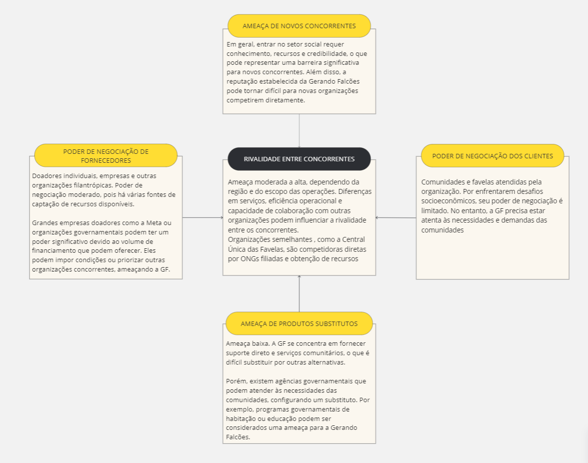
  <p>Fonte: Autoria própria</p>
</div>

&emsp;Essa análise permite à Gerando Falcões compreender melhor o contexto em que operam, identificando oportunidades e ameaças, além de orientar estratégias para se posicionarem de forma mais competitiva no mercado. Ao entender as forças que moldam a competição em uma indústria, ela pode desenvolver estratégias para se diferenciar, fortalecer sua posição ou explorar lacunas no mercado, tornando-se mais resilientes e adaptáveis às mudanças externas.

&emsp;Em relação ao modelo de negócios da GF, pode-se dizer que ele é fundamentado em três pilares: captação de recursos, venda de produtos e gestão de impacto. De acordo com Souza<sup>[\[17\]](#referências)</sup>, a captação de recursos é realizada por meio de doações de pessoas físicas e jurídicas, campanhas online, eventos beneficentes e editais diversos. Já a venda de produtos inclui a loja online do Bazar GF, que comercializa roupas e acessórios doados por celebridades e marcas parceiras. Por fim, a gestão de impacto é realizada por meio de indicadores principais, relatórios, auditorias e avaliações externas que auxiliem na medição dos resultados e o retorno social dos projetos apoiados pela GF.

&emsp;Pensando na parte lucrativa da GF, o foco do seu modelo negócio não possui o foco em acumular riqueza, haja vista que a GF pode ser considerada um empreendedorismo social, mas, sim, reinvestir os recursos obtidos em sua missão social, de modo a apoiar mais ONGs ou realizar outras atividades sociais<sup>[\[17\]](#referências)</sup>.

&emsp;Neste cenário, é relevante analisar algumas tendências emergentes no setor sem fins lucrativos que estão influenciando a maneira como organizações como a Gerando Falcões operam:

&emsp;**1. Foco na mensuração de impacto e transparência:** Doadores e partes interessadas estão cada vez mais exigindo evidências concretas de resultados. Isto está levando as ONGs a adotar uma abordagem mais orientada para dados no planejamento de programas e monitoramento.

&emsp;**2. Colaboração e iniciativas coletivas:** Atualmente, observa-se um reconhecimento cada vez maior em trabalhos colaborativos. As organizações, como a Gerando Falcões, se unem a outros atores para lidar com os desafios sociais de maneira mais eficiente.

&emsp;**3. Crescente uso da tecnologia:** A implementação de tecnologias e ferramentas digitais para arrecadação de fundos, comunicação e implementação de programas também está se tornando cada vez mais crucial para alcançar um público mais amplo e se conectar de maneira eficaz com os apoiadores.

&emsp;Portanto, a Rede Gerando Falcões destaca-se como uma das principais players no mercado, ao lado de outras entidades igualmente influentes, entre estas, a CUFA (Central Única das Favelas) já citada anteriormente, que se destaca pela sua presença nacional e uma gama diversificada de programas que abordam desde esportes até empreendedorismo, garantindo uma forte visibilidade e um amplo alcance comunitário, e o G-10 Favelas, também já citado anteriormente, que, por sua vez, é uma coalizão de líderes de grandes favelas brasileiras, concentrando esforços para promover o desenvolvimento econômico, social e cultural dessas comunidades, com uma poderosa capacidade de mobilização.

&emsp;A Rede Gerando Falcões pode ser contemplada como uma importante player no desenvolvimento das favelas brasileiras, visto principalmente pelos seus números, com um alcance nacional que abrange mais de 6000 favelas em todo o Brasil, implementando programas e iniciativas que visam promover a inclusão social, o empreendedorismo e o desenvolvimento humano nas comunidades mais desfavorecidas. Sendo assim, estes três players representam uma competição significativa para o mercado, cada um trazendo perspectivas e abordagens únicas para o desenvolvimento das comunidades em situação de vulnerabilidade.

## 2.2 Problema

&emsp;Neste tópico serão abordados os problemas levantados pela Gerando Falcões, os quais serão utilizados como base para o desenvolvimento do projeto. Além disso, terá uma análise um pouco mais aprofundada da situação externa e interna da Gerando Falcões em seu mercado de atuação.

### 2.2.1 Análise do Problema

&emsp;Conforme o TAPI <sup>[\[7\]](#referências)</sup>, a Gerando Falcões enfrenta um problema de falta de ferramentas que apoiem a sua rede de líderes na gestão dos seus atendimentos/oficinas e dos seus atendidos. Esse problema decorre porque mais de 80% das ONG’s que fazem parte da GF não conseguem gerir seus atendimentos de maneira eficaz devido à falta de uma solução digital que possa realizar tais registros.

&emsp;Nessa direção, essa problemática de gestão compromete a capacidade da GF de obter dados precisos sobre os atendimentos e os atendidos da sua rede de líderes, de modo que determinadas oportunidades e planejamento de novas soluções, por parte da GF, não consigam ser aplicadas para as ONG’s que sofrem com este problema.

&emsp;Além disso, vale destacar que esse problema tem diversas causas, entre elas, os diferentes níveis de letramento digital dos líderes das ONG’s, que podem dificultar o uso de tecnologias ou até mesmo arquivos (como excel) em seu cotidiano, para realizar os registros de atendimentos/oficinas e dos atendidos. Outro ponto a se destacar é que o parceiro apresentou uma solução atual semelhante à solução proposta para ser desenvolvida, mas os líderes relataram que ela possui uma alta complexidade de utilização.

&emsp;Tendo isso em vista, é necessário desenvolver uma solução web que possibilite a coleta dos dados cruciais que permitam o acompanhamento e a avaliação dos indicadores de atendidos e atendimento. Ademais, é preciso que a aplicação contemple os diversos níveis de letramento digital, o que significa que ela deve conter uma interface intuitiva e amigável para uma utilização fluida.

&emsp;Por fim, o desafio proposto pela GF contém uma pequena restrição, de acordo com o TAPI <sup>[\[7\]](#referências)</sup>, sendo relacionada a não inclusão de módulos financeiros.

### 2.2.2 Análise do Cenário (Matriz SWOT)

&emsp;Segundo Gurel<sup>[\[6\]](#referências)</sup>, a análise SWOT, originária do acrônimo em inglês para Strengths (Forças), Weaknesses (Fraquezas), Opportunities (Oportunidades) e Threats (Ameaças), é uma técnica consolidada utilizada para avaliar aspectos internos e externos de uma organização ou projeto. Ela busca compreender tanto os pontos fortes e vulnerabilidades da entidade em questão (fatores internos), quanto as oportunidades e desafios presentes no ambiente em que está inserida (fatores externos).

&emsp;No contexto da realização do projeto, a análise SWOT é uma ferramenta valiosa para a compreensão do cenário em que a solução será implementada. A partir dela, é possível identificar os fatores que podem influenciar positivamente ou negativamente o desenvolvimento do projeto, bem como as características que podem ser exploradas ou mitigadas para o alcance dos objetivos propostos na solução.

<div align="center">
  <p>Imagem 01 - Matriz SWOT Gerando Falcões</p>
  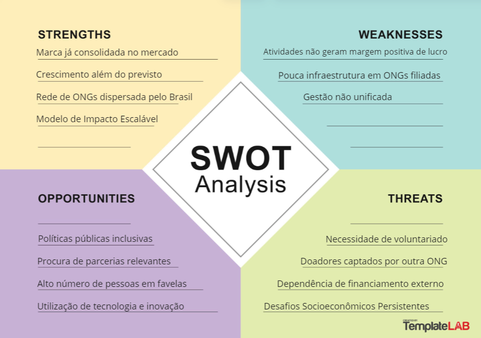
  <p>Fonte: Autoria própria</p>
</div>

**Strengths (Forças):**

- Marca já consolidada no mercado: A Gerando Falcões possui uma marca reconhecida e respeitada, levando em consideração que estão presentes em 25 estados brasileiros e marcas como XP Investimentos e EMS já são investidores masters da ONG. Isso traz poder de negociação, que pode facilitar a captação de recursos e ainda mais parcerias.

- Crescimento além do previsto: No vídeo "Como a Gerando Falcões surgiu?"<sup>[\[5\]](#referências)</sup>, postado no canal da própria organização em 2021, é dito que "Nos próximos 4 anos, teremos presença em 1200 favelas no país". Três anos depois, a ONG já está presente em 5558 favelas. Isso mostra que a organização teve um crescimento exponencial.

- Rede de ONGs dispersas pelo Brasil: A Gerando Falcões possui uma rede de ONGs filiadas que atuam em favelas de todo o Brasil, em 25 estados diferentes. Isso pode ser uma vantagem para a organização, pois pode facilitar a implementação de projetos e ações em diferentes regiões do país.

- Modelo de Impacto Escalável: A Gerando Falcões utiliza um modelo que pode ser replicado em diferentes comunidades, permitindo que cada vez mais favelas sejam impactadas, independentemente das suas características internas ou da sua localização geográfica.

**Weaknesses (Fraquezas):**

- Atividades não geram margem positiva de lucro: A Gerando Falcões é uma organização sem fins lucrativos, o que significa que as atividades realizadas pela ONG geralmente não geram lucro ou pagam as próprias despesas. Isso é considerado uma fraqueza, pois a organização depende de doações e patrocínios para se manter.

- Pouca infraestrutura em ONGs filiadas: A Gerando Falcões é um ecossistema de desenvolvimento social que atua em rede. Logo, as ONGs filiadas à Gerando Falcões são independentes e podem possuir baixa infraestrutura. Com isso, as oficinas e projetos podem ser prejudicados, se tornando limitado em números, ou até mesmo inviáveis em algumas regiões.

- Gestão não unificada: Por contar com um grande número de organizações filiadas, a Gerando Falcões acaba tendo uma gestão não unificada, resultando em desafios na coordenação de esforços e na padronização de práticas. Com isso, diversos processos com os fundadores de cada ONG são necessários na tentativa de mitigar os malefícios dessa fraqueza.

**Opportunities (Oportunidades):**

- Políticas públicas inclusivas: O projeto de orçamento de 2024<sup>[\[1\]](#referências)</sup> apresentou crescimento em diversas áreas sociais, a Gerando Falcões pode se beneficiar dessas medidas políticas, que visam a redução das desigualdades sociais e a promoção da inclusão social, para alavancar seu trabalho.

- Expansão de parcerias com empresas: A Gerando Falcões já possui parcerias com grandes empresas. Porém, utilizando do seu ponto forte em negociações, a organização pode expandir essas parcerias e buscar novos investidores, o que pode trazer mais recursos e visibilidade para a ONG.

- Alto número de pessoas em favelas: No Brasil, a população da favela é estimada em 17,9 milhões de habitantes<sup>[\[2\]](#referências)</sup>. Por se tratar do público-alvo da Gerando Falcões, a organização pode se beneficiar desse alto índice de pessoas em favelas para expandir seu trabalho, alcançar e impactar mais vidas.

- Utilização de tecnologia e inovação: Meios digitais são uma forma de acelerar os processos internos e realização de atividades das ONGs, podendo auxiliar em gestão, divulgação e obtenção de recursos e outros.

**Threats (Ameaças):**

- Necessidade de voluntariado: Algumas ONGs dentro da rede da Gerando Falcões dependem de voluntários para realizar suas atividades. A falta deles pode ser uma ameaça para a organização, pois pode impactar diretamente na viabilidade de execução de projetos e oficinas, enquanto a procura por voluntários pode ser uma tarefa difícil e custosa para os organizadores.

- Doadores captados por outras ONGs: A Gerando Falcões não é a única ONG que atua em favelas. Outras redes que também atuam nesses locais gerariam competitividade em relação à captação de doadores, obtendo recursos que poderiam ser adquiridos pela Gerando Falcões.

- Dependência de financiamento externo: A falta de captação e expansão de recursos adquiridos por meio de patrocinadores impossibilita o crescimento da organização. Logo, a Gerando Falcões tem uma grande dependência em relação à verba, o que representa ameaça para a organização e para a continuidade de projetos.

- Desafios Socioeconômicos Persistentes: Favelas enfrentam realidades diversas e em algumas regiões podem-se ter a presença de violência, falta de infraestrutura básica, crimes e outros aspectos que podem ser uma ameaça contínua para o sucesso e expansão dos programas realizados.

&emsp;&emsp;Em conclusão, a análise SWOT traz uma visão geral do cenário em que a Gerando Falcões está inserida. A partir dela, é possível identificar as características de impacto em relação à organização, que tem uma marca forte e uma rede abrangente de ONGs, mas enfrenta desafios financeiros e de gestão, além de possíveis competições por recursos. No entanto, há oportunidades para parcerias e uma crescente de políticas inclusivas que podem ser de bom uso.

# 3. Proposta da Solução

&emsp;Neste tópico será abordada uma descrição geral da solução desenvolvida pelo grupo Alto Voo para a Gerando Falcões, de modo a sanar as dores apresentadas no TAPI <sup>[\[7\]](#referências)</sup>. Além disso, este tópico contemplará qual a proposta tecnológica da solução desenvolvida e quais os seus benefícios para o parceiro.

## 3.1 Descritivo Geral da Solução

&emsp; Neste tópico será abordada uma descrição geral da solução proposta pelo grupo para sanar as dores apresentadas pela Gerando Falcões.

## 3.1 Descritivo Geral da Solução

&emsp;A solução que será desenvolvida tem como base a problemática apresentada pela Gerando Falcões (GF), sendo a falta de uma ferramenta de fácil utilização que possibilite o gerenciamento da sua rede de líderes. Nessa direção, a solução que será desenvolvida trata-se de uma aplicação web que será utilizada por três usuários finais: a GF, o líder da ONG e os professores que pertencem à ONG. Essa aplicação permitirá as seguintes funcionalidades principais:

- Acesso único para cada ONG, por meio de um login;
- Acesso administrativo somente para a GF, por meio de um login;
- Por meio desse acesso único, o líder da ONG conseguirá registrar quais atendimentos/oficinas serão realizadas;
- Com os atendimentos/oficinas criadas, será possível realizar o cadastro dos professores que irão ministrar tais atividades, caso exista o professor, já que o próprio líder pode assumir essa função;
- A partir dessas criações, será possível que o líder e/ou professor consigam cadastrar todos os atendidos;
- A GF conseguirá, por meio de todos esses dados, visualizar informações específicas de cada ONG, como: os atendimentos/oficinas prestadas, a quantidade total de atendidos, a quantidade de atendidos por atendimento/oficina, a frequência de cada atendido, a frequência de cada atendimento/oficina, além de informações sobre o perfil geral das pessoas que já participaram de um atendimento dessa ONG;
- O líder de cada ONG conseguirá visualizar informações específicas, como: quais atendimentos/oficina estão sendo realizadas atualmente ou que já foram finalizadas, quantos atendidos há em cada atendimento/oficina, qual a frequência desses atendidos nos atendimentos/oficinas, entre outras informações;
- Os líderes e os professores conseguirão marcar a presença dos alunos já cadastrados na plataforma e conseguirão, também, imprimir um template de presença para fazer manualmente e, depois, passar isso para a aplicação.

&emsp;Tendo em vista as funcionalidades acima, é válido ressaltar que a aplicação desenvolvida será disponibilizada na nuvem, haja vista que tal característica possibilitará uma maior flexibilidade de utilização e acesso (mais detalhes sobre essa escolha será descrito no tópico [3.2 Proposta Tecnológica e Benefícios](#proposta-tecnologica-beneficios)). Ademais, pensando no público-alvo deste projeto, as quais são pessoas que podem ter diferentes níveis de letramento digital, a interface da aplicação será idealizada e desenvolvida com base em boas práticas de design e visando a simplicidade de informações que serão apresentadas para o usuário.

&emsp; Em suma, a solução proposta visa atender às necessidades da Gerando Falcões e de sua rede de líderes, oferecendo uma ferramenta de gerenciamento eficiente e fácil de usar. Espera-se que, com essa solução, a GF possa ampliar seu impacto social e fortalecer sua missão de transformar as favelas em comunidades sustentáveis.

## 3.2 Proposta Tecnológica e Benefícios

&emsp; A proposta tecnológica para o projeto "Conectando Falcões" emprega uma arquitetura de nuvem híbrida inovadora, integrando soluções da Vercel, AWS EC2 e ElephantSQL. Esta abordagem assegura uma combinação equilibrada de escalabilidade, segurança e eficiência, essenciais para atender às necessidades dinâmicas do projeto. Além disso, a flexibilidade e a robustez da arquitetura proposta prometem impulsionar o desempenho e a confiabilidade, destacando o projeto no cenário tecnológico atual.

### 3.2.1 Tipo de arquitetura de nuvem escolhida

&emsp; O projeto "Conectando Falcões" optou por uma arquitetura de nuvem específica para otimizar o desenvolvimento e a implantação de suas aplicações.

&emsp; Por consequência, a escolha recaiu sobre a utilização de uma arquitetura de nuvem pública, empregando serviços da AWS. Esta decisão foi baseada na flexibilidade, escalabilidade e eficiência que a nuvem pública oferece, especialmente importante para aplicações em desenvolvimento ágil e contínuo.

&emsp; Portanto, a escolha dessa arquitetura de nuvem está alinhada com os objetivos do projeto, oferecendo uma base sólida para o desenvolvimento e a expansão futura das aplicações.

### 3.2.2 Arquitetura de nuvem escolhida

&emsp; A infraestrutura do "Conectando Falcões" foi cuidadosamente planejada para suportar suas operações de backend e frontend.

&emsp; Como resultado, utilizam-se duas instâncias EC2 da AWS, uma dedicada ao backend em NestJS e outra ao frontend em NextJS. Para o banco de dados, optou-se pelo ElephantSQL, garantindo assim uma gestão eficiente e escalável dos dados.

&emsp; Logo, essa arquitetura específica facilita a manutenção, o monitoramento e a escalabilidade da aplicação, essenciais para atender às necessidades dinâmicas do projeto.

### 3.2.3 Benefícios trazidos pela arquitetura de nuvem proposta

&emsp; A adoção de uma arquitetura de nuvem robusta no projeto "Conectando Falcões" traz benefícios significativos que impulsionam o desempenho e a escalabilidade da solução.

&emsp; Os principais benefícios incluem:

- **Escalabilidade Dinâmica**: Permite ajustes rápidos de recursos para atender às demandas variáveis, garantindo eficiência operacional.
- **Alta Disponibilidade**: As instâncias EC2 da AWS proporcionam confiabilidade e minimizam os tempos de inatividade, essenciais para manter a continuidade dos serviços.
- **Segurança Aprimorada**: A infraestrutura da AWS oferece camadas de segurança robustas, protegendo os dados e a aplicação contra ameaças virtuais.
- **Custo-Efetividade**: O modelo de pagamento conforme o uso da AWS reduz os custos operacionais, otimizando o orçamento do projeto.
- **Manutenção Simplificada**: Serviços gerenciados como ElephantSQL facilitam a gestão do banco de dados, reduzindo a carga de trabalho da equipe.

&emsp; Portanto, a arquitetura de nuvem proposta não apenas fortalece a base técnica do "Conectando Falcões", mas também oferece uma estrutura escalável e segura, essencial para seu sucesso e crescimento sustentável.

## 3.3 Proposta de Valor (Value Proposition Canvas)

&emsp; O Value Proposition Canvas (VPC), de acordo com Ferreira <sup>[\[21\]](#referências)</sup>, é uma ferramenta estratégica utilizada para o desenvolvimento de uma solução de gestão para a Gerando Falcões e suas ONGs parceiras focada em suas atividades conduzidas em comunidades. Ao detalhar especificamente o perfil da Gerando Falcões, esta ferramenta nos capacita a alinhar nossa oferta com as suas necessidades, desafios e aspirações. Essa ferramenta também permite reconhecer as dores críticas enfrentadas pela Gerando Falcões e as ONGs na gestão eficiente de recursos, a medição de impacto social, a comunicação com stakeholders e os ganhos significativos que nossa solução busca proporcionar. Incorporando esses elementos, o VPC nos guia na concepção de uma plataforma que não só atende às necessidades imediatas da rede Gerando Falcões mas também promove um crescimento sustentável entre suas ONGs afiliadas.

<div align="center">
<p>Imagem xx - Value Proposition Canvas</p>
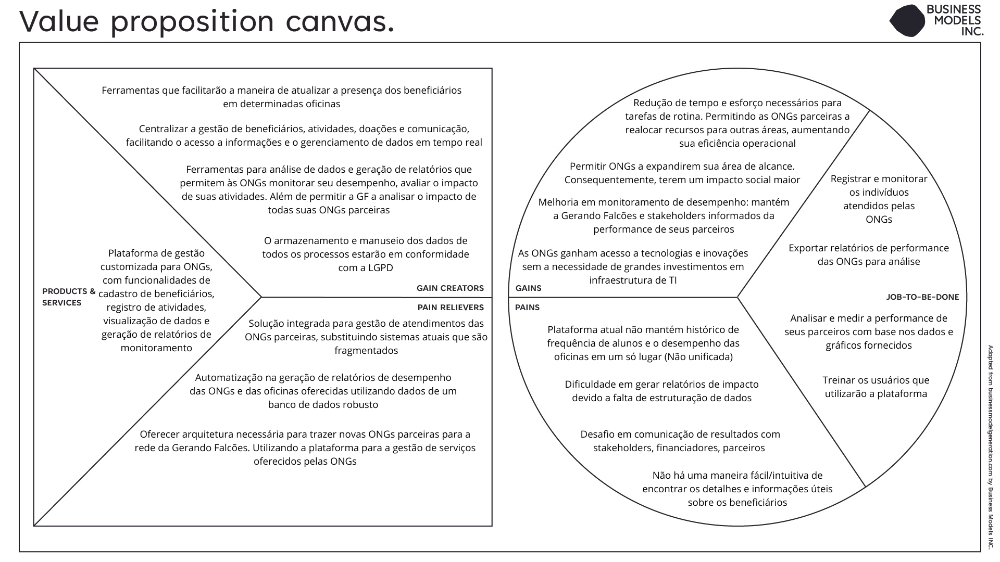
<p>Fonte: elaborada pelos autores. Template disponível em https://www.businessmodelsinc.com/en/inspiration/tools/value-proposition-canvas</p>
</div>

&emsp; A proposta de valor acima detalha as dores da Gerando Falcões em não ter uma plataforma unificada que permite seus parceiros (ONGs) a ter uma controle de suas oficinas e alunos e de gerar relatórios de controle. A solução do grupo Alto Voo soluciona essas dores, proporcionando tal plataforma que possui funcionalidades de cadastro de beneficiários, registro de atividades, visualização de dados e mais. Além disso, os "Gain Creators" da solução são projetados para ir além de simplesmente aliviar as dores, oferecendo benefícios estratégicos que fortalecem a capacidade das ONGs de cumprir suas missões de forma mais eficaz, expandir seu alcance e impacto, e operar com maior confiança e eficiência.

## 3.4 Matriz de Risco

&emsp;De acordo com Pedra<sup>[\[19\]](#referências)</sup>, a matriz de risco é uma ferramenta de gerenciamento que permite ampliar a visibilidade de possíveis riscos, classificadas de acordo com sua probabilidade de ocorrência e o impacto que podem gerar, facilitando a adoção de medidas preventivas Considerando as características da equipe e a análise de mercado específica deste projeto, foi desenvolvida a seguinte matriz de risco:

<div align="center">
<p>Imagem xx - Matriz de risco</p>
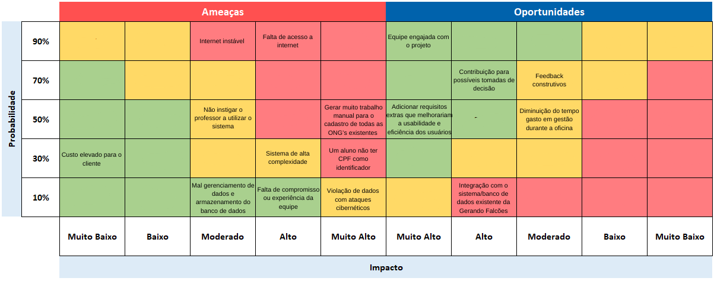
<p>Fonte: elaborada pelos autores. Template disponível em https://ferramentasdaqualidade.org/matriz-de-riscos-matriz-de-probabilidade-e-impacto/</p>
</div>

#### Planos de ação para ameaças

&emsp;Segundo Rohr <sup>[\[20\]](#referências)</sup>, um plano de ação consiste em uma série de direções de melhorias de resultados e solução de problemas para atingir as metas e objetivos do negócio. Para a matriz de risco, ele é útil pois fornece uma visão de como gerenciar, reduzir ou responder a esses riscos.

- **Custo elevado para o cliente**: Uma ONG depende de doações e recursos financeiros para continuar operando, portanto, entregar um produto com um custo elevado para esse tipo de cliente não é interessante. É necessário lidar da melhor forma com os serviços, como armazenamento e outros oferecidos pela internet, para evitar custos financeiros altos para a ONG.

- **Internet instável**: Uma internet instável pode ocasionar falhas ao salvar os dados a nuvem. Portanto, deve-se desenvolver uma aplicação que armazena dados localmente antes de enviar para o banco de dados na nuvem.

- **Falha de acesso a internet**: O sistema, por ser uma aplicação Web, necessita ter uma conexão inicial para funcionar. Para contornar essa situação, é essencial que o sistema seja capaz de receber e processar dados por meio de um arquivo criado pelo usuário, caso a conexão com a aplicação Web não seja possível.

- **Não instigar o professor a utilizar o sistema**: É importante incentivar os professores a utilizarem o sistema dentro da própria aplicação, para evitar que recorram a métodos tradicionais ou mais simples, o que poderia resultar no abandono da plataforma.

- **Mal gerenciamento de dados e armazenamento do banco de dados**: Uma má estrutura do banco de dados poderia ocasionar falhas, além de gerar informações desnecessárias e consequentemente um alto custo do provedor. Portanto, é fundamental garantir uma estrutura sólida e eficiente.

- **Sistema de alta complexidade**: Um sistema com uma usabilidade de alta complexidade ocasionaria desentendimentos dos usuários com baixo letramento digital. Para mitigar este problema, é fundamental simplificar a interface e as funcionalidades do sistema.

- **Falta de compromisso ou experiência da equipe**: A falta de comprometimento ou experiência por parte da equipe pode comprometer a qualidade e eficiência do projeto. Para lidar com essa questão, é essencial estabelecer metas claras, promover uma cultura de trabalho colaborativa e incentivar o engajamento e a responsabilidade de todos os membros.

- **Gerar muito trabalho manual para o cadastro de todas as ONG's existentes**: O processo manual de cadastro de todas as ONGs existentes pode consumir muito tempo de trabalho por parte da Gerando Falcões. Para isso, é fundamental buscar soluções automatizadas, como a integração de bancos de dados públicos ou adaptar o sistema para receber e processar dados por meio de arquivos que contém as informações necessárias para o cadastro das ONGs.

- **Um aluno não ter CPF como identificador**: O CPF é o identificador mais utilizado para a busca dos alunos, sua ausência pode causar dificuldades no processo de cadastro e acompanhamento. Portanto, é importante oferecer outras alternativas de identificação de alunos no sistema, como nome de familiares, ID aleatório, etc.

- **Violação de dados com ataques cibernéticos**: A ameaça de violação de dados por meio de ataques cibernéticos é uma grande preocupação para um sistema que lida com informações sensíveis. É importante implementar medidas de segurança, como criptografia de dados.

#### Detalhamento das oportunidades

- **Equipe engajada com o projeto**: Uma equipe engajada pode levar a um aumento na produtividade, melhor comunicação e um ambiente de trabalho mais harmonioso, que por consequência, produz um projeto com resultados positivos.

- **Contribuição para possíveis tomadas de decisão**: A visualização de dados pelo Conectando Falcões pode desempenhar um papel crucial na tomada de decisões. Ao analisar e interpretar dados, eles podem obter insights valiosos que podem levar a decisões mais assertivas e estratégicas.

- **Adicionar requisitos extras que melhorariam a usabilidade e eficiência dos usuários**: A adição de funcionalidades extras pode melhorar significativamente a experiência do usuário.

- **Integração com o sistema/banco de dados existente da Gerando Falcões**: A integração com o sistema ou banco de dados já em uso pela Gerando Falcões poderia otimizar significativamente o processo de cadastro das ONGs. Isso possibilitaria a automação do processo, eliminando a necessidade de cadastro manual, tarefa que estaria a cargo da própria Gerando Falcões.

- **Feedbacks construtivos**: Feedbacks tanto da Gerando Falcões quanto dos usuários finais poderiam ajudar a equipe de desenvolvimento a identificar melhorias e oportunidades de crescimento do projeto.

- **Diminuição do tempo gasto em gestão durante a oficina**: A diminuição do tempo gasto em gestão pode liberar mais tempo para se concentrar em tarefas mais importantes. Isso pode levar a um aumento na eficiência e produtividade dos gestores da Gerando Falcões.

# 4. Análise de experiência do usuário

&emsp;Neste tópico será abordado uma descrição específica sobre os usuários finais da aplicação que será desenvolvida pelo grupo. Sendo assim, tais análises seguem as informações que foram transmitidas pelo parceiro (GF) e por pesquisas aprofundadas sobre as dores atuais apresentados no TAPI <sup>[\[7\]](#referências)</sup>. Com isso, este tópico irá abordar perfis de usuário, personas, e mapa de jornada dos usuários.

## 4.1 Perfis de Usuários

&emsp; Os perfis de usuários podem ser considerados informações relevantes e macros sobre quem utilizará a solução que está sendo desenvolvida. Nesse sentido, a sua principal importância está no conhecimento de suas necessidades específicas, de acordo com as suas características, comportamentos, interesses, entre outras informações que possam materializar os possíveis usuários finais <sup>[\22\]](#referências)</sup>.

&emsp;Portanto, abaixo serão listados os quadros que representam os perfis de usuário do projeto Conectando Falcões.

| <div style="width:150px">**Perfil 1: Gerando Falcões**</div> | **Descrição**                                                                                                                                                                                                                                          |
| ------------------------------------------------------------ | ------------------------------------------------------------------------------------------------------------------------------------------------------------------------------------------------------------------------------------------------------ |
| Características                                              | Funcionários da rede Gerando Falcões que administram todos os acessos na plataforma e têm acesso a todos os dados e visualizações. Precisam de ferramentas que facilitem a gestão de recursos, o monitoramento de atividades e a avaliação de impacto. |
| Necessidades                                                 | Uma plataforma intuitiva e simples para monitorar o desempenho das ONGs parceiras além de meios simplificados para a geração de relatórios e acompanhamento de atendimentos aos beneficiários.                                                         |
| Interação com a plataforma                                   | Utilizarão a plataforma principalmente para gestão de dados, monitoramento de projetos, comunicação de resultados e geração de relatórios de performance.                                                                                              |
| Faixa etária                                                 | De acordo com uma análise geral da cultura da organização, é possível considerar que a faixa etária dos gestores da GF é de 25 a 40 anos.                                                                                                              |
| Interesses                                                   | Buscam sempre "transformar a vida de crianças, jovens, líderes e moradores das favelas, através da combinação de educação socioemocional, educação profissional, acesso ao trabalho e tecnologias <sup>[\[23\]](#referências)</sup>".                  |

<br>

| <div style="width:150px">**Perfil 2: Líderes de ONGs**</div> | **Descrição**                                                                                                                                                                                                                                                                                                         |
| ------------------------------------------------------------ | --------------------------------------------------------------------------------------------------------------------------------------------------------------------------------------------------------------------------------------------------------------------------------------------------------------------- |
| Características                                              | Empreendedores sociais que lideram as ONGs parceiras. Precisam de funcionalidades que agilizem o gerenciamento de suas organizações, permitindo um controle efetivo de atividades, participantes, colaboradores e recursos                                                                                            |
| Necessidades                                                 | Uma solução que facilite o cadastro de novos atendidos e a gestão de atividades, com uma interface simples que não exija conhecimento técnico. Ferramentas para controle de frequência e facilitação na gestão de eventos e oficinas são essenciais                                                                   |
| Interação com a plataforma                                   | Priorizarão o uso da plataforma para a inserção e gestão de dados de atendidos, organização de oficinas, controle de presença e monitoramento de atividades específicas da ONG                                                                                                                                        |
| Faixa etária                                                 | Devido aos diferentes contextos das ONGs que pertencem à rede da Gerando Falcões, há uma dificuldade de estabelecer uma faixa de idade específica para os líderes da ONG. Porém, de acordo com algumas informações fornecidas pelo parceiro ao longo das validações, é notório que os líderes são maiores de 18 anos. |
| Interesses                                                   | Buscam sempre realizar pequenas atividades em favelas específicas para que a vida de diferentes pessoas possam mudar. Ademais, devido a esse grande interesse, sempre tentam encontrar meios cabíveis de tornar esse anseio de transformação social realidade e, por isso, fazem parte da Gerando Falcões.            |

<br>
<br>

| <div style="width:150px">**Perfil 3: Educadores e Voluntários**</div> | **Descrição**                                                                                                                                                                                                                                                                            |
| --------------------------------------------------------------------- | ---------------------------------------------------------------------------------------------------------------------------------------------------------------------------------------------------------------------------------------------------------------------------------------- |
| Características                                                       | Indivíduos dedicados ao ensino e voluntariado em ONGs, frequentemente lidando com várias turmas ou oficinas. Buscam por soluções que os ajudem a se organizar melhor e a gerenciar as suas turmas de forma mais eficiente                                                                |
| Necessidades                                                          | Uma interface de fácil uso para a gestão de presença e cadastro de participantes. A solução deve permitir um rápido acesso à informação das oficinas geridas pelo mesmo e à capacidade de adaptar listas de presença em instantes, especialmente em ambientes com recursos limitados     |
| Interação com a plataforma                                            | Farão uso intensivo da plataforma para o gerenciamento de presenças, visualização de calendários de atividades, e para acessar informações cruciais sobre as oficinas, turmas em que estão envolvidos e seus alunos                                                                      |
| Faixa etária                                                          | Devido às diferentes realidades de professores que atuam nas ONGs pertencentes à rede da GF, é difícil mensurar uma faixa etária específica. Porém, de acordo com algumas informações fornecidas pelo parceiro ao longo das validações, é notório que os líderes são maiores de 18 anos. |
| Interesses                                                            | Aplicar seus conhecimentos dentro de favelas de modo a contribuir e enriquecer o repertório educacional e social dos moradores de tais localidades.                                                                                                                                      |

<br>

## 4.2 Personas

&emsp; Segundo Dam<sup>[\[9\]](#referências)</sup>, personas são representações fictícias de usuários reais que são criadas com o objetivo de ajudar designers, desenvolvedores e equipes de UX a compreender melhor os diferentes tipos de usuários que podem interagir com um produto ou serviço. Elas são construídas a partir de dados demográficos, comportamentais, necessidades e metas dos usuários reais.

&emsp; As personas ajudam a entender melhor as necessidades, expectativas e desafios dos usuários, permitindo que criem experiências mais relevantes e eficazes. Logo, no contexto do Conectando Falcões, a criação de personas é essencial para garantir que a solução atenda às dores e necessidades dos usuários finais, desde o desenvolvimento de funcionalidades até a criação de interfaces mais amigáveis e centradas.

&emsp; Dentro dos perfis de usuário, as personas desempenham um papel crucial ao personificar esses perfis, proporcionando uma compreensão mais profunda, específica e humanizada das necessidades e motivações destes. Assim, ao invés de determinar um grupo de indivíduos, é possível pensar em um tipo de indivíduo ainda mais focado ao desenvolver as funcionalidades do projeto.

### Persona 1: Priscila Amaya

<div align="center">
  <p>Imagem 02 - Persona 1: Priscila Amaya</p>
  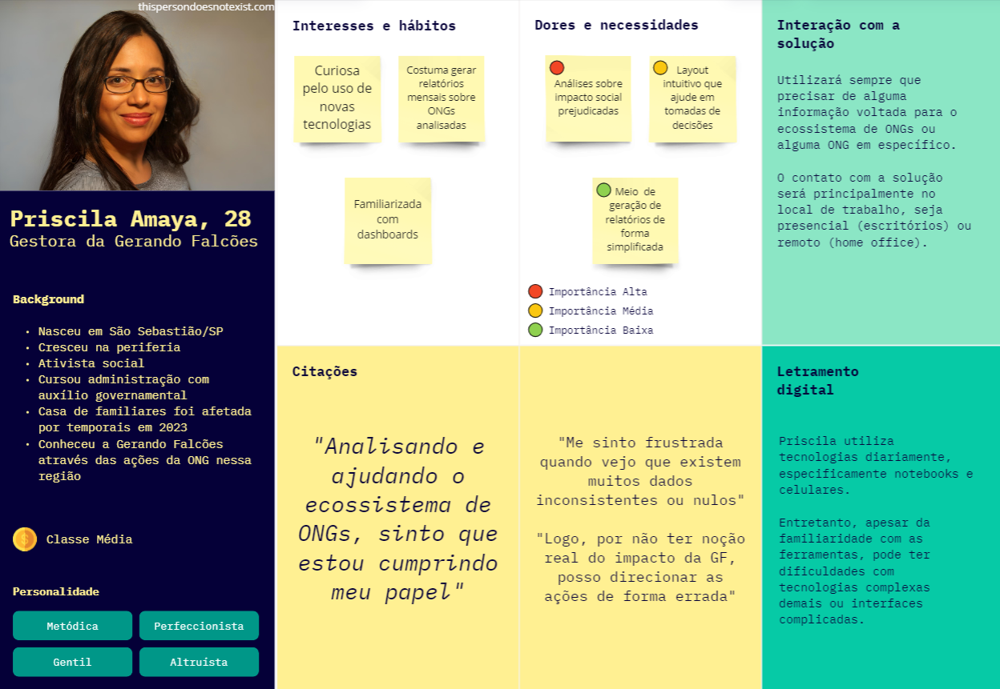
  <p>Fonte: Autoria própria. Imagem por thispersondoesnotexist.com</p>
</div>

<br>

| **Tópico**               | **Descrição**                                                                                                                                                                                                                                                                   |
| ------------------------ | ------------------------------------------------------------------------------------------------------------------------------------------------------------------------------------------------------------------------------------------------------------------------------- |
| Nome                     | Priscila Amaya                                                                                                                                                                                                                                                                  |
| Idade                    | 28                                                                                                                                                                                                                                                                              |
| Profissão                | Gestora da Gerando Falcões                                                                                                                                                                                                                                                      |
| Perfil Socioeconômico    | Classe média                                                                                                                                                                                                                                                                    |
| Background               | - Nasceu em São Sebastião/SP <br> - Cresceu na periferia <br> - Ativista social <br> - Cursou administração com auxílio governamental <br> - Casa de familiares foi afetada por temporais em 2023 <br> - Conheceu a Gerando Falcões através das ações da ONG nessa região       |
| Personalidade            | - Metódica <br> - Perfeccionista <br> - Gentil <br> - Altruísta                                                                                                                                                                                                                 |
| Interesses e Hábitos     | - Curiosa pelo uso de novas tecnologias <br> - Costuma gerar relatórios mensais sobre ONGs analisadas <br> - Familiarizada com dashboards                                                                                                                                       |
| Dores e Necessidades     | - Análises sobre impacto social prejudicadas por falta de dados no sistema (Importância alta) <br> - Layout intuitivo que ajude na tomada de decisões (Importância média) <br> - Meio de geração de relatórios de forma simplificada (Importância baixa)                        |
| Citações diretas         | - "Analisando e ajudando o ecossistema de ONGs, sinto que estou cumprindo meu papel" <br> - "Me sinto frustrada quando vejo que existem muitos dados inconsistentes ou nulos" <br> - "Logo, por não ter noção real do impacto da GF, posso direcionar as ações de forma errada" |
| Interações com a Solução | Utilizará sempre que precisar de alguma informação voltada para o ecossistema de ONGs ou alguma ONG em específico. O contato com a solução será principalmente no local de trabalho, seja presencial (escritórios) ou remoto (home office).                                     |
| Letramento Digital       | Priscila utiliza tecnologias diariamente, especificamente notebooks e celulares. Entretanto, apesar da familiaridade com as ferramentas, pode ter dificuldades com tecnologias complexas demais ou interfaces complicadas.                                                      |

<br>
&emsp; A primeira persona, nomeada como Priscila Amaya, enquadra-se no perfil de usuário 1: funcionários da Gerando Falcões, como gestora do ecossistema de ONGs filiadas.

### Persona 2: José Tiago

<div align="center">
  <p>Imagem 03 - Persona 2: José Tiago</p>
  
  <p>Fonte: Autoria própria. Imagem por thispersondoesnotexist.com</p>
</div>

<br>

| **Tópico**               | **Descrição**                                                                                                                                                                                                                                                                                                   |
| ------------------------ | --------------------------------------------------------------------------------------------------------------------------------------------------------------------------------------------------------------------------------------------------------------------------------------------------------------- |
| Nome                     | José Tiago                                                                                                                                                                                                                                                                                                      |
| Idade                    | 32                                                                                                                                                                                                                                                                                                              |
| Profissão                | Fundador ONG Crisálidas                                                                                                                                                                                                                                                                                         |
| Perfil Socioeconômico    | Classe média                                                                                                                                                                                                                                                                                                    |
| Background               | - Nasceu em São Paulo/SP <br> - Morador de favela desde criança <br> - É pai de duas meninas <br> - Tornou-se lider social pela Falcons University <br> - Fundou uma ONG para ajudar crianças                                                                                                                   |
| Personalidade            | - Impaciente <br> - Empreendedor <br> - Proativo <br> - Altruísta                                                                                                                                                                                                                                               |
| Interesses e Hábitos     | - Quer impactar vidas e ajudar as favelas <br> - Preza pela parceria com a Gerando Falcões <br> - Se esforça para manter a gestão da ONG em dia                                                                                                                                                                 |
| Dores e Necessidades     | - Não tem paciência para aprender tecnologias complexas (Importância alta) <br> - Falta de controle de frequência de atendidos (Importância alta) <br> - Dificuldade em preencher formulários longos (Importância média) <br> - Seu celular tem pouca memória (Importância baixa)                               |
| Citações diretas         | - "Eu quero mudar a realidade da favela, mostrar que é possível ter um futuro próspero" <br> - "Quero organizar tudo, mas manter o controle das atividades no site atual é complicado" <br> - "Estou disposto a aprender a utilizar novas tecnologias se ajudar na gestão da ONG"                               |
| Interações com a Solução | Utilizará a solução quando precisar cadastrar um novo atendido ou novo professor dentro da ONG, ao criar novas oficinas e ao controlar a presença de alunos por conta própria. O contato com a solução será principalmente dentro da ONG, sendo em algum escritório ou dentro das salas de oficinas e projetos. |
| Letramento Digital       | José não é habituado a utilizar outra tecnologia que não seja o seu celular e só o usa para funcionalidades simples como envio de mensagens e ver redes sociais.                                                                                                                                                |

<br>
&emsp; A segunda persona, nomeada como José Tiago, enquadra-se no perfil de usuário 2, de líderes de ONG por fundar a ONG Crisálidas e gerir seu funcionamento.

### Persona 3: Matheus Rocha

<div align="center">
  <p>Imagem 04 - Persona 3: Matheus Rocha</p>
  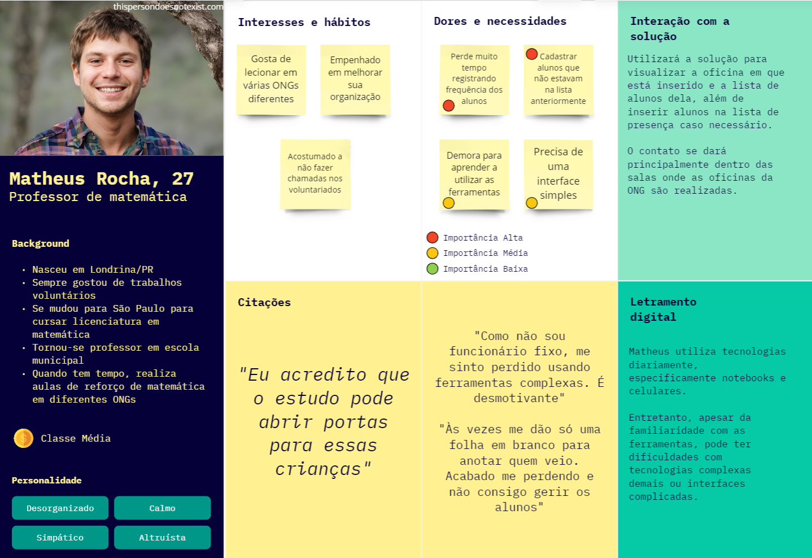
  <p>Fonte: Autoria própria. Imagem por thispersondoesnotexist.com</p>
</div>

<br>

| **Tópico**               | **Descrição**                                                                                                                                                                                                                                                                                     |
| ------------------------ | ------------------------------------------------------------------------------------------------------------------------------------------------------------------------------------------------------------------------------------------------------------------------------------------------- |
| Nome                     | Matheus Rocha                                                                                                                                                                                                                                                                                     |
| Idade                    | 27                                                                                                                                                                                                                                                                                                |
| Profissão                | Professor de Matemática                                                                                                                                                                                                                                                                           |
| Perfil Socioeconômico    | Classe média                                                                                                                                                                                                                                                                                      |
| Background               | - Nasceu em Londrina/PR <br> - Sempre gostou de trabalhos voluntários <br> - Se mudou para São Paulo para cursar licenciatura em matemática <br> - Tornou-se professor em escola municipal <br> - Quando tem tempo, realiza aulas de reforço de matemática em diferentes ONGs                     |
| Personalidade            | - Desorganizado <br> - Calmo <br> - Simpático <br> - Altruísta                                                                                                                                                                                                                                    |
| Interesses e Hábitos     | - Gosta de lecionar em várias ONGs diferentes <br> - Empenhado em melhorar sua organização <br> - Acostumado a não fazer chamadas nos voluntariados                                                                                                                                               |
| Dores e Necessidades     | - Perde muito tempo registrando frequência dos alunos (Importância alta) <br> - Cadastrar alunos que não estavam na lista anteriormente (Importância alta) <br> - Demora para aprender a utilizar as ferramentas (Importância média) <br> - Precisa de uma interface simples (Importância média)  |
| Citações diretas         | - "Eu acredito que o estudo pode abrir portas para essas crianças" <br> - "Como não sou funcionário fixo, me sinto perdido usando ferramentas complexas. É desmotivante" <br> - "Às vezes me dão só uma folha em branco para anotar quem veio. Acabado me perdendo e não consigo gerir os alunos" |
| Interações com a Solução | Utilizará a solução para visualizar a oficina em que está inserido e a lista de alunos dela, além de inserir alunos na lista de presença caso necessário. O contato se dará principalmente dentro das salas onde as oficinas da ONG são realizadas.                                               |
| Letramento Digital       | Matheus utiliza tecnologias diariamente, especificamente notebooks e celulares. Entretanto, apesar da familiaridade com as ferramentas, pode ter dificuldades com tecnologias complexas demais ou interfaces complicadas.                                                                         |

&emsp; A terceira persona, nomeada como Matheus Rocha, enquadra-se no perfil de usuário 3, de educadores e voluntários por trabalhar em diversas ONGs como professor de matemática voluntário

## 4.3 Mapa de jornada do usuário

&emsp;De acordo com Salgado<sup>[\[18\]](#referências)</sup>, a jornada do usuário, também conhecida como “User Journey”, consiste na representação gráfica das etapas que envolvem o relacionamento do cliente com um produto ou serviço de determinada empresa. É uma ferramenta essencial no campo do design de experiência do usuário (UX) que abrange não apenas os passos e ações do usuário, mas também suas emoções, permitindo uma compreensão mais profunda de sua experiência.

&emsp;A jornada do usuário é crucial para identificar melhorias, garantindo que os produtos atendam efetivamente às necessidades dos usuários e proporcionem uma experiência positiva.

&emsp;No processo de desenvolvimento dessas jornadas, foram utilizadas três personas específicas: Priscila Amaya, José Tiago e Matheus Rocha. Através da análise detalhada das necessidades, comportamentos e expectativas dessas personas, foi possível criar jornadas de usuário mais precisas e personalizadas. Isso, por sua vez, permitiu uma melhor compreensão das experiências dos usuários, facilitando a o planejamento da solução centrada no usuário.

<div align="center">
  <p>Imagem 05 - Jornada de Usuário 1: Priscila Amaya</p>
  
  <p>Fonte: elaborada pelos autores com a plataforma Miro. Template disponível em: https://miro.com/app/dashboard/?tpTemplate=customer-journey-map-hanan&isCustom=false&share_link_id=632184165677</p>
</div>

<div align="center">
  <p>Imagem 06 - Jornada de Usuário 2: José Tiago</p>
  
  <p>Fonte: elaborada pelos autores com a plataforma Miro. Template disponível em: https://miro.com/app/dashboard/?tpTemplate=customer-journey-map-hanan&isCustom=false&share_link_id=632184165677</p>
</div>

<div align="center">
  <p>Imagem 07 - Jornada de Usuário 3: Matheus Rocha</p>
  
  <p>Fonte: elaborada pelos autores com a plataforma Miro. Template disponível em: https://miro.com/app/dashboard/?tpTemplate=customer-journey-map-hanan&isCustom=false&share_link_id=632184165677</p>
</div>

# 5. Requisitos

&emsp; Requisitos, no contexto da engenharia de software, são especificações das funcionalidades e características que um sistema de software deve possuir para atender às necessidades dos usuários, clientes ou outras partes interessadas. Eles são essenciais para guiar o processo de desenvolvimento de software e garantir que o produto final atenda às expectativas e requisitos dos stakeholders.<sup>[\[14\]](#referências)</sup>

&emsp; Eles são divididos em requisitos funcionais e não funcionais, que descrevem as operações específicas que o sistema deve executar e as características que o sistema deve possuir, respectivamente.

&emsp; No contexto do Conectando Falcões, os requisitos do sistema são fundamentais para garantir que a solução proposta atenda às necessidades e expectativas dos usuários finais e do parceiro. Eles descrevem as funcionalidades e operações específicas que a aplicação deve oferecer para atender às necessidades dos gestores, líderes de ONGs e professores envolvidos no projeto.

## 5.1 Requisitos Funcionais

&nbsp;&nbsp;&nbsp;&nbsp; Os requisitos funcionais de um projeto descrevem as funcionalidades essenciais que a solução deve oferecer para atender às necessidades e expectativas dos usuários e partes interessadas envolvidas. Eles representam as operações específicas que o sistema deve executar para cumprir seus objetivos e resolver os problemas identificados. No contexto do Conectando Falcões, os requisitos funcionais delineiam as ações que cada persona – gestores, líderes de ONGs e professores – pode realizar na plataforma.

A seguir estão todos os requisitos funcionais divididos em subcategorias, sendo elas correspondendo a uma persona ou a uma área específica de funcionalidades.

#### Etapa comum para todas as personas:

### RF-001

**Login**

Todas as personas, incluindo líderes da ONG, professores e gestores da Gerando Falcões, devem ter a capacidade de fazer login na plataforma utilizando credenciais específicas para seu papel. Após o login bem-sucedido, a pessoa terá seu nível de acesso determinado de acordo com o seu papel na organização, permitindo acesso apenas às funcionalidades e informações pertinentes à sua função.

#### Critérios de Aceitação

1. O sistema deve verificar se o nome de usuário e a senha correspondem a uma conta existente e ativa na plataforma
2. Se o nome de usuário ou senha estiverem incorretos, o sistema deve exibir uma mensagem de erro

#### Descrição dos Testes

<div align="center">
   <sub>Quadro X - Descrição dos casos de teste do RF-001</sub>

| Requisito | Pré-condição                                                   | Procedimentos                                                                                 | Resultado Esperado                                               | Pós-condição       |
| --------- | -------------------------------------------------------------- | --------------------------------------------------------------------------------------------- | ---------------------------------------------------------------- | ------------------ |
| RF-001    | Usuários não logados na plataforma, acessando a página inicial | Usuários inserem suas credenciais nos campos 'Usuário' e 'Senha' e pressionar o botão 'Login' | Redirecionamento à página principal do usuário efetuando o login | Login bem sucedido |

<sup>Fonte: Os autores (2024)</sup>

</div>

### RF-002

**Editar/arquivar ONGs**

Permite ao gestor da Gerando Falcões gerenciar as organizações não governamentais cadastradas na plataforma, podendo adicionar novas, editar informações existentes ou arquivar ONGs que não são mais ativas.

#### Critérios de Aceitação

1. O gestor deve ser capaz de adicionar novas ONGs com todas as informações necessárias.
2. O gestor deve poder editar informações das ONGs cadastradas.
3. O gestor deve poder remover ONGs que não são mais ativas.

#### Descrição dos Testes

<div align="center">
   <sub>Quadro X - Descrição dos casos de teste do RF-002</sub>

| Requisito | Pré-condição                                | Procedimentos                                                                                  | Resultado Esperado                              | Pós-condição               |
| --------- | ------------------------------------------- | ---------------------------------------------------------------------------------------------- | ----------------------------------------------- | -------------------------- |
| RF-002    | Gestor logado e na página de gestão de ONGs | Selecionar a opção para adicionar uma nova ONG, preenchendo as informações requeridas e salvar | A nova ONG aparece na lista de ONGs cadastradas | ONG adicionada com sucesso |

<sup>Fonte: Os autores (2024)</sup>

</div>

### RF-003

**Visualizar detalhadamente cada ONG, cada oficina e seus alunos**

Permite ao gestor acessar informações detalhadas sobre cada ONG cadastrada, cada oficina realizada por elas e os alunos atendidos pelas ONGs.

#### Critérios de Aceitação

1. O gestor deve ter acesso a uma interface que liste todas as ONGs, com opções para visualizar detalhes de cada uma.
2. Ao selecionar uma ONG, o gestor deve poder ver informações detalhadas sobre as oficinas realizadas e os alunos atendidos.

#### Descrição dos Testes

<div align="center">
   <sub>Quadro X - Descrição dos casos de teste do RF-003</sub>

| Requisito | Pré-condição                                       | Procedimentos                              | Resultado Esperado                                                     | Pós-condição                                     |
| --------- | -------------------------------------------------- | ------------------------------------------ | ---------------------------------------------------------------------- | ------------------------------------------------ |
| RF-003    | Gestor logado e na página de visualização das ONGs | Clicar em uma ONG para visualizar detalhes | A página mostra detalhes da ONG, incluindo oficinas e alunos atendidos | Informações detalhadas apresentadas corretamente |

<sup>Fonte: Os autores (2024)</sup>

</div>

### RF-004

**Exportar dados de todas as ONGs**

Dá a capacidade de exportar informações de todas as ONGs cadastradas em um formato específico, possibilitando análises externas.

#### Critérios de Aceitação

1. O gestor deve ser capaz de exportar dados das ONGs em um formato de dados estruturados.
2. A exportação deve conter todas as informações relevantes das ONGs.

#### Descrição dos Testes

<div align="center">
   <sub>Quadro X - Descrição dos casos de teste do RF-004</sub>

| Requisito | Pré-condição                                       | Procedimentos                                                                 | Resultado Esperado                                                             | Pós-condição                 |
| --------- | -------------------------------------------------- | ----------------------------------------------------------------------------- | ------------------------------------------------------------------------------ | ---------------------------- |
| RF-004    | Gestor logado e na página de visualização das ONGs | Selecionar a opção de exportar dados e escolher o formato de arquivo desejado | Um arquivo é gerado e disponibilizado para download contendo os dados das ONGs | Dados exportados com sucesso |

<sup>Fonte: Os autores (2024)</sup>

</div>

#### Líder/ONG’s:

### RF-005

**Cadastrar/editar/arquivar professores**

Permite que os líderes de ONGs gerenciem o cadastro de professores que trabalham em suas oficinas e organizações.

#### Critérios de Aceitação

1. Líderes de ONGs devem ser capazes de adicionar novos professores com informações necessárias.
2. Deve ser possível editar ou remover o cadastro de professores existentes na plataforma.

#### Descrição dos Testes

<div align="center">
   <sub>Quadro X - Descrição dos casos de teste do RF-005</sub>

| Requisito | Pré-condição                                                          | Procedimentos                                                                                        | Resultado Esperado                                                         | Pós-condição                     |
| --------- | --------------------------------------------------------------------- | ---------------------------------------------------------------------------------------------------- | -------------------------------------------------------------------------- | -------------------------------- |
| RF-005    | Líder da ONG logado e na página de gestão/visualização de professores | Selecionar a opção para adicionar um novo professor, preenchendo as informações necessárias e salvar | O novo professor aparece na lista de professores cadastrados na plataforma | Professor cadastrado com sucesso |

<sup>Fonte: Os autores (2024)</sup>

</div>

### RF-006

**Cadastrar/editar/arquivar alunos**

Permite que os líderes das ONGs gerenciem o cadastro de alunos atendidos por ela.

#### Critérios de Aceitação

1. Líderes de ONGs precisam gerenciar o cadastro de alunos, incluindo adicionar, editar e excluir alunos.
2. O sistema deve permitir a visualização detalhada do perfil de cada aluno cadastrado.

#### Descrição dos Testes

<div align="center">
   <sub>Quadro X - Descrição dos casos de teste do RF-006</sub>

| Requisito | Pré-condição                                                     | Procedimentos                                                                                  | Resultado Esperado                                         | Pós-condição                 |
| --------- | ---------------------------------------------------------------- | ---------------------------------------------------------------------------------------------- | ---------------------------------------------------------- | ---------------------------- |
| RF-006    | Líder da ONG logado e na página de gestão/visualização de alunos | Selecionar a opção para adicionar um novo aluno, inserindo as informações necessárias e salvar | O novo aluno aparece na lista de alunos atendidos pela ONG | Aluno cadastrado com sucesso |

<sup>Fonte: Os autores (2024)</sup>

</div>

### RF-007

**Criar/editar/arquivar oficinas**

Permite aos líderes de ONGs gerenciarem as oficinas oferecidas por suas organizações, podendo adicionar novas, editar ou remover oficinas existentes.

#### Critérios de Aceitação

1. Líderes de ONGs devem conseguir criar novas oficinas, editá-las ou excluí-las, especificando detalhes como nome da oficina, descrição, professor responsável e data/hora.
2. A plataforma deve fornecer uma visão geral e detalhada de cada oficina cadastrada.

#### Descrição dos Testes

<div align="center">
   <sub>Quadro X - Descrição dos casos de teste do RF-007</sub>

| Requisito | Pré-condição                                                       | Procedimentos                                                                                | Resultado Esperado                                                  | Pós-condição               |
| --------- | ------------------------------------------------------------------ | -------------------------------------------------------------------------------------------- | ------------------------------------------------------------------- | -------------------------- |
| RF-007    | Líder da ONG logado e na página de gestão/visualização de oficinas | Selecionar a opção para criar uma nova oficina, preenchendo os detalhes necessários e salvar | A nova oficina é adicionada à lista de oficinas oferecidas pela ONG | Oficina criada com sucesso |

<sup>Fonte: Os autores (2024)</sup>

</div>

### RF-008

**Monitorar alunos de cada oficina**

Possibilita o controle de presença e o gerenciamento dos alunos participantes de cada oficina, permitindo marcar presença e gerenciar as atividades de cada aluno em particular.

#### Critérios de Aceitação

1. Deve haver funcionalidade para controle de presença dos alunos em cada oficina, com a possibilidade de marcar presença ou ausência.
2. Líderes devem conseguir acessar e gerenciar os dados de participação dos alunos nas oficinas.

#### Descrição dos Testes

<div align="center">
   <sub>Quadro X - Descrição dos casos de teste do RF-008</sub>

| Requisito | Pré-condição                                                          | Procedimentos                                                   | Resultado Esperado                                                 | Pós-condição                               |
| --------- | --------------------------------------------------------------------- | --------------------------------------------------------------- | ------------------------------------------------------------------ | ------------------------------------------ |
| RF-008    | Líder da ONG logado e visualizando a página de uma oficina específica | Marcar presença dos alunos participantes da oficina selecionada | A lista de presença é atualizada para refletir os alunos presentes | Presença dos alunos registrada com sucesso |

<sup>Fonte: Os autores (2024)</sup>

</div>

### RF-009

**Visualizar histórico de alunos, turmas, oficinas**

Fornece acesso ao histórico completo de cada aluno, incluindo sua participação em aulas e oficinas ao longo do tempo.

#### Critérios de Aceitação

1. Acesso ao histórico completo de participação dos alunos em oficinas e aulas, incluindo datas e presenças.
2. O sistema deve fornecer filtros para visualizar o histórico de atividades por aluno ou oficina.

#### Descrição dos Testes

<div align="center">
   <sub>Quadro X - Descrição dos casos de teste do RF-009</sub>

| Requisito | Pré-condição                                                      | Procedimentos                                                                          | Resultado Esperado                                                                             | Pós-condição                                                |
| --------- | ----------------------------------------------------------------- | -------------------------------------------------------------------------------------- | ---------------------------------------------------------------------------------------------- | ----------------------------------------------------------- |
| RF-009    | Líder da ONG logado e na página de histórico de oficinas e alunos | Selecionar um aluno para visualizar seu histórico completo de participação em oficinas | O sistema apresenta todas as oficinas das quais o aluno participou, incluindo datas e presença | Histórico de participação do aluno visualizado corretamente |

<sup>Fonte: Os autores (2024)</sup>

</div>

### RF-010

**Visualização de dados gerais e detalhados da própria ONG**

Permite aos líderes de ONGs visualizarem dados gerais e detalhados sobre sua própria organização, incluindo estatísticas de atendimento e participação.

#### Critérios de Aceitação

1. Líderes de ONGs devem ter acesso a dashboards com dados gerais e detalhados sobre a performance e atividades da ONG.
2. Os dados apresentados devem incluir estatísticas de frequência em oficinas e o progresso dos alunos.

#### Descrição dos Testes

<div align="center">
   <sub>Quadro X - Descrição dos casos de teste do RF-010</sub>

| Requisito | Pré-condição                                         | Procedimentos                                                       | Resultado Esperado                                                                                        | Pós-condição                          |
| --------- | ---------------------------------------------------- | ------------------------------------------------------------------- | --------------------------------------------------------------------------------------------------------- | ------------------------------------- |
| RF-010    | Líder da ONG logado e na página gerencial de sua ONG | Acessar a seção de visualização de dados gerais e detalhados da ONG | Dados gerais e específicos sobre a ONG são exibidos, incluindo estatísticas de atendimento e participação | Dados da ONG visualizados com sucesso |

<sup>Fonte: Os autores (2024)</sup>

</div>

### RF-011

**Exportar arquivo de presença**

Permite os líderes de ONGs a exportarem um arquivo contendo os nomes dos alunos presentes em uma determinada oficina, permitindo a impressão para controle de presença em sala de aula.

#### Critérios de Aceitação

1. A funcionalidade deve permitir a exportação de listas de presença de alunos em formatos adequados para impressão.
2. A lista exportada deve conter informações sobre a oficina, data e nomes dos alunos presentes.

#### Descrição dos Testes

<div align="center">
   <sub>Quadro X - Descrição dos casos de teste do RF-011</sub>

| Requisito | Pré-condição                                              | Procedimentos                                                   | Resultado Esperado                                                                                                 | Pós-condição                            |
| --------- | --------------------------------------------------------- | --------------------------------------------------------------- | ------------------------------------------------------------------------------------------------------------------ | --------------------------------------- |
| RF-011    | Líder da ONG logado e na página de uma oficina específica | Selecionar a opção para exportar a lista de presença da oficina | Um arquivo contendo os nomes dos alunos que participam de certa oficina é gerado para download (em forma de lista) | Lista de presença exportada com sucesso |

<sup>Fonte: Os autores (2024)</sup>

</div>

#### Professor:

### RF-012

**Cadastrar alunos**

Permite aos professores cadastrarem novos alunos em suas oficinas.

#### Critérios de Aceitação

1. Professores devem poder cadastrar novos alunos, inserindo informações necessárias.
2. O sistema deve validar os dados inseridos para garantir a integridade e completude das informações do aluno.

#### Descrição dos Testes

<div align="center">
   <sub>Quadro X - Descrição dos casos de teste do RF-012</sub>

| Requisito | Pré-condição                                                  | Procedimentos                                 | Resultado Esperado                                     | Pós-condição                 |
| --------- | ------------------------------------------------------------- | --------------------------------------------- | ------------------------------------------------------ | ---------------------------- |
| RF-012    | Professor logado e na página de cadastro de alunos da oficina | Inserir as informações do novo aluno e salvar | O novo aluno é adicionado à lista de alunos da oficina | Aluno cadastrado com sucesso |

<sup>Fonte: Os autores (2024)</sup>

</div>

### RF-013

**Controlar frequência dos alunos de cada oficina**

Dá aos professores a capacidade de marcar a presença dos alunos em suas oficinas.

#### Critérios de Aceitação

1. Deve existir uma funcionalidade que permita aos professores marcar a presença dos alunos em cada sessão da oficina.
2. O sistema deve atualizar automaticamente o registro de frequência do aluno após a marcação da presença.

#### Descrição dos Testes

<div align="center">
   <sub>Quadro X - Descrição dos casos de teste do RF-013</sub>

| Requisito | Pré-condição                                                    | Procedimentos                                               | Resultado Esperado                            | Pós-condição                                |
| --------- | --------------------------------------------------------------- | ----------------------------------------------------------- | --------------------------------------------- | ------------------------------------------- |
| RF-013    | Professor logado e na página de controle de presença da oficina | Selecionar a oficina, marcar a presença dos alunos e salvar | A presença dos alunos é registrada no sistema | Registro de presença atualizado com sucesso |

<sup>Fonte: Os autores (2024)</sup>

</div>

### RF-014

**Visualizar alunos cadastrados e suas frequências**

Permite aos professores visualizarem a lista de alunos cadastrados em suas oficinas, bem como suas frequências de participação

#### Critérios de Aceitação

1. Professores devem ter acesso a uma lista de todos os alunos cadastrados em suas oficinas, incluindo informações do aluno e histórico de frequência.
2. O sistema deve permitir a visualização filtrada de alunos por oficina e por frequência de participação.

#### Descrição dos Testes

<div align="center">
   <sub>Quadro X - Descrição dos casos de teste do RF-014</sub>

| Requisito | Pré-condição                                     | Procedimentos                                                                                                                 | Resultado Esperado | Pós-condição |
| --------- | ------------------------------------------------ | ----------------------------------------------------------------------------------------------------------------------------- | ------------------ | ------------ |
| RF-014    | Visualizar alunos cadastrados e suas frequências | Permite aos professores visualizar a lista de alunos cadastrados em suas oficinas, bem como suas frequências de participação. |

<sup>Fonte: Os autores (2024)</sup>

</div>

### RF-015

**Exportar arquivo de presença**

Oferece aos professores a opção de exportar um arquivo contendo os nomes dos alunos presentes em suas oficinas para fins de controle de presença em sala de aula.

#### Critérios de Aceitação

1. A funcionalidade deve permitir aos professores exportar uma lista de presença dos alunos em formato adequado para controle de presença.
2. A lista exportada deve incluir os nomes dos alunos, a data da oficina, e um indicativo de presença.

#### Descrição dos Testes

<div align="center">
   <sub>Quadro X - Descrição dos casos de teste do RF-015</sub>

| Requisito | Pré-condição                                                           | Procedimentos                                                                        | Resultado Esperado                                                   | Pós-condição                            |
| --------- | ---------------------------------------------------------------------- | ------------------------------------------------------------------------------------ | -------------------------------------------------------------------- | --------------------------------------- |
| RF-015    | Professor logado e na página de oficina com presença de alunos marcada | Selecionar a opção para exportar a lista de presença e escolher o formato do arquivo | Um arquivo com a lista de presença dos alunos é gerado para download | Lista de presença exportada com sucesso |

<sup>Fonte: Os autores (2024)</sup>

</div>

#### Visualização de dados (ONG):

### RF-016

**Visualizar o total de atendidos da ONG**

Apresenta o número total de indivíduos atendidos pela ONG.

#### Critérios de Aceitação

1. A plataforma deve calcular automaticamente e apresentar o número total de indivíduos atendidos pela ONG, com base nos registros de alunos e participantes de oficinas.
2. A visualização deve ser atualizada em tempo real conforme novos participantes são registrados.

#### Descrição dos Testes

<div align="center">
   <sub>Quadro X - Descrição dos casos de teste do RF-016</sub>

| Requisito | Pré-condição                                              | Procedimentos                         | Resultado Esperado                                            | Pós-condição                    |
| --------- | --------------------------------------------------------- | ------------------------------------- | ------------------------------------------------------------- | ------------------------------- |
| RF-016    | Líder da ONG logado e na página de dashboard/dados da ONG | Acessar a seção de total de atendidos | Visualização do número total de indivíduos atendidos pela ONG | Dados apresentados corretamente |

<sup>Fonte: Os autores (2024)</sup>

</div>

### RF-017

**Participantes x Oficinas**

Mostra a distribuição de participantes entre as diferentes oficinas oferecidas pela ONG.

#### Critérios de Aceitação

1. Deve ser possível visualizar a distribuição de participantes entre as diversas oficinas oferecidas, com números ou gráficos para cada oficina.
2. A plataforma deve permitir filtragens por período, como mensal ou anual, para observar variações na participação.

#### Descrição dos Testes

<div align="center">
   <sub>Quadro X - Descrição dos casos de teste do RF-017</sub>

| Requisito | Pré-condição                                                  | Procedimentos                                          | Resultado Esperado                                    | Pós-condição                             |
| --------- | ------------------------------------------------------------- | ------------------------------------------------------ | ----------------------------------------------------- | ---------------------------------------- |
| RF-017    | Líder da ONG logado e na página de relatórios de participação | Selecionar a visualização de participantes por oficina | Distribuição clara de participantes entre as oficinas | Informações sobre participação acessadas |

<sup>Fonte: Os autores (2024)</sup>

</div>

### RF-018

**Oficinas ativas e desativadas**

Indica quais oficinas estão atualmente em funcionamento e quais foram desativadas.

#### Critérios de Aceitação

1. A plataforma deve claramente indicar quais oficinas estão ativas e quais foram desativadas, permitindo uma visualização fácil do status atual de cada oficina.
2. Deve ser possível acessar históricos de oficinas desativadas para análise de dados passados.

#### Descrição dos Testes

<div align="center">
   <sub>Quadro X - Descrição dos casos de teste do RF-018</sub>

| Requisito | Pré-condição                                          | Procedimentos                                       | Resultado Esperado                                       | Pós-condição                   |
| --------- | ----------------------------------------------------- | --------------------------------------------------- | -------------------------------------------------------- | ------------------------------ |
| RF-018    | Líder da ONG logado e na página de gestão de oficinas | Visualizar a lista de oficinas ativas e desativadas | Lista atualizada mostrando oficinas ativas e desativadas | Status das oficinas confirmado |

<sup>Fonte: Os autores (2024)</sup>

</div>

### RF-019

**Visualização de dados do perfil do aluno/professor**

Fornece uma visão geral dos dados relacionados ao perfil dos alunos e professores atendidos pela ONG.

#### Critérios de Aceitação

1. Informações detalhadas dos perfis de alunos e professores, participação em oficinas e progresso, devem ser acessíveis através da plataforma.
2. A visualização de perfil deve incluir um resumo das atividades e contribuições do indivíduo.

#### Descrição dos Testes

<div align="center">
   <sub>Quadro X - Descrição dos casos de teste do RF-019</sub>

| Requisito | Pré-condição                                    | Procedimentos                                               | Resultado Esperado                                                          | Pós-condição                   |
| --------- | ----------------------------------------------- | ----------------------------------------------------------- | --------------------------------------------------------------------------- | ------------------------------ |
| RF-019    | Líder da ONG logado e acessando dados de perfil | Selecionar um aluno ou professor para visualizar seu perfil | Dados completos do perfil apresentados, incluindo atividades e participação | Perfil visualizado com sucesso |

<sup>Fonte: Os autores (2024)</sup>

</div>

### RF-020

**Visualização da quantidade de alunos participantes de uma oficina**

Apresenta o número de alunos que participaram de uma determinada oficina em períodos específicos: diário, semanal, mensal e anualmente.

#### Critérios de Aceitação

1. A plataforma deve apresentar o número de alunos que participaram de cada oficina, com opções para visualizar a participação diária, semanal, mensal e anual.
2. Deve haver uma funcionalidade para comparar a quantidade de participantes entre diferentes períodos ou oficinas.

#### Descrição dos Testes

<div align="center">
   <sub>Quadro X - Descrição dos casos de teste do RF-020</sub>

| Requisito | Pré-condição                                               | Procedimentos                                                   | Resultado Esperado                                                   | Pós-condição                           |
| --------- | ---------------------------------------------------------- | --------------------------------------------------------------- | -------------------------------------------------------------------- | -------------------------------------- |
| RF-020    | Líder da ONG logado e na página de detalhes de uma oficina | Acessar a contagem de participantes para um período selecionado | Número de alunos participantes apresentado por períodos selecionados | Quantidade de participantes confirmada |

<sup>Fonte: Os autores (2024)</sup>

</div>

#### Visualização dos dados (Gerando Falcões):

### RF-021

**Filtrar ONG por estado e cidade**

Permite a persona do analista selecionar estados e cidades para filtrar os dados.

#### Critérios de Aceitação

1. A plataforma deve permitir que analistas selecionem estados e cidades específicos de um menu dropdown ou interface similar para filtrar os dados visualizados.
2. A seleção de um estado e/ou cidade deve atualizar automaticamente os dados e relatórios exibidos para refletir apenas as informações relevantes para a localidade escolhida.

#### Descrição dos Testes

<div align="center">
   <sub>Quadro X - Descrição dos casos de teste do RF-021</sub>

| Requisito | Pré-condição                                      | Procedimentos                                         | Resultado Esperado                                                                | Pós-condição                              |
| --------- | ------------------------------------------------- | ----------------------------------------------------- | --------------------------------------------------------------------------------- | ----------------------------------------- |
| RF-021    | Analista logado e na página de filtragem de dados | Selecionar um estado e cidade nos filtros disponíveis | Dados e relatórios da plataforma atualizados para refletir a localidade escolhida | Filtro de localidade aplicado com sucesso |

<sup>Fonte: Os autores (2024)</sup>

</div>

### RF-022

**Pesquisar ONGs**

Capacita a persona do analista a filtrar as ONGs com base em critérios específicos, como: Nome ou CNPJ.

#### Critérios de Aceitação

1. Analistas devem ser capazes de aplicar filtros baseados em nome ou CNPJ da ONG para refinar a lista de ONGs mostradas.
2. O sistema deve apresentar as ONGs que correspondem aos critérios de filtro inseridos pelo analista.

#### Descrição dos Testes

<div align="center">
   <sub>Quadro X - Descrição dos casos de teste do RF-022</sub>

| Requisito | Pré-condição                                        | Procedimentos                                                     | Resultado Esperado                                                       | Pós-condição                         |
| --------- | --------------------------------------------------- | ----------------------------------------------------------------- | ------------------------------------------------------------------------ | ------------------------------------ |
| RF-022    | Analista logado e na página de visualização de ONGs | Aplicar filtros de busca por atributos como nome ou CNPJ das ONGs | Lista de ONGs filtrada conforme os critérios especificados pelo analista | Filtros de ONG aplicados com sucesso |

<sup>Fonte: Os autores (2024)</sup>

</div>

### RF-023

**Visualizar a quantidade de ONGs cadastradas/ativas**

Indica o número total de ONGs cadastradas na plataforma e em parceria com a Gerando Falcões, bem como a quantidade de ONGs que estão atualmente ativas.

#### Critérios de Aceitação

1. A plataforma deve indicar claramente o número total de ONGs cadastradas e o número de ONGs ativas no momento.
2. Os dados devem ser atualizados em tempo real para refletir quaisquer alterações no status das ONGs (ativa ou inativa).

#### Descrição dos Testes

<div align="center">
   <sub>Quadro X - Descrição dos casos de teste do RF-023</sub>

| Requisito | Pré-condição                                   | Procedimentos                                    | Resultado Esperado                                             | Pós-condição                             |
| --------- | ---------------------------------------------- | ------------------------------------------------ | -------------------------------------------------------------- | ---------------------------------------- |
| RF-023    | Analista logado e na página de dashboard geral | Visualizar a contagem de ONGs cadastradas/ativas | Número total e número de ONGs ativas apresentados corretamente | Contagem de ONGs visualizada com sucesso |

<sup>Fonte: Os autores (2024)</sup>

</div>

### RF-024

**Visualizar a quantidade de alunos da ONG em geral e por oficina**

Apresenta o número total de alunos atendidos pelas ONGs cadastradas na plataforma, bem como a distribuição desses alunos por oficina.

#### Critérios de Aceitação

1. O número total de alunos atendidos por todas as ONGs cadastradas e a distribuição desses alunos por oficina devem ser exibidos claramente na plataforma.
2. A visualização deve permitir análises comparativas entre o número de alunos por oficina.

#### Descrição dos Testes

<div align="center">
   <sub>Quadro X - Descrição dos casos de teste do RF-024</sub>

| Requisito | Pré-condição                                              | Procedimentos                                | Resultado Esperado                                                    | Pós-condição                                         |
| --------- | --------------------------------------------------------- | -------------------------------------------- | --------------------------------------------------------------------- | ---------------------------------------------------- |
| RF-024    | Analista logado e na página de relatórios de participação | Acessar a distribuição de alunos por oficina | Apresentação do número total de alunos e sua distribuição por oficina | Dados de alunos por oficina visualizados com sucesso |

<sup>Fonte: Os autores (2024)</sup>

</div>

### RF-025

**Visualizar a frequência de alunos total e por oficina**

Mostra a frequência de participação dos alunos nas oficinas, tanto de forma geral quanto específica por oficina.

#### Critérios de Aceitação

1. A frequência de participação dos alunos em todas as oficinas deve ser apresentada, com opções para visualizar dados gerais ou detalhados por oficina específica.
2. A plataforma deve oferecer recursos para monitorar tendências de frequência ao longo do tempo.

#### Descrição dos Testes

<div align="center">
   <sub>Quadro X - Descrição dos casos de teste do RF-025</sub>

| Requisito | Pré-condição                                        | Procedimentos                                              | Resultado Esperado                                                 | Pós-condição                                 |
| --------- | --------------------------------------------------- | ---------------------------------------------------------- | ------------------------------------------------------------------ | -------------------------------------------- |
| RF-025    | Analista logado e na página de frequência de alunos | Selecionar visualização de frequência total ou por oficina | Frequência de participação dos alunos exibida, geral e por oficina | Frequência de alunos visualizada com sucesso |

<sup>Fonte: Os autores (2024)</sup>

</div>

### RF-026

**Visualizar a frequência de oficinas**

Apresenta a frequência de realização das oficinas oferecidas pelas ONGs.

#### Critérios de Aceitação

1. Deve ser exibida a frequência com que as oficinas são oferecidas pelas ONGs, permitindo análises periódicas (mensal, semestral).
2. A plataforma deve permitir filtros por período para avaliar a regularidade e o alcance das oficinas.

#### Descrição dos Testes

<div align="center">
   <sub>Quadro X - Descrição dos casos de teste do RF-026</sub>

| Requisito | Pré-condição                                         | Procedimentos                                     | Resultado Esperado                                                        | Pós-condição                                   |
| --------- | ---------------------------------------------------- | ------------------------------------------------- | ------------------------------------------------------------------------- | ---------------------------------------------- |
| RF-026    | Analista logado e na página de relatórios de oficina | Verificar a frequência de realização das oficinas | Frequência e regularidade das oficinas oferecidas pelas ONGs apresentadas | Frequência de oficinas visualizada com sucesso |

<sup>Fonte: Os autores (2024)</sup>

</div>

### RF-027

**Visualizar informação geral do perfil dos atendidos pela ONG**

Fornece informações gerais sobre o perfil dos indivíduos atendidos pelas ONGs cadastradas na plataforma.

#### Critérios de Aceitação

1. Informações gerais sobre o perfil dos atendidos devem ser acessíveis para permitir a condução de análises.
2. A plataforma deve assegurar a privacidade e a conformidade com regulamentos de proteção de dados ao exibir essas informações.

#### Descrição dos Testes

<div align="center">
   <sub>Quadro X - Descrição dos casos de teste do RF-027</sub>

| Requisito | Pré-condição                                       | Procedimentos                                      | Resultado Esperado                                            | Pós-condição                              |
| --------- | -------------------------------------------------- | -------------------------------------------------- | ------------------------------------------------------------- | ----------------------------------------- |
| RF-027    | Analista logado e na seção de perfil dos atendidos | Acessar informações gerais do perfil dos atendidos | Dados demográficos e gerais dos atendidos pelas ONGs exibidos | Perfil dos atendidos acessado com sucesso |

<sup>Fonte: Os autores (2024)</sup>

</div>

### RF-028

**Visualizar a abrangência de atendimentos**

Indica a extensão geográfica dos atendimentos realizados pelas ONGs, com base nos filtros aplicados.

#### Critérios de Aceitação

1. A plataforma deve mostrar a abrangência geográfica dos atendimentos realizados pelas ONGs, utilizando os filtros de estado e cidade aplicados.
2. Deve ser possível visualizar mapas ou gráficos que destaquem as áreas de atuação e o impacto geográfico das atividades das ONGs.

#### Descrição dos Testes

<div align="center">
   <sub>Quadro X - Descrição dos casos de teste do RF-028</sub>

| Requisito | Pré-condição                                       | Procedimentos                                        | Resultado Esperado                                                     | Pós-condição                                        |
| --------- | -------------------------------------------------- | ---------------------------------------------------- | ---------------------------------------------------------------------- | --------------------------------------------------- |
| RF-028    | Analista logado e utilizando filtros de localidade | Visualizar a abrangência geográfica dos atendimentos | Extensão geográfica dos atendimentos realizados pelas ONGs apresentada | Abrangência de atendimentos visualizada com sucesso |

<sup>Fonte: Os autores (2024)</sup>

</div>

#### Visualização dos dados (Professores):

### RF-029

**Visualização dos alunos cadastrados**

Permite que os professores visualizem os alunos cadastrados em suas próprias oficinas.

#### Critérios de Aceitação

1. Professores devem ter acesso a uma interface na plataforma que liste todos os alunos cadastrados por eles em suas oficinas.
2. A lista de alunos deve incluir informações relevantes dos alunos.

#### Descrição dos Testes

<div align="center">
   <sub>Quadro X - Descrição dos casos de teste do RF-029</sub>

| Requisito | Pré-condição                                  | Procedimentos                                          | Resultado Esperado                                                          | Pós-condição                            |
| --------- | --------------------------------------------- | ------------------------------------------------------ | --------------------------------------------------------------------------- | --------------------------------------- |
| RF-029    | Professor logado e na página de suas oficinas | Acessar a lista de alunos cadastrados em suas oficinas | Visualização de uma lista completa de alunos com as informações pertinentes | Lista de alunos visualizada com sucesso |

<sup>Fonte: Os autores (2024)</sup>

</div>

#### Líder da ONG e Professor:

### RF-030

**Envio dos dados de chamada após a aplicação reconectar com a internet**

Permite que os dados de chamadas, registrados pelos responsáveis da oficina, sejam armazenados localmente, caso ocorra a falta de conexão. Após reestabelecer a conexão, esses dados serão enviados para o servidor.

#### Critérios de Aceitação

1. O sistema deve permitir o armazenamento local dos dados de chamada registrados pelos professores ou responsáveis pelas oficinas durante a falta de conexão com a internet.
2. Após a reconexão com a internet, o sistema deve automaticamente enviar os dados de chamada armazenados localmente para o servidor, sem perda de informações.

#### Descrição dos Testes

<div align="center">
   <sub>Quadro X - Descrição dos casos de teste do RF-030</sub>

| Requisito | Pré-condição                                                                          | Procedimentos                                                          | Resultado Esperado                                          | Pós-condição                       |
| --------- | ------------------------------------------------------------------------------------- | ---------------------------------------------------------------------- | ----------------------------------------------------------- | ---------------------------------- |
| RF-030    | Professor logado e com a sessão iniciada na aplicação, mas sem conexão com a internet | Registrar a chamada dos alunos na aplicação durante a falta de conexão | Os dados de chamada são armazenados localmente na aplicação | Dados de chamada salvos localmente |

<sup>Fonte: Os autores (2024)</sup>

</div>

&emsp; Portanto, os requisitos funcionais identificados para o Conectando Falcões proporcionam uma base sólida para o desenvolvimento de uma solução eficaz. Eles abordam desde a gestão de cadastros até a visualização detalhada de dados, atendendo às necessidades específicas de cada persona envolvida no processo. Ao implementar esses requisitos, espera-se que a solução seja capaz de melhorar significativamente a eficiência operacional das ONGs, facilitando o registro e acompanhamento dos atendimentos prestados, bem como fornecendo insights valiosos para a Gerando Falcões sobre o impacto de suas iniciativas.

## 5.2 Requisitos não Funcionais

&emsp; Este documento visa estabelecer os requisitos não funcionais para o desenvolvimento da solução "Conectando Falcões", focada na gestão de atividades realizadas pelos atendidos das ONGs parceiras da Gerando Falcões. O público-alvo deste documento inclui a equipe de desenvolvimento, stakeholders do projeto e representantes das ONGs envolvidas.

### RNF-001: Segurança de Dados (ISO 25010 - Segurança)

**A solução deve garantir a segurança e a privacidade dos dados de acordo com a LGPD.**

#### Critérios de Aceitação

1. Autenticação e autorização robustas para acesso aos dados.
2. Conformidade com as diretrizes da LGPD verificada por auditoria externa.

#### Descrição dos Testes

<div align="center">
   <sub>Quadro X - Descrição dos casos de teste do RNF-001</sub>

| Nome                        | Pré-condição                            | Procedimentos                                  | Resultado Esperado                        | Pós-condição                           |
| --------------------------- | --------------------------------------- | ---------------------------------------------- | ----------------------------------------- | -------------------------------------- |
| Teste de Segurança de Dados | Dados sensíveis cadastrados no sistema. | Tentativas de acesso não autorizado aos dados. | Acesso negado com registros de auditoria. | Sistema continua seguro e operacional. |

<sup>Fonte: Os autores (2024)</sup>

</div>

### RNF-002: Desempenho (ISO 25010 - Eficiência de Desempenho)

**A solução deve manter tempos de resposta rápidos, mesmo sob carga pesada.**

#### Critérios de Aceitação

1. Tempo de resposta inferior a 2 segundos para 95% das transações.
2. Suporte a pelo menos 1000 usuários simultâneos sem degradação de desempenho.

#### Descrição dos Testes

<div align="center">
   <sub>Quadro X - Descrição dos casos de teste do RNF-002</sub>

| Nome           | Pré-condição                  | Procedimentos                                         | Resultado Esperado                             | Pós-condição                                   |
| -------------- | ----------------------------- | ----------------------------------------------------- | ---------------------------------------------- | ---------------------------------------------- |
| Teste de Carga | Sistema operando normalmente. | Simulação de 1000 usuários acessando simultaneamente. | Tempos de resposta dentro do limite aceitável. | Sistema retorna ao estado normal após o teste. |

<sup>Fonte: Os autores (2024)</sup>

</div>

### RNF-003: Usabilidade (ISO 25010 - Usabilidade)

**A interface da solução deve ser intuitiva e acessível para todos os usuários.**

#### Critérios de Aceitação

1. Feedback positivo de usabilidade de pelo menos 80% dos usuários testados.
2. Conformidade com as diretrizes de acessibilidade WCAG 2.1.

#### Descrição dos Testes

<div align="center">
   <sub>Quadro X - Descrição dos casos de teste do RNF-003</sub>

| Nome                 | Pré-condição                                 | Procedimentos                                | Resultado Esperado                                        | Pós-condição                                          |
| -------------------- | -------------------------------------------- | -------------------------------------------- | --------------------------------------------------------- | ----------------------------------------------------- |
| Teste de Usabilidade | Usuários variados selecionados para o teste. | Usuários realizam tarefas comuns na solução. | Conclusão bem-sucedida das tarefas com feedback positivo. | Feedback integrado ao desenvolvimento para melhorias. |

<sup>Fonte: Os autores (2024)</sup>

</div>

### RNF-004: Manutenibilidade (ISO 25010 - Manutenção)

**A solução deve ser projetada para facilitar atualizações, correções e melhorias com um mínimo de esforço.**

#### Critérios de Aceitação

1. Código fonte bem documentado e seguindo padrões de codificação.
2. Facilidade de atualização do sistema sem interrupções significativas.

#### Descrição dos Testes

<div align="center">
   <sub>Quadro X - Descrição dos casos de teste do RNF-004</sub>

| Nome                      | Pré-condição                                      | Procedimentos                                      | Resultado Esperado                                               | Pós-condição                                                          |
| ------------------------- | ------------------------------------------------- | -------------------------------------------------- | ---------------------------------------------------------------- | --------------------------------------------------------------------- |
| Teste de Manutenibilidade | Código fonte organizado e documentado disponível. | Simulação de um cenário de atualização do sistema. | Atualização realizada com sucesso sem afetar a operacionalidade. | Sistema atualizado, operando normalmente com melhorias implementadas. |

<sup>Fonte: Os autores (2024)</sup>

</div>

&emsp; Os requisitos não funcionais especificados para o Conectando Falcões são vitais para seu sucesso e adoção pelas ONGs dentro da rede Gerando Falcões. A implementação destes requisitos garantirá uma plataforma robusta, segura e fácil de usar, que não apenas atenderá às necessidades atuais, mas também será capaz de se adaptar e crescer conforme as demandas futuras. Este foco em qualidade não funcional assegura que o Conectando Falcões se torne uma ferramenta indispensável na gestão de atendimentos, promovendo uma melhoria significativa no impacto social das ONGs associadas. Sendo assim, Este documento será revisado e atualizado conforme o projeto evolui e mais informações se tornam disponíveis.

## 5.3 Casos de Uso

&emsp; Um diagrama de caso, que faz parte da Linguagem de Modelagem Unificada (UML), é uma representação gráfica que possui a capacidade de demonstrar as diferentes maneiras pelas quais os usuários, considerados atores, podem interagir com o sistema<sup>[\[15\]](#referências)</sup>. Nesse sentido, esse diagrama é essencial para a formulação de requisitos funcionais e para a modelagem básica do fluxo do sistema. Assim, esse diagrama possui os seguintes componentes principais:

- Atores: usuários do sistema
- Casos de uso: interações específicas com o sistema
- Relacionamentos entre atores e casos de uso.

&emsp;Em relação às histórias de usuário, elas são definidas como descrições curtas e simples de uma funcionalidade do sistema a partir do ponto de vista do usuário final, de modo a destacar o valor que a funcionalidade traz para o cliente. Desse modo, as histórias de usuário são também uma técnica ágil para obter requisitos de software de maneira facilitada, haja vista que são escritas em uma linguagem não técnica<sup>[\[16\]](#referências)</sup>.

<br>

<div align="center">
  <sub>Quadro X - User Stories 1</sub>
  <table>
    <tr>
      <th><strong>Número</strong></th>
      <td>US001</td>
    </tr>
    <tr>
      <th><strong>Título</strong></th>
      <td>Analisar os dados das ONGs como um todo.</td>
    </tr>
    <tr>
      <th><strong>Persona</strong></th>
      <td>Priscila Amaya, gestora da Gerando Falcões.</td>
    </tr>
    <tr>
      <th><strong>Requisito funcional relacionado</strong></th>
      <td>RF-003:
Visualizar detalhadamente cada ONG, cada oficina e seus alunos</td>
    </tr>
    <tr>
      <th><strong>História</strong></th>
      <td>Como gestora da Gerando Falcões, desejo visualizar as informações gerais de todas as ONGs, proporcionando uma visão abrangente que me permita tomar decisões informadas e estratégicas.</td>
    </tr>
    <tr>
      <th><strong>Critério de aceitação</strong></th>
      <td>O sistema deve gerar um dashboard que apresenta uma visão abrangente dos dados de todas as ONGs, facilitando assim a análise e a tomada de decisões.</td>
    </tr>
    <tr>
      <th><strong>Prioridade</strong></th>
      <td>Alta.</td>
    </tr>
  </table>
  <sup>Fonte: Os autores (2024)</sup>
</div>

<br>

<div align="center">
  <sub>Imagem X - Caso de uso 1</sub>
  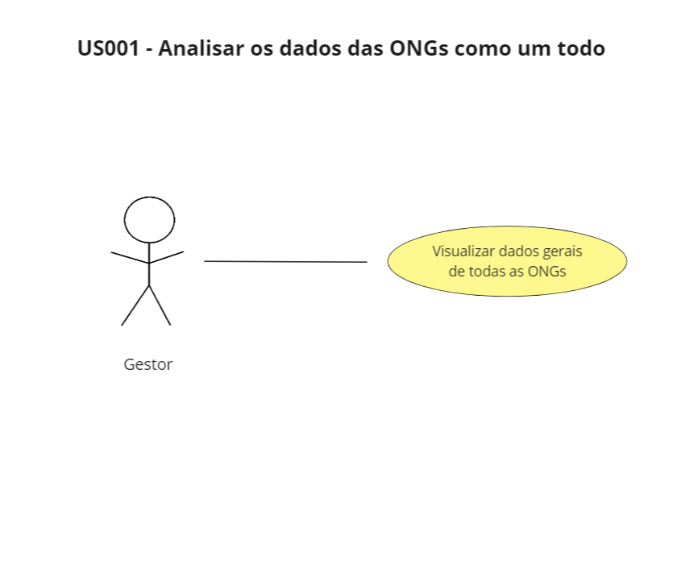
  <sup>Fonte: Os autores (2024)</sup>
</div>

<br>
<hr>
<br>

<div align="center">
  <sub>Quadro X - User Stories 2</sub>
  <table>
    <tr>
      <th><strong>Número</strong></th>
      <td>US002</td>
    </tr>
    <tr>
      <th><strong>Título</strong></th>
      <td>Analisar os dados de ONGs específicas.</td>
    </tr>
    <tr>
      <th><strong>Persona</strong></th>
      <td>Priscila Amaya, gestora da Gerando Falcões.</td>
    </tr>
    <tr>
      <th><strong>Requisito funcional relacionado</strong></th>
      <td>RF-003: Visualizar detalhadamente cada ONG, cada oficina e seus alunos</td>
    </tr>
    <tr>
      <th><strong>História</strong></th>
      <td>Como gestora da Gerando Falcões, desejo visualizar as informações detalhadas de uma ONG específica para acompanhar seu desempenho.</td>
    </tr>
    <tr>
      <th><strong>Critério de aceitação</strong></th>
      <td>Quando uma ONG específica é selecionada, o sistema deve fornecer aos gestores um acesso detalhado às suas informações e métricas.</td>
    </tr>
    <tr>
      <th><strong>Prioridade</strong></th>
      <td>Alta.</td>
    </tr>
  </table>
  <sup>Fonte: Os autores (2024)</sup>
</div>

<br>

<div align="center">
  <sub>Imagem X - Caso de uso 2</sub>
  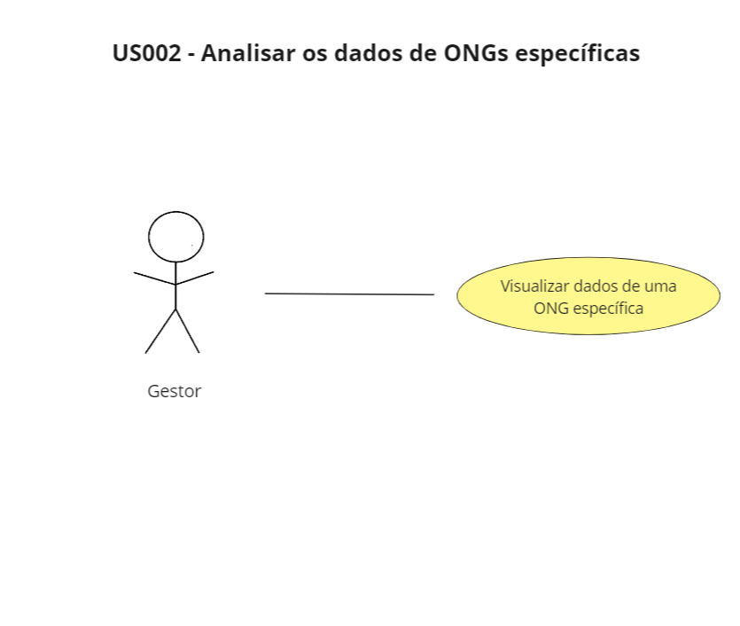
  <sup>Fonte: Os autores (2024)</sup>
</div>

<br>
<hr>
<br>

<div align="center">
  <sub>Quadro X - User Stories 3</sub>
  <table>
    <tr>
      <th><strong>Número</strong></th>
      <td>US003</td>
    </tr>
    <tr>
      <th><strong>Título</strong></th>
      <td>Filtrar e procurar por ONGs.</td>
    </tr>
    <tr>
      <th><strong>Persona</strong></th>
      <td>Priscila Amaya, gestora da Gerando Falcões.</td>
    </tr>
    <tr>
      <th><strong>Requisito funcional relacionado</strong></th>
      <td>RF-021: Selecionar estado e cidade
      <br>RF-022: Filtrar as ONGs</td>
    </tr>
    <tr>
      <th><strong>História</strong></th>
      <td>Como gestora da Gerando Falcões, quero ter a capacidade de procurar por ONGs pelo nome ou localização (estado ou cidade), permitindo-me localizar a ONG desejada.</td>
    </tr>
    <tr>
      <th><strong>Critério de aceitação</strong></th>
      <td>O sistema deve disponibilizar funcionalidades de procura por ONGs, incluindo a capacidade de filtrar por localização, como estado e cidade, permitindo uma pesquisa mais direcionada.</td>
    </tr>
    <tr>
      <th><strong>Prioridade</strong></th>
      <td>Média.</td>
    </tr>
  </table>
  <sup>Fonte: Os autores (2024)</sup>
</div>

<br>

<div align="center">
  <sub>Imagem X - Caso de uso 3</sub>
  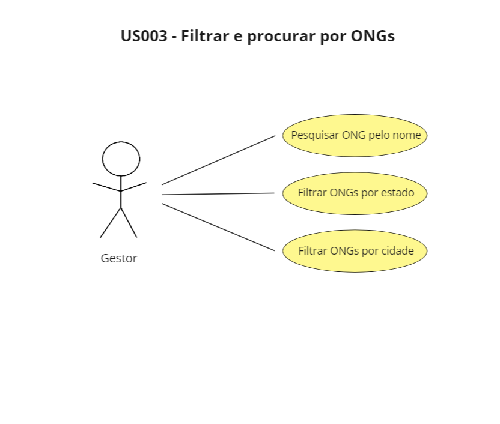
  <sup>Fonte: Os autores (2024)</sup>
</div>

<br>
<hr>
<br>

<div align="center">
  <sub>Quadro X - User Stories 4</sub>
  <table>
    <tr>
      <th><strong>Número</strong></th>
      <td>US004</td>
    </tr>
    <tr>
      <th><strong>Título</strong></th>
      <td>Editar informações de uma ONG.</td>
    </tr>
    <tr>
      <th><strong>Persona</strong></th>
      <td>Priscila Amaya, gestora da Gerando Falcões.</td>
    </tr>
    <tr>
      <th><strong>Requisito funcional relacionado</strong></th>
      <td>RF-002: Editar/arquivar ONGs</td>
    </tr>
    <tr>
      <th><strong>História</strong></th>
      <td>Como gestora da Gerando Falcões, quero ter a capacidade de atualizar as informações de uma ONG específica, garantindo assim que os dados continuem sendo coerentes com as atividades da ONG.</td>
    </tr>
    <tr>
      <th><strong>Critério de aceitação</strong></th>
      <td>A plataforma deve permitir ao gestor editar as informações das ONGs já criadas.</td>
    </tr>
    <tr>
      <th><strong>Prioridade</strong></th>
      <td>Média.</td>
    </tr>
  </table>
  <sup>Fonte: Os autores (2024)</sup>
</div>

<br>

<div align="center">
  <sub>Imagem X - Caso de uso 4</sub>
  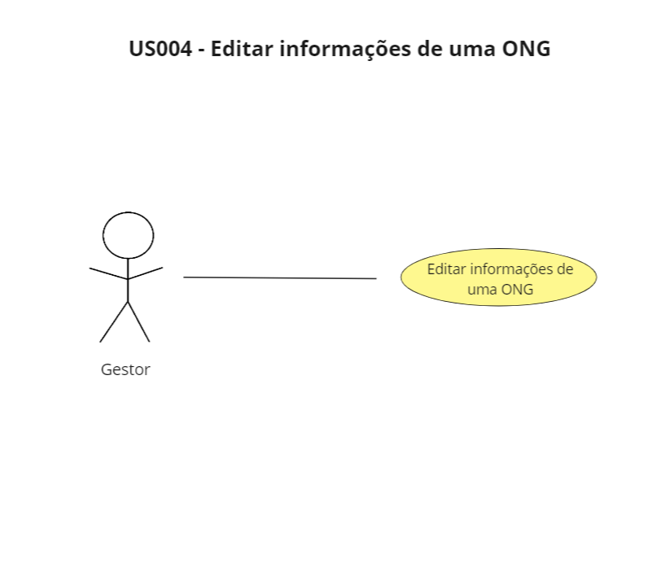
  <sup>Fonte: Os autores (2024)</sup>
</div>

<br>
<hr>
<br>

<div align="center">
  <sub>Quadro X - User Stories 5</sub>
  <table>
    <tr>
      <th><strong>Número</strong></th>
      <td>US005</td>
    </tr>
    <tr>
      <th><strong>Título</strong></th>
      <td>Cadastro de perfis na plataforma</td>
    </tr>
    <tr>
      <th><strong>Persona</strong></th>
      <td>José Tiago, fundador e líder de ONG</td>
    </tr>
    <tr>
      <th><strong>Requisito funcional relacionado</strong></th>
      <td>RF-005:
Cadastrar/editar/arquivar professores <br>RF-006: 
Cadastrar/editar/arquivar alunos</td>
    </tr>
    <tr>
      <th><strong>História</strong></th>
      <td>Como líder de ONG, eu quero poder cadastrar novos alunos e professores para que eu consiga manter um controle de todos que estão na minha organização</td>
    </tr>
    <tr>
      <th><strong>Critério de aceitação</strong></th>
      <td>O sistema apresenta a funcionalidade “Cadastrar alunos” e “Cadastrar professores”</td>
    </tr>
    <tr>
      <th><strong>Prioridade</strong></th>
      <td>Alta</td>
    </tr>
  </table>
  <sup>Fonte: Os autores (2024)</sup>
</div>

<br>

<div align="center">
  <sub>Imagem X - Caso de uso 5</sub>
  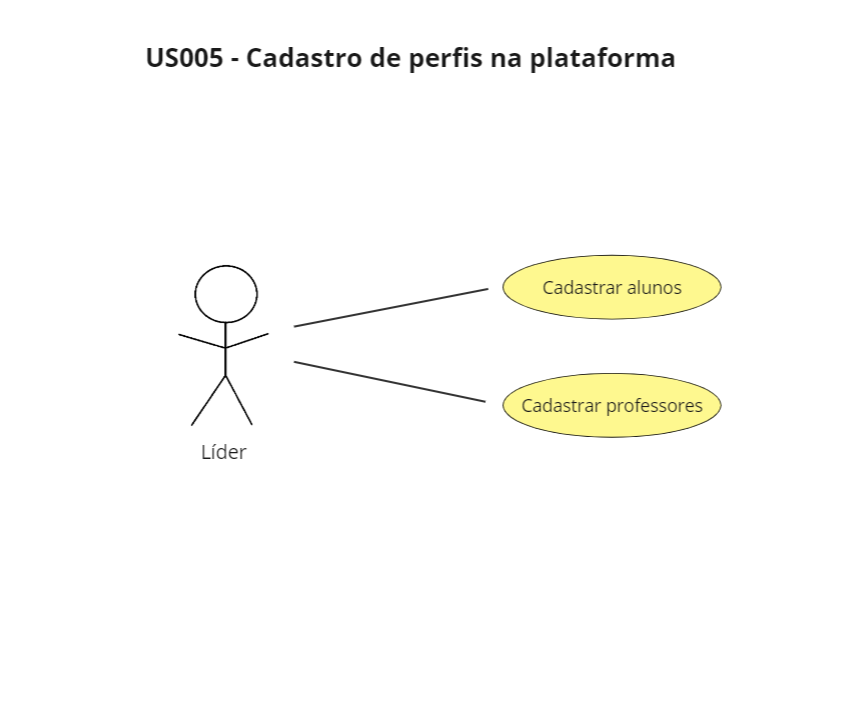
  <sup>Fonte: Os autores (2024)</sup>
</div>

<br>
<hr>
<br>

<div align="center">
  <sub>Quadro X - User Stories 6</sub>
  <table>
    <tr>
      <th><strong>Número</strong></th>
      <td>US006</td>
    </tr>
    <tr>
      <th><strong>Título</strong></th>
      <td>Criação de oficinas</td>
    </tr>
    <tr>
      <th><strong>Persona</strong></th>
      <td>José Tiago, fundador e líder de ONG</td>
    </tr>
    <tr>
      <th><strong>Requisito funcional relacionado</strong></th>
      <td>RF-007:
Criar/editar/arquivar oficinas</td>
    </tr>
    <tr>
      <th><strong>História</strong></th>
      <td>Como líder de ONG, eu quero poder criar novas oficinas e adicionar alunos e professores responsáveis nela para que haja um controle de atividades na ONG.</td>
    </tr>
    <tr>
      <th><strong>Critério de aceitação</strong></th>
      <td>O sistema apresenta a funcionalidade “Adicionar oficina” e a personalização de pessoas inseridas dentro dela.</td>
    </tr>
    <tr>
      <th><strong>Prioridade</strong></th>
      <td>Alta</td>
    </tr>
  </table>
  <sup>Fonte: Os autores (2024)</sup>
</div>

<br>

<div align="center">
  <sub>Imagem X - Caso de uso 6</sub>
  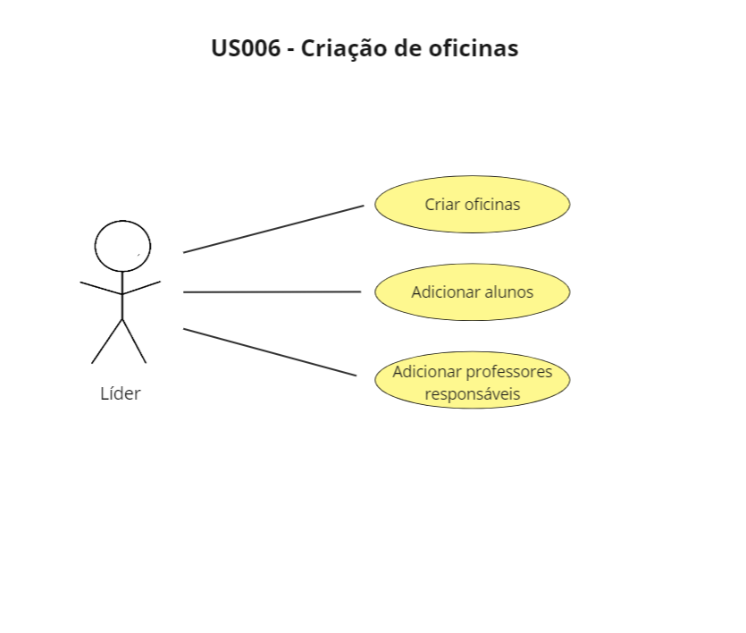
  <sup>Fonte: Os autores (2024)</sup>
</div>

<br>
<hr>
<br>

<div align="center">
  <sub>Quadro X - User Stories 7</sub>
  <table>
    <tr>
      <th><strong>Número</strong></th>
      <td>US007</td>
    </tr>
    <tr>
      <th><strong>Título</strong></th>
      <td>Visualização de dados das oficinas</td>
    </tr>
    <tr>
      <th><strong>Persona</strong></th>
      <td>José Tiago, fundador e líder de ONG</td>
    </tr>
    <tr>
      <th><strong>Requisito funcional relacionado</strong></th>
      <td>RF-009: Visualizar histórico de alunos, turmas, oficinas | RF-010: Visualização de dados gerais e detalhados da própria ONG </td>
    </tr>
    <tr>
      <th><strong>História</strong></th>
      <td>Como líder de ONG, eu quero poder ver dados da execução da oficina em dashboard para que eu possa ter insights sobre os projetos de forma simplificada.</td>
    </tr>
    <tr>
      <th><strong>Critério de aceitação</strong></th>
      <td>O sistema apresenta um dashboard personalizado para líderes de ONGs.</td>
    </tr>
    <tr>
      <th><strong>Prioridade</strong></th>
      <td>Média</td>
    </tr>
  </table>
  <sup>Fonte: Os autores (2024)</sup>
</div>

<br>

<div align="center">
  <sub>Imagem X - Caso de uso 7</sub>
  
  <sup>Fonte: Os autores (2024)</sup>
</div>

<br>
<hr>
<br>

<div align="center">
  <sub>Quadro X - User Stories 8</sub>
  <table>
    <tr>
      <th><strong>Número</strong></th>
      <td>US008</td>
    </tr>
    <tr>
      <th><strong>Título</strong></th>
      <td>Gestão de presença em aulas</td>
    </tr>
    <tr>
      <th><strong>Persona</strong></th>
      <td>Matheus Rocha, professor de matemática</td>
    </tr>
    <tr>
      <th><strong>Requisito funcional relacionado</strong></th>
      <td>RF-013: Controlar frequência dos alunos de cada oficina</td>
    </tr>
    <tr>
      <th><strong>História</strong></th>
      <td>Como um professor, eu quero poder dar presença aos alunos da oficina para que haja uma gestão de frequência dentro da ONG</td>
    </tr>
    <tr>
      <th><strong>Critério de aceitação</strong></th>
      <td>O sistema apresenta uma lista de presença dentro das oficinas e a opção de marcar presença para cada aluno</td>
    </tr>
    <tr>
      <th><strong>Prioridade</strong></th>
      <td>Alta</td>
    </tr>
  </table>
  <sup>Fonte: Os autores (2024)</sup>
</div>

<br>

<div align="center">
  <sub>Imagem X - Caso de uso 8</sub>
  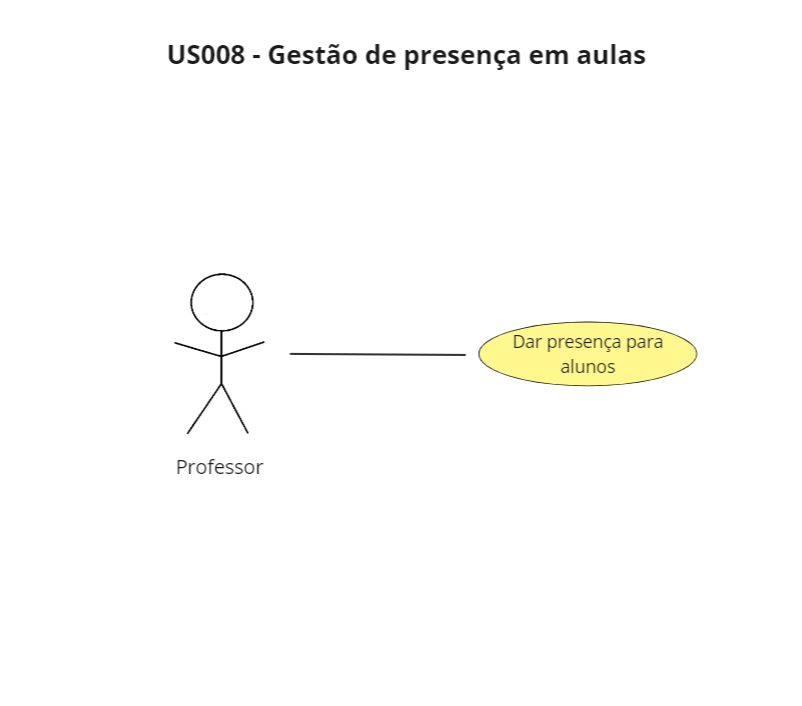
  <sup>Fonte: Os autores (2024)</sup>
</div>

<br>
<hr>
<br>

<div align="center">
  <sub>Quadro X - User Stories 9</sub>
  <table>
    <tr>
      <th><strong>Número</strong></th>
      <td>US009</td>
    </tr>
    <tr>
      <th><strong>Título</strong></th>
      <td>Lidar com dados de forma offline</td>
    </tr>
    <tr>
      <th><strong>Persona</strong></th>
      <td>Matheus Rocha, professor de matemática</td>
    </tr>
    <tr>
      <th><strong>Requisito funcional relacionado</strong></th>
      <td>RF-030: Envio dos dados de chamada após a aplicação reconectar com a internet 
</td>
    </tr>
    <tr>
      <th><strong>História</strong></th>
      <td>Como um professor, eu quero conseguir enviar as presenças de forma offline para que não haja perda de informação em caso de falha de internet</td>
    </tr>
    <tr>
      <th><strong>Critério de aceitação</strong></th>
      <td>O sistema armazena os dados inseridos localmente e envia para o servidor de forma assíncrona quando tiver internet estável</td>
    </tr>
    <tr>
      <th><strong>Prioridade</strong></th>
      <td>Baixa</td>
    </tr>
  </table>
  <sup>Fonte: Os autores (2024)</sup>
</div>

<br>

<div align="center">
  <sub>Imagem X - Caso de uso 9</sub>
  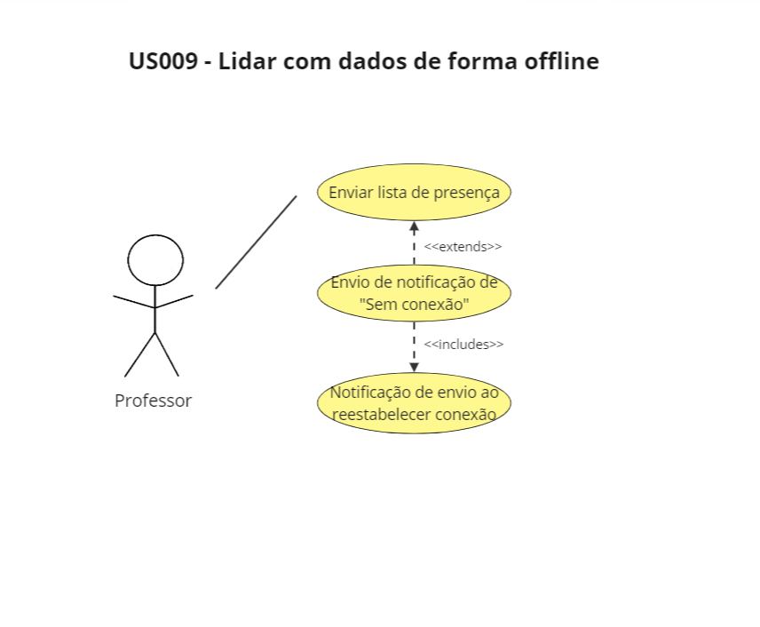
  <sup>Fonte: Os autores (2024)</sup>
</div>

<br>
<hr>
<br>

&emsp;Nesse viés, a relação entre os diagramas de caso de uso e as histórias de usuário se dá pela complementaridade entre ambos. Isso porque, enquanto os diagramas oferecem um panorama visual das interações entre os usuários e o sistema, as histórias de usuário detalham essas interações em termos de requisitos específicos e o valor que elas conseguem trazer tanto para o cliente quanto para o usuário final. Ademais, essas são duas ferramentas bastante utilizadas no planejamento de desenvolvimento de software ao permitir uma visualização mais direta do escopo do sistema.

# 6. Projeto de Solução

&emsp; Neste tópico serão abordados diagramas que auxiliam na compreensão macro do projeto que está sendo desenvolvido para a Gerando Falcões, de modo que qualquer stakeholder envolvido neste projeto, consiga compreender os detalhes do sistema.

## 6.1 Diagrama de Classes

<conteúdo>

### 6.1.1 Diagrama de Classes de Domínio

&emsp; O diagrama de classe de domínio, de acordo com Bezerra e Bandeira [28], é uma representação gráfica das entidades relevantes para um sistema de software específicos e as suas inter-relações. Este tipo de diagrama é um aspecto crucial de modelagem orientada a objetos e é amplamente uitlizado em Engenharia de Software para visualizar a estrutura do sistema que está sendo desenvolvido.

&emsp;Nesse sentido, a importância desse diagrama para um projeto reside no seu papel fundamental de comunicar a estrutura e o design do sistema de forma clara e padronizada. Ele auxilia na compreensão das responsabilidades das classes e como elas interagem para realizar as funcionalidades do sistema. O diagrama de classe de domínio ajuda a identificar e organizar os componentes do sistema antes da implementação do código, o que pode economizar tempo e recursos ao evitar mal-entendidos e refatorações significativas no futuro. Portanto, a imagem abaixo evidencia o diagrama de classes de domínio do projeto que está sendo desenvolvido para a Gerando Falcões.

<div align="center">
  <sub>Imagem X - Diagrama de Classes de Domínio</sub>
  
  <sup>Fonte: Os autores (2024)</sup>
</div>

&emsp;Analisando o conteúdo da imagem acima, é possíve notar quatro entidades principais que estão envolvidas na problemática pautada pela Gerando Falcões: ONG,Oficina, Aluno, Professor e Turmas. Sendo assim, é importante analisar qual a importância de cada uma dessas entidades para a problemática e o que elas representam dentro do diagrama desenvolvido:

- **ONG:** Esta entidade representa a organização não governamental que fazem parte da rede de ONG's da Gerando Falcões. Assim, tal entidade possui atributos importantes para definir uma ONG, como nome, endereço, email, CNPJ e listas gerais para oficinas e professores relacionados a ONG específica. Portanto, esta entidade é responsável por gerenciar múltiplas oficinas e professores, além de conter dados básicos.
- **Oficina:** Esta entidade representa as atividades que são oferecidas pela ONG. Sendo assim, ela possui alguns atributos como nome, duração, descrição, turmas que pertencem a ela e categoria, que indica a natureza das atividades de tal oficina. Logo, esta entidade é importante para se ter noção de quais atividades estão sendo oferecidas por uma determinada ONG, algo necessário para a GF analisar o impacto de uma ONG.
- **Aluno:** Esta entidade representa as pessoas que participam das oficinas oferecidas por uma ONG. Assim, ela possui alguns atributos como nome completo, data de nascimento, gênero, estado civil, etnia, contato e endereço. Nesse viés, tal entidade é essencial para gerenciar quem está recebendo educação/treinamento de uma determinada ONG a partir de uma certa oficina.
- **Professor:** Esta entidade representa as pessoas que serão responsáveis por ministrar as atividades de uma oficina. Assim, os seus atributos são similares aos atributos da entidade Aluno, algo importante, tanto para a ONG quanto para a GF, uma vez que é possível ter um perfil geral das pessoas que ministram as atividades da ONG.
- **Turmas:** Esta entidade representa as turmas que uma determinada oficina pode ter, haja vista que, dentro de uma ONG, uma oficina pode atender uma quantidade grande de alunos, sendo necessária uma organização mais divisória dos participantes. Nesse sentido, tal entidade possui alguns atributos importantes como nome, a oficina em que ela está relacionada, os alunos que estão cadastrados e o professor responsável por ministrar as aulas.

&emsp;Além das entidades, é importante destacar a ligação entre cada uma delas:

- Uma ONG pode ter várias oficinas;
- Uma oficina só pode estar relacionada com uma ONG e pode ter várias turmas.
- Uma turma só pode estar relacionada com uma oficina e pode ter um ou mais alunos e professores;
- Cada aluno pode estar relacionado com várias turmas;
- Cada professor pode estar relacionado com várias turmas.

&emsp;Portanto, o diagrama de classe de domínio fornecido oferece uma visão clara das entidades envolvidas no sistema que está sendo desenvolvido para a GF e suas relações. Os atributos escolhidos para cada entidade são relevantes para a gestão da rede ONG's da GF e as associações entre as entidades sugerem um fluxo de informações e operações bem definido. Este diagrama é um passo crucial no desenvolvimento de um sistema eficiente que atenda às necessidades tanto da ONG quanto de seus beneficiários, possibilitando uma implementação de software mais organizada e eficiente.

### 6.1.2 Diagrama de Classes de Implementação

&emsp;O Diagrama de Classes de Implementação é uma representação gráfica das classes e interfaces que compõem um sistema, bem como o relacionamento entre elas [29]. É válido ressaltar que tal diagrama também faz parte da UML.

&emsp;Nesse sentido, a importância desse diagrama para um projeto é significativa, pois ele ajuda a equipe de desenvolvimento a entender como o sistema será construído. Para o código backend, especificamente, ele é crucial porque define a estrutura lógica do sistema, representando entidades, seus atributos, métodos e as relações entre elas, como associações, heranças e dependências. Isso facilita o planejamento, a manutenção e a expansão do código. Assim, abaixo há tal diagrama desenvolvido para o projeto atual.

<div align="center">
  <sub>Imagem X - Diagrama de Classes de Implementação</sub>
  
  <sup>Fonte: Os autores (2024)</sup>
</div>

&emsp;De acordo com a imagem acima, o diagrama inclui alguns elementos que fazem parte do backend desenvolvido divido em seções, de modo a facilitar o entendimento. Assim, cada seção será detalhada a seguir:

- **Listagem de Oficinas:** Esta seção está focada nas funcionalidades de cadastro e listagem das oficinas do sistema. Para isso, o backend do projeto precisa de um módulo específico para isso, haja vista que a tecnologia utilizada exige esse arquivo. Esse módulo sempre se comunica com um controller, então, é necessária a presença de um controller para esta entidade, o qual irá se comunicar com os serviços relacionados à oficinas (workshop), os quais, por sua vez, se comunicam com a entidade de oficina.
- **Listagem de ONGs:** Esta seção está focada na funcionalidade de listagem das ONGs. Para isso, o backend do projeto precisa de um módulo específico que irá se comunicar com um controller para contatar os serviços relacionados às ONGs, os quais, por sua vez, se comunicam com a entidade de ONG.
- **Listagem e Cadastro de Professores:** Esta seção está focana na funcionalidade de cadastro e listagem de professores. Para isso, o backend do projeto precisa de um módulo específico, além de um controller para se comunicar com os serviços relacionados aos professores, os quais, por sua vez, se comunicam tanto com a entidade do professor quanto com o DTO (objeto que simplifica a entidade original) do professor. Vale ressaltar que o DTO é importante para que o usuário insira, ao cadastrar um professor, somente os dados que fazem sentido para ele, ou seja, o usuário não precisará colocar o ID do professor, haja vista que o DTO já irá fornecer somente os dados que o usuário precisa ter contato.
- **Cadastro de Alunos:** Esta seção está focada na funcionalidade de cadastrar alunos. Para isso, o backend do projeto precisa de um módulo específico para isso, além de um controller para se comunicar com os serviços relacionados ao aluno, os quais, por sua vez, se comunicam tanto com a entidade de aluno quanto o DTO de aluno.
- **Listagem de Categoria:** Esta seção está focada na funcionalidade de listar as categorias existentes das oficinas de uma ONG. Para isso, o backend do projeto precisa de um módulo específico para isso, o qual irá se comunicar com um controller, o qual contata os serviços relacionados à categoria que, por sua vez, se comunicam com a entidade de categoria.
- **Armazenamento de turmas:** Esta seção é extremamente simples, haja vista que não há uma funcionalidade específica. Sendo assim, nela só há a entidade de turma, uma vez que, no backend do projeto, é necessário um molde de dados que representa uma turma. A partir desse molde de dados da turma, que é a sua entidade, é possível que outras partes do backend a utilize, como, por exemplo, a entidade de oficina (workshop) que a utiliza para armazenar dados relacionados à turma de uma oficina.

&emsp;Sobre mais detalhes do diagrama de classe de implementação, cada classe no diagrama inclui atributos e métodos, que são fundamentais para a implementação das funcionalidades do sistema. As linhas que conectam as classes indicam os tipos de relações, como herança (uma seta com linha sólida) ou associação (uma linha com um losango na ponta).

&emsp;Portanto, este diagrama é uma ferramenta essencial para o desenvolvimento e a compreensão do projeto em questão. Ele proporciona uma visão clara da arquitetura do sistema, o que é crítico para a construção de um backend robusto e escalável. Além disso, ele serve como um guia para os desenvolvedores durante o processo de codificação e pode ser usado para comunicar a estrutura do sistema a novos membros da equipe ou partes interessadas externas. Por fim, a sua existência indica uma abordagem metódica e profissional para o desenvolvimento de software, o que é um indicativo de qualidade e seriedade no projeto da Gerando Falcões.

## 6.2 Diagrama de Componentes da Arquitetura

<conteúdo>

## 6.3 Diagrama de Implantação

&emsp;Um diagrama de implantação, no contexto da computação em nuvem, é uma representação gráfica que ilustra como os diversos componentes de um sistema são distribuídos e executados dentro da infraestrutura de nuvem.<sup>[\[11\]](#referências)</sup>

&emsp;Cada elemento no diagrama é representado para refletir sua função e relação com outros elementos do sistema. Os nós (nodes) geralmente representam os recursos físicos ou virtuais disponíveis na nuvem, enquanto os artefatos representam os diversos módulos, aplicativos ou serviços que compõem o sistema. A conexão entre esses elementos é representada por meio de redes, indicando como funciona o fluxo de dados entre eles.

<div align="center">
  <sub>Imagem X - Diagrama de implantação</sub>
  
  <sup>Fonte: Os autores (2024)</sup>
</div>

### Amazon EC2

&emsp;O Amazon Elastic Compute Cloud (Amazon EC2) é um serviço da web que disponibiliza capacidade computacional segura e redimensionável na nuvem. O EC2 oferece muitas opções que permitem criar e executar praticamente qualquer aplicação. Com essas possibilidades, começar a usar o EC2 é rápido e fácil. Esta página fornece os recursos para você começar com as instâncias EC2.<sup>[\[12\]](#referências)</sup>

&emsp;Através do EC2, é possível provisionar e dimensionar servidores virtualizados conforme necessário, ajustando recursos como capacidade de CPU, memória, armazenamento e rede de acordo com os requisitos específicos e necessidades do usuário. Isso permite que as organizações implementem e gerenciem facilmente aplicativos e serviços sem se preocupar com a infraestrutura física subjacente.

&emsp;Hospedar o backend e frontend em instâncias EC2 oferece à equipe uma série de vantagens e benefícios significativos. Entre eles, a flexibilidade é uma característica crucial das instâncias EC2. As organizações podem dimensionar sua capacidade de acordo com as demandas de tráfego ou mudanças nas cargas de trabalho.

&emsp;Além disso, possibilita a integração perfeita com outros serviços da AWS. Ao utilizar instâncias EC2, as empresas podem facilmente integrar seu backend com uma variedade de serviços, como Relational Database Storage (RDS), Simple Storage Service (S3) e outros, permitindo construir uma infraestrutura completa e altamente escalável.

#### HTTPS

&emsp;A comunicação entre o frontend e o backend será realizada pelo HTTPS. O Hypertext Transfer Protocol Secure é uma extensão do protocolo HTTP que utiliza criptografia SSL/TLS para garantir a segurança da comunicação entre um cliente (como um navegador web) e um servidor web. Ele protege os dados durante a transmissão, evitando que sejam interceptados ou alterados por terceiros mal-intencionados.

&emsp;Quando o frontend precisa se comunicar com um backend, como o servidor web hospedado em uma instância EC2, o HTTPS é comumente utilizado para garantir a segurança da comunicação. Isso é especialmente importante ao lidar com dados sensíveis, como informações de login, detalhes do cartão de crédito, entre outros.

&emsp;Ademais, é válido ressaltar que a EC2 de backend interage com serviços fundamentais da AWS para armazenamento e gerenciamento dos dados, sendo: Amazon S3 e Amazon RDS.

### Amazon S3

&emsp;O Amazon Simple Storage Service (S3) é utilizado pelo backend, neste projeto, para realizar o armazenamento de itens que o banco de dados não suporta diretamente, sendo imagens de alunos, por exemplo. A EC2 do backend se comunica com o S3 por meio do protocolo TCP/IP, o qual facilita as operações de upload, download e listagem dessas imagens que estarão dentro dos buckets do S3. É válido ressaltar que no diagrama não foi exposto um artefato específico dentro do S3, haja vista que as decisões de armazenamento de dados serão realizadas na sprint seguinte.

#### TCP/IP

&emsp;O Protocolo de Controle de Transmissão/Protocolo de Internet (TCP/IP) é o conjunto de protocolos de comunicação que sustenta a Internet e muitas redes locais. Ele fornece uma estrutura para transmitir dados entre dispositivos em uma rede de forma eficiente e confiável.

&emsp;O TCP/IP fornece uma base robusta para a comunicação de rede, permitindo que dispositivos de diferentes fabricantes e sistemas operacionais se comuniquem entre si de forma eficiente e confiável. É por isso que se tornou o padrão predominante para redes de computadores, incluindo a Internet.

### Amazon RDS

&emsp;A EC2 que contém o backend também se conecta ao Amazon Relational Database Service (RDS), o qual estará configurado para utilizar o PostgreSQL. Dessa forma, a EC2 em questão se comunica com o RDS por meio do protocolo TCP/IP, de modo a permitir que o backend realize operações de banco de dados de maneira mais confiável.

&emsp;Portanto, por meio desses dois serviços disponibilizados pela AWS, é possível visualizar que o backend possui uma forte integração com tais serviços, de modo que o sistema seja coeso, com suporte à gestão de dados estáticos e operações de banco de dados.

## 6.4 Tecnologias e Ferramentas

<conteúdo>

# 7. Interface

&emsp; Neste tópico será abordada um estudo sobre Design System e o quanto ele pode ser aplicado ao projeto desenvolvido. Além disso, será apresentado os wireframes do projeto e um detalhamento sobre o front-end.

## 7.1 Design System

&emsp;De acordo com Souza<sup>[\[24\]](#referências)</sup>, o Design System (DS) é um documento que contém vários componentes reutilizáveis, padronizados e organizados para um determinado produto digital de uma organização. O seu propósito principal é manter a consistência visual e funcional de um produto digital, de modo a tornar a interação do usuário mais agradável e uniforme, além de facilitar a construção desses produtos digitais<sup>[\[25\]](#referências)</sup>. Desse modo, a sua importância se dá devido à possibilidade de acelerar o desenvolvimento de um produto, reduzir possíveis erros, aumentar a colaboração entre os times de design e de desenvolvimento e, principalmente, melhorar a experiência do usuário<sup>[\[24\]](#referências)</sup>.

&emsp;Nesse sentido, o projeto desenvolvido para a Gerando Falcões irá seguir o Design System da ONG, definido pelo Ant Design (https://ant.design/components/overview). Assim, o que a GF fez foi pegar os componentes do Ant Design como base para definir os seus próprios componentes conforme o manual da marca, de modo a criar plataformas padronizadas e compatíveis com as diretrizes da GF. Sendo assim, abaixo terá explicações de como realizaremos a aplicação desses dois designs systems, Ant Design e da Gerando Falcões, no projeto desenvolvido.

**Grid:** O sistema de grid é um componente essencial para o Design System, pois ele fornece uma estrutura para o layout e a organização dos elementos na interface do usuário.
Nesse sentido, após analisar o Ant Design, que utiliza o sistema de grid em 24 colunas, e o Design System da GF, que utiliza o sistema de grid em 12 colunas, o grupo optou por seguir o grid de 12 colunas, seguindo o guia de estilos da GF. A escolha se baseou nos seguintes aspectos:

- Flexibilidade e Organização: O grid de 12 colunas oferece uma maior flexibilidade de organização dos elementos na interface. Ademais, essa flexibilidade é fundamental para criar designs responsivos que se adaptem harmoniosamente a diversos dispositivos e tamanhos de tela.
- Elementos maiores: O grid de 12 colunas permite a criação de elementos visuais maiores e com mais espaçamento entre eles, proporcionando uma experiência do usuário mais leve, intuitiva e acessível.
- Estética mais limpa: O grid de 12 colunas, por meio de elementos maiores e da sua flexibilidade e organização, possibilita a criação de interfaces com uma estética mais limpa e organizada, visto que os elementos terão mais espaços entre si e tamanhos adequados.
- Consistência com o Design System da Gerando Falcões: Esta escolha faz com que a estética do projeto esteja diretamente conectada com as diretrizes do Design System da GF, garantindo uma coesão visual e estrutural com outros produtos digitais da organização, reforçando a identidade de marca e facilitando a interoperabilidade entre projetos.

&emsp;Sendo assim, as imagens abaixo demonstra a diferença entre o grid de 24 colunas proposto pelo Ant Design e o grid de 12 colunas proposto pelo guia de estilos da GF.

<div align="center">
   <sub>Figura XX - Demonstração de Grid de 12 colunas do guia de estilos da GF</sub>

   

<sub>Fonte: Autoria própria</sub>

</div>

<div align="center">
   <sub>Figura XX - Demonstração do Grid de 24 colunas do Ant Design</sub>

   
    <sub>Fonte: Autoria própria</sub>
</div>

**Paleta de Cores:** A seleção da paleta de cores é fundamental no design de um projeto, uma vez que ela desempenha um papel crucial em transmitir os valores e a identidade visual da marca Gerando Falcões. Sendo assim, a estratégia do grupo para definir as cores que irão compor a paleta é uma abordagem híbrida, que aproveita tanto as cores oferecidas pelo Ant Design quanto aquelas especificadas pelo Design System da Gerando falcões. Sendo assim, abaixo será destacado quais categorias de cores terá na paleta de cores da aplicação, com base no Ant Design e no guia de estilos da Gerando Falcões:

- Cores neutras: As cores neutras são cruciais para a interface ao fornecer uma base sólida que contrasta e complementa as cores mais vibrantes. Assim, a escolha de cores neutras visa não apenas estabelecer uma hierarquia visual clara, mas também garantir que a interface seja intuitiva e acolhedora para os usuários. Sendo assim, essa categoria de cores será utilizada para conteúdos textuais, cor de fundo de elementos, borda de elementos principais, como inputs, entre outros.
- Cores de alerta: As cores de alerta são essenciais para comunicar visualmente para o usuário se alguma ação está correta, parcialmente correta ou incorreta, fazendo com que o usuário seja orientado durante a sua interação com a aplicação. Isso faz com que eles se sintam mais seguros e confiáveis ao utilizar a aplicação, algo eficaz para o público-alvo do projeto. Nesse sentido, essa categoria de cores será utilizada em mensagens de sucesso/erro, validação de dados, entre outras interações importantes.
- Cores da GF: As cores primárias, secundárias e terciárias definidas pelo Design System da Gerando Falcões enriquecem visualmente o projeto, garantindo o alinhamento com a identidade visual da marca. Nesse sentido, essas cores serão utilizadas estrategicamente para dar vida à interface, com elementos mais coloridos e efeitos mais vibrantes, promovendo uma experiência de usuário mais engajadora. Sendo assim, essas cores fazem com que o projeto permaneça fiel à estética e aos valores da GF.

&emsp;Sendo assim, as imagens abaixo irão demonstrar exemplos de cada uma das categorias de cores citadas anteriormente.

<div align="center">
   <sub>Figura XX - Demonstração de exemplo da categoria de cores neutras, seguindo sugestão do Ant Design</sub>
   
   <sub>Fonte: Autoria própria</sub>
</div>

<div align="center">
   <sub>Figura XX - Demonstração de exemplo da categoria de cores de alerta, seguindo sugestão do Ant Design</sub>
   
   <sub>Fonte: Autoria própria</sub>
</div>

<div align="center">
   <sub>Figura XX - Demonstração de exemplo da categoria de cores da GF, seguindo o seu guia de estilos</sub> <br>
    <br>
   <sub>Fonte: Autoria própria</sub>
</div>

**Tipografia:** A escolha da tipografia desempenha um papel fundamental para a experiência do usuário e na comunicação da identidade visual da marca Gerando Falcões. Nesse sentido, neste projeto serão seguidas estritamente as orientações estabelecidas pelo Design System da Gerando Falcões, de modo a adotar a família de fontes sans-serif, que inclui fontes como Roboto e Open Sans. Porém, vale destacar que as orientações de utilização destacadas no Ant Design, como o tamanho básico da fonte, serão seguidas, para ter uma consistência na interface do usuário. Sendo assim, abaixo há outras motivações para esta escolha:

- Legibilidade: As fontes da família sans-serif são reconhecidas pela sua facilidade de leitura, haja vista que as letras possuem uma simplicidade que facilita a leitura em diferentes resoluções e tamanhos de telas. Isso faz com que as informações sejam rapidamente absorvidas pelo usuário, independente do seu dispositivo, algo essencial para o público-alvo deste projeto.
- Alinhamento com a identidade da marca: A escolha de seguir com a família sans-serif, algo definido pelo guia de estilos Gerando Falcões, reflete o compromisso do grupo de manter a coesão com a identidade visual da marca e o projeto desenvolvido.

**Iconografia:** A iconografia desempenha um papel crucial na comunicação visual da Gerando Falcões, pois oferece uma maneira eficaz de transmitir informações e funcionalidades de forma rápida e intuitiva. Portanto, na aplicação será adotada uma abordagem que combine ícones do Ant Design com ícones personalizados, seguindo o guia de estilos da Gerando Falcões. A seguir, detalhamos os principais pontos desta abordagem:

- Seleção de ícones do Ant Design: Serão utilizados ícones do Ant Design para elementos comuns e amplamente reconhecidos, como ícones de menu, botões de ação e indicadores de status. Esses ícones proporcionam uma experiência familiar aos usuários e garantem consistência visual dentro do produto digital.
- Coerência visual e temática: Deve ser garantido que tanto os ícones do Ant Design quanto os possíveis ícones personalizados da Gerando Falcões estejam alinhados visualmente e sigam uma temática coesa. Isso inclui manter consistência no estilo de design, proporções e paleta de cores, de modo a criar uma experiência de usuário integrada e harmoniosa.

<div align="center">
   <sub>Figura XX - Exemplo dos ícones a serem utilizados no projeto.</sub>

   
   
   <sub>Fonte: Autoria própria</sub>
</div>

**Ilustrações:** As ilustrações de uma aplicação desempenham um papel importante na criação de uma experiência de usuário envolvente e memorável, adicionando personalidade e contexto visual ao produto digital. Para este projeto, o grupo optou por utilizar as ilustrações já existentes dentro do guia de estilos da Gerando Falcões.

A padronização das ilustrações é importante pois estas são desenvolvidas de acordo com as diretrizes de design da marca, incorporando elementos visuais que comuniquem de forma eficaz a missão e os objetivos da organização. Isso inclui a representação de pessoas, comunidades e iniciativas sociais, de forma a transmitir a mensagem de inclusão, empoderamento e transformação social promovida pela Gerando Falcões, consequentemente, serão representados os mesmos princípios dentro da aplicação.

<div align="center">
   <sub>Figura XX - Demonstração das ilustrações utilizadas associada a seu objetivo.</sub>

   
   
   <sub>Fonte: Guia de estilos da Gerando Falcões</sub>
</div>

**Opções de acessibilidade:** A acessibilidade é um aspecto fundamental do design inclusivo, e visa garantir que todos os usuários, independentemente de suas habilidades ou limitações, possam acessar e utilizar o produto digital de forma eficaz. Para esta aplicação, o grupo poderá adotar diversas medidas para promover a acessibilidade e a usabilidade para todos os usuários, sendo elas:

- Implementação de práticas recomendadas de design acessível, como o uso de contraste adequado entre cores e o fornecimento de alternativas textuais para elementos visuais, como ícones e imagens;
- Realização de testes de usabilidade com usuários com diferentes necessidades e capacidades, a fim de identificar e corrigir quaisquer barreiras de acessibilidade que possam surgir durante o desenvolvimento da aplicação.

Isso garantirá que o produto final seja verdadeiramente inclusivo e acessível para todos os usuários.

## 7.2 Projeto de Interface (Wireframes)

<conteúdo>

&emsp; Em princípio, é válido enfatizar que um wireframe é um esboço, isto é, um rascunho simples das telas de uma aplicação web, cujo objetivo é validar a ideia da estrutura das páginas, já que não apresenta cor, fontes, ícones nem imagens. Nesse viés, essa ferramenta serve como validação de um protótipo mínimo mostrado ao cliente, de modo que seja possível alinhar as expectativas do cliente com o que será desenvolvido e auxiliar o time de design na diagramação da identidade visual do site. Portanto, com esses objetivos, foram criados esboços para cada tela da aplicação Conectando Falcões, cujas imagens, exceto as complexas, estão detalhadas abaixo. Ademais, vale destacar que elas foram formuladas pensando no fluxo de utilização mais simples possível, fazendo com que o usuário utilize, pelo menos, de dois a três cliques para acessar uma determinada funcionalidade.

<div align="center">
  <sub>Figura XX - Tela de Login - GF, ONGs e Professores (versão desktop)</sub>

  
  
  <sup>Fonte: Autoria própria</sup>

Wireframe da tela de login, na qual todos os usuários que irão utilizar o Conectando Falcões, como: membros da GF, líderes das ONGs, e professores das ONGs, vão passar por ela para serem autenticados na plataforma, e assim poderem usufruir dela.

</div>

<hr>

<div align="center">
  <sub>Figura XX - Tela inicial - GF (versão desktop)</sub>

  
  
  <sup>Fonte: Autoria própria</sup>

Tela inicial da Conectando Falcões exclusiva para usuários autenticados como membro da GF, essa tela é utilizada para dar dados gerais de todas as ONGs no ecossistema da GF

</div>

<hr>

<div align="center">
  <sub>Figura XX - Tela inicial - ONG (versão desktop)</sub>

  
  
  <sup>Fonte: Autoria própria</sup>

Tela inicial da Conectando Falcões exclusiva para usuários autenticados como líderes das ONGs, essa tela é utilizada para ver os dados da ONG em questão, para realizar os cadastros necessários, entre outras coisas.

</div>

<hr>

<div align="center">
   <sub>Figura XX - Tela inicial - Professor da ONG (versão desktop)</sub>

   
   
   <sup>Fonte: Autoria própria</sup>

Tela inicial da Conectando Falcões exclusiva para usuários autenticados como professores da ONGs, essa tela é utilizada para ver os alunos em cada oficina que o professor da aula e também para marcar presença e cadastrar alunos.

</div>

<hr>

<div align="center">
   <sub>Figura XX - Tela sobre a ONG - GF (versão desktop)</sub>

   
   
   <sup>Fonte: Autoria própria</sup>

Tela que mostra os detalhes de uma ONG presente no ecossistema da GF, essa tela é exclusiva para usuários autenticados como membro da GF

</div>

<hr>

<div align="center">
   <sub>Figura XX - Tela das oficinas - ONG (versão desktop)</sub>

   
   
   <sup>Fonte: Autoria própria</sup>

Tela que detalha todas as oficinas de uma ONG, essa tela é exclusiva para usuários autenticados como líderes das ONGs

</div>

<hr>

<div align="center">
   <sub>Figura XX - Tela de detalhes da oficina- ONG (versão desktop)</sub>

   
   
   <sup>Fonte: Autoria própria</sup>

Tela que mostra os detalhes de uma oficina em especifíco da ONG, essa tela é exclusiva para usuários autenticados como líderes das ONGs

</div>

<hr>

<div align="center">
   <sub>Figura XX - Tela de alunos por oficina - ONG (versão desktop)</sub>

   
   
   <sup>Fonte: Autoria própria</sup>

Tela que mostra os alunos de uma oficina em especifíco da ONG, essa tela é exclusiva para usuários cadastrados como líderes das ONGs

</div>

<hr>

&emsp; Outras muitas telas foram criadas, considerando todas as funcionalidades do projeto, como telas específicas para filtrar ONGs, cadastrar alunos, entre outras. Para acessar o wireframe completo das telas da aplicação web Conectando Falcões, versão desktop, basta acessar este link: https://www.figma.com/file/3jOfGRG9WPIRbGKgzPoyUQ/Wireframe?type=design&node-id=114%3A53&mode=design&t=Uk7BHIs9fUMdg26T-1

## 7.3 Frontend

&emsp;Neste tópico serão listado todos os itens importantes e que fazem parte do frontend do projeto desenvolvido para a Gerando Falcões.

### 7.3.1 Next Js

&emsp;Para o desenvolvimento do frontend, foi adotado o **Next.js** como framework. O Next.js possui uma estrutura de desenvolvimento web que permite criar aplicativos React de forma simplificada, oferecendo uma variedade de recursos que facilitam o desenvolvimento, incluindo a renderização do lado do servidor (SSR), geração de sites estáticos (SSG), roteamento dinâmico e, principalmente, a reutilização de componentes em diferentes partes do aplicativo para promover a **modularidade** e a **manutenibilidade do código**.

### 7.3.2 Arquitetura do Next.js

&emsp;Para a arquitetura do frontend com Next Js, foi utilizado o **App Router** para gerenciar a navegação entre as diferentes páginas da aplicação. O App Router proporciona um sistema de roteamento dinâmico que melhora a performance da navegação do usuário e simplifica a criação de URLs.

&emsp;Para a estilização dos componentes, foi adotada a biblioteca **"styled-components"**. Essa biblioteca permite a definição de estilos diretamente nos componentes React, promovendo maior flexibilidade e reutilização de estilos.

&emsp;Toda essa arquitetura integrada foi cuidadosamente pensada levando em consideração os princípios de design de interface e no desenvolvimento e manutenção do frontend, visando melhorar a experiência do usuário e a consistência da aplicação.

### 7.3.3 Páginas

&emsp;Uma página no Next.js é um componente React que representa uma rota específica da sua aplicação. Cada página corresponde a uma URL acessível pelo usuário no navegador.

#### 1. Login

&emsp; Esta tela será responsável por permitir o acesso dos usuários à plataforma Conectando Falcões. Sendo assim, para que o usuário consiga realizar tal ação, é necessário que ele informe, nesta tela, o seu e-mail e senha. É válido ressaltar que tal tela possui uma animação, que ocorre na imagem apresentada no lado esquerdo, uma vez que tal imagem muda de forma aleatória, trazendo mais aproximação dos usuários com a plataforma. Sendo assim, é possível que ao longo deste tópico a imagem da tela de login esteja diferente, devido à essa funcionalidade de animação.

<div align="center">
  <sub>Figura XX - Página de Login </sub>

  
   
  <sup>Fonte: Autoria própria</sup>
</div>

**Responsividade**

&emsp;Em relação à responsividade, tais telas ainda não possuem a responsividade implementada, haja vista que o foco maior estava em transparecer para os usuários os dados corretos que deverão ser preenchidos para realizar o login na plataforma. Vale ressaltar que a implementação da responsividade destas telas é algo projeto para sprints futuras.

**Funcionalidades**

- Permitir que o usuário consiga acessar a plataforma Gerando Falcões de acordo com as suas credenciais.
> Tal funcionalidade atende ao requisito funcional RF001, que trata sobre o login na plataforma.

**Navegação**

&emsp;Ao analisar a imagem abaixo, é possível identificar as diversas ações de navegação associadas à tela de "Login". Cada ação é numerada para facilitar a compreensão do fluxo de interação do usuário com a interface. Destacamos as seguintes operações:

<div align="center">
  <p><sub>Figura XX - Fluxo de navegação - Tela: Login </sub></p>
  

<sup>Fonte: Autoria própria</sup>

</div>

1. **Efetuar Login:**

   - Ao clicar no botão "login", o usuário é direcionado para sua página de início. No exemplo mencionado, se o usuário for um líder da ONG, ele será direcionado para a tela de início específica da ONG, onde poderá acessar informações e funcionalidades relacionadas à organização em si.

2. **Continuar com o Google:**
   - Ao clicar no botão "Continuar com o Google", o usuário tem a opção de usar suas credenciais do Google para acessar a aplicação. Acessando desta forma, o líder será direcionado da mesma forma para a tela de início específica da ONG.

#### 2. Tela Inicial do Líder da ONG

&emsp;Esta é a tela inicial que somente o líder da ONG possui acesso após realizar o login. Nela há a presença, de forma direta, de funcionalidades essenciais e de dados específicos da ONG deste líder. Dessa forma, as imagens abaixo demonstram a estrutura e a visualização de tais informações nesta tela.

<div align="center">
  <sub>Figura XX - Tela inicial do líder da ONG - Parte 1 </sub>

  
   
  <sup>Fonte: Autoria própria</sup>
</div>

<div align="center">
  <sub>Figura XX - Tela inicial do líder da ONG - Parte 2 </sub>

  
   
  <sup>Fonte: Autoria própria</sup>
</div>

**Responsividade**

Em relação à responsividade, tais telas ainda não possuem a responsividade implementada, haja vista que o foco maior estava em transparecer para o usuário as ações e informações que ele precisa ter contato ao realizar o login na plataforma. Vale ressaltar que a implementação da responsividade destas telas é algo projeto para sprints futuras.

**Funcionalidades**

- Botão de "Visualizar Oficinas" que redireciona para a tela de listagem de oficinas;
- Botão de "Visualizar Professores" que redireciona para a tela de listagem de professores;
- Botão de "Cadastrar Aluno(a)" que redireciona para a tela de formulário de cadastro de aluno;
- Botão de "Cadastrar Professor(a)" que redireciona para a tela de formulário de cadastro de professor;
- Botão de "Cadastrar Oficina" que redireciona para a tela de formulário de oficina;
- Permitir a visualização das oficinas ativas;
- Permitir a visualização de participantes por oficinas.
> Tais funcionalidades atendem aos requisitos funcionais RF005, RF006, RF018 e RF017.


**Navegação**

Ao analisar a imagem abaixo, é possível identificar as diversas ações de navegação associadas à tela de "Home". Cada ação é numerada para facilitar a compreensão do fluxo de interação do usuário com a interface. Destacamos as seguintes operações:

<div align="center">
  <p><sub>Figura XX - Fluxo de navegação - Tela: Login </sub></p>
  

<sup>Fonte: Autoria própria</sup>

</div>

1. **Tela Inicial da Aplicação:**

   - Ao clicar no ícone da aplicação, o usuário retorna à tela inicial. Para o líder da ONG, isso significa acessar a página inicial de visualização da organização.

2. **Visualizar Oficinas:**

   - Ao clicar no botão "Visualizar Oficinas", o líder da ONG é redirecionado para a tela que exibe todas as oficinas disponíveis, juntamente com seus detalhes.

3. **Visualizar Professores:**

   - Ao clicar no botão "Visualizar Professores", o líder da ONG é levado à página que lista todos os professores cadastrados na ONG, bem como suas respectivas turmas e oficinas.

4. **Cadastrar Aluno:**

   - Ao clicar no botão "Cadastrar Aluno", a ONG é direcionada para a página onde pode registrar um novo aluno em seu sistema.

5. **Cadastrar Professor:**

   - Ao clicar no botão "Cadastrar Professor", a ONG é direcionada para a página onde pode adicionar um novo professor ao seu quadro e relacioná-lo com uma ou várias turmas.

6. **Cadastrar Oficina:**

   - Ao clicar no botão "Cadastrar Oficina", a ONG é direcionada para a página onde pode cadastrar uma nova oficina. Nesta página, é possível tanto selecionar um aluno existente quanto cadastrar um novo aluno.

7. **Desconexão da Conta:**
   - Ao clicar no ícone de saída, o usuário pode desconectar-se da sua conta, retornando para a tela de login.

#### 3. Oficinas

&emsp;Essa página listará todas as oficinas dentro de uma ONG específica, que ja foi selecionada pelo usuário.

<div align="center">
  <sub>Figura XX - Página de oficinas </sub>

  
   
  <sup>Fonte: Autoria própria</sup>
</div>

**Responsividade**

&emsp;A ferramenta **"grid"** do CSS é empregada para determinar o layout dos cards, os quais são organizados em um padrão de 3 colunas

&emsp;No entanto, para aplicar a responsividade em diferentes dispositivos. Foram utilizadas as media queries, um recurso do CSS3 que permite adaptar o layout de uma página para diferentes tamanhos de tela e tipos de mídia.

- Computadores: largura maior que 1024px;

<div align="center">
  <sub>Figura XX - Página de oficinas </sub>

  
   
  <sup>Fonte: Autoria própria</sup>
</div>

- Tablets: largura menor ou igual a 1024px e maior que 768px;

<div align="center">
  <sub>Figura XX - Página de oficinas </sub>

  
   
  <sup>Fonte: Autoria própria</sup>
</div>

- Celulares: largura menor ou igual a 768px;

<div align="center">
  <p><sub>Figura XX - Página de oficinas </sub></p>

  
   
  <sup>Fonte: Autoria própria</sup>
</div>

**Funcionalidades:**

- Procurar uma oficina pelo nome;
- Filtrar oficinas pela categoria;
- Botão de voltar para a página inicial.

**Barra de pesquisa**

&emsp;Para procurar por uma oficina, basta digitar o nome na barra de pesquisa. Foi colocado um **placeholder** para orientar o usuário.

<div align="center">
  <p><sub>Figura XX - Dropdown </sub></p>

  
   
  <sup>Fonte: Autoria própria</sup>
</div>

**Filtragem de oficinas**

&emsp;Para realizar a filtragem das oficinas, optou-se por utilizar um ícone comumente empregado para essa função, retirado do Ant Design. Ao passar o mouse sobre o ícone, é exibido um menu suspenso contendo as categorias disponíveis para seleção. Ao escolher uma categoria, as oficinas são filtradas conforme a seleção realizada.

<div align="center">
  <p><sub>Figura XX - Dropdown </sub></p>

  
   
  <sup>Fonte: Autoria própria</sup>
</div>

<div align="center">
  <p><sub>Figura XX - Oficinas filtradas pela categoria "esportes" </sub></p>

  
   
  <sup>Fonte: Autoria própria</sup>
</div>

**Navegação**

Ao analisar a imagem abaixo, é possível identificar as diversas ações de navegação associadas à tela de oficinas. Cada ação é numerada para facilitar a compreensão do fluxo de interação do usuário com a interface. Destacamos as seguintes operações:

<div align="center">
  <p><sub>Figura XX - Fluxo de navegação - Tela: Página de oficinas </sub></p>
  

<sup>Fonte: Autoria própria</sup>

</div>

1. **Tela Inicial da Aplicação:**

   - Ao clicar no ícone da aplicação, o usuário é direcionado de volta para a tela inicial da aplicação. Dentro do contexto do líder da ONG, isso o levará à página inicial de visualização da organização.

2. **Tela Inicial da ONG:**

   - Ao pressionar o botão "Voltar", o usuário retorna à tela inicial da ONG, visto que a mesma antecede a tela de visualização de oficinas.

3. **Visualização de Oficinas:**

   - Ao clicar em um card de oficina, o usuário é redirecionado para a tela de "Lista de Alunos". Isso permite que ele explore mais detalhes sobre uma oficina específica, os alunos envolvidos nela e também registre as presenças.

4. **Desconexão da Conta:**
   - Ao clicar no ícone de saída, o usuário pode se desconectar da sua conta, retornando para a tela de login.

#### 4. Informações da oficina/turma

&emsp;Esta tela é responsável por transparecer ao líder da ONG as informações relacionadas à turma de uma determinada oficina.

<div align="center">
  <p><sub>Figura XX - Tela de Turma de uma determinada oficina</sub></p>
  

<sup>Fonte: Autoria própria</sup>

</div>

**Responsividade**

&emsp;Em relação à responsividade, tais telas ainda não possuem a responsividade implementada, haja vista que o foco maior estava em transparecer para os usuários os dados relacionados aos alunos pertencentes de uma determinada turma de uma oficina. Vale ressaltar que a implementação da responsividade destas telas é algo projeto para sprints futuras.

**Funcionalidades**

- Adicionar um(a) aluno(a) à respectiva turma, caso ele já tenha cadastro na plataforma;
- Registrar presença dos alunos.
> Tais funcionalidades atendem aos requisitos funcionais RF012, RF013 e RF029.

**Navegação:**

&emsp;Ao analisar a imagem abaixo, é possível identificar as diversas ações de navegação associadas à tela de "Informações da oficina". Cada ação é numerada para facilitar a compreensão do fluxo de interação do usuário com a interface. Destacamos as seguintes operações:

<div align="center">
  <p><sub>Figura XX - Fluxo de navegação - Tela: Informações da Oficina </sub></p>
  

<sup>Fonte: Autoria própria</sup>

</div>

1. **Tela Inicial da Aplicação:**

   - Ao clicar no ícone da aplicação, o usuário retorna à tela inicial. Para o líder da ONG, isso significa acessar a página inicial de visualização da organização.

2. **Tela de oficina:**

   - Ao pressionar o botão "Voltar", o usuário retorna à tela de oficinas, visto que a mesma antecede a tela de informações da oficina.

3. **Desconexão da Conta:**
   - Ao clicar no ícone de saída, o usuário pode desconectar-se da sua conta, retornando para a tela de login.

#### 5. Lista de estudantes - Tela do Professor

&emsp;Essa página é projetada para ser acessada pelo professor de uma aula específica. Nela, o professor pode visualizar informações relevantes, como a ONG responsável pela oficina, horários e datas. A página permite que o professor registre as presenças dos alunos durante a aula. Isso facilita o acompanhamento da participação dos estudantes.

<div align="center">
  <p><sub>Figura XX - Página da lista de estudantes </sub></p>

  
   
  <sup>Fonte: Autoria própria</sup>
</div>

**Responsividade**

&emsp;Em relação à responsividade, tais telas ainda não possuem a responsividade implementada, haja vista que o foco maior estava em transparecer para os usuários os dados relacionados aos alunos pertencentes de uma determinada turma de uma oficina. Vale ressaltar que a implementação da responsividade destas telas é algo projeto para sprints futuras.

**Funcionalidades:**

- Registrar presenças dos alunos;
  - É gerada uma lista de todos os alunos que participam da turma. O professor deve marcar o "checkbox" para cada aluno presente e clicar em "registrar presenças" para enviar ao banco de dados.
- Adicionar um novo aluno;
  - Ao clicar neste botão, o usuário é redirecionado para outra página para realizar esta operação.

**Navegação**

Ao analisar a imagem abaixo, é possível identificar as diversas ações de navegação associadas à tela de "Lista de estudantes". Cada ação é numerada para facilitar a compreensão do fluxo de interação do usuário com a interface. Destacamos as seguintes operações:

<div align="center">
  <p><sub>Figura XX - Fluxo de navegação - Tela: Lista de estudantes </sub></p>
  

<sup>Fonte: Autoria própria</sup>

</div>

1. **Tela Inicial da Aplicação:**

   - Ao clicar no ícone da aplicação, o usuário é direcionado de volta para a tela inicial da aplicação. Dentro do contexto do professor, isso o deixará na mesma página.

2. **Desconexão da Conta:**

   - Ao clicar no ícone de saída, o usuário pode se desconectar da sua conta, retornando para a tela de login.

3. **Adição de Aluno:**
   - Ao clicar no botão "adicionar aluno", o professor é direcionado para a página onde pode adicionar um aluno à turma. Nesta página, é possível tanto selecionar um aluno existente quanto cadastrar um novo aluno.

#### 6. Formulários de Cadastro de Aluno(a) e Professor(a)

&emsp; Essas telas serão responsáveis por realizar o cadastro de alunos(as) e professores(as) respectivamente. Sendo assim, é notório que ambas são muito parecidas, mudando apenas as suas funcionalidades e dados que serão recebidos, uma vez que uma tela recebe dados de alunos(as) e a outra recebe os dados de professor(a).

<div align="center">
  <sub>Figura XX - Formulário de cadastro de alunos(as) </sub>

  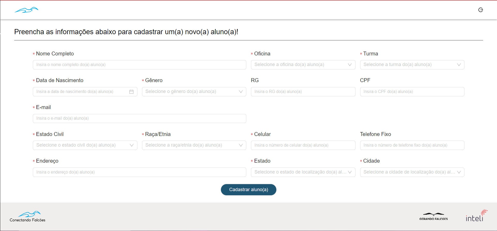
   
  <sup>Fonte: Autoria própria</sup>
</div>

<div align="center">
  <sub>Figura XX - Formulário de cadastro de professor(as) </sub>

  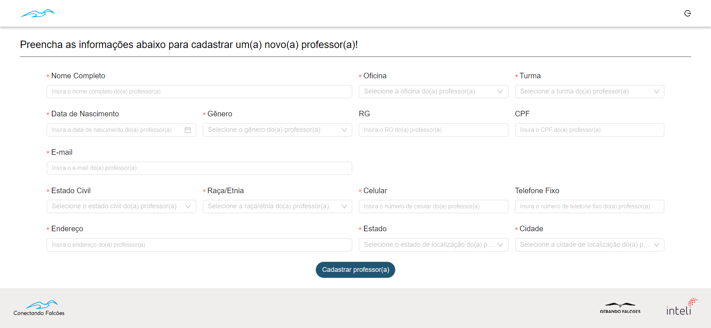
   
  <sup>Fonte: Autoria própria</sup>
</div>

**Responsividade:**

&emsp;Em relação à responsividade, tais telas ainda não possuem a responsividade implementada, haja vista que o foco maior estava em transparecer para os usuários os dados corretos que deverão ser preenchidos para realizar um determinado cadastro. Vale ressaltar que a implementação da responsividade destas telas é algo projeto para sprints futuras.

**Funcionalidades de ambas as telas:**

- Cadastrar aluno(as);
  - Esse cadastro é importante para o líder da ONG, haja vista que ele conseguirá ter um maior controle dos participantes das atividades oferecidas pela ONG.
- Cadastrar professor(as);
  - Esse cadastro é importante para o líder da ONG, haja vista que ele conseguirá ter um maior controle dos vonluntários das atividades oferecidas pela ONG.

**Navegação: Cadastro de aluno(a)**

&emsp;Ao analisar a imagem abaixo, é possível identificar as diversas ações de navegação associadas à tela de "Cadastro Aluno". Cada ação é numerada para facilitar a compreensão do fluxo de interação do usuário com a interface. Destacamos as seguintes operações:

<div align="center">
  <p><sub>Figura XX - Fluxo de navegação - Tela: Cadastro Aluno </sub></p>
  

<sup>Fonte: Autoria própria</sup>

</div>

1. **Tela Inicial da Aplicação:**

   - Ao clicar no ícone da aplicação, o usuário retorna à tela inicial. Para o líder da ONG, isso significa acessar a página inicial de visualização da organização.

2. **Desconexão da Conta:**

   - Ao clicar no ícone de saída, o usuário pode desconectar-se da sua conta, retornando para a tela de login.

3. **Cadastrar Aluno:**
   - Ao clicar no botão "Cadastrar Aluno", a ONG é direcionada para a página onde pode registrar um novo aluno em seu sistema.

**Navegação: Cadastro de professor(a)**

&emsp;Ao analisar a imagem abaixo, é possível identificar as diversas ações de navegação associadas à tela de "Cadastro Professor". Cada ação é numerada para facilitar a compreensão do fluxo de interação do usuário com a interface. Destacamos as seguintes operações:

<div align="center">
  <p><sub>Figura XX - Fluxo de navegação - Tela: Cadastro Professor </sub></p>
  

<sup>Fonte: Autoria própria</sup>

</div>

1. **Tela Inicial da Aplicação:**

   - Ao clicar no ícone da aplicação, o usuário retorna à tela inicial. Para o líder da ONG, isso significa acessar a página inicial de visualização da organização.

2. **Desconexão da Conta:**

   - Ao clicar no ícone de saída, o usuário pode desconectar-se da sua conta, retornando para a tela de login.

3. **Cadastrar Professor:**
   - Ao clicar no botão "Cadastrar Professor", a ONG é direcionada para a página onde pode adicionar um novo professor ao seu quadro e relacioná-lo com uma ou várias turmas.

### 7.3.4 Requisitos Funcionais Atendidos

&emsp;Abaixo, estão listados os requisitos funcionais que foram atendidos no desenvolvimento do frontend do projeto Conectando Falcões e sua tela correspondente.

| Tela                                               | Requisitos Funcionais Atendidos                                                                                                                                                                                                                                                                      |
| -------------------------------------------------- | ---------------------------------------------------------------------------------------------------------------------------------------------------------------------------------------------------------------------------------------------------------------------------------------------------- |
| Login                                              | **RF-001:** Login                                                                                                                                                                                                                                                                                    |
| Tela Inicial do Líder da ONG;                      | **RF-010:** Visualização de dados gerais e detalhados da própria ONG; <br> **RF-016:** Visualizar o total de atendidos da ONG; <br> **RF-017:** Participantes x Oficinas; <br> **RF-024:** Visualizar a quantidade de alunos da ONG em geral e por oficina;                                          |
| Oficinas                                           | **RF-003:** Visualizar detalhadamente cada ONG, cada oficina e seus alunos; <br> **RF-020:** Visualização da quantidade de alunos participantes de uma oficina; <br> **RF-022:** Pesquisar ONGs; <br> **RF-024:** Visualizar a quantidade de alunos da ONG em geral e por oficina;                   |
| Informações da oficina/turma                       | **RF-003:** Visualizar detalhadamente cada ONG, cada oficina e seus alunos; <br> **RF-008:** Monitorar alunos de cada oficina; <br> **RF-020:** Visualização da quantidade de alunos participantes de uma oficina; <br> **RF-024:** Visualizar a quantidade de alunos da ONG em geral e por oficina; |
| Lista de estudantes - Tela do Professor            | **RF-008:** Monitorar alunos de cada oficina; <br> **RF-013:** Controlar frequência dos alunos de cada oficina; <br> **RF-014:** Visualizar alunos cadastrados e suas frequências; <br> **RF-029:** Visualização dos alunos cadastrados;                                                             |
| Formulários de Cadastro de Aluno(a) e Professor(a) | **RF-005:** Cadastrar/editar/arquivar professores; <br> **RF-006:** Cadastrar/editar/arquivar alunos; <br> **RF-012:** Cadastrar alunos;                                                                                                                                                             |

Total de requisitos funcionais atendidos: 11

### 7.3.5 Componentes

&emsp;Componentes são pedaços isolados de código que podem ser reutilizados em diferentes partes do seu aplicativo. Eles ajudam a organizar e modularizar o código, tornando-o mais legível e fácil de manter.
&emsp;No contexto do Next.js, os componentes podem ser elementos visuais, como botões, formulários, cabeçalhos, ou até mesmo lógica de negócios, como a lógica para buscar dados de uma API.

#### 1. Card de oficinas

&emsp;Esse componente é utilizado para exibir informações sobre uma oficina de uma determinada ONG, incluindo detalhes como data, horário e quantidade de alunos. Ao clicar em um card, o usuário é direcionado para a página específica da oficina.

&emsp;Os cards exibem uma variedade de cores estabelecidas no design system, as quais são determinadas pela categoria da oficina, o que contribui para uma melhor experiência do usuário em termos de usabilidade.

**Funcionalidades:**

- Redirecionar o usuário para a página da oficina específica.

<div align="center">
  <p><sub>Figura XX - Componente "card" </sub></p>

  
   
  <sup>Fonte: Autoria própria</sup>
</div>

#### 2. Formulário

&emsp; Este componente é utilizado para ser possível o registro de informações de alunos e professores. Nesse sentido, tal formulário possui todos os atributos que precisam ser preenchidos para que seja possível realizar a criação de um aluno ou professor. É válido destacar que os seus inputs, ou seja, seus campos, foram criados com os componentes disponibilizados pelo Ant Design, os quais foram personalizado pelo grupo de modo a atender os wireframes.

**Funcionalidades:**

- Cadastrar um(a) aluno(a) ou um(a) professor(a).

<div align="center">
  <p><sub>Figura XX - Componente "Formulário" </sub></p>

  
   
  <sup>Fonte: Autoria própria</sup>
</div>

#### 3. Botão

&emsp; Este componente é utilizado para direcionar ou realizar uma ação do usuário. Sendo assim, ele foi criado de acordo com o Estudo de Design System definido e de acordo com as funcionalidades e estilizações disponibilizados pelo Ant Design. Ademais, vale destacar que os botões podem assumir duas principais funcionalidades, as quais serão listadas a seguir.

**Funcionalidades:**

- Direcionar para páginas específicas;
- Efetivar uma ação do usuário, como, por exemplo cadastrar aluno/professor.

<div align="center">
  <p><sub>Figura XX - Componente "Botão" que direciona para páginas específicas </sub></p>

  
   
  <sup>Fonte: Autoria própria</sup>
</div>

<div align="center">
  <p><sub>Figura XX - Componente "Botão" efetiva uma ação do usuário </sub></p>

  
   
  <sup>Fonte: Autoria própria</sup>
</div>

#### 4. Gráfico de Barras

&emsp; Este componente é utilizado para mostrar ao líder da ONG uma visão geral da quantidade de alunos matrículados em cada oficina, de acordo com a categoria de tal oficina. Este é um componente importante e bastante visado pelo parceiro, haja vista que permite ter uma visualização de dados mais direta e informativa.

**Funcionalidades:**

- Mostrar ao usuário (líder da ONG) os dados de quantidade de alunos registrados por oficina, de acordo com a categoria da oficina.

<div align="center">
  <p><sub>Figura XX - Componente "Gráfico de Barras"</sub></p>

  
   
  <sup>Fonte: Autoria própria</sup>
</div>

### 7.3.6 Layouts

&emsp;No Next.js, um layout é um componente que pode ser reaproveitado em várias páginas, o que é vantajoso para a **usabilidade do usuário**, **manutenção** e **performance** da aplicação. Essa abordagem permite garantir uma consistência visual em todo o site sem a necessidade de duplicar o código em diferentes partes, o que simplifica a experiência do usuário e facilita a manutenção do design. Além disso, ao utilizar layouts, as alterações podem ser implementadas de forma ágil, pois modificá-las significa mexer em um único local, evitando a necessidade de ajustes em cada página individualmente.

&emsp;Também, ao navegar pelo site, os layouts garantem que seus estados permaneçam intactos, mantendo a interatividade e evitando renderizações desnecessárias.

#### 1. Layout de cabeçalho e rodapé

&emsp;Este layout contém dois componentes principais: o cabeçalho (header) e o rodapé (footer). O cabeçalho e o rodapé geralmente contêm elementos que são iguais em todas as páginas, como logotipo, navegação e informações. Ao definir esses elementos em um layout de cabeçalho e rodapé, facilita o desenvolvimento da aplicação.

**Funcionalidades:**

- Fazer o logout;
- Voltar para a página inicial ao clicar na logo.

<div align="center">
  <sub>Figura XX - Layout de cabeçalho e rodapé </sub>

  
  
   
  <sup>Fonte: Autoria própria</sup>
</div>

### 7.3.7 Paleta de Cores

&emsp;A paleta de cores do projeto que está sendo desenvolvido para a Gerando Falcões foi formalizada de acordo com o [7.1 Design System](#design-system) e em conformidade com o guia de estilos da Gerando Falcões. Assim, a imagem abaixo demonstra qual a paleta de cores utilizada neste projeto.

<div align="center">
  <sub>Figura XX - Paleta de Cores do Conectando Falcões </sub>

  
   
  <sup>Fonte: Autoria própria</sup>
</div>

# 8. Projeto de Banco de Dados

<conteúdo>

## 8.1 Modelo Conceitual

<conteúdo>

## 8.2 Modelo Lógico

<conteúdo>

# 9. Testes de Software

&emsp;Neste tópico serão abordados testes do software desenvolvido para a Gerando Falcões. Desse modo, serão demonstrados diversos pontos que evidenciam as funcionalidades do software, passando desde a demonstração de integração até os mais diversos testes.

## 9.1 Testes Iniciais

&emsp;Neste tópico serão demonstradas todas as informações necessárias para o entendimento e utilização dos endpoints desenvolvidos para a aplicação, com o foco nos acessos do líder da ONG e professor.

&emsp;Nesse sentido, para que isso seja possível, foram realizados testes para verificar o funcionamento inicial do backend com o auxílio da ferramenta Postman. Com isso, foi possível realizar a verificação dos dados retornados pelos endpoints e o recebimento de dados para cadastros e listagens. Portanto, os testes de cada endpoint serão realizados a seguir.

### Tela de Login

&emsp;A seguir serão detalhados os endpoints desenvolvidos para a tela de login da aplicação Conectando Falcões.

&emsp;**POST /user/auth:** Este endpoint é utilizado para realizar a autenticação do usuário, seja ele líder da ONG ou professor. Desse modo, no backend, o usuário foi representado como uma entidade que possui os seguintes campos e tipos de dados:

| Campo    | Tipo   | Descrição         |
| -------- | ------ | ----------------- |
| email    | String | E-mail do usuário |
| password | String | Senha do usuário  |

&emsp;A partir dessa entidade do usuário, foi possível desenvolver o endpoint `POST/user/auth`. Sendo assim, ao realizar uma requisição POST para este endpoint, o sistema deverá retornar um objeto JSON contendo as seguintes informações:

| Campo  | Tipo   | Descrição                                                    |
| ------ | ------ | ------------------------------------------------------------ |
| role   | String | Tipo de usuário (Gerando Falcões, líder de ONG ou professor) |
| roleID | Number | Identificador único do tipo de usuário                       |

&emsp;Exemplo de retorno:

<div align="center">
   <sub>Figura XX - Retorno do endpoint POST/user/auth no Postman</sub>

   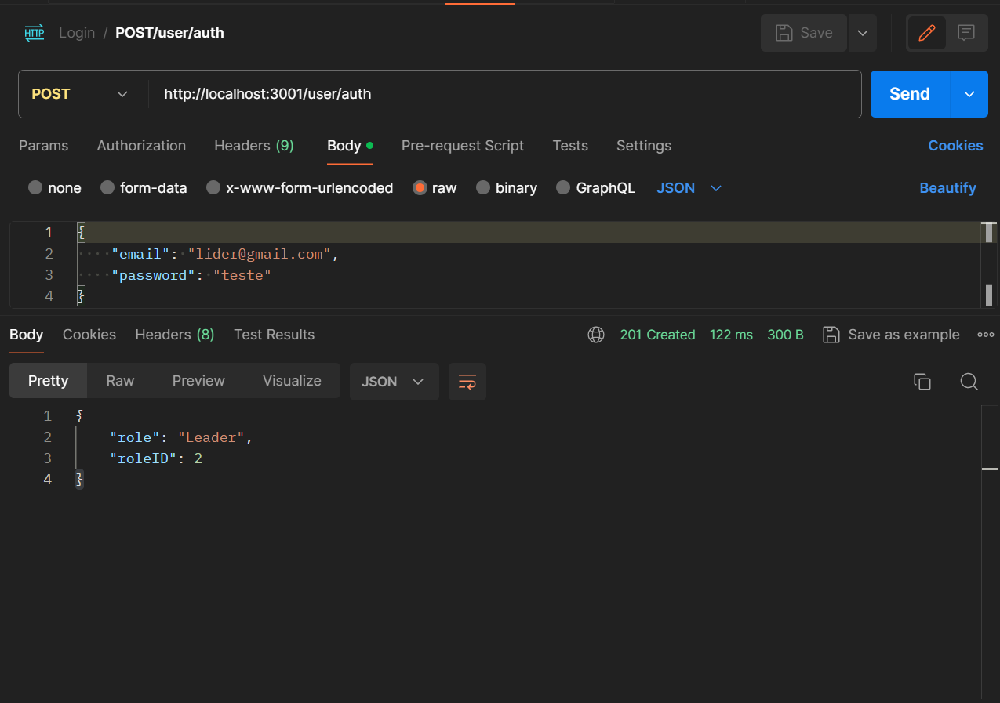
   
   <sup>Fonte: Autoria própria</sup>
</div>

&emsp;Nesse sentido, é possível realizar a autenticação do usuário, seja ele funcionário da Gerando Falcõs, líder da ONG ou professor. Com isso, é possível redirecioná-lo e definir os níveis de acesso dentro da aplicação conforme seu papel e tipo de usuário retornado.

### Tela Inicial do Líder da ONG

&emsp;A seguir serão detalhados os endpoints desenvolvidos para a tela inicial do acesso do líder da ONG.

&emsp;**GET /ongs:** Este endpoint é utilizado para recuperar informações básicas de todas as ONGs cadastradas no sistema. Desse modo, no backend a ONG foi representada como uma entidade que possui os seguintes campos e tipos de dados:
| Campo | Tipo | Descrição |
| ----- | ---- | --------- |
| id | Number |Identificador único de cada ONG |
| name | String | Nome da ONG |
| address | String | Endereço da ONG |
| email | String |E-mail de contato da ONG |
| cnpj | String | CNPJ da ONG |

&emsp;A partir dessa entidade da ONG, foi possível desenvolver o endpoint `GET/ongs`. Sendo assim, ao realizar uma requisição GET para este endpoint, o sistema deverá retornar um JSON com um array de objetos, cada um representando uma ONG cadastrada. Exemplo de retorno:

<div align="center">
   <sub>Figura XX - Retorno do endpoint GET/ongs visualizado no Postman</sub>

   
   
   <sup>Fonte: Autoria própria</sup>
</div>

&emsp;Nesse sentido, o uso do endpoint `GET/ongs` é para realizar consultas de informações gerais de todas as ONGs cadastradas no sistema. Com isso, ao realizar tal requisição, não é necessário incluir dados adicionais na requisição.

&emsp;**GET/ongs/\:id:** Este endpoint fornece dados detalhados de uma ONG específica, incluindo informações sobre oficinas (workshops) e turmas (class) oferecidas, conforme o id da ONG. Desse modo, tal endpoint contém um parâmetro obrigatório que é justamente o ID da ONG, o qual deve ser fornecido na URL para buscar os dados específicos da ONG. Nesse sentido, esse endpoint possibilita exibir informações da tela inicial do líder da ONG após ele realizar o login, trazendo uma visão detalhada das atividades e participações.

&emsp;Desse modo, no backend a ONG foi representada com a entidade apresentada anteriormente, porém, para este endpoint, foi necessário utilizar outras duas entidades que representem a Oficina (workshop) e a turma (class), as quais serão apresentadas a seguir, respectivamente.

Entidade Workshop, que corresponde à oficina:

| Campo    | Tipo          | Descrição                                             |
| -------- | ------------- | ----------------------------------------------------- |
| id       | Number        | Identificador único do workshop                       |
| idOng    | Number        | Identificador único da ONG                            |
| name     | String        | Nome da oficina/workshop                              |
| category | String        | Categoria da oficina/workshop                         |
| class    | ClassEntity[] | Lista de turmas/class que pertence à oficina workshop |

Entidade Class, que corresponde à turma de uma determinada oficina:
| Campo | Tipo | Descrição |
| -------- | ------------- | ----------------------------------------------------- |
| name | String | Nome da Turma |
| qtyStudents | Number | Quantidade de estudantes inscritos na turma |

&emsp;A partir dessas entidades foi possível desenvolver o endpoint `GET/ongs/:id`. Sendo assim, ao realizar uma requisição GET para este endpoint, o sistema deverá retornar um objeto JSON contendo informações detalhadas da ONG, de modo a deixar claro as suas oficinas e turmas de cada oficina. Exemplo de retorno:

<div align="center">
   <sub>Figura XX - Retorno do endpoint GET/ongs visualizado no Postman</sub>

   
   
   <sup>Fonte: Autoria própria</sup>
</div>

&emsp;Nesse sentido, o uso do endpoint `GET/ongs/:id` é para realizar consulta de informações detalhadas de uma ONG específica cadastrada no sistema. Com isso, ao realizar tal requisição, é necessário incluir um parâmetro obrigatório, sendo o id da ONG.

### Tela da lista de oficinas

&emsp;A seguir, será detalhado o endpoint desenvolvido para a interface que contém a lista de oficinas.

&emsp;**GET /workshops:** Este endpoint é utilizado para recuperar informações básicas de todas as oficinas cadastradas no sistema. As oficinas são representadas como entidades com os seguintes campos e tipos de dados:

| Campo     | Tipo              | Descrição                                        |
| --------- | ----------------- | ------------------------------------------------ |
| id        | Number            | Identificador único de cada oficina              |
| idOng     | Number            | Identificador único da ONG que oferece a oficina |
| nameOng   | String            | Nome da ONG                                      |
| name      | String            | Nome da oficina                                  |
| category  | String            | Categoria da oficina                             |
| classroom | ClassroomEntity[] | Lista de turmas associadas à oficina             |

&emsp;Ao realizar uma requisição GET para este endpoint, o sistema deverá retornar um JSON com um array de objetos, cada um representando uma oficina cadastrada. Exemplo de retorno:

<div align="center">
   <sub>Figura XX - Retorno do endpoint GET/workshops visualizado no Postman</sub>

   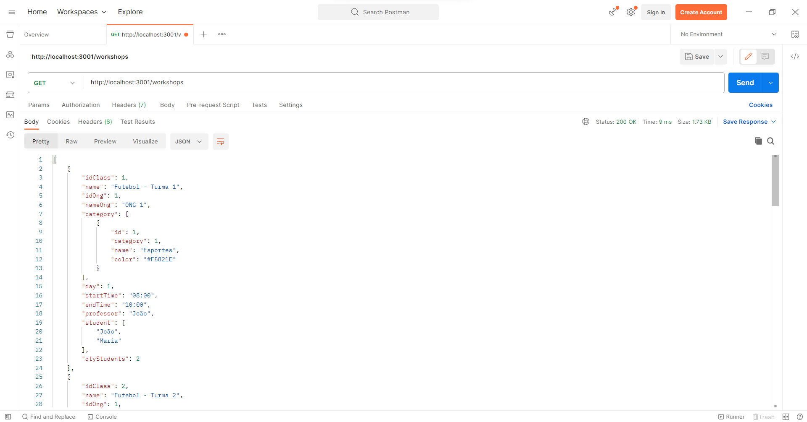
   
   <sup>Fonte: Autoria própria</sup>
</div>

&emsp;Assim como no caso de `/ongs`, o uso do endpoint `GET /workshops` é para realizar consultas de informações gerais de todas as oficinas cadastradas no sistema. Nesse caso, não é necessário incluir dados adicionais na requisição.

### Tela da turma e do professor

&emsp;A seguir, serão detalhados os endpoints desenvolvidos para a tela da turma e a do professor.

&emsp;**GET /workshops/:id**: Este endpoint fornece dados detalhados de uma oficina específica, incluindo informações sobre as turmas (classes) oferecidas por essa oficina. Este endpoint requer um parâmetro obrigatório, que é o ID da oficina, fornecido na URL.

&emsp;A entidade Workshop, apresentada anteriormente, serve como base para representar uma oficina. Ao realizar uma requisição GET para este endpoint, o sistema deverá retornar um objeto JSON contendo informações detalhadas da oficina, incluindo as turmas associadas. Exemplo de retorno:

<div align="center">
   <sub>Figura XX - Retorno do endpoint GET/workshops/:id visualizado no Postman</sub>

   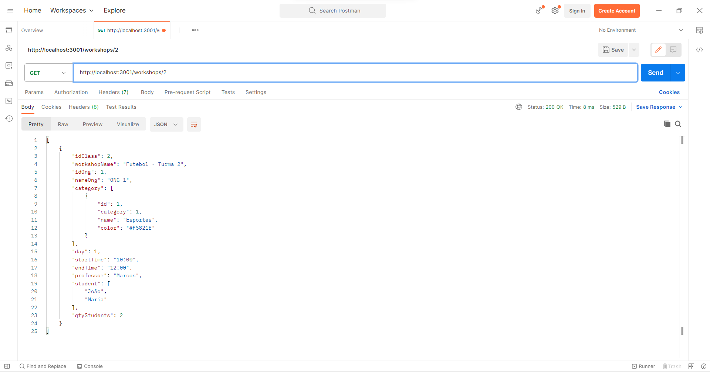
   
   <sup>Fonte: Autoria própria</sup>
</div>

&emsp;**POST /class/presence**: Este endpoint é utilizado para marcar a presença de estudantes em uma turma específica. Esta ação requer o envio de dados no corpo da requisição em formato JSON, indicando algumas informações com a seguinte estrutura:

```json
{
  "idClassroom": 3,
  "dateTime": "20/02/2024",
  "idTeacher": 1,
  "presence": [1, 3, 5],
  "absent": [2, 4]
}
```

&emsp;Onde `idClassroom` é o identificador único da turma, `presence` é um array contendo os identificadores dos estudantes presentes e o `absent` é outro array contendo os identificadores dos estudantes ausentes.

&emsp;O sistema irá processar a requisição e atualizará o registro de presença na turma especificada. Exemplo de resposta:

<div align="center">
   <sub>Figura XX - Exemplo de resposta do endpoint POST/class/presence visualizado no Postman</sub>

   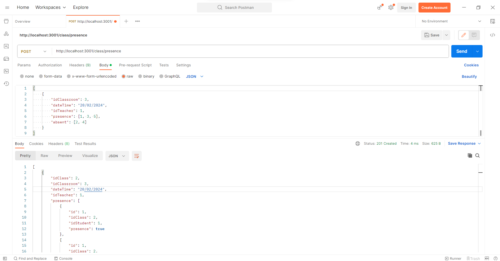
   
   <sup>Fonte: Autoria própria</sup>
</div>

### Tela Cadastro Professor e Cadastro Aluno

&emsp;A seguir, serão detalhados os endpoints desenvolvidos para a Cadastro Professor e Cadastro Aluno.

&emsp;**POST/students/register**: Este endpoint permite registrar um novo aluno no sistema. Ele recebe os dados do aluno através do corpo de uma requisição POST para '/students' e utiliza o serviço `StudentService` para realizar o registro. Os dados do aluno são fornecidos como um objeto `StudentDTO`, contendo todas as informações necessárias. O endpoint retorna uma promessa que resolve para a entidade `StudentEntity` do aluno recém-registrado, incluindo um identificador único gerado pelo sistema.

&emsp;A entidade Students, previamente definida, serve como base para representar um estudante. Desse modo, a mesma possui os seguintes campos e tipos de dados:

| Campo          | Tipo   | Descrição               |
| -------------- | ------ | ----------------------- |
| id             | number | Identificação           |
| name           | string | Nome                    |
| idWorkshop     | number | ID da Oficina           |
| idClass        | number | ID da Classe            |
| dateOfBirth    | string | Data de Nascimento      |
| gender         | string | Gênero                  |
| rg             | string | RG                      |
| cpf            | string | CPF                     |
| maritalStatus  | string | Estado Civil            |
| raceEthnicity  | string | Raça/Etnia              |
| address        | string | Endereço                |
| state          | string | Estado                  |
| city           | string | Cidade                  |
| phoneNumber    | string | Número de Telefone      |
| landlineNumber | string | Número de Telefone Fixo |
| email          | string | Email                   |

&emsp; Ao efetuar uma requisição POST para este endpoint, o sistema responderá com um objeto JSON que contém detalhes do aluno recém-registrado, incluindo um identificador único gerado pelo sistema. Exemplo de retorno:

<div align="center">
   <sub>Figura XX - Retorno do endpoint POST/students/register visualizado no Postman</sub>

   
   
   <sup>Fonte: Autoria própria</sup>
</div>

&emsp;**POST/teachers**: Este endpoint permite registrar um novo professor no sistema. Ele recebe os dados do professor através do corpo de uma requisição POST para '/teachers' e utiliza o serviço `TeacherService` para realizar o registro. Os dados do professor são fornecidos como um objeto `TeacherDTO`, contendo informações como nome, qualificações, áreas de especialização, entre outros. O endpoint retorna uma promessa que resolve para a entidade `TeacherEntity` do professor recém-registrado, incluindo um identificador único gerado pelo sistema.

&emsp;A entidade Teacher definida, é utilizada como base para representar um professor. Desse modo, a mesma possui os seguintes campos e tipos de dados:

| Campo       | Tipo   | Descrição            |
| ----------- | ------ | -------------------- |
| id          | number | Identificação        |
| name        | string | Nome                 |
| workshops   | Array  | Oficinas associadass |
| ongs        | Array  | ONGs associadas      |
| dateOfBirth | string | Data de Nascimento   |
| gender      | string | Gênero               |
| address     | string | Endereço             |
| state       | string | Estado               |
| city        | string | Cidade               |
| email       | string | Email                |
| phoneNumber | string | Número de Telefone   |
| rg          | string | RG                   |
| cpf         | string | CPF                  |

&emsp;Ao fazer uma requisição POST para este endpoint, o sistema retornará um objeto JSON contendo informações detalhadas do professor recém-registrado, incluindo um identificador único gerado pelo sistema. Exemplo de retorno:

<div align="center">
   <sub>Figura XX - Retorno do endpoint POST/teachers visualizado no Postman</sub>

   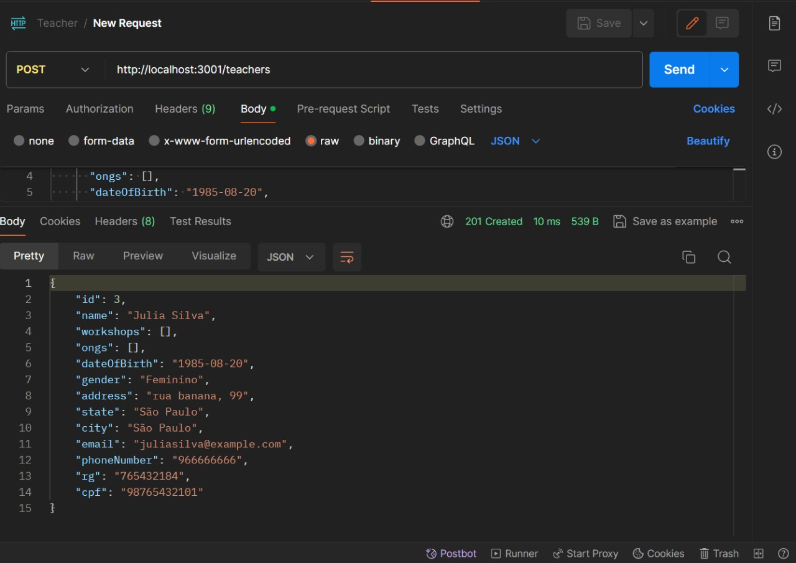
   
   <sup>Fonte: Autoria própria</sup>
</div>

&emsp;Em resumo, ambos endpoints fornecem uma maneira de registrar novos alunos e professores na Conectando Falcões. Ao utilizar requisições POST para `'/students'` e `'/teachers'`, respectivamente, os dados são processados e armazenados no sistema, garantindo a integridade e precisão das informações.

### EC2 com o Backend do Projeto

&emsp; Após desenvolver todos os endpoints listados anteriormente, foi possível armazenar tais estruturas do backend do projeto em uma instância EC2 da AWS. Sendo assim, abaixo há algumas configurações padrões que o grupo definiu

- Nome: backend-conectando-falcoes
- AMI: Amazon Linux
- Tipo: t2-micro (prezamos pela configuração padrão da Amazon, pois a funcionalidade da instância, neste primeiro momento, não requer maiores complexidades)
- Redes: Prezamos pela configuração padrão da Amazon, pois a funcionalidade da instância, neste primeiro momento, não requer maiores complexidades, porém foi adicionado a permissão de HTTP/HTTPS, bem como a comunicação TCP personalizada para a porta 3001, haja vista que é nela que o backend irá funcionar. 
- Armazenamento: 1x de Gib, sendo o volume raiz padrão (prezamos pela configuração padrão da Amazon, pois a funcionalidade da instância, neste primeiro momento, não requer maiores complexidades).

&emsp; Dessa forma, para verificar melhor e mais de perto o funcionamento da EC2 com o backend desenvolvido, é possível acessar o link a seguir, o qual irá redirecionar para um vídeo de demonstração do acesso à instância por meio do seu IP Público e os endpoints funcionando com seu IP Público, com o retorno tanto no Postman quanto no navegador: [Vídeo de Demonstração da EC2 com o Backend desenvolvido](https://drive.google.com/file/d/103eihO_TMGlJ34pD_VHSjlryiv6jJOLk/view?usp=sharing)


&emsp; A imagem abaixo fornece um resumo geral das informações sobre a EC2 criada. 

<div align="center">
   <sub>Figura XX - Resumo das Informações da EC2 criada</sub>

   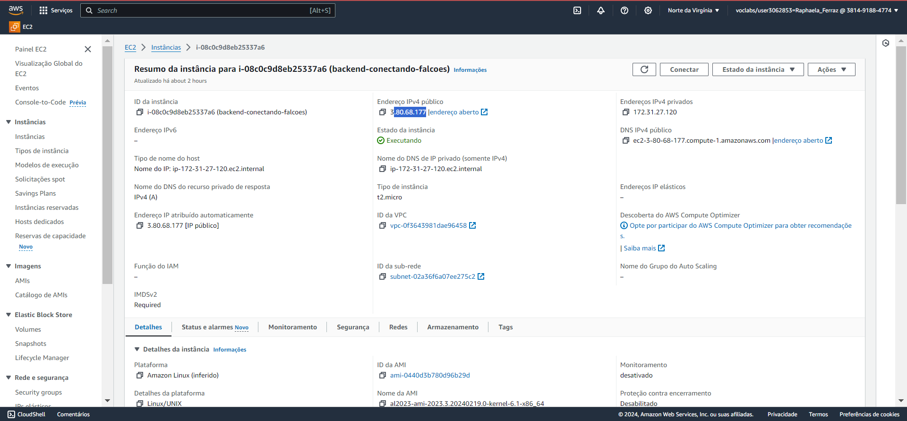
   
   <sup>Fonte: Autoria própria</sup>
</div>

> Vale ressaltar que a EC2 foi criada no ambiente AWS Lab, o qual utilizamos durante as instruções de programação e, por isso, o  link de demonstração do vídeo, que é o IP Público muda de 4 em 4 horas, podendo não estar disponível na hora em que estiver sendo assistido o vídeo. 

## 9.2 Teste de Integração

<conteúdo>

## 9.3 Testes automatizados

<conteúdo>

## 9.4 Testes de Usabilidade

<conteúdo>

## 9.5 Testes de Requisitos Não Funcionais

<conteúdo>

# 10. Procedimento de Implantação da Solução

<conteúdo>

## 10.1 Procedimento de Implantação do Sistema

<conteúdo>

## 10.2 Procedimento de Implantação do Banco de Dados

<conteúdo>

## 10.3 Documentação Automática do Sistema (Swagger)

<conteúdo>

# Referências

1. AGÊNCIA SENADO. **Orçamento de 2024 tem prioridade social e mínimo de R$ 1.421**. Disponível em: <https://www12.senado.leg.br/noticias/materias/2023/08/31/orcamento-de-2024-com-sm-de-r-1-421-e-prioridade-para-saude-educacao-e-moradia-chega-ao-congresso#:~:text=O%20projeto%20da%20Lei%20Or>. Acesso em: 10 fev. 2024.

2. CAMPOS, A. C. **Censo: falta de endereço em favelas dificulta registro de domicílios.** Disponível em: <https://agenciabrasil.ebc.com.br/economia/noticia/2023-03/censo-falta-de-endereco-em-favelas-dificulta-registro-dos-domicilios#:~:text=Data%20Favela&text=S>. Acesso em: 11 fev. 2024.

3. CASA DO DESENVOLVEDOR. **Requisitos funcionais e não funcionais: o que são e como identificar?** Disponível em: <https://blog.casadodesenvolvedor.com.br/requisitos-funcionais-e-nao-funcionais/>. Acesso em: 9 fev. 2024.

4. DAM, R.; SIANG, T. **Personas – A Simple Introduction.** Disponível em: <https://www.interaction-design.org/literature/article/personas-why-and-how-you-should-use-them>. Acesso em: 12 fev. 2024.

5. GERANDO FALCÕES. **Como a Gerando Falcões surgiu?** Disponível em: <https://youtu.be/Tt4Wx7t841I?si=yR8UrvhiAIH9C-hm>. Acesso em: 11 fev. 2024.

6. GUREL, E. **SWOT analysis: A theoretical review.** Journal of International Social Research, v. 10, n. 51, p. 994–1006, 2017.

7. INTELI, Instituto de Tecnologia e Liderança. **Termo de Abertura de Projeto do Inteli (TAPI)**: Projeto Parceiro Gerando Falcões - 5° Módulo, 2024.

8. KRÜGER, G.; LANE, C. How to Write a Software Requirements Specification (SRS Document) | Perforce Software. Disponível em: <https://www.perforce.com/blog/alm/how-write-software-requirements-specification-srs-document>. Acesso em: 15 fev. 2024.

9. DAM, R.; SIANG, T. **Personas – A Simple Introduction.** Disponível em: <https://www.interaction-design.org/literature/article/personas-why-and-how-you-should-use-them>. Acesso em: 12 fev. 2024.

10. GERANDO FALCÕES. **Como a Gerando Falcões surgiu?** Disponível em: <https://youtu.be/Tt4Wx7t841I?si=yR8UrvhiAIH9C-hm>. Acesso em: 11 fev. 2024.

11. GUREL, E. **SWOT analysis: A theoretical review.** Journal of International Social Research, v. 10, n. 51, p. 994–1006, 2017.

12. HARVARD BUSINESS SCHOOL. **The Five Forces.** Disponível em: <https://www.isc.hbs.edu/strategy/business-strategy/Pages/the-five-forces.aspx>. Acesso em: 16 fev. 2024.

13. INTELI, Instituto de Tecnologia e Liderança. **Termo de Abertura de Projeto do Inteli (TAPI)**: Projeto Parceiro Gerando Falcões - 5° Módulo, 2024.

14. KRÜGER, G.; LANE, C. **How to Write a Software Requirements Specification (SRS Document)** | Perforce Software. Disponível em: <https://www.perforce.com/blog/alm/how-write-software-requirements-specification-srs-document>. Acesso em: 15 fev. 2024.

15. “Diagrama de Caso de Uso UML: O Que é, Como Fazer E Exemplos.” Lucidchart. Disponível em: www.lucidchart.com/pages/pt/diagrama-de-caso-de-uso-uml. Acesso em: 10 fev. 2024. <br>

16. “O Que é E Como Escrever Uma Boa História Do Usuário? Veja Aqui!” Miro. Disponível em: miro.com/pt/agile/o-que-e-historia-do-usuario/. Acesso em: 10 fev. 2024. <br>

17. SOUZA, Elenara. “Empreendedorismo Social: Saiba Como Lucro E Propósito Andam de Mãos Dadas.” Blog Gerando Falcões, 29 Dez. 2021. Disponível em: blog.gerandofalcoes.com/empreendedorismo-social-como-lucro-e-proposito-andam-juntos/. Acesso em: 10 fev. 2024. <br>

18. SALGADO, Danielle. “Jornada do Usuário: o que é e qual a importância?” Blog Opnion Box, 09 Mar. 2022. Disponível em: https://blog.opinionbox.com/jornada-do-usuario/. Acesso em: 17 fev. 2024. <br>

19. PEDRA, David. “O que é Matriz de Risco?” Blog Siteware, 01 Dez. 2023. Disponível em: https://www.siteware.com.br/blog/projetos/o-que-e-matriz-risco/. Acesso em: 17 fev. 2024. <br>

20. ROHR, Rebeca. “Plano de ação: o que é, como fazer e o passo a passo” Blog Mereo, 24 Ago. 2022. Disponível em: https://mereo.com/blog/plano-de-acao-passo-a-passo/. Acesso em: 17 fev. 2024. <br>

21. FERREIRA, K. Canvas de proposta de valor: para que serve e como preencher. Disponível em: <https://blog.somostera.com/product-management/canvas-de-proposta-de-valor#:~:text=Value%20proposition%20canvas%2C%20ou%20canvas>. Acesso em: 18 fev. 2024.

22. AWARI. Perfil de Usuário Design Thinking: Compreendendo Perfis de Usuários no Contexto do Design Thinking. Awari, 4 jul. 2023. Disponível em: https://awari.com.br/perfil-de-usuario-design-thinking-compreendendo-perfis-de-usuarios-no-contexto-do-design-thinking/?. Acesso em: 16 fev. 2024.

23. Quem Somos - Gerando Falcões. Disponível em: <https://gerandofalcoes.com/quem-somos/>. Acesso em: 16 fev. 2024.

24. Souza, Natan. “Design Systems: Entenda O Que é E Confira Exemplos.” Alura, 16 set. 2022. Disponível em: www.alura.com.br/artigos/design-systems-exemplos-praticos. Acesso em: 10 fev. 2024. <br>

25. Villain, Mateus . “Design System: O Que é, Propósito E Vantagens.” Alura, 23 Nov. 2023. Disponível: www.alura.com.br/artigos/o-que-e-design-system. Acesso em: 11 fev. 2024. <br>

26. IBM. **Diagramas de Implementação**. Disponível em: <https://www.ibm.com/docs/pt-br/rsas/7.5.0?topic=topologies-deployment-diagrams>. Acesso em: 28 fev. 2024. <br>

27. AMAZON WEB SERVICES, INC. Conceitos básicos do Amazon EC2. Disponível em: <https://aws.amazon.com/pt/ec2/getting-started/#:~:text=O%20Amazon%20Elastic%20Compute%20Cloud>. Acesso em: 28 fev. 2024. <br>

28. BEZERRA, A.; BANDEIRA, V. Diagrama de Domínio - EconomizAqui. Disponível em: <https://economizaqui.github.io/EconomizAqui/Requisitos/Modelagem/Tradicional/Diagrama-de-Dom%C3%ADnio/>. Acesso em: 1 mar. 2024. <br>

# Apêndice
