<table>
<tr>
<Table>
  <tr>
    <td><a href= "https://gerandofalcoes.com//"></td>
    <td>
      
    </td>
  </tr>
</table>

## Grupo Fly

## :student: Integrantes:

- <a href="https://www.linkedin.com/in/bruna-brasil-alexandre/">Bruna Brasil</a>
- <a href="https://www.linkedin.com/in/claramohammad/">Clara Mohammad</a>
- <a href="https://www.linkedin.com/in/heitorprudente/">Heitor Prudente</a>
- <a href="https://www.linkedin.com/in/henrique-ottoboni-magalhaes-tecnologia/">Henrique Ottoboni</a>
- <a href="https://www.linkedin.com/in/isabella-fernandes-saldanha-138a631b4/">Isabella Fernandes</a>

## Sumário

- [1. Termos e Abreviações](#termos-e-abreviacoes)
- [2. Visão Geral do Projeto](#visão-geral-do-projeto)
  - [2.1 Entendimento da Demanda](#entendimento-demanda)
    - [2.1.1 Partes Interessadas](#partes-interessadas)
    - [2.1.2 Análise da Indústria](#analise-da-industria)
  - [2.2 Problema](#problema)
    - [2.2.1 Análise do Problema](#análise-do-problema)
    - [2.2.2 Análise do Cenário (Matriz SWOT)](#análise-do-cenário-e-Matriz-SWOT)
- [3. Proposta da Solução](#proposta-de-solucao)
  - [3.1 Descritivo Geral da Solução](#descritivo-da-solucao)
  - [3.2 Proposta Tecnológica e Benefícios](#proposta-tecnologica-beneficios)
    - [3.2.1 Tipo de arquitetura de nuvem escolhida](#tipo-arquitetura-nuvem-escolhida)
    - [3.2.2 Arquitetura de nuvem escolhida](#arquitetura-nuvem-escolhida)
    - [3.2.3 Benefícios trazidos pela arquitetura de nuvem proposta](#beneficios-arquitetura)
  - [3.3 Proposta de Valor (Value Proposition Canvas)](#value-canvas)
  - [3.4 Matriz de Risco](#matriz-de-risco)
- [4. Análise de experiência do usuário](#experiencia-usuario)
  - [4.1 Personas](#personas)
  - [4.2 Mapa de jornada do usuário](#jornada-usuario) 
- [5. Requisitos](#requisitos)
  - [5.1 Requisitos Funcionais](#requisitos-funcionais)
  - [5.2 Requisitos não Funcionais](#requisitos-não-funcionais)
  - [5.3 Casos de Uso](#casos-de-uso)
- [6. Projeto de Solução](#projeto-solucao)
  - [6.1 Diagrama de Classes](#diagrama-classes)
    - [6.1.1 Diagrama de Classes de Domínio](#diagrama-classes-dominio)
    - [6.1.2 Diagrama de Classes de Implementação](#diagrama-classes-implementacao)
  - [6.2 Diagrama de Componentes da Arquitetura](#diagrama-componentes)
  - [6.3 Diagrama de Implantação](#diagrama-implantacao)
  - [6.4 Tecnologias e Ferramentas](#tecnologias-ferramentas)
- [7. Interface](#interface)
  - [7.1 Design System](#design-system)
  - [7.2 Projeto de Interface (Wireframes)](#wireframe)
  - [7.3 Frontend](#frontend) 
- [8. Projeto de Banco de Dados](#projeto-de-banco-de-dados)
  - [Modelo Conceitual](#modelo-conceitual)
  - [Modelo Lógico](#modelo-conceitual)
- [9. Testes de Software](#testes-de-software)
  - [9.1 Demonstração da integração](#demonstracao-integracao)
  - [9.2 Teste de Integração](#teste-de-integracao)
  - [9.3 Testes automatizados](#teste-automatizado)
  - [9.4 Testes de Usabilidade](#teste-de-usabilidade)
  - [9.5 Testes de Requisitos Não Funcionais](#teste-de-rnf)
- [10. Procedimento de Implantação da Solução](#procedimento-implantacao)
  - [10.1 Procedimento de Implantação do Sistema](#procedimento-implantacao-sistema)
  - [10.2 Procedimento de Implantação do Banco de Dados](#procedimento-implantacao-bd)
  - [10.3 Documentação Automática do Sistema (Swagger)](#documentacao-automatica)
- [Referências](#referências)
- [Apêndice](#apêndice)

## 1. Termos e Abreviações

&emsp;&emsp;Este documento utiliza termos e abreviações específicas para descrever os requisitos e funcionalidades do sistema. Abaixo está uma lista desses termos com suas definições ou significados correspondentes.

- RF: Requisito Funcional.
- RNF: Requisito Não Funcional

# 2. Visão Geral do Projeto {#visão-geral-do-projeto}

&emsp;&emsp; O projeto em questão visa atender a uma demanda crucial no cenário das organizações não governamentais (ONGs), fornecendo uma solução abrangente para a gestão de atendimentos. Com base na necessidade identificada de cadastro e gestão dos atendidos, registro de frequências e faltas por oficina/atividade, anotações sobre atendimentos pontuais, e visualização de histórico por atendido, aula ou oficina, o projeto propõe o desenvolvimento de uma plataforma digital. Essa solução não apenas simplificará processos complexos, mas também oferecerá insights valiosos e ferramentas poderosas para impulsionar o impacto social positivo.

## 2.1 Entendimento da Demanda

&emsp;&emsp; A demanda para este projeto é estabelecida com base na necessidade de fornecer uma solução abrangente para as organizações não governamentais (ONGs) gerenciarem seus atendimentos. Isso inclui o cadastro e gestão dos atendidos, a possibilidade de registrar frequências e faltas por oficina/atividade, anotações sobre atendimentos pontuais, e a visualização de histórico por atendido, aula ou oficina. Além disso, para a Gerando Falcões, é essencial um protótipo destinado à visualização desses dados consolidados e abertos para as ONGs, com seus acessos definidos pelas necessidades de cada organização. Após a aprovação e feedbacks, espera-se o desenvolvimento da solução proposta para a realização de um piloto e coleta de feedbacks adicionais.

### 2.1.1 Partes Interessadas

&emsp;&emsp; As partes interessadas desempenham papéis fundamentais no desenvolvimento, implementação e utilização da solução proposta. São elas:

#### Gerando Falcões

&emsp;&emsp; A Gerando Falcões é uma organização reconhecida nacionalmente por sua atuação no desenvolvimento social, especialmente em comunidades carentes e favelas. Fundada por Edu Lyra, a Gerando Falcões tem como missão acelerar o poder de impacto de líderes comunitários, oferecendo suporte, recursos e oportunidades para transformar realidades. Como uma das principais partes interessadas neste projeto, a Gerando Falcões desempenha um papel central ao fornecer insights valiosos sobre as necessidades das ONGs e dos líderes comunitários, garantindo que a solução desenvolvida seja eficaz e alinhada com os objetivos de desenvolvimento social da organização.

#### Inteli

&emsp;&emsp; A Inteli é uma instituição de ensino superior dedicada à excelência acadêmica e à inovação educacional. Como parceira neste projeto, a Inteli está comprometida em fornecer recursos humanos e técnicos para o desenvolvimento da solução proposta. Através de sua equipe de professores, pesquisadores e alunos, a Inteli contribui com expertise em tecnologia da informação e gestão de projetos, garantindo que a solução seja desenvolvida com os mais altos padrões de qualidade e eficiência. Além disso, a Inteli também desempenha um papel importante na validação e implementação da solução, garantindo que ela atenda às necessidades e expectativas das partes interessadas envolvidas.

### 2.1.2 Análise da Indústria 

&emsp;&emsp; Nesta seção, serão abordados os elementos cruciais que definem o setor das ONGs e organizações sociais, desdobrando-se em contexto da indústria, modelo de negócio, tendências atuais, players de mercado e o Modelo de Porter. 

### 2.1.2.1 Contexto da indústria 

&emsp;&emsp; A Rede Gerando Falcões, fundada por Eduardo Lyra, é um ecossistema de desenvolvimento social que nasceu em comunidades carentes. A fim de transformar a vida de crianças e jovens em situação de vulnerabilidade, a Gerando Falcões trabalha através da combinação de educação socioemocional, educação profissional, acesso ao trabalho e tecnologias e à cultura.

&emsp;&emsp; A respeito de números, a ONG atua em mais de 6000 comunidades espalhadas pelo Brasil e conta com mais de 1000 ONG's em seu ecossistema, alcançando, assim, mais de 700 mil pessoas. Nestas diversas comunidades, a Gerando Falcões atua na formação de líderes sociais por meio da Falcons University, no acompanhamento de organizações, como a Unidades Aceleradas e Rede Fellows, além de atuar em projetos como a Fome Não, Bolsa Digital e o Favela 3D.

&emsp;&emsp; Outro ponto importante a ser destacado em seu contexto de indústria são as parcerias com investidores sociais e apoiadores. Dentre eles, as empresas GOL, MRV, Instituto Bandeirantes, accenture, Microsoft, entre outros. Assim, atuando em um contexto e um meio de vulnerabilidade, a Gerando Falcões cresce em trabalhos, projetos sociais e parcerias em prol do desenvolvimento de crianças e jovens de comunidades carentes.  

### 2.1.2.2 Modelo de negócio

**Introdução ao Modelo de Negócio:**

&emsp;&emsp;Neste modelo de negócio da plataforma digital Fly será oferecida uma visão abrangente de como a solução proposta se traduz em um empreendimento viável, abordando desde a proposta de valor até as estratégias de mitigação de riscos. A priori, modelo de negócio foi concebido para atender a uma necessidade no cenário das organizações não governamentais (ONGs) e entidades dedicadas ao serviço comunitário, isto é, a Gerando Falcões solicitou um protótipo reconhecendo os desafios enfrentados por essas instituições na gestão eficiente de recursos, monitoramento de atividades e engajamento do público, a plataforma digital foi desenvolvida sob medida para atender a essas demandas. Logo, essa solução busca simplificar processos complexos e oferecer insights valiosos e ferramentas poderosas para impulsionar o impacto social positivo. Com uma abordagem centrada no usuário, prioriza-se a simplicidade, a intuitividade e a personalização, garantindo que os clientes possam extrair o máximo valor da solução.

<h6 align="center"> Figura 1: Modelo De Negócios </h6>

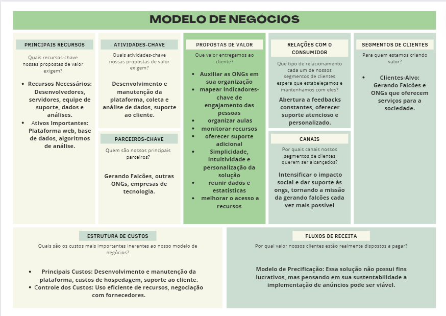

<h6 align="center"> Fonte: Elaborado pelo grupo Fly </h6>

#### 1. Proposta de Valor:

&emsp;&emsp;A proposta de valor da plataforma reside na sua capacidade de resolver problemas específicos enfrentados pelas ONGs e pela Gerando Falcões. Ao oferecer uma solução que ajuda na organização das atividades, no monitoramento de indicadores-chave de engajamento e na eficiente gestão de recursos, a plataforma se destaca pela sua simplicidade, intuitividade e personalização, diferenciando-se das alternativas existentes no mercado. Para a Gerando Falcões, a plataforma representa uma ferramenta valiosa para reunir dados e estatísticas, enquanto para as ONGs beneficiadas, oferece suporte na organização e acesso a recursos essenciais.

#### 2. Segmento de Clientes:

&emsp;&emsp;Os clientes-alvo da plataforma são principalmente a Gerando Falcões e as ONGs que oferecem serviços para a sociedade. Esses segmentos podem se beneficiar de maneiras distintas, o que demanda estratégias de comunicação e relacionamento diferenciadas.

#### 3. Canais de Distribuição:

&emsp;&emsp;A entrega da solução ocorre exclusivamente através de um site acessível via web, sendo que canais eficazes de distribuição incluem o marketing digital, parcerias estratégicas e programas de divulgação. Dessa forma, a principal intencionalidade destes canais é alcançar as ONGs que precisam deste auxilio e intensificar o impacto social de suas atividades, com o intuito de que recebam suporte eficiente para suas operações.

#### 4. Relacionamento com Clientes:

&emsp;&emsp;O relacionamento com os clientes é caracterizado por uma abordagem centrada no feedback constante e no suporte personalizado. A plataforma busca manter os clientes satisfeitos e engajados através da implementação rápida de sugestões e atualizações baseadas em suas necessidades e experiências.

#### 5. Fontes de Receita:

&emsp;&emsp;Embora a solução não tenha fins lucrativos, a implementação de anúncios pode ser considerada para garantir a sustentabilidade da solução.

#### 6. Recursos-Chave:

&emsp;&emsp;Os recursos-chave necessários para a operação do negócio incluem desenvolvedores, servidores, equipe de suporte, dados e análises. A plataforma web, a base de dados e os algoritmos de análise representam ativos importantes para a proposta de valor da solução.

#### 7. Atividades-Chave:

&emsp;&emsp;Atividades essenciais incluem o desenvolvimento e manutenção da plataforma, a coleta e análise de dados, bem como o suporte ao cliente.

#### 8. Parcerias-Chave:

&emsp;&emsp;Parcerias-chave incluem a Gerando Falcões, outras ONGs e empresas de tecnologia, sendo essenciais para o sucesso do negócio. O cultivo dessas parcerias envolve o estabelecimento de relacionamentos próximos e colaborações estratégicas.

#### 9. Estrutura de Custos:

&emsp;&emsp;Os principais custos incluem o desenvolvimento e manutenção da plataforma, custos de hospedagem e suporte ao cliente, que são controlados por meio do uso eficiente de recursos e negociação com fornecedores.

&emsp;&emsp;Em conclusão, o modelo de negócio da plataforma digital Fly representa uma abordagem abrangente para atender às necessidades das organizações não governamentais e entidades dedicadas ao serviço comunitário, oferecendo uma solução sustentável que simplifica processos complexos e fornece insights valiosos, visando auxiliar a Gerando Falcões na sua missão social.

#### 2.1.2.3 Tendências 

&emsp;&emsp; Se inserir no cenário atual das organizações não governamentais (ONGs) e entidades sociais requer uma compreensão profunda das forças que moldam nosso mundo. Em uma era caracterizada por rápidas transformações tecnológicas e mudanças socioeconômicas, estas organizações estão no centro de uma evolução crucial. Sabendo disso, a adaptabilidade, a inovação e a colaboração atuam como pilares fundamentais para enfrentar os desafios contemporâneos e aproveitar as oportunidades emergentes.

&emsp;&emsp;Nesse sentido, esta subseção tem como objetivo explorar tendências chave que estão redefinindo o setor, oferecendo uma visão ampla sobre como essas tendências podem ser integradas e utilizadas para fortalecer as missões sociais. É essencial que as ONGs, como a Gerando Falcões e suas parceiras, estejam preparadas para navegar neste cenário em constante mudança, garantindo que continuem a criar um impacto significativo na sociedade.

- **Digitalização e Tecnologia em ONGs:** A pandemia acelerou a digitalização do terceiro setor, evidenciando a necessidade de adaptar os processos organizacionais ao ambiente digital. O uso de tecnologias digitais se tornou essencial não apenas para a captação de recursos, com 55% dos doadores preferindo contribuições online, mas também para a gestão interna, oferecendo mais transparência e eficiência. A implementação de sistemas de gestão integrada é um exemplo de como a tecnologia pode melhorar a administração de ONGs, aumentando sua credibilidade e capacidade de atrair mais apoio[1].

- **Gestão de Dados e Transparência:** O Relatório Global de Tecnologia de ONGs mostra que as organizações não governamentais em todo o mundo estão cada vez mais utilizando tecnologia para melhorar a comunicação, captação de recursos online, mídia social, tecnologia móvel e software de produtividade. Isso enfatiza a importância da gestão de dados para promover a transparência, permitindo que as ONGs demonstrem claramente seu impacto e inspirem maior filantropia[2].

- **Colaboração e Parcerias Estratégicas:** A colaboração se tornou uma ferramenta vital para o crescimento e o sucesso das organizações, destacando-se como uma abordagem eficaz para impulsionar a inovação e a vantagem competitiva. Parcerias estratégicas entre empresas são alianças colaborativas com o objetivo de alcançar metas comuns, envolvendo o compartilhamento de recursos, conhecimentos e expertise, visando a criação de valor mútuo. Tais colaborações permitem o acesso a recursos complementares, a expansão para novos mercados, o compartilhamento de riscos e custos, aumentando a inovação e fortalecendo a vantagem competitiva no mercado[3].

- **Inovação Social e Sustentabilidade:** O setor de ONGs está investindo cada vez mais em software de gestão de relacionamento com o cliente (CRM) para rastrear doações e gerenciar informações de contato dos doadores, demonstrando a integração de tecnologias e aplicativos móveis para agilizar processos. A adoção de plataformas de crowdfunding também está crescendo, permitindo que ONGs angariem fundos de uma ampla rede de investidores através de mídias sociais e sites especializados. Essas tendências refletem um foco crescente em inovação social e sustentabilidade financeira, ajudando organizações a atingir mais efetivamente suas missões[4].

- **Adaptação e Resiliência:** A capacidade de adaptação e resiliência tem sido crucial para as ONGs, especialmente em tempos de crise. A tecnologia desempenha um papel vital nesse aspecto, permitindo que as organizações se ajustem rapidamente a novas realidades, mantendo a continuidade de seus serviços. A transformação digital nas ONGs envolve a mudança cultural e a redefinição de processos, garantindo que estejam preparadas para enfrentar desafios futuros[5].

&emsp;&emsp; Este panorama sugere um caminho promissor para as ONGs, onde a incorporação de tendências tecnológicas e estratégicas não apenas fortalece suas operações diárias mas também as prepara melhor para enfrentar desafios futuros, maximizando seu impacto social. Portanto, para as ONGs, incluindo a Gerando Falcões, alinhar-se com essas tendências não é apenas uma questão de crescimento, mas também de sobrevivência e relevância contínua em um mundo em rápida mudança.

#### 2.1.2.4 3 players

&emsp;&emsp; De início, é válido destacar que instituições sociais, como a Gerando Falcões, tendem a trabalhar em conjunto e harmonia com demais ONG's, visto que o grande objetivo é promover impacto positivo na sociedade. Porém, é possível haver outros "players" que atuam muitas vezes nas mesmas regiões. Assim, podemos citar como 3 players o Instituto da Criança, a Fundação Roberto Marinho e até mesmo o Instituto Ayrton Senna.

&emsp;&emsp; Descrevendo um pouco mais, temos:

- Instituto da Criança: criado em 1998, o instituto dá início em apoio a crianças em situação de vulnerabilidade, além de ter apoiado uma instituição com crianças com paralisia cerebral. Em seguida, um programa interno é criado a fim educar a criança a respeito de fatos ao seu entorno, ou seja, educação familiar, tópicos como cidadania, planejamento familiar, alcoolismo, entre outros. Programas como este que sustentam grande parte do projeto social. Outro ponto importante a ser citado é que o Instituto da Criança foca nos empreendedores sociais, assim como a Gerando Falcões, ou seja, pessoas que estão à frente dos projetos sociais e que viabilizam a existência e continuidade deles.

- Fundação Roberto Marinho: fundada em 1977, a fundação tem como objetivo promover a inclusão social e o desenvolvimento humano através da educação e da cultura. Segundo o próprio site da fundação, a principal missão é ser um ambiente colaborativo onde todos que acreditam no impacto positivo da educação se encontram, e encontram ferramentas para a produção e implementação de metodologias e ações socioeducacionais transformadoras e suporte para mobilização. Sendo assim, mais um player.

- Instituto Ayrton Senna: por fim, o Instituto Ayrton Senna, que é uma organização sem fins lucrativos comprometida com a educação integral. O instituto tem como missão a melhoria da qualidade da educação pública brasileira, visando oferecer oportunidades de desenvolvimento humano e social para crianças e jovens em todo o país. Com diversos programas de desenvolvimento voltado à criança e ao adolescente, o Instituto Ayrton Senna já realizou mais de 30 milhões de atendimentos, segundo o site do instituto. Além disso, está presente em todos os estados brasileiros e atuando em mais de 3 mil municípios. Desse modo, caracterizando mais um dos 3 players que atuam com projetos sociais como a Gerando Falcões.

### 2.1.2.5 Modelo de Porter

&emsp;&emsp; As Cinco Forças de Porter, elaboradas pelo economista Michael Porter em 1979, constituem uma ferramenta crucial para a análise do cenário competitivo de um produto. Amplamente adotadas em estratégias empresariais e planejamento de investimentos, essas forças permitem avaliar tanto o potencial de lucro de uma indústria quanto a posição estratégica de uma empresa dentro desse contexto. Nessa perspectiva, esses princípios foram empregados na elaboração da seguinte análise sobre o Gerando Falcões:

<h6 align="center"> Figura 2: Cinco Forças de Porter </h6>

<h6 align="center"> Fonte: Elaborado pelo grupo Fly </h6>

#### Ameaça de produtos substitutos:

&emsp;&emsp; Produtos substitutos são aqueles que podem satisfazer as mesmas necessidades ou demandas dos compradores da Gerando Falcões, oferecendo alternativas ao seu produto social. No contexto em que se encontra a Gerando Falcões, essa ameaça pode ser considerada como média. Isso se deve ao fato da oferta de projetos realizados por outras organizações sociais atuantes em favelas, como a CUFA (Central Única das Favelas), que atende mais de 5 milhões de pessoas em 27 estados brasileiros, e de projetos governamentais, como o Periferia Viva, que busca criar novas políticas públicas voltadas à saúde, educação, moradia, segurança alimentar e lazer nas periferias brasileiras. No entanto, é importante destacar que a Gerando Falcões possui vantagens frente a esses projetos, pois já está estabelecido e possui resultados sólidos em projetos como a Falcons University, que já formou mais de 2 mil jovens em cursos de tecnologia, empreendedorismo e liderança.  

#### Ameaça de novos entrantes:

&emsp;&emsp; Novos entrantes são as organizações sociais que podem surgir ou se expandir para o mesmo segmento ou para segmentos similares ao da Gerando Falcões, oferecendo concorrência ao seu serviço ou produto social. Essa ameaça pode ser considerada como baixa para a Gerando Falcões, pois existem barreiras de entrada que dificultam a chegada e o estabelecimento de novos concorrentes. Essas barreiras incluem a necessidade de recursos, tempo e apoio para a criação de uma organização no porte da Gerando Falcões, bem como as regulamentações legais e sociais que devem ser cumpridas.  

#### Poder de negociação dos clientes:

&emsp;&emsp; O poder de negociação dos clientes é a capacidade que eles têm de influenciar as condições, os preços, a qualidade ou a reputação da organização social. Por se tratar de uma organização social sem fins lucrativos, o poder de negociação dos clientes da Gerando Falcões se torna baixo. A ameaça nesse quesito não vem da compra do seu produto pelo cliente, mas sim pelo grau de satisfação e fidelidade das pessoas atendidas pela organização. Diante disso, a Gerando Falcões consegue manter seus atendidos satisfeitos, tendo impactado mais de 5.500 favelas em todo o Brasil.  

#### Poder de negociação dos fornecedores:

&emsp;&emsp;O poder de negociação dos fornecedores é a capacidade que eles têm de influenciar as condições, a qualidade ou a disponibilidade dos seus recursos. O poder de negociação dos fornecedores da Gerando Falcões pode ser avaliado como alto, pois eles são essenciais para a sustentabilidade e a expansão da organização social. Além disso, eles podem encerrar as parcerias caso não observem os retornos esperados no projeto, como o impacto social, a transparência, a eficiência ou a inovação.  

#### Rivalidade entre concorrentes

&emsp;&emsp;Rivalidade entre concorrentes é uma das cinco forças de Porter que mede o grau de competição entre as organizações sociais que atuam na mesma área ou em áreas relacionadas. A rivalidade entre os concorrentes da Gerando Falcões pode ser avaliada como alta, pois a organização enfrenta grandes concorrentes, como a CUFA, a Fundação Gol de Letra e a Secretaria Nacional de Periferias do Governo Federal. A CUFA é uma organização social que atende mais de 5 milhões de pessoas, além de ter reconhecimento nacional e internacional e diversos prêmios, como o iBest. A Fundação Gol de Letra é uma organização social que atua há mais de 20 anos na área de educação e desenvolvimento comunitário, mas tem uma abrangência limitada ao Rio de Janeiro e São Paulo. A Secretaria Nacional de Periferias é uma iniciativa pública que visa criar novas políticas públicas voltadas às periferias brasileiras, mas ainda está em fase de implementação. Como ponto forte, a Gerando Falcões possui parcerias sólidas e de renome com empresas como Google e NBA, que podem aumentar sua visibilidade, credibilidade e capacidade de atuação.  

## 2.2 Problema

&emsp;&emsp;Nesta seção, nos aprofundaremos na análise do problema que a Rede Gerando Falcões enfrenta em suas operações e missão social. Essa análise é fundamental para entender os desafios e obstáculos que a organização precisa superar para alcançar seus objetivos e promover um impacto positivo nas comunidades de favelas em todo o Brasil. Vamos examinar de perto os principais problemas identificados e suas implicações, fornecendo insights valiosos que orientarão o desenvolvimento de estratégias eficazes para enfrentar esses desafios de frente.

### 2.2.1 Análise do Problema
  
&emsp;&emsp; A Gerando Falcões enfrenta desafios significativos em sua missão de transformar comunidades de favelas em todo o Brasil. Um desses desafios é a necessidade de melhorar a eficácia do controle de dados das ONGs parceiras, garantindo ao mesmo tempo a gestão eficiente de recursos e a monitoração do progresso de jovens e famílias atendidas em suas oficinas educacionais e programas de desenvolvimento. O principal problema reside na capacidade de alcançar e manter a eficiência operacional, enquanto se maximiza o impacto social dos programas oferecidos.

&emsp;&emsp; Para lidar com esse problema, é essencial implementar uma solução que permita a coleta, análise e visualização eficaz de dados relacionados às atividades das oficinas e ao progresso dos participantes. A falta de ferramentas acessíveis para gerenciar informações e avaliar o impacto das iniciativas dificulta a tomada de decisões baseada em evidências e a adaptação estratégica das atividades para atender melhor às necessidades das comunidades.

&emsp;&emsp; Portanto, a solução requer o desenvolvimento de uma plataforma digital que ofereça recursos de gerenciamento de dados, dashboards interativos para visualização de informações em tempo real e funcionalidades intuitivas e simplificadas para facilitar o acesso e uso por parte de todos os envolvidos, desde os líderes das ONGs até os professores e a equipe da Gerando Falcões. Essa abordagem não só resolverá os problemas operacionais enfrentados pela rede, mas também aumentará a capacidade de gerar um impacto social mais profundo e duradouro nas comunidades atendidas.

### 2.2.2 Análise do Cenário (Matriz SWOT)

&emsp;&emsp; A análise SWOT (Strengths, Weaknesses, Opportunities, Threats) é uma ferramenta estratégica amplamente utilizada para avaliar os pontos fortes e fracos internos de uma organização, bem como as oportunidades e ameaças externas que ela enfrenta. Ao identificar esses fatores, a análise SWOT proporciona insights valiosos que podem orientar o planejamento estratégico e ajudar na tomada de decisões.

<h6 align="center"> Figura 3: Análise Swot </h6>

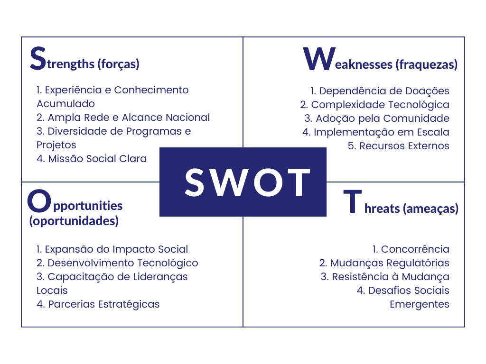

<h6 align="center"> Fonte: Elaborado pelo grupo Fly </h6>

&emsp;&emsp; Neste contexto, a imagem acima é a aplicação da análise SWOT à Rede Gerando Falcões, uma organização dedicada ao desenvolvimento social em comunidades de favelas em todo o Brasil, revela uma série de aspectos cruciais que impactam sua eficácia e sustentabilidade. Logo, nos tópicos seguintes têm-se exploração dessa análise e detalhamento dos principais pontos.

### Forças

Ao avaliar as forças da Gerando Falcões, destacamos quatro pontos cruciais:

1. **Experiência e Conhecimento Acumulado:** A Gerando Falcões possui uma equipe experiente e altamente qualificada, com profundo conhecimento das necessidades e dinâmicas das comunidades de favelas.

2. **Ampla Rede e Alcance Nacional:** Com uma presença em mais de 6000 favelas em todo o Brasil, a Gerando Falcões tem uma rede estabelecida de líderes comunitários e organizações parceiras, permitindo um alcance significativo em suas iniciativas.

3. **Diversidade de Programas e Projetos:** A organização oferece uma variedade de programas e projetos, desde serviços educacionais e econômicos até iniciativas de transformação sistêmica de favelas, demonstrando sua capacidade de abordar múltiplas necessidades das comunidades.

4. **Missão Social Clara:** A Gerando Falcões possui uma missão social clara e bem definida, focada em transformar a vida de crianças, jovens e líderes comunitários por meio da educação, do desenvolvimento econômico e do acesso a oportunidades.

### Fraquezas 

Entretanto, a análise também revela algumas fraquezas que a Gerando Falcões enfrenta, entre elas:

1. **Dependência de Doações:** A organização depende fortemente de doações e financiamento externo para sustentar suas operações, o que pode criar vulnerabilidades financeiras e limitar sua autonomia.

2. **Complexidade Tecnológica:** A adoção e integração de tecnologias podem apresentar desafios devido à complexidade e à necessidade de capacitação da equipe, impactando a eficiência e eficácia dos programas.

3. **Adoção pela Comunidade:** A aceitação e adesão das comunidades às iniciativas da Gerando Falcões podem variar, o que pode afetar a eficácia e a sustentabilidade das intervenções.

4. **Implementação em Escala:** A implementação e expansão de programas em larga escala podem enfrentar desafios logísticos, operacionais e de engajamento comunitário, limitando o alcance e o impacto das iniciativas.

5. **Recursos Externos:** A dependência excessiva de recursos externos, como parcerias e apoio financeiro, pode expor a organização a riscos relacionados à disponibilidade e estabilidade desses recursos.

### Oportunidades

No que diz respeito às oportunidades, a Gerando Falcões apresenta o seguinte cenário:

1. **Expansão do Impacto Social:** A organização tem a oportunidade de ampliar seu impacto social, desenvolvendo e implementando novos programas e projetos que atendam às necessidades emergentes das comunidades.

2. **Desenvolvimento Tecnológico:** O uso estratégico de tecnologias pode melhorar a eficiência operacional, aumentar o alcance e a acessibilidade dos serviços, e proporcionar novas formas de engajamento e participação da comunidade.

3. **Capacitação de Lideranças Locais:** Investir na capacitação contínua de líderes comunitários pode fortalecer a capacidade das comunidades de favelas de autogerenciarem e impulsionarem seu próprio desenvolvimento, garantindo a sustentabilidade das iniciativas a longo prazo.

4. **Parcerias Estratégicas:** A Gerando Falcões pode explorar parcerias estratégicas com outras organizações, instituições governamentais e setor privado para alavancar recursos, conhecimentos e redes, ampliando assim seu impacto e alcance.

### Ameaças

No entanto, há também ameaças a serem consideradas, tais como:

1. **Concorrência:** A concorrência de outras organizações sociais que atuam nas mesmas áreas ou oferecem serviços similares pode limitar o acesso a recursos e colaboradores, bem como impactar a relevância e eficácia das iniciativas da Gerando Falcões.

2. **Mudanças Regulatórias:** Alterações nas políticas públicas ou regulamentações podem afetar negativamente o ambiente operacional e financeiro da organização, exigindo adaptações e ajustes em suas estratégias e programas.

3. **Resistência à Mudança:** A resistência à mudança por parte das comunidades ou de outros stakeholders pode dificultar a implementação e adoção de novas abordagens e tecnologias, retardando o progresso e o impacto das iniciativas.

4. **Desafios Sociais Emergentes:** A emergência de novos desafios sociais, como crises econômicas, pandemias ou desastres naturais, pode sobrecarregar os recursos e capacidades da organização, comprometendo sua capacidade de resposta e continuidade das operações.

&emsp;&emsp; Em suma, ao compreender esses aspectos através da análise SWOT, a Gerando Falcões está melhor equipada para desenvolver estratégias que capitalizem suas forças, mitiguem suas fraquezas, aproveitem as oportunidades disponíveis e enfrentem as ameaças potenciais, garantindo assim sua capacidade de continuar promovendo um impacto positivo nas comunidades de favelas em todo o Brasil.

# 3. Proposta da Solução 

&emsp;&emsp; Essa seção é destinada a detalhar a solução concebida pela equipe fly, focada em descrever as funcionalidades e características do produto mínimo viável (MVP) proposto, bem como a lógica por trás das decisões de design e desenvolvimento. O objetivo é fornecer um entendimento claro das etapas que serão tomadas para atender às necessidades identificadas da Gerando Falcões, garantindo que a solução seja não apenas tecnicamente viável, mas também alinhada com o impacto social que se deseja alcançar.

## 3.1 Descritivo Geral da Solução

&emsp;&emsp; A solução proposta pelo grupo Fly envolve o desenvolvimento de uma plataforma web projetada para otimizar a gestão de atendimentos das ONGs parceiras da Gerando Falcões. Essencialmente, o projeto visa fornecer um sistema que simplifique o cadastro de novos participantes em oficinas, registre de forma eficiente as atividades realizadas e monitore a presença de cada participante. Esta solução simples, eficiente e intuitiva, tem como objetivo centralizar informações importantes sobre os serviços prestados e a participação dos atendidos, permitindo uma análise mais aprofundada e uma gestão mais eficaz.

&emsp;&emsp; A tecnologia por trás da solução é projetada para ser simples, pensando em todo tipo de público, inclusive os que não possuem grande familiaridade com o mundo digital. Para o frontend, será utilizado o framework do React.js, conhecido por sua flexibilidade e facilidade de uso, e para o backend, será utilizado o Node.js, assegurando que tudo funcione de maneira fluída e confiável. Os dados serão organizados através do SQLite, uma escolha estratégica pela sua simplicidade e eficiência em armazenamento de dados. Tudo isso será armazenado na nuvem, utilizando serviços da AWS,  o que significa que é possível aumentar a capacidade conforme necessário, mantendo os dados seguros e acessíveis de qualquer lugar.

&emsp;&emsp; O objetivo desse MVP é mais do que apenas fornecer uma solução tecnológica; é capacitar as ONGs a melhorar a organização das informações coletadas, promovendo uma alocação de recursos mais eficiente, além de permitir à Gerando Falcões um acompanhamento mais detalhado, contribuindo para uma compreensão mais profunda das necessidades das comunidades assistidas. Com a visibilidade proporcionada pela plataforma, é esperado amplificar o  impacto social das atividades das ONGs, alinhando-se à missão da Gerando Falcões de acelerar o poder de impacto de líderes de favelas de todo país.

## 3.2 Proposta Tecnológica e Benefícios

&emsp;&emsp;Neste tópico, será apresentada a arquitetura cloud utilizada para o projeto, que é a forma como os componentes de tecnologia se combinam para criar uma nuvem na qual os recursos são agrupados e compartilhados dentro de uma rede. Existem diferentes tipos de arquitetura cloud, dependendo do nível de controle, flexibilidade e escalabilidade que se deseja, e para o projeto foi escolhido um tipo que atende aos requisitos e objetivos do negócio. A implementação e configuração da arquitetura cloud seguiu as especificações do projeto, utilizando os componentes adequados e garantindo a comunicação entre eles. A arquitetura cloud trouxe vantagens para o projeto, em termos de custo, desempenho, segurança e disponibilidade, que serão discutidos em detalhes a seguir.

### 3.2.1 Tipo de arquitetura de nuvem escolhida 

&emsp;&emsp; Uma arquitetura de nuvem refere-se à estrutura geral e ao design de um sistema de computação em nuvem, que envolve a distribuição de recursos de computação, armazenamento, rede e serviços pela internet. Essa abordagem permite que organizações acessem e utilizem recursos de TI de forma flexível e sob demanda, sem a necessidade de investimentos em infraestrutura física local.

&emsp;&emsp; Existem diversas arquiteturas de nuvem possíveis, cada uma com suas características e benefícios específicos, incluindo:

1. Nuvem Pública: Na nuvem pública, os recursos de computação são hospedados e gerenciados por provedores de serviços em nuvem, como Amazon Web Services (AWS), Microsoft Azure e Google Cloud Platform (GCP). Essa arquitetura oferece escalabilidade, flexibilidade e custos reduzidos, mas pode levantar preocupações sobre segurança e privacidade de dados.

2. Nuvem Privada: Na nuvem privada, a infraestrutura de computação é dedicada a uma única organização e pode ser hospedada internamente ou por um provedor de serviços de nuvem privada. Isso oferece controle total sobre os recursos e maior segurança, mas pode ser mais caro devido aos custos de manutenção da infraestrutura.

3. Nuvem Híbrida: A nuvem híbrida combina elementos de nuvens públicas e privadas, permitindo que as organizações aproveitem os benefícios de ambas as arquiteturas. Ela oferece flexibilidade e escalabilidade, além de permitir integração entre sistemas locais e serviços em nuvem.

4. Nuvem Multicloud: Na nuvem multicloud, uma organização utiliza serviços de vários provedores de nuvem para distribuir seus aplicativos e dados. Isso pode oferecer redundância, diversidade de recursos e evitar lock-in de fornecedor, mas pode aumentar a complexidade de gerenciamento.

&emsp;&emsp; No contexto deste projeto, a arquitetura de nuvem escolhida é a Amazon Elastic Compute Cloud (EC2), que é uma parte fundamental da infraestrutura de nuvem da Amazon Web Services (AWS). A Amazon EC2 permite provisionar e gerenciar instâncias virtuais de servidores em nuvem, oferecendo elasticidade, flexibilidade e confiabilidade para hospedar e executar aplicativos e serviços de forma escalável. Essa escolha foi feita com base na necessidade de escalabilidade, confiabilidade e facilidade de gerenciamento do sistema, bem como na familiaridade e na forte reputação da AWS no mercado de computação em nuvem.

### 3.2.2 Como a arquitetura de nuvem escolhida será utilizada 

&emsp;&emsp;Neste projeto, o objetivo é otimizar a capacidade e a escalabilidade da aplicação usando uma nuvem privada virtual (VPC). Essa escolha se deve ao fato de que a VPC permite utilizar os serviços necessários para o desenvolvimento do projeto presentes na AWS, como o Amazon EC2. Além disso, a VPC abrange sub-redes dentro da sua zona de disponibilidade, onde cada sub-rede padrão é uma sub-rede pública que armazena a Amazon EC2. [6]

&emsp;&emsp;Com a VPC configurada, criaremos uma instância na Amazon EC2, que fornecerá máquinas virtuais para hospedar nossa aplicação. Também configuraremos as ferramentas do front-end e do back-end, sendo elas a Amazon S3 e a Amazon RDS, que auxiliarão no desenvolvimento da aplicação. [7]

&emsp;&emsp;Neste projeto, utilizamos o Amazon S3 e o Amazon RDS como ferramentas de armazenamento e gerenciamento de dados na nuvem. O Amazon S3 é um serviço de armazenamento de objetos que permite armazenar e recuperar qualquer quantidade de dados de qualquer local, com diferentes classes de armazenamento, recursos de gerenciamento e alta durabilidade. 

&emsp;&emsp;O Amazon RDS é um serviço de banco de dados relacional que facilita a configuração, a operação e a escalabilidade de um banco de dados na nuvem, com oito mecanismos populares, alta disponibilidade, alta performance e alta segurança. Esses serviços foram escolhidos por oferecerem flexibilidade, escalabilidade e custo-benefício para o desenvolvimento da aplicação.

### 3.2.3 Benefícios trazidos pela arquitetura de nuvem proposta

&emsp;&emsp;Durante o desenvolvimento deste projeto, fizemos a escolha estratégica de adotar a Amazon Web Services (AWS) como provedora da nossa Arquitetura de Nuvem. Essa decisão é fundamental para garantir uma série de benefícios [8] que impactam diretamente na segurança, acessibilidade, flexibilidade e economia. Abaixo, detalhamos cada um desses aspectos:

#### 1. Segurança Robusta:
&emsp;&emsp;A AWS é reconhecida por sua robusta infraestrutura de segurança, fornecendo uma ampla gama de ferramentas e recursos para proteger os dados e as aplicações hospedadas na nuvem. Com serviços como AWS Identity and Access Management (IAM), AWS Web Application Firewall (WAF) e AWS Key Management Service (KMS), podemos garantir a confidencialidade, integridade e disponibilidade dos nossos sistemas. Além disso, o fato de grandes empresas como Goldman Sachs, Coca-Cola, Johnson & Johnson, Siemens, Shell e Comcast [9] confiarem na AWS atesta a sua credibilidade nesse aspecto.

#### 2. Acesso On-Demand:
&emsp;&emsp;A capacidade sob demanda da AWS permite-nos provisionar recursos de computação, armazenamento e rede conforme necessário. Isso nos possibilita escalabilidade instantânea para lidar com picos de demanda ou ajustar os recursos conforme o fluxo de trabalho do nosso projeto. Essa agilidade operacional garante que tenhamos os recursos adequados no momento certo, evitando desperdícios e mantendo controle total sobre nossas demandas.

#### 3. Flexibilidade:
&emsp;&emsp;Com a AWS, temos a liberdade de escolher entre uma ampla variedade de serviços e soluções para atender às necessidades específicas do nosso projeto. Seja adotando contêineres com Amazon Elastic Kubernetes Service (EKS) ou Amazon Elastic Container Service (ECS), ou optando por computação serverless com AWS Lambda, a flexibilidade da AWS nos permite selecionar a combinação ideal de serviços para atender aos nossos objetivos de negócios e técnicos. No caso deste projeto, a escolha do EC2 [7] foi feita para permitir que os usuários aluguem computadores virtuais onde executam suas próprias aplicações, proporcionando escalabilidade e controle.

#### 4. Modelo de Pagamento por Uso:
&emsp;&emsp;Uma das vantagens mais significativas da AWS é o modelo de pagamento por uso, onde pagamos apenas pelos recursos que consumimos e pelo tempo de utilização. Isso elimina a necessidade de investimentos iniciais em infraestrutura e nos permite otimizar os custos, ajustando os recursos de acordo com a demanda do nosso projeto. Com o Amazon EC2, por exemplo, podemos dimensionar verticalmente ou horizontalmente as instâncias de acordo com as necessidades de processamento, pagando apenas pelo que utilizamos.

&emsp;&emsp;Em resumo, ao escolher a AWS como nossa arquitetura de nuvem, garantimos uma infraestrutura sólida e segura, acesso instantâneo a recursos, flexibilidade para adotar as tecnologias certas e um modelo de pagamento que se alinha com nossas necessidades e orçamento. Isso nos capacita a concentrar nossos esforços no desenvolvimento de soluções inovadoras, enquanto a AWS cuida da infraestrutura subjacente.

## 3.3 Proposta de Valor (Value Proposition Canvas) 
&emsp;&emsp; O Canvas de Proposta de Valor é uma ferramenta fundamental para empresas focadas em inovação e desenvolvimento estratégico, oferecendo um caminho claro para a compreensão e atendimento das necessidades dos clientes [10]. Este modelo ajuda na identificação das dores e expectativas dos clientes, ligando-as diretamente aos produtos e serviços ofertados, o que é crucial para garantir que a proposta de valor esteja alinhada com o que o mercado busca. Distinguindo-se por seu enfoque no cliente, o Canvas de Proposta de Valor facilita a criação de soluções que efetivamente solucionam problemas e satisfazem necessidades.

<h6 align="center"> Figura 4: Canvas Proposta de Valor</h6>
  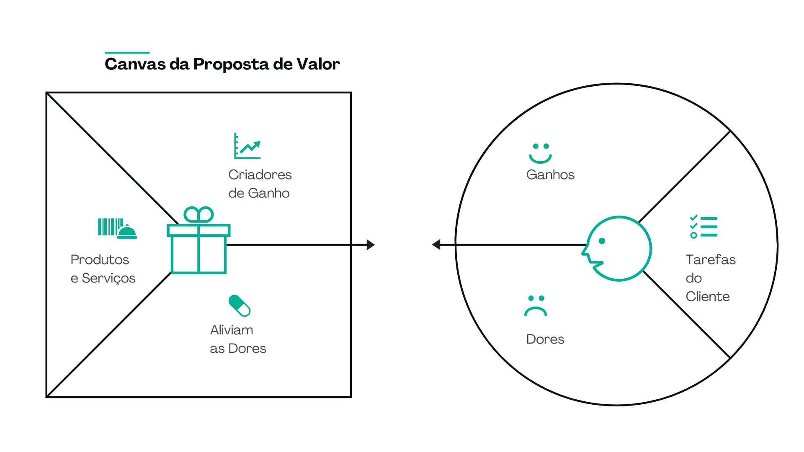
</h6>
<h6 align="center"> Fonte: [11] Canvas da Proposta de Valor, adaptado de Analista Modelos de Negócios (2024). </h6>

&emsp;&emsp; Para o projeto Fly, desenvolvido em colaboração com a Gerando Falcões, o Canvas de Proposta de Valor assume uma importância fundamental ao destacar a necessidade de alinhar a solução tecnológica às necessidades específicas das ONGs atendidas. Este framework permite detalhar de forma clara e objetiva como a solução pode resolver problemas concretos enfrentados pelas organizações, tais como a gestão ineficiente dos atendimentos e a falta de visibilidade sobre o impacto das suas ações. Ao mapear as dores e ganhos dos clientes (ONGs) em relação às funcionalidades e benefícios oferecidos pela solução Fly, é possível garantir que o produto final não apenas atenda às expectativas das organizações, mas também contribua significativamente para a melhoria da gestão e análise de dados, potencializando o impacto social de suas atividades.

#### Proposta de Valor:

**Produtos e Serviços:** Solução tecnológica para gestão de atendimentos, que inclui cadastro de atendidos, registro de frequências, anotações sobre atendimentos, e módulo de visualização de dados.

**Aliviadores de Dor:** Simplificação da gestão de atendimentos, centralização de dados em uma única plataforma, e facilitação da análise do impacto das ações.

**Criadores de Ganho:** Aumento da eficiência operacional das ONGs, melhor visibilidade do impacto social de suas ações, e a promoção de uma gestão baseada em dados.

#### Perfil do Cliente:

**Tarefas do Cliente:** Gestão eficiente dos atendimentos, acompanhamento dos resultados das atividades, e análise do impacto social.

**Dores:** Falta de uma ferramenta de gestão que centralize os dados dos atendimentos, dificuldade na visibilidade e análise do impacto das ações, e a necessidade de cumprimento da LGPD.

**Ganhos Esperados:** Melhoria na eficiência operacional, capacidade de análise de dados para tomada de decisões, e conformidade com normas de proteção de dados.

&emsp;&emsp; A implementação do Canvas de Proposta de Valor para o projeto Fly em parceria com a Gerando Falcões representa um passo crucial na direção de uma solução tecnológica verdadeiramente alinhada com as necessidades das ONGs. 

## 3.4 Matriz de Risco

&emsp;&emsp; De início, é válido destacar o conceito de matriz de risco. Isto é: uma ferramenta visual que auxilia na identificação e priorização dos riscos de um projeto. Para representar essa prioridade dos riscos, utilizamos cores para marcar a probabilidade e o impacto de tal risco acontecer, sendo classificados em baixo, médio ou alto. Por outro lado, a matriz também pode destacar as oportunidades para o projeto, também divindo em probabilidade e impacto, assim como em alto, baixo ou médio. 

&emsp;&emsp; Seguindo este conceito, cita-se abaixo a matriz de risco do grupo Fly:

<h6 align="center"> Figura 5: Matriz de Risco</h6>
<h6 align="center">
  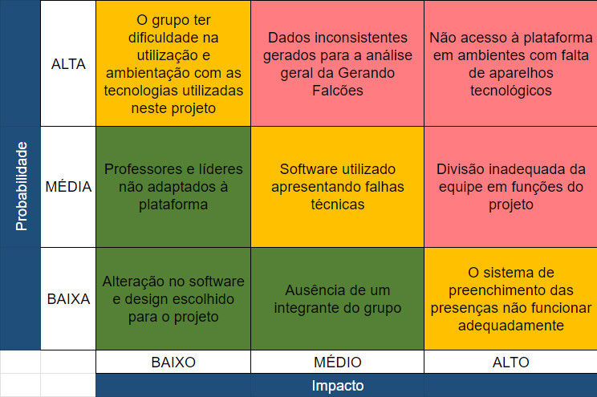
</h6>
<h6 align="center"> Elaboração Fly </h6>

&emsp;&emsp; Para cada risco, um plano de ação para superá-lo caso ocorra durante o desenvolvimento do projeto:

- O grupo ter dificuldade na utilização e ambientação com as tecnologias utilizadas neste projeto: classificado como um risco de probabilidade alta e impacto baixo, a equipe Fly buscará ajuda de colegas e professores, bem como cursos online e fóruns a fim de compreender tal tecnologia para então desenvolver um bom projeto.

- Dados inconsistentes gerados para a análise geral da Gerando Falcões: classificado como um risco de probabilidade alta e impacto médio, o grupo trabalhará com assertividade para que os dados e informações das oficinas, líderes e professores, por exemplo, sejam coerentes e reais quando mostrados para a Gerando Falcões. Ou seja, uma boa conectividade entre as telas, interações e preenchimentos.

- Não acesso à plataforma em ambientes com falta de aparelhos tecnológicos: classificado como um risco de probabilidade alta e impacto alto, a equipe Fly buscará desenvolver uma plataforma bastante simples visando funcionar adequadamento em aparelhos com baixa eficácia e velocidade.

- Professores e líderes não adaptados à plataforma: classificado como um risco de probabilidade média e impacto baixo, o grupo construirá um sistema que seja bastante simples e intuitivo para os usuários, visto que muitos têm baixo letramento digital. A princípio, plataforma em que o usuário acesse os campos necessários com poucos cliques.

- Software utilizado apresentando falhas técnicas: classificado como um risco de probabilidade média e impacto médio, a equipe desenvolverá um sistema em que terá bastante assertividade e conexão em todas as partes a fim de entregar uma solução final correta.

- Divisão inadequada da equipe em funções do projeto: classificado como um risco de probabilidade média e impacto alto, o grupo, juntamente com a orientação dos professores, dividirá de maneira adequada todas as tarefas a fim de não sobrecarregar um indivíduo e, além disso, contribuir com o aprendizado igualitário, fazendo com que todos passem por todas as áreas.

- Alteração no software e no design escolhido para o projeto: classificado como um risco de probabilidade baixa e impacto baixo, a equipe já está bem definida em relação às tecnologias que serão utilizadas, bem como todo o design systema, visto que foi validado com o parceiro. No entanto, caso esse risco ocorra, o grupo trabalhará de maneira clara e objetiva para que essas mudanças não afetem na usabilidade do sistema.

- Ausência de um integrante do grupo: classificado como um risco de probabilidade baixa e impacto médio, o grupo está bem unido, com todas as tarefas bem divididas e sempre adiantadas, para caso alguém fique impossibilitado de realizar sua função, outra pessoa pode desenvolver.

- O sistema de preenchimento das presenças não funcionar adequadamente: classificado como um risco de probabilidade baixa e impacto alto, a equipe Fly definiu como prioridade esta função, visto que é uma das principais dificuldades apresentadas pelo parceiro. No entanto, caso esse risco ocorra, o grupo imediatamente trabalhará na manutenção para que fique funcional o mais rápido possível.

### 3.5 Matriz de Oportunidades

&emsp;&emsp; Assim como a matriz de risco desenvolvida, a equipe Fly trabalhou no desenvolvimento da matriz de oportunidades.

<h6 align="center"> Figura 6: Matriz de Oportunidades</h6>
<h6 align="center">
  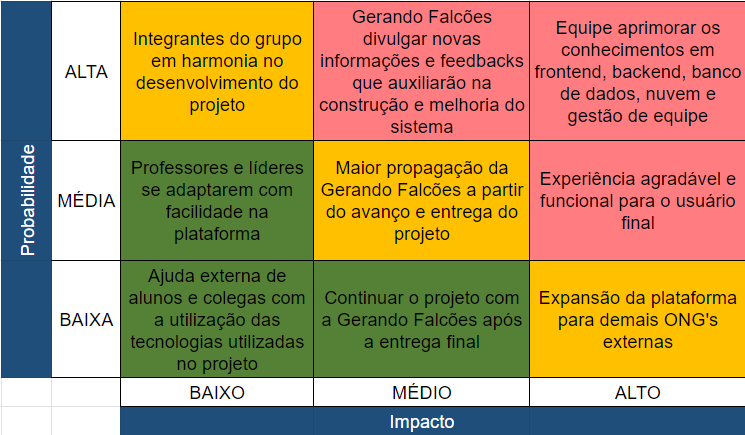
</h6>
<h6 align="center"> Elaboração Fly </h6>

&emsp;&emsp; Desse modo, cita-se em forma de lista as oportunidades que o grupo poderá ter no decorrer deste módulo:

- Integrantes do grupo em harmonia no desenvolvimento do projeto: boa relação entre a equipe e com todos desempenhando suas respectivas tarefas de maneira assertiva.

- Gerando Falcões divulgar novas informações e feedbacks que auxiliarão na construção e melhoria do sistema.

- Equipe aprimorar os conhecimentos em frontend, backend, banco de dados, nuvem e gestão de equipe;

- Professores e líderes se adaptarem com facilidade na plataforma;

- Maior propagação da Gerando Falcões a partir do avanço e entrega do projeto;

- Experiência agradável e funcional para o usuário final;

- Ajuda externa de colegas com a utilização das tecnologias utilizadas no projeto;

- Continuar o projeto com a Gerando Falcões após a entrega final;

- Expansão da plataforma para demais ONG's externas.

&emsp;&emsp; Assim, fechando a matriz de oportunidades.

# 4. Análise de experiência do usuário

&emsp;&emsp; A análise de experiência do usuário é uma etapa essencial no desenvolvimento de qualquer produto ou serviço digital, e não é diferente para a plataforma proposta para a Gerando Falcões. Nesta seção, vamos explorar em detalhes a importância de compreender e melhorar a experiência do usuário, utilizando ferramentas como personas e jornadas.

## 4.1 Personas

&emsp;&emsp; Personas são construções semi-fictícias que espelham as características dos usuários finais e são vitais no processo de desenvolvimento de produtos e serviços. A utilização de personas é fundamental para o desenvolvimento de soluções eficientes, pois oferece uma perspectiva detalhada e abrangente dos clientes potenciais. Incluindo dados demográficos, preferências, objetivos e obstáculos dos utentes, as personas auxiliam na concepção de um design mais eficaz, visando aprimorar a experiência do usuário. Abaixo, estão descritas as três personas desenvolvidas pelo grupo Fly.

### Persona 1: Marcos Leite

<h6 align="center"> Figura 7: Persoa Marcos Leite </h6>

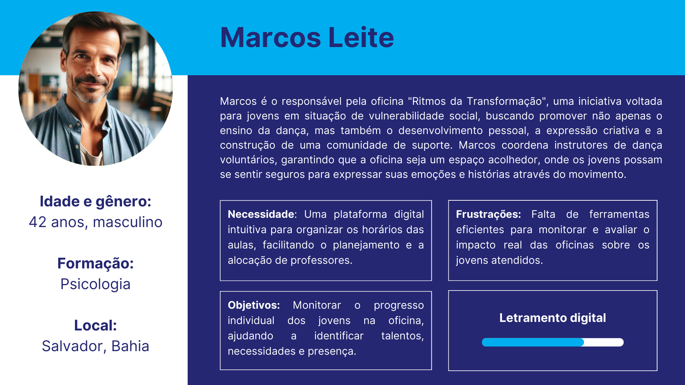

<h6 align="center"> Fonte: Elaborado pelo grupo Fly </h6>

&emsp;&emsp; Marcos Leite é o líder da oficina de dança "Ritmos da Transformação". Embora sua carreira principal seja como psicólogo, Marcos desempenha um papel fundamental na ONG, aplicando seu conhecimento para nutrir um ambiente seguro e propício ao crescimento pessoal dos jovens. Ele utiliza sua competência para garantir que a oficina vá além do ensino de dança, atuando como um catalisador para o desenvolvimento de talentos e a expressão criativa, com o intuito de construir uma forte comunidade de apoio. No entanto, Marcos enfrenta desafios logísticos significativos, particularmente na gestão e organização das oficinas, que requerem uma solução digital que se alinhe com o Requisito Não Funcional 4 [(RNF4)](https://github.com/Inteli-College/2024-T0009-ES05-G05/blob/feature/requisitos-nao-funcionais/documentos/index.md#52-requisitos-n%C3%A3o-funcionais-sprint-1---descri%C3%A7%C3%A3o-o-teste-deve-ser-colocado-no-t%C3%B3pico-de-testes).

&emsp;&emsp; O RNF4 indica a necessidade crítica de um Sistema de gerenciamento de aulas na plataforma. Para atender a essa demanda, a plataforma precisa ser projetada com uma interface intuitiva e flexível que não só simplifique a organização dos horários das aulas e a alocação de professores, mas que também permita a Marcos monitorar o progresso dos jovens de maneira eficiente. A usabilidade é uma prioridade, assegurando que o sistema possa ser facilmente navegado por Marcos, que já tem um horário ocupado e não pode perder tempo com complexidades desnecessárias do software.

### Persona 2: Beatriz Menezes

<h6 align="center"> Figura 8: Persoa Beatriz Menezes </h6>

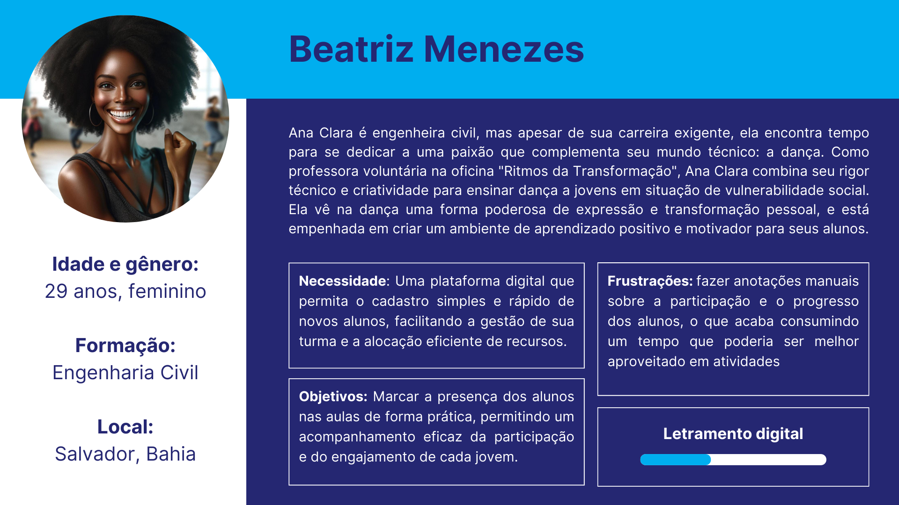

<h6 align="center"> Fonte: Elaborado pelo grupo Fly </h6>

&emsp;&emsp; Beatriz Menezes é Engenheira Civil, e investe seu tempo livre para nutrir talentos e inspirar jovens através da arte, combinando seu rigor técnico com uma paixão que é dançar. Ela atua como professora voluntária na oficina de dança “Ritmos da Transformação”. Apesar de sua habilidade em transmitir conhecimento e inspiração, ela enfrenta desafios administrativos que consomem um tempo precioso, que poderia ser melhor gasto no engajamento com os alunos.

&emsp;&emsp; O Requisito Não Funcional 3 [(RNF3)](https://github.com/Inteli-College/2024-T0009-ES05-G05/blob/feature/requisitos-nao-funcionais/documentos/index.md#52-requisitos-n%C3%A3o-funcionais-sprint-1---descri%C3%A7%C3%A3o-o-teste-deve-ser-colocado-no-t%C3%B3pico-de-testes) é crucial para Beatriz, pois demanda uma interface de usuário simplificada e intuitiva na plataforma digital que ela utiliza. A simplicidade e a intuição são essenciais para facilitar seu trabalho, permitindo que ela realize o cadastro de novos alunos e confira a presença de cada um. A interface deve ser projetada para ser acessível e compreensível, mesmo para usuários como Beatriz, que podem ter um letramento digital menos avançado.

### Persona 3: Carla Souza

<h6 align="center"> Figura 9: Persoa Carla Souza </h6>

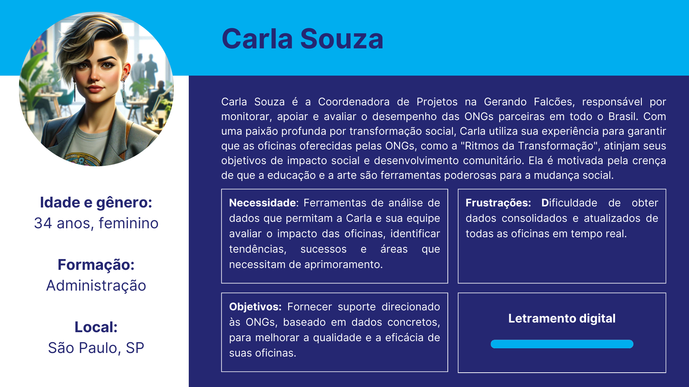

<h6 align="center"> Fonte: Elaborado pelo grupo Fly </h6>

&emsp;&emsp; Carla Souza é uma das principais cabeças por trás da supervisão e apoio às ONGs parceiras na Gerando Falcões. Com 34 anos e formada em administração, Carla traz consigo não apenas uma mente aguçada para negócios, mas também um coração pulsante por mudanças sociais significativas. Ela se dedica a garantir que oficinas como "Ritmos da Transformação" não só alcancem, mas ultrapassem seus objetivos de impacto social e desenvolvimento comunitário. Ela enfrenta o desafio contínuo de coletar e analisar dados de várias oficinas distribuídas pelo país. A necessidade de ter uma visão holística e atualizada das atividades e do impacto dessas oficinas é crucial para o sucesso da missão da Gerando Falcões.

&emsp;&emsp; O Requisito Não Funcional 2 [(RNF2)](https://github.com/Inteli-College/2024-T0009-ES05-G05/blob/feature/requisitos-nao-funcionais/documentos/index.md#52-requisitos-n%C3%A3o-funcionais-sprint-1---descri%C3%A7%C3%A3o-o-teste-deve-ser-colocado-no-t%C3%B3pico-de-testes) vem ao encontro das necessidades de Carla. Com dashboards interativos integrados à plataforma, Carla poderá ter acesso instantâneo a dados atualizados, permitindo-lhe monitorar o desempenho das ONGs eficientemente. Essa funcionalidade é fundamental para a Eficiência de Desempenho do sistema, permitindo a Carla não apenas visualizar as informações de forma clara e concisa, mas também manipular e extrair insights acionáveis sem demora. Isso significa poder identificar tendências, celebrar sucessos e reconhecer áreas que precisam de atenção extra quase instantaneamente.

&emsp;&emsp; Em suma, o desenvolvimento de uma boa plataforma depende do entendimento profundo das necessidades e desafios específicos dos usuários finais. As personas de Marcos, Beatriz e Carla são fundamentais para o grupo de desenvolvedores não só atender, mas também exceder as expectativas dos utentes, integrando simplicidade e acessibilidade. Portanto, a atenção aos detalhes na definição de personas é fundamental para garantir que um produto seja verdadeiramente centrado no usuário e bem-sucedido no mercado.

## 4.2 Mapa de jornada do usuário

&emsp;&emsp;A jornada do usuário é uma representação visual e narrativa do caminho que um usuário percorre ao interagir com um sistema, serviço ou produto, desde a descoberta inicial até o alcance de seus objetivos específicos. Ela descreve as etapas que o usuário realiza, suas ações, pensamentos e emoções ao longo desse processo. Nesta análise, exploraremos três jornadas distintas, cada uma centrada em um usuário específico e suas experiências únicas enquanto interagem com a plataforma. Neste contexto, existem três tipos de usuários diferentes na plataforma, cada um com suas próprias necessidades e objetivos, essa divisão foi pensada com base nas principais funções do perfil de cada uma das nossas personas descritas na seção 4.2 dessa documentação.

### Primeira jornada

<h6 align="center"> Figura 10: Primeira Jornada do Usuário </h6>

<h6 align="center"> Fonte: Elaborado pelo grupo Fly </h6>

&emsp;&emsp;Conforme as etapas ilustradas na imagem acima, os textos abaixo tem como objetivo detalhar cada etapa da jornada da persona Carla enquanto usuária da plataforma:

#### Acesso à Plataforma:

&emsp;&emsp; Carla acessa a plataforma digital da Gerando Falcões usando suas credenciais de login.

#### Visão Geral das ONGs Parceiras:

&emsp;&emsp; Ao acessar a plataforma, Carla é apresentada a uma visão geral das ONGs parceiras listadas. Ela pode ver informações básicas sobre cada uma, como nome, localização e área de atuação. dessa forma, ela pode selecionar uma ONG, como a "Ritmos da Transformação", para obter mais detalhes sobre suas oficinas, ver informações específicas sobre horários de aulas, professores envolvidos e o progresso dos alunos inscritos.

#### Explorando Dados e Métricas:

&emsp;&emsp; Carla navega pelas ferramentas de análise de dados da plataforma, buscando métricas relevantes para avaliar o impacto das oficinas. Ela visualiza gráficos e relatórios que mostram o progresso dos alunos, taxas de participação e outras métricas-chave. no caso de uma ONG específica como a "Ritmos da Transformação", Carla acessa dados detalhados sobre o desempenho das oficinas de dança.
Ela examina relatórios de participação, feedback dos alunos e qualquer outra informação relevante disponível na plataforma.

#### Identificação de Áreas para Melhoria:

&emsp;&emsp; Com base nos dados analisados, Carla identifica áreas específicas onde a ONG pode melhorar, como aumentar a participação dos alunos ou ajustar o currículo das aulas.
Ela pode deixar comentários ou recomendações diretamente na plataforma para a equipe da ONG. Além disso, ela pode compartilhar essa mesma análise e os insights obtidos com sua equipe na Gerando Falcões, discutindo possíveis estratégias para apoiar melhor as ONGs parceiras. Ela utiliza as ferramentas de colaboração da plataforma para compartilhar relatórios e informações relevantes.

#### Acompanhamento do Progresso:

&emsp;&emsp; Carla continua a monitorar o progresso das oficinas ao longo do tempo, revisitando regularmente os dados e métricas disponíveis na plataforma.
Ela ajusta suas estratégias de suporte com base nas mudanças observadas e nos resultados obtidos pelas ONGs parceiras.

### Segunda jornada

<h6 align="center"> Figura 11: Segunda Jornada do Usuário </h6>

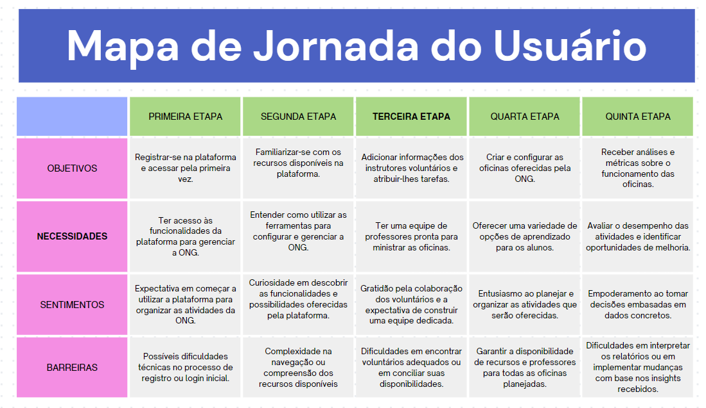

<h6 align="center"> Fonte: Elaborado pelo grupo Fly </h6>

&emsp;&emsp;Conforme as etapas ilustradas na imagem acima, os textos abaixo tem como objetivo detalhar cada etapa da jornada da persona Marcos enquanto usuário da plataforma:

#### Registro e Primeiro Acesso:

&emsp;&emsp;Marcos irá se inscrever na plataforma, preenchendo um formulário de registro e o enviando para a Gerando Falcões criar o seu acesso.
Ele recebe uma confirmação por e-mail e faz login pela primeira vez. Logo, a persona deve cadastrar seu perfil com suas informações, após esse processo ele é solicitado a configurar a sua ONG "Ritmos da Transformação" que está diretamente atrelada ao seu nome, incluindo informações sobre sua localização, horários de funcionamento e detalhes sobre as oficinas existentes. 

#### Explorando Recursos:

&emsp;&emsp;Ele navega pelos diferentes recursos da plataforma, como o calendário de horários de aulas e a seção de cadastro de professores.
Marcos experimenta a facilidade de uso da interface para adicionar e editar informações, ele tem todas as permissões que um professor/voluntário tem, podendo configurar horários de aulas e cadastrar/visualizar alunos, mas essas tarefas são preferencialmente realizadas pelos professores e voluntários.

#### Cadastro de Professores e Voluntários:

&emsp;&emsp;Ele adiciona os detalhes dos instrutores voluntários, incluindo seus nomes, especialidades de dança e disponibilidade de horários.
Marcos pode atribuir instrutores a aulas específicas, garantindo uma distribuição equilibrada de talentos e recursos. Dessa forma, ao cadastrar um professor novo, Marcos pode conceder um login para este professor com permissões especificas da função.

#### Cadastro de Oficinas:

&emsp;&emsp;Marcos inicia o processo de cadastro de oficinas, que são como turmas na ONG "Ritmos da Transformação". Ele define os diferentes temas das oficinas, como dança, pintura, inglês, artes, entre outros, e atribui um professor ou professores responsáveis por cada uma delas. Além disso, ele organiza os horários disponíveis para cada oficina, levando em consideração a disponibilidade dos professores e a demanda dos alunos.

&emsp;&emsp;Durante o cadastro, Marcos também inclui informações detalhadas sobre cada oficina, como a descrição do conteúdo programático, os materiais necessários, a faixa etária dos alunos atendidos e qualquer outra informação relevante. Ele verifica se todas as oficinas estão corretamente configuradas para garantir uma experiência consistente e de qualidade para os participantes.

#### Recebendo Insights da Gerando Falcões:

&emsp;&emsp;Após o cadastro das oficinas e o início das atividades, Marcos começa a receber relatórios e insights gerados pela plataforma da Gerando Falcões. Esses relatórios fornecem análises detalhadas sobre o engajamento dos alunos em cada oficina, os padrões de participação ao longo do tempo e outras métricas relevantes.

&emsp;&emsp;Utilizando essas informações, Marcos é capaz de avaliar o desempenho de cada oficina individualmente, identificar áreas de melhoria e tomar decisões informadas para otimizar o funcionamento da ONG "Ritmos da Transformação". Ele pode ajustar os horários das oficinas, revisar o conteúdo programático com base no feedback dos alunos e dos professores, e até mesmo expandir o alcance da ONG com base nas demandas identificadas através dos insights fornecidos pela plataforma. Essa abordagem orientada por dados ajuda Marcos a garantir que a ONG esteja cumprindo sua missão de promover a transformação social através da educação e das artes.

### Terceira Jornada

<h6 align="center"> Figura 12: Terceira Jornada do Usuário </h6>

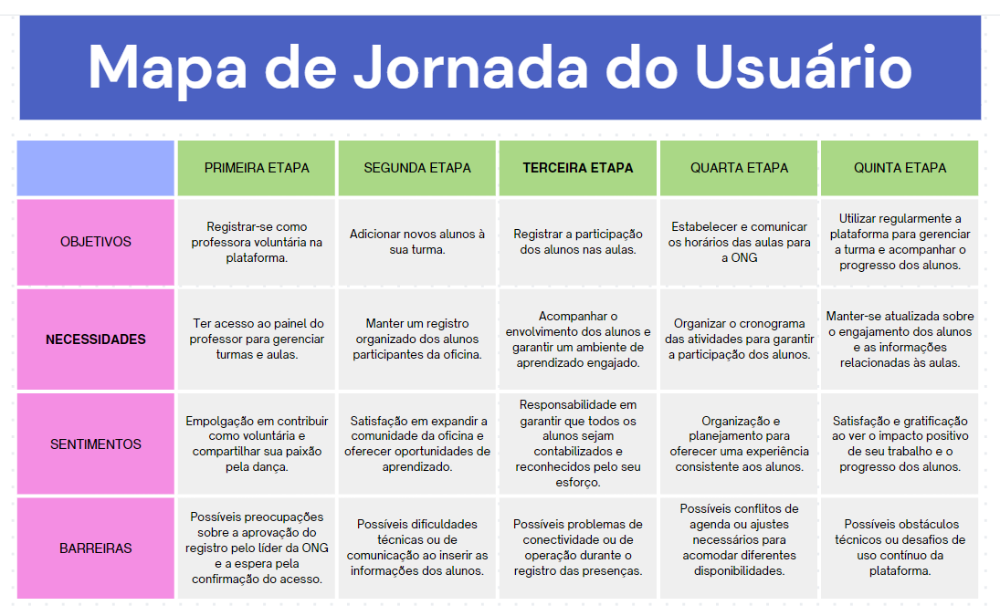

<h6 align="center"> Fonte: Elaborado pelo grupo Fly </h6>

&emsp;&emsp;Conforme as etapas ilustradas na imagem acima, os textos abaixo tem como objetivo detalhar cada etapa da jornada da persona beatriz enquanto usuária da plataforma:

#### Registro na Plataforma:

&emsp;&emsp; Beatriz acessa a plataforma digital da Gerando Falcões ou da própria ONG "Ritmos da Transformação" para se cadastrar como professora voluntária.
Ela preenche um formulário de registro simples, fornecendo suas informações básicas e detalhes sobre sua experiência em dança. Esse registro é apresentado para o líder da ONG que pode aprovar a Beatriz como professora ou não. Além desse caso, o líder pode optar por criar o login da sua professora. Após o registro, Beatriz recebe acesso ao painel do professor na plataforma, onde pode gerenciar sua turma de alunos e registrar a presença nas aulas.

#### Cadastro de Novos Alunos:

&emsp;&emsp; Beatriz utiliza a funcionalidade de cadastro de alunos para adicionar novos membros à sua turma.
Ela insere informações básicas, como nome, idade e contato, para criar perfis individuais para cada aluno, esse cadastro não irá conceder acesso ao aluno para a plataforma, mas será importante para gerar dados como engajamento. Além disso, a partir desse cadastro inicial Beatriz pode acompanhar o engajamento de seus alunos ao longo do tempo, registrando regularmente sua participação nas aulas.
Ela pode identificar tendências de participação e detectar alunos que possam precisar de apoio adicional ou incentivo.

#### Registro de Presença:

&emsp;&emsp; Durante as aulas, Beatriz utiliza a funcionalidade de registro de presença na plataforma para marcar a participação de cada aluno.
Ela pode usando um sistema de check-in automatizado integrado à plataforma.

#### Configurando Horários de Aulas:

&emsp;&emsp;Beatriz começa a inserir os horários das aulas da oficina que é professora em um calendário, especificando a data, hora e local de cada sessão.
Ele pode visualizar facilmente os horários das aulas em um formato intuitivo de calendário semanal ou mensal. 

#### Continuidade do Uso:

&emsp;&emsp;Beatriz continua a utilizar a plataforma regularmente como parte de seu trabalho como professora voluntária na oficina "Ritmos da Transformação", encontrando valor na facilidade de gerenciamento de sua turma e no acompanhamento da participação dos alunos, ela gosta da funcionalidade de registrar seu horário de aula na plataforma e se sente feliz ao visualizar os resultados positivos de engajamento.

#### Conclusões

&emsp;&emsp; Dado essas supostas experiências dos usuários no protótipo apresentado, fica evidente o papel fundamental que a plataforma digital desempenha no apoio às atividades das ONGs e na promoção da transformação social. Ao acompanhar Carla, Marcos e Beatriz em suas jornadas, testemunhamos não apenas os desafios enfrentados, mas também os sucessos alcançados através do uso eficaz da tecnologia.

&emsp;&emsp; As análises de dados fornecidas pela plataforma capacitam os usuários a tomar decisões informadas, identificar áreas para melhoria e, em última análise, criar um impacto positivo nas comunidades atendidas. À medida que avançamos, é importante continuar a aprimorar e aperfeiçoar a plataforma, garantindo que ela continue a atender às necessidades em constante evolução das ONGs e de seus colaboradores voluntários.

# 5. Requisitos

&emsp;&emsp; A fim de solucionar um problema apresentado pela Gerando Falcões, o grupo Fly entregará uma solução completa e que atenda às necessidades do parceiro. No entanto, para que o resultado seja bem sucedido, é indispensável a definição dos requisitos da solução. Desse modo, é dividido em sete etapas, sendo a de concepção, elicitação, elaboração, negociação, especificação, validação e gerenciamento. Segundo o site "Mestres da Web" em "Requisitos Funcionais e não funcionais: o que são?", a concepção define a visão geral do sistema pelos principais envolvidos no projeto e a elicitação é a divisão dos requisitos funcionais e não funcionais.

&emsp;&emsp; Nesta etapa, a elaboração, tudo o que foi definido anteriormente é transformado em diagramas. Já a negociação são os acordos com o consumidor a respeito do que será mantido ou descartado no projeto. A especificação são todos os requisitos aprovados e que são transformados em especificações técnicas. A etapa da validação é para validar com os envolvidos no projeto tudo o que foi elaborado. Por fim, o gerenciamento, que garante que os requisitos aprovados e aplicados continuem em conformidade com o que foi definido. Desse modo, definindo os requisitos da solução.

&emsp;&emsp; Abaixo, detalhamento dos requisitos identificados para o sistema, divididos em requisitos funcionais e não funcionais. Cada funcionalidade e restrição do sistema é explorada para garantir uma compreensão clara do que é necessário para o desenvolvimento da solução.

## 5.1 Requisitos Funcionais 

&emsp;&emsp; Requisitos funcionais descrevem as ações específicas que o sistema deve ser capaz de realizar em termos de operações, serviços ou atividades específicas a fim de atender às necessidades do usuário. Os requisitos funcionais atuam nas ações que o sistema deve executar, sem se preocupar com os detalhes de como essas ações serão implementadas. Além disso, descrevem as entradas necessárias para que o sistema realize a ação, os dados manipulados, bem com as saídas esperadas.

&emsp;&emsp; São importantes pois definem o escopo do projeto, guiam o desenvolvimento do sistema e facilitam a comunicação entre as partes interessadas.

&emsp;&emsp; A seguir, exemplos de requisitos funcionais a respeito do projeto a ser desenvolvido em parceria com a Gerando Falcões, e considerando as necessidades de cada uma das Personas (Marcos, Beatriz e Carla).

| ID   | Requisito Funcional                                      | Descrição de Teste                                                                                                                                                                                                                                                                                                                    | Critérios de Aceitação                                                                                                         |
|------|----------------------------------------------------------|---------------------------------------------------------------------------------------------------------------------------------------------------------------------------------------------------------------------------------------------------------------------------------------------------------------------------------------|-------------------------------------------------------------------------------------------------------------------------------|
| RF01 | O sistema deve permitir o cadastro de oficinas           | **Pré-condição:** Usuário logado com perfil de líder. **Procedimento de Teste:** Inserir informações da oficina, incluindo número mínimo de alunos, e submeter. **Resultado Esperado:** Oficina cadastrada com sucesso. **Pós-condição:** Oficina com detalhes e mínimo de alunos exigido listada no sistema.                   | Oficina cadastrada sem erros e com todas as informações corretas.                                                             |
| RF02 | O sistema deve registrar presença e frequência dos alunos | **Pré-condição:** Alunos e oficinas cadastrados. **Procedimento de Teste:** Marcar presença dos alunos e verificar frequência. **Resultado Esperado:** Presença e frequência dos alunos registradas com sucesso. **Pós-condição:** Informações de presença e frequência refletidas no perfil do aluno.                                | Registro de presença e frequência preciso e refletido corretamente no sistema.                                                |
| RF03 | O sistema deve cadastrar novos alunos                    | **Pré-condição:** Acesso ao sistema com perfil de professor. **Procedimento de Teste:** Realizar cadastro de novos alunos, inserindo dados obrigatórios. **Resultado Esperado:** Alunos cadastrados com sucesso. **Pós-condição:** Alunos novos listados no sistema com todas as informações fornecidas.                            | O cadastro de novos alunos deve ser feito sem erros, armazenando todas as informações corretamente.                           |
| RF04 | O sistema deve operar offline e sincronizar dados         | **Pré-condição:** Internet não disponível. **Procedimento de Teste:** Realizar operações enquanto offline e sincronizar ao reconectar. **Resultado Esperado:** Sistema opera offline e sincroniza ao reconectar. **Pós-condição:** Dados sincronizados com o servidor quando a conexão é restabelecida.                          | Capacidade de trabalhar offline e sincronizar dados sem perda ou corrupção de informações.                                    |
| RF05 | O sistema deve importar dados de um template em Excel     | **Pré-condição:** Template em Excel preenchido disponível. **Procedimento de Teste:** Importar dados do template para o sistema. **Resultado Esperado:** Dados importados com sucesso. **Pós-condição:** Dados do template refletidos corretamente no sistema.                                                                 | Importação de dados precisa, validação de informações para evitar duplicidade e erros.                                        |
| RF06 | O sistema deve validar dados para evitar duplicidade      | **Pré-condição:** Dados importados ou inseridos manualmente. **Procedimento de Teste:** Verificar sistema de validação de dados ao inserir ou importar. **Resultado Esperado:** Sistema valida e alerta sobre possíveis duplicidades. **Pós-condição:** Usuário notificado sobre duplicidades e guiado por resolução.             | Validação de dados eficaz para garantir a integridade do banco de dados.                                                      |
| RF07 | O sistema deve prover visualizações simples e unificadas  | **Pré-condição:** Dados de múltiplas oficinas e alunos disponíveis. **Procedimento de Teste:** Acessar diferentes visualizações de dados no sistema. **Resultado Esperado:** Visualizações claras e coesas apresentadas ao usuário. **Pós-condição:** Usuários têm uma visão unificada e simplificada das informações necessárias. | Visualizações de dados devem ser amigáveis ao usuário, fornecendo uma compreensão rápida e clara das informações.             |
| RF08 | O sistema deve fornecer estatísticas de nível de ONG      | **Pré-condição:** Dados acumulados das oficinas de várias ONGs. **Procedimento de Teste:** Gerar estatísticas gerais das ONGs. **Resultado Esperado:** Estatísticas geradas e visualizadas com sucesso. **Pós-condição:** GF tem visão geral das estatísticas das ONGs.                                                                 | Estatísticas gerais das ONGs precisas e atualizadas, permitindo uma visão de alto nível para tomada de decisão.               |
| RF09 | O sistema deve coletar feedback das oficinas              | **Pré-condição:** Oficinas realizadas e dados de feedback disponíveis. **Procedimento de Teste:** Coletar e analisar feedback das oficinas. **Resultado Esperado:** Feedback coletado e analisado com sucesso. **Pós-condição:** Feedback disponível para revisão e ações de melhoria.                                                | Coleta e análise de feedback eficientes, permitindo melhorias contínuas nas oficinas.                                         |
| RF10 | O sistema deve gerenciar informações da ONG               | **Pré-condição:** Usuário com permissão de líder da ONG. **Procedimento de Teste:** Inserir e atualizar informações da ONG. **Resultado Esperado:** Informações da ONG gerenciadas com sucesso. **Pós-condição:** Informações atualizadas e precisas da ONG disponíveis no sistema.                                                    | Gerenciamento de informações da ONG de forma eficiente, mantendo a precisão dos dados.                                        |

&emsp;&emsp; Sendo assim, esses requisitos são fundamentais para garantir que o sistema atenda às necessidades específicas das ONGs e proporcione uma gestão eficaz, visibilidade e controle sobre as atividades realizadas. Com a implementação bem-sucedida desses requisitos, espera-se melhorar significativamente a operação, a análise de dados e o engajamento entre professores, alunos e líderes, alinhando-se aos objetivos estratégicos da organização.

## 5.2 Requisitos não Funcionais

&emsp;&emsp; Requisitos não funcionais referem-se às características de qualidade de um sistema, descrevendo como o sistema deve operar, em vez de quais funções o sistema deve executar. Eles são cruciais para garantir a eficiência, usabilidade, confiabilidade e outros aspectos de qualidade de um software ou sistema de informação. Esses requisitos definem os critérios que podem ser usados para julgar a operação de um sistema, em contraste com as funcionalidades específicas que o sistema realiza.

&emsp;&emsp; A ISO/IEC 25010, também conhecida como SQuaRE (System and Software Quality Requirements and Evaluation), é uma norma internacional que define e categoriza a qualidade de produtos de software e sistemas. Ela foi criada pela Organização Internacional para Padronização (ISO) e pela Comissão Eletrotécnica Internacional (IEC). A norma é amplamente utilizada por desenvolvedores de software para avaliar e assegurar a qualidade dos produtos de software ao longo do ciclo de vida do desenvolvimento. Na tabela abaixo é possível analisar os requisitos pensados pelo grupo Fly referente à plataforma desenvolvida.

|  ID  |  Requisito Não Funcional  |  Descrição  |  Iso relacionada  |
|------|---------------------------|-------------|-------------------|
| RNF01 | Controle de Acesso Baseado em Papéis (RBAC) | A plataforma deve implementar um mecanismo de Controle de Acesso Baseado em Papéis (RBAC) para garantir que usuários autenticados tenham acesso apenas às informações e funcionalidades relevantes para seu papel específico dentro do sistema. Este mecanismo deve ser flexível o suficiente para acomodar três categorias principais de usuários: ONGs e líderes, professores e a equipe da Gerando Falcões, cada uma com diferentes níveis de acesso e permissões. | Segurança (Security), pois protege os dados de serem alterados ou danificados por pessoas não autorizadas. O RBAC contribui para isso ao restringir as permissões de edição e atualização de dados conforme o papel do usuário. |
| RNF02 | Dashboards Interativos | A plataforma deve prover dashboards interativos que facilitam a visualização e manipulação de dados em tempo real, permitindo o acompanhamento e desempenho das ONGs, identificando tendências e extraindo insights acionáveis de forma intuitiva e dinâmica. |  Eficiência de Desempenho (Performance Efficiency), pois este requisito está relacionado à eficiência na visualização de dados, um aspecto crucial para o desempenho eficiente do sistema. |
| RNF03 |  Interface de Usuário Simplificada e Intuitiva |  A plataforma deve oferecer uma interface de usuário (UI) simplificada e intuitiva, que minimize a complexidade e facilite a navegação e a utilização do sistema por usuários com baixo letramento digital. O design deve ser claro e direto, removendo barreiras desnecessárias para o acesso e o uso eficaz das funcionalidades da plataforma. |Usabilidade (Usability), pois este requisito busca garantir uma interface que seja facilmente utilizada por usuários de diferentes níveis de letramento digital, alinhando-se ao princípio de usabilidade. |
| RNF04 | Sistema de Gerenciamento de Aulas | A plataforma deve oferecer um sistema de gerenciamento de aulas intuitivo e flexível que permita organizar facilmente os horários das aulas, alocar professores e monitorar o progresso dos jovens. | Usabilidade (Usability), pois este requisito destina-se a assegurar que a plataforma ofereça uma experiência de usuário prática e flexível. |
| RNF05 |  Estabilidade e Precisão no Gerenciamento de Dados | A plataforma deve prover um ambiente estável e confiável para o gerenciamento e armazenamento de dados, assegurando que as informações relativas às aulas, aos professores e ao progresso dos alunos sejam mantidas com precisão e sem perdas. |  Confiabilidade (Reliability), pois este requisito foca em assegurar que a plataforma opere de forma consistente e precisa, mantendo a integridade e a disponibilidade dos dados críticos para o gerenciamento das oficinas e o acompanhamento do progresso dos alunos. |

<h6 align="center"> Fonte: Elaborado por Grupo Fly </h6>

&emsp;&emsp; Na seção [9.5](https://github.com/Inteli-College/2024-T0009-ES05-G05/blob/feature/requisitos-nao-funcionais/documentos/index.md#95-testes-de-requisitos-n%C3%A3o-funcionais-sprint-1---caso-de-teste-rnf) desde documento, é possível analisar os testes referentes à estes requisitos, que são fundamentais durante o ciclo de desenvolvimento do software, influenciando desde a escolha das tecnologias até as práticas de design e implementação. Eles ajudam a assegurar que o sistema final não só atenda às necessidades funcionais dos usuários, mas também ofereça uma experiência de qualidade, seja sustentável a longo prazo, e alinhe-se com os objetivos de negócios e tecnologia.

## 5.3 Casos de Uso e Histórias dos Usuários

&emsp;&emsp;Os casos de uso visam a gerenciar a complexidade do domínio do problema, fragmentando as funcionalidades do sistema em casos individuais. Isso possibilita a realização de discussões e descrições textuais em contextos mais específicos e menores.

### Atores

&emsp;&emsp;Um ator trata-se de qualquer coisa que precise interagir com o sistema, tais como usuários e outros sistemas que se comunicam com o sistema em questão. Nesse sentido, foram definidos os seguintes atores para o projeto desse documento:

GF: Representante do Gerando Falcões  
Líder: Líder da ONG  
Professor: Professor da ONG

### Cadastro de Oficinas

<h6 align="center"> Figura 13: Primeiro Caso de Uso </h6>

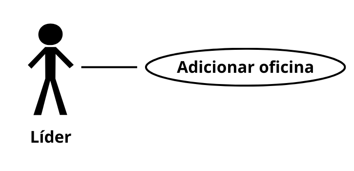

<h6 align="center"> Fonte: Elaborado pelo grupo Fly </h6>

A imagem acima representa o primeiro caso de uso, que consiste no cadastro de oficinas:

    História de Usuário: "Eu, enquanto líder de uma ONG, desejo poder cadastrar novas oficinas em nossa plataforma, para oferecer uma variedade de atividades para os participantes."
    
    Descrição: Este caso de uso aborda o cadastro das oficinas conduzidas pelas ONGs parceiras do Gerando Falcões, um procedimento facilitado pelo líder da unidade. Para tal, o usuário inicia selecionando a opção "Adicionar Oficina" na tela inicial. Em seguida, são inseridas informações como nome da oficina, nome, CNPJ, endereço, telefone, e-mail, e os dias da semana em que as oficinas serão realizadas. Além disso, é possível cadastrar os professores responsáveis.

<h6 align="center"> Figura 14: Segundo Caso de Uso </h6>

  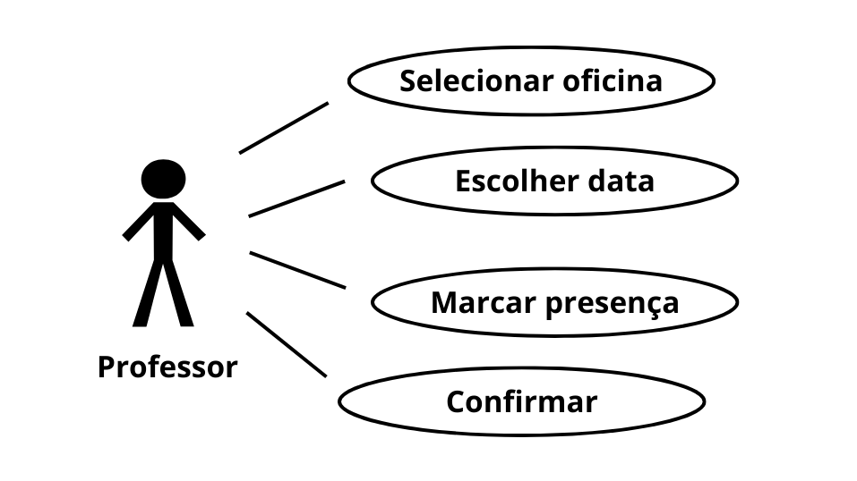

<h6 align="center"> Fonte: Elaborado pelo grupo Fly </h6>

A imagem acima possui três casos de uso do professor voluntário da ONG, entre eles:

### Selecionar Oficina

1. Diagrama de Caso de Uso: "Selecionar Oficina"

    História de Usuário: "Eu, como professor voluntário, desejo poder visualizar todas as oficinas que faço parte, para escolher aquela na qual desejo realizar ações"
    
    Descrição: O professor voluntário acessa a plataforma e visualiza todas as oficinas disponíveis. Ele navega pelas opções e seleciona a oficina na qual deseja visualizar.

### Definir datas para oficinas

2. Diagrama de Caso de Uso: "Escolher Data para Oficina
    
    História de Usuário: "Eu, como professor voluntário, desejo poder escolher a data e hora para a oficina na qual serei voluntário, para me programar adequadamente."
    
    Descrição: Após selecionar a oficina desejada, o professor voluntário é direcionado para escolher a data e hora específicas para participar da oficina.

### Registrar presença de Alunos

3. Diagrama de Caso de Uso: "Registrar Presença de Alunos"

    História de Usuário: "Eu, como professor voluntário, desejo poder marcar a presença dos alunos participantes na oficina, para garantir um registro preciso de sua participação e engajamento."
    
    Descrição: Durante a realização da oficina, o professor voluntário tem a capacidade de marcar a presença dos alunos participantes, garantindo um registro preciso de quem esteve presente na atividade.

### Visualização de Estatísticas

<h6 align="center"> Figura 15: Terceiro Caso de Uso </h6>

  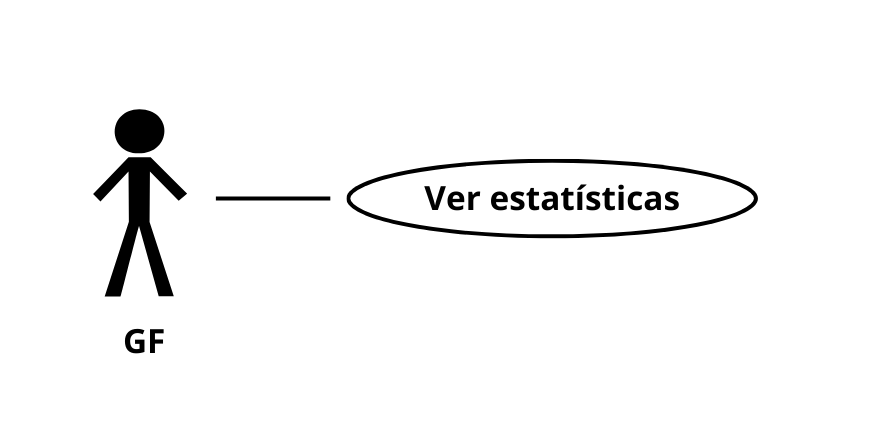

<h6 align="center"> Fonte: Elaborado pelo grupo Fly </h6>

Na imagem acima, temos o caso de uso "Visualizar Relatórios de Engajamento":

    História de Usuário: "Eu, como funcionário da Gerando Falcões, desejo poder visualizar os relatórios da plataforma sobre o engajamento dos participantes nas oficinas, para avaliar o impacto de nossos programas e tomar decisões informadas."
    
    Descrição: Este caso de uso permite que o funcionário da Gerando Falcões visualize os relatórios da plataforma sobre o engajamento dos participantes nas oficinas, fornecendo informações valiosas para avaliar o impacto dos programas.

### Gerar Relatórios

<h6 align="center"> Figura 16: Quarto Caso de Uso </h6>

  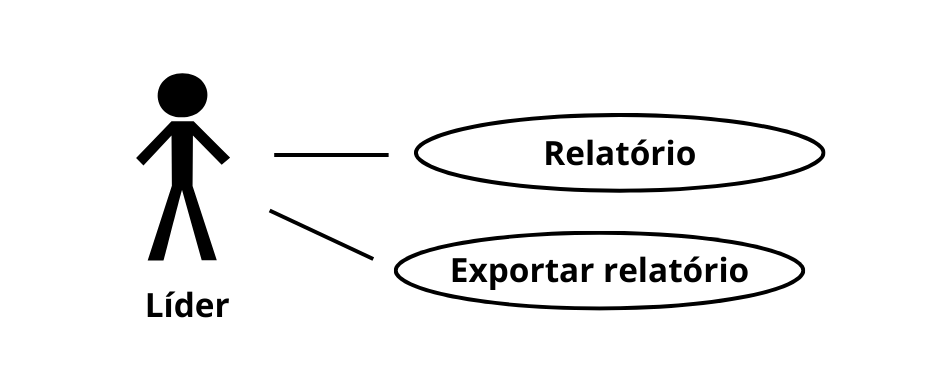

<h6 align="center"> Fonte: Elaborado pelo grupo Fly </h6>

Nesta imagem, temos o caso de Uso "Gerar Relatórios":

    História de Usuário: "Eu, como líder de uma ONG, desejo poder gerar relatórios sobre o desempenho das atividades realizadas em nossas oficinas, para avaliar o impacto de nossos programas e identificar áreas de melhoria."
    
    Descrição: Esse caso de uso permite que o líder da ONG gere relatórios sobre o desempenho das oficinas e o engajamento dos participantes, fornecendo insights valiosos para avaliar a eficácia dos programas.

<h6 align="center"> Figura 17: Quinto Caso de Uso </h6>

  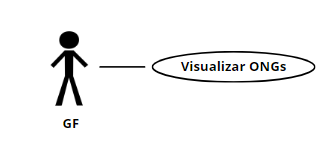

<h6 align="center"> Fonte: Elaborado pelo grupo Fly </h6>

Na imagem acima, temos o caso de uso "Visualizar ONGs": 
    
    História de Usuário: "Eu, como funcionário da Gerando Falcões, desejo poder visualizar todas as ONGs cadastradas na plataforma, para acompanhar nossas parcerias e identificar oportunidades de colaboração."
    
    Descrição: Este caso de uso permite que o funcionário da Gerando Falcões visualize todas as ONGs cadastradas na plataforma, fornecendo uma visão geral das parcerias estabelecidas.

<h6 align="center"> Figura 18: Sexto Caso de Uso </h6>

  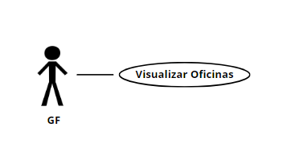

<h6 align="center"> Fonte: Elaborado pelo grupo Fly </h6>

Na imagem acima, temos o Diagrama de Caso de Uso: "Visualizar Oficinas e ONGs":

    História de Usuário: "Eu, como funcionário da Gerando Falcões, desejo poder visualizar as oficinas disponíveis na plataforma e quais ONGs oferecem cada tipo de oficina, para coordenar melhor nossas atividades e recursos."
    
    Descrição: Esse caso de uso permite que o funcionário da Gerando Falcões visualize as oficinas disponíveis na plataforma e quais ONGs oferecem cada tipo de oficina, facilitando a coordenação de recursos.

&emsp;&emsp; Portanto, os casos de uso abordados nesta seção englobam uma diversidade de atividades fundamentais, desde o processo de cadastro de oficinas até a elaboração de relatórios detalhados sobre as atividades realizadas. Cada caso de uso é cuidadosamente acompanhado por uma história de usuário que descreve precisamente a necessidade específica que ele visa atender. Essa abordagem garante que as funcionalidades do sistema sejam desenvolvidas de forma alinhada com as expectativas e necessidades dos usuários, resultando em uma plataforma que atende efetivamente às demandas do ambiente operacional.

# 6. Projeto de Solução

&emsp;&emsp; Nesta seção, exploraremos os detalhes fundamentais relacionados aos diagramas de implementação e à infraestrutura tecnológica por trás do nosso sistema. Começaremos discutindo os diagramas de classes de implementação, que oferecem uma visão detalhada das classes e suas relações em níveis de implementação. Em seguida, abordaremos o diagrama de componentes da arquitetura, fornecendo insights sobre como os diferentes componentes do sistema se integram para formar uma arquitetura coesa. Além disso, examinaremos o diagrama de implantação, que descreve a distribuição física dos componentes do sistema em hardware ou ambientes de execução. Por fim, exploraremos as tecnologias e ferramentas utilizadas no desenvolvimento e na implementação do sistema, destacando suas características e benefícios para o projeto em questão. Essa seção fornecerá uma compreensão abrangente dos aspectos práticos e técnicos envolvidos na construção e na execução do nosso sistema.

## 6.1 Diagrama de Classes

&emsp;&emsp; Nesta seção, abordaremos a importante ferramenta de modelagem conhecida como diagrama de classes de domínio e implementação. Esses diagramas oferecem uma visão estruturada das entidades e relacionamentos em um sistema de software, fornecendo uma base sólida para o desenvolvimento, a implementação e a compreensão do sistema. Vamos explorar como esses diagramas são construídos e como eles ajudam na concepção e na representação visual das classes e suas interações.

### 6.1.1 Diagrama de Classes de Domínio

&emsp;&emsp; Um diagrama de classes de domínio é uma ferramenta de modelagem visual que representa as classes de um sistema de software e os relacionamentos entre essas classes, essa ferramenta fornece uma visão geral da estrutura estática do sistema, identificando as entidades principais e suas interações. Dessa forma, o diagrama de classes de domínio abaixo descreve a estrutura de um sistema relacionado a atividades do líder de uma ONG na nossa plataforma:

<h6 align="center"> Figura 19: Diagrama de Classes de Domínio </h6>

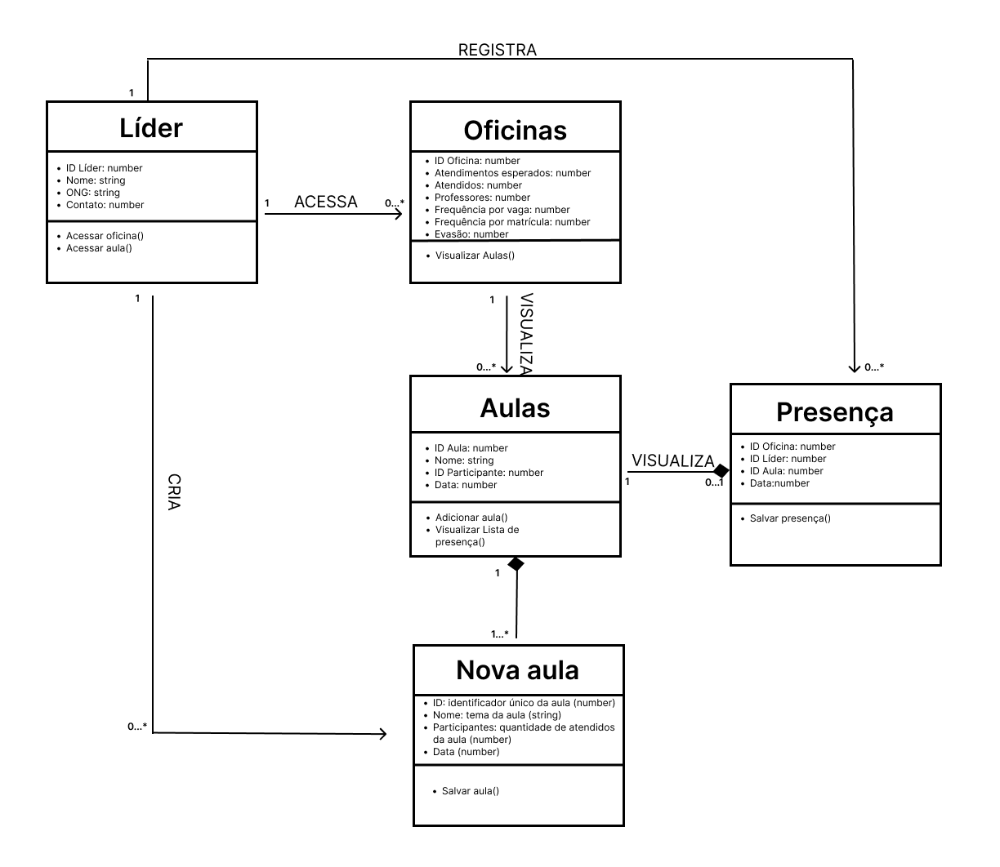

<h6 align="center"> Fonte: Elaborado pelo grupo Fly </h6>

&emsp;&emsp; Na imagem acima, o diagrama de classes de domínio apresentado fornece uma visão clara da estrutura do sistema relacionado às atividades do líder de uma ONG. Com classes cuidadosamente definidas, atributos e métodos, este diagrama representa as entidades principais e seus relacionamentos, proporcionando uma compreensão abrangente da organização e interação dos componentes do sistema.

**Métodos e Atributos:**

- **Métodos:** Em orientação a objetos, um método é uma função associada a uma classe que define o comportamento dos objetos dessa classe. Os métodos representam as ações que os objetos podem realizar ou os processos que podem ser executados por esses objetos. Eles geralmente manipulam os atributos da classe para realizar tarefas específicas. Por exemplo, na classe "Líder", os métodos `Acessar oficina()` e `Acessar aula()` representam ações que um líder pode realizar, como participar de uma oficina ou de uma aula.

- **Atributos:** Os atributos são as características ou propriedades dos objetos de uma classe. Eles representam o estado dos objetos e descrevem o que esses objetos são. Por exemplo, na classe "Líder", os atributos incluem o ID do líder, o nome, a ONG a que pertence e o contato. Os atributos definem as características individuais de cada objeto da classe.

**Razões para a Definição de Cada Classe:**

1. **Líder:**
   - A classe "Líder" foi definida com atributos como ID, nome, ONG e contato para representar informações básicas sobre um líder.
   - Os métodos `Acessar oficina()` e `Acessar aula()` foram definidos para permitir que um líder participe de oficinas e aulas, refletindo seu papel ativo nessas atividades.

2. **Oficinas:**
   - A classe "Oficinas" foi definida com atributos relacionados à gestão das oficinas, como ID da oficina, número de atendimentos esperados, atendidos, número de professores, frequência e evasão.
   - O método `Visualizar Aulas()` permite visualizar as aulas relacionadas a uma oficina, facilitando o gerenciamento das atividades.

3. **Aulas:**
   - A classe "Aulas" foi definida com atributos como ID da aula, nome, ID do participante e data, representando informações sobre as aulas realizadas.
   - Os métodos `Adicionar aula()` e `Visualizar Lista de presença()` permitem a gestão das aulas e a visualização das listas de presença, respectivamente.

4. **Presença:**
   - A classe "Presença" foi definida para rastrear a presença dos líderes nas aulas e oficinas.
   - Seus atributos incluem IDs de oficina, líder, aula e data, representando os dados necessários para registrar a presença.
   - O método `Salvar presença()` é responsável por salvar as informações de presença.

5. **Nova aula:**
   - A classe "Nova aula" foi definida para representar a criação de novas aulas.
   - Seus atributos incluem um identificador único, o nome da aula, o número de participantes e a data.
   - O método `Salvar aula()` é usado para salvar informações sobre uma nova aula.

&emsp;&emsp; ada classe foi definida dessa maneira para organizar e representar os dados e comportamentos relevantes para o sistema de atividades de liderança e educação em questão. Elas encapsulam dados e funcionalidades relacionados, promovendo uma estrutura modular e coesa do sistema.

&emsp;&emsp; Dessa forma, através da construção e análise do diagrama de classes de domínio, foi possível identificar as entidades essenciais do sistema e suas interações, fornecendo assim uma base sólida para o desenvolvimento do software. Logo, o conjunto ds métodos e atributos definidos junto com os relacionamentos, propõe uma visão geral do fluxo de atuação na plataforma e suas funcionalidades.

### 6.1.2 Diagrama de Classes de Implementação

&emsp;&emsp;Já um Diagrama Classes de Implementação, como o apresentado na Figura 20, vai além de ilustrar a estrutura de domínio e foca na forma como o software é efetivamente construído e organizado em termos de código. Este diagrama descreve a arquitetura do sistema em um nível mais concreto, mostrando como as classes são implementadas, como os diferentes componentes do sistema interagem entre si, e qual é o fluxo de controle e dados através do aplicativo.

<h6 align="center"> Figura 20: Diagrama de Classes de Implementação </h6>

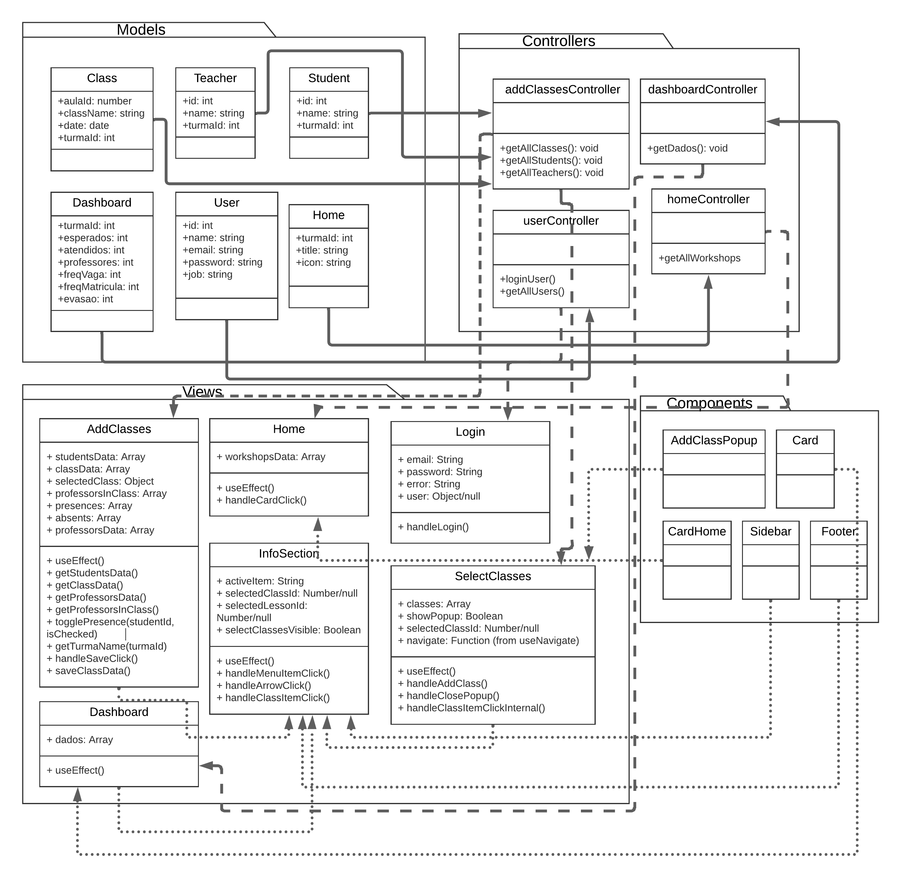

<h6 align="center"> Fonte: Elaborado pelo grupo Fly </h6>

**Métodos e Atributos:**

- **Métodos:** Em um Diagrama de Classes de Implementação, os métodos são representados de forma mais detalhada em comparação com um diagrama de domínio. Eles não apenas definem o que a classe pode fazer, mas também como ela se integra com outras partes do sistema. Por exemplo, o método `handleLogin()` na classe `Login` não somente permite a autenticação de um usuário, mas também interage com serviços externos via chamadas de API e atualiza o estado da aplicação.

- **Atributos:** Os atributos, neste contexto, não apenas definem as características dos objetos, mas também como o estado é gerenciado dentro da aplicação. Eles são cruciais para o gerenciamento de dados dentro dos componentes do frontend e influenciam o render da interface de usuário.

**Razões para a Definição de Cada Classe e Componente:**

1. **Classes de Modelo:**
   - As classes como `Class`, `Teacher`, `Student`, `Dashboard`, e `User` possuem atributos que correspondem diretamente às propriedades dos dados manipulados e exibidos pela aplicação.
   
2. **Controladores:**
   - Os controladores, tais como `addClassesController`, `dashboardController`, `homeController`, e `userController`, contêm métodos que lidam com a lógica de negócio e as ações que podem ser realizadas em resposta às interações do usuário.

3. **Componentes de Visualização (Views):**
   - Componentes como `AddClasses`, `Home`, `Dashboard`, e `SelectClasses` gerenciam como os dados são exibidos ao usuário e como o usuário interage com esses dados.

4. **Componentes:**
   - Componentes reutilizáveis como `AddClassPopup`, `Card`, `CardHome`, `Sidebar`, e `Footer` fornecem funcionalidades específicas e são usados em várias partes da aplicação para garantir uma experiência de usuário coesa.

&emsp;&emsp;Este diagrama de implementação foi elaborado com o objetivo de oferecer uma visão clara e detalhada de como o sistema é implementado. Ele revela as dependências entre classes e componentes, os estados gerenciados e como os dados fluem através da aplicação. Com isso, desenvolvedores e designers de software podem entender melhor as especificidades técnicas do sistema, facilitando tanto o desenvolvimento quanto a manutenção do código.

## 6.2 Diagrama de Componentes da Arquitetura
<conteúdo>
## 6.3 Diagrama de Implantação

&emsp;&emsp;Neste tópico é apresentado o diagrama de implantação do projeto, que ilustra a distribuição e a comunicação do sistema entre diversos nós de hardware e software, uma ferramenta útil para visualizar e documentar a arquitetura do sistema, as dependências e as configurações dos componentes, os recursos de infraestrutura e de rede, e os modos de comunicação entre os nós. Um nó é uma entidade física ou lógica que executa um ou mais componentes do sistema, como um servidor, um dispositivo, um processo, um banco de dados, etc. 

&emsp;&emsp;Com base nesse conceito, foram definidas duas instâncias na Amazon EC2, uma para cada camada da aplicação, o que garante escalabilidade, e o código da camada de frontend será desenvolvido com react.js e o da camada de backend com node.js, sendo que a comunicação entre elas será feita por meio do protocolo HTTP. O Amazon RDS será utilizado para o banco de dados relacional, alinhado com a aplicação que utiliza SQLite, e o protocolo de comunicação entre o banco de dados e a camada de negócio será o TCP/IP. Por fim, o armazenamento dos arquivos será realizado por meio do Amazon S3, que se comunicará com a camada de backend por meio do protocolo HTTP.

<h6 align="center"> Figura 21: Diagrama de implantação</h6>

<h6 align="center">
  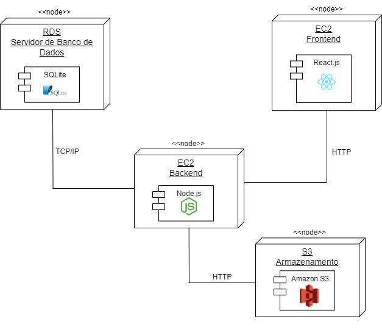
</h6>

<h6 align="center"> Fonte: Elaborado pelo grupo Fly </h6>

&emsp;&emsp;Em resumo, o diagrama de implantação delineia a arquitetura do sistema, destacando a interação entre os diversos nós de hardware e software. A utilização de instâncias na Amazon EC2, protocolos como HTTP e TCP/IP, e serviços como Amazon RDS e Amazon S3, garantem uma estrutura sólida e escalável para o projeto. Essas escolhas arquiteturais promovem a integração entre as diferentes partes do sistema e asseguram uma experiência de usuário satisfatória.

## 6.4 Tecnologias e Ferramentas
<conteúdo>
# 7. Interface (sprint 1 - definição de estruturas padrão)

&emsp;&emsp;Ao desenvolver uma aplicação, é essencial pensar na experiência do usuário, tornando o projeto acessível, intuitivo e de fácil entendimento. Para isso, o design system, o wireframe e principalmente o frontend como conjunto devem ser pontos de extrema atenção. Nessa seção, abordaremos como os elementos serão organizados na interface, considerando a definição dos elementos visuais e da acessibilidade, buscando atender a todos os públicos, inclusive com baixo letramento digital.

## 7.1 Design System 

&emsp;&emsp; O Design System desenvolvido para esta plataforma é fruto de uma seleção criteriosa dos elementos já utilizados pela Gerando Falcões, com ajustes para atender às especificidades do nosso projeto. A construção dessa identidade visual começou com a análise dos wireframes, onde cada componente foi escolhido para se encaixar de forma ideal na estrutura proposta.

&emsp;&emsp; Com a consciência de que parte dos líderes possui diferentes níveis de letramento digital, o sistema foi projetado para ser o mais amigável e intuitivo possível. A simplicidade na navegação e a clareza visual foram priorizadas para que o uso da plataforma seja acessível a todos, independentemente de sua familiaridade prévia com tecnologias digitais. Isso reflete nosso compromisso com a acessibilidade e a inclusão, facilitando o engajamento de todos os usuários na realização das ações sociais.

&emsp;&emsp; Sendo assim, abaixo está o Design System desenvolvido pela equipe Fly:

### Grid

<h6 align="center"> Figura 22: Grid - Design System</h6>

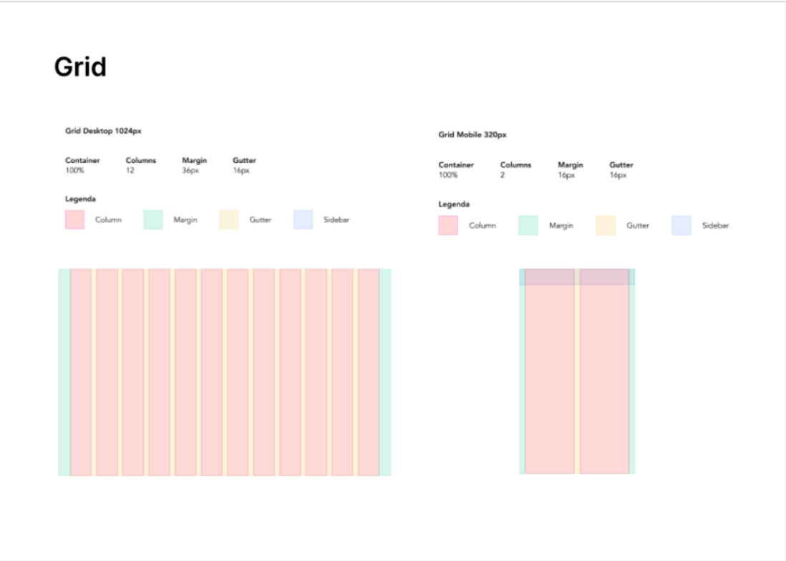

<h6 align="center"> Fonte: Elaborado pelo grupo Fly </h6>

&emsp;&emsp; O grid utilizado na plataforma Fly foi selecionado a partir do Design System fornecido pela Gerando Falcões. A decisão de adotar este grid específico foi tomada para garantir a consistência visual e funcional com a identidade já estabelecida pela Gerando Falcões, proporcionando aos usuários uma experiência familiar e intuitiva. O uso do grid de 12 colunas para desktop e 2 colunas para mobile segue um padrão responsivo e flexível, que se adapta a diversos tamanhos de tela, mantendo a hierarquia e a legibilidade das informações.

&emsp;&emsp; Além disso, ao se relacionar com o wireframe, o grid estabelece uma estrutura para a distribuição de elementos de interface, como cabeçalhos, textos e botões, assegurando que o design final seja uma representação visual coesa do esqueleto do wireframe. Essa consistência é crucial para manter o alinhamento estratégico com o design system da Gerando Falcões, enquanto atendemos às necessidades específicas do nosso projeto Fly, garantindo que cada componente sirva a um propósito funcional e estético.

&emsp;&emsp; A estrutura de grid adaptativa destaca-se por sua capacidade de oferecer acessibilidade em uma variedade de dispositivos, o que é essencial, pois muitos usuários podem depender exclusivamente de dispositivos móveis. O design responsivo assegura que todos os usuários, independentemente do dispositivo que utilizam, tenham uma experiência de usuário coesa e sem barreiras, garantindo que as funcionalidades e informações sejam facilmente acessíveis e navegáveis em telas menores, comuns em smartphones.

### Paleta de cores

<h6 align="center"> Figura 23: Paleta de cores - Design System </h6>

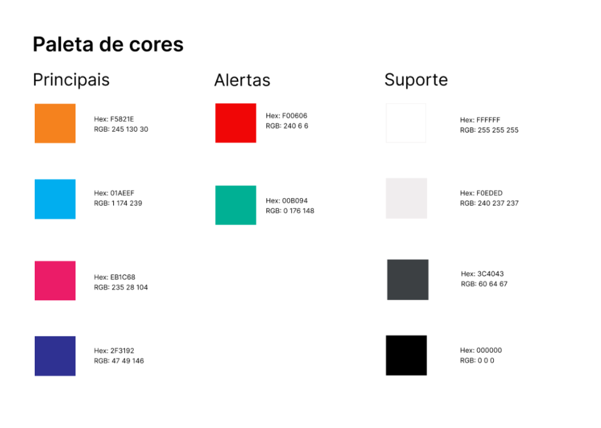

<h6 align="center"> Fonte: Elaborado pelo grupo Fly </h6>

<h6 align="center"> Figura 24: Paleta de cores - Design System </h6>

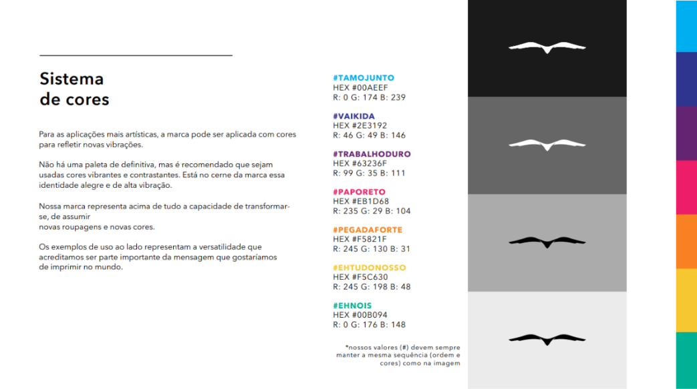

<h6 align="center"> Fonte: Elaborado por Gerando Falcões </h6>

&emsp;&emsp; A partir do desenvolvimento do Wireframe, a paleta de cores foi definida a fim de padronizar a construção do sistema web que atenderá às necessidades do consumidor final. Para isso, com base na própria paleta de cores da Gerando Falcões, as cores foram divididas em três partes: cores principais, alertas e cores de suporte. Ou seja, as cores laranja, azul claro, rosa e azul escuro servirão para colorir e estilizar as partes principais e de destaque em todas as telas do sistema. Exemplo: na primeira tela acessada pelo Líder/Professor de uma ONG, temos uma visão geral da quantidade de oficinas cadastradas. Estas, então, poderão ser estilizadas com a cor azul claro e o botão de acessar estas oficinas com a cor laranja. Outro exemplo é a utilização da cor rosa, que pode ser usada para editar o campo de alunos.

&emsp;&emsp; Já as cores de alerta (verde e vermelho) poderão ser utilizadas para sinalizar quando o cadastro de novos professores, líderes e alunos foram bem ou mal sucedidos, por exemplo. A cor verde simbolizando o sucesso; a cor vermelho o oposto. Por fim, as cores de suporte, como o branco, cinza claro, cinza escuro e preto. Estas cores servirão para estilizar as fontes, escritas e determinadas informações, sendo essenciais para a construção desse sistema em harmonia. Outro ponto importante a ser destacado é a busca pela acessibilidade, visto que as cores, além da estilização, servirão para tornar a plataforma intuitiva e de fácil utilização para o usuário. Assim, valorizando a escolha de uma boa paleta de cores.

### Tipografia

<h6 align="center"> Figura 25: Tipografia - Design System </h6>

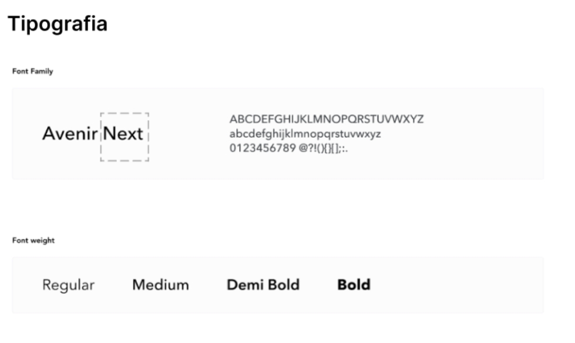

<h6 align="center"> Fonte: Elaborado pelo grupo Fly </h6>

<h6 align="center"> Figura 26: Tipografia - Design System </h6>

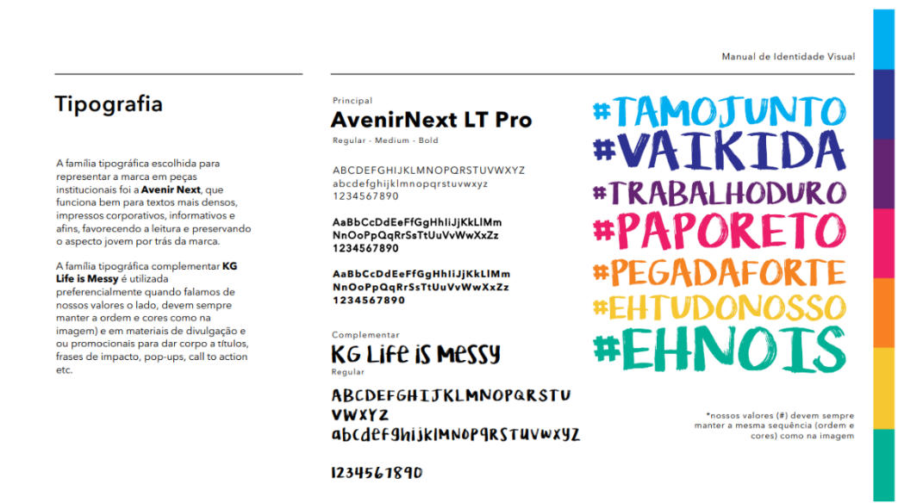

<h6 align="center"> Fonte: Elaborado por Gerando Falcões </h6>

&emsp;&emsp; Optamos pela fonte Avenir Next para o nosso design system devido à sua versatilidade e legibilidade. Sua ampla gama de pesos, desde Regular a Bold, permite uma hierarquização clara do conteúdo, facilitando a leitura e a compreensão do usuário. Avenir Next é conhecida por sua aparência moderna e profissional, características que estão alinhadas com os valores da nossa marca. Além disso, a sua utilização no design system da Gerando Falcões reforça a coesão visual e a conexão entre as plataformas, promovendo uma experiência de usuário consistente. A fonte foi projetada para ser altamente legível em diferentes tamanhos e em diversos dispositivos, garantindo que nosso conteúdo seja acessível a todos os usuários, independentemente do meio pelo qual acessam a nossa plataforma.

### Iconografia

<h6 align="center"> Figura 27: Iconografia - Design System </h6>

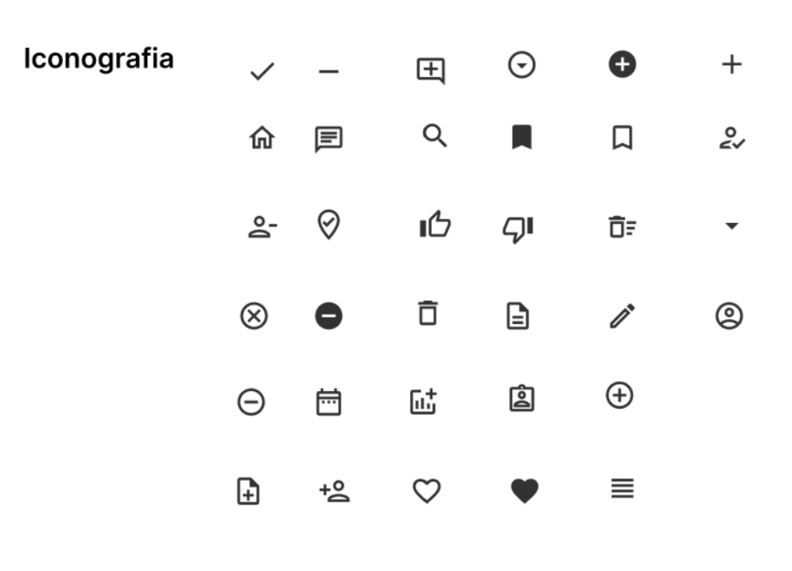

<h6 align="center"> Fonte: Elaborado pelo grupo Fly </h6>

&emsp;&emsp; A respeito da iconografia, o grupo optou, a partir de uma análise do Design System divulgado pela Gerando Falcões, em selecionar 34 ícones com grande probabilidade de serem utilizados em nosso sistema. Dentre essas opções, há ícones que poderão servir na representação de algumas funções que o usuário terá. Exemplo: um ícone que mostrará ao professor sobre a adição de comentários em uma determinada atividade; um ícone para adicionar e remover professores, alunos e atividades; ícones para favoritar e curtir atividades; um para marcar presença e outro para marcar falta dos alunos; um ícone para editar as atividades, professores e alunos; um para calendário, entre outros.

&emsp;&emsp; Ao integrar os ícones do design system da Gerando Falcões, nossa plataforma não apenas se alinha esteticamente a um projeto reconhecido, mas também abraça práticas de design comprovadas para acessibilidade. Os ícones funcionam como elementos visuais intuitivos que facilitam a navegação para todos os usuários, independente de idioma ou capacidade de leitura, e são particularmente úteis para aqueles com dificuldades visuais ou cognitivas. Além disso, cada ícone é escolhido por sua clareza semântica, ajudando na orientação e eficiência do usuário.

### Ilustrações

<h6 align="center"> Figura 28: Ilustrações - Design System </h6>

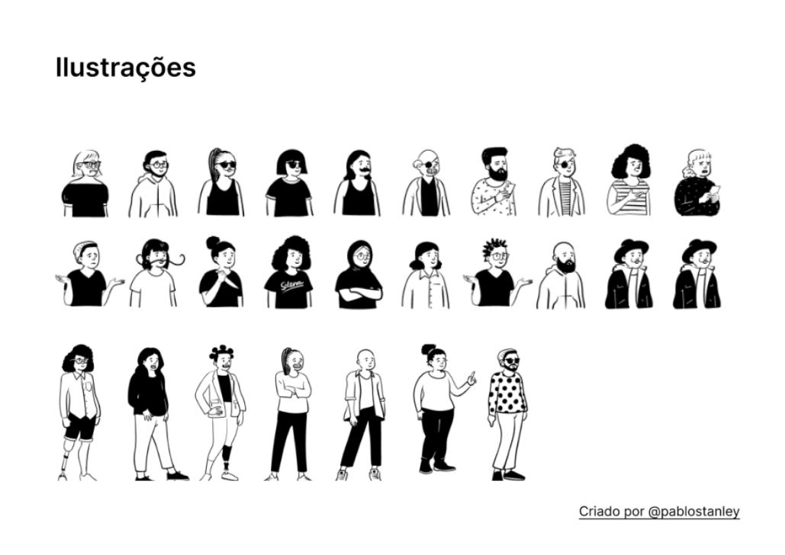

<h6 align="center"> Fonte: Elaborado pelo grupo Fly </h6>

&emsp;&emsp; Essas ilustrações destacam-se por sua abordagem inclusiva e diversificada, representando uma ampla gama de personagens e personalidades que podem se conectar com um público variado, refletindo a rica diversidade da comunidade a qual servimos. Além disso, ao alinharmos nossa escolha com as ilustrações já presentes no design system da Gerando Falcões, estamos promovendo uma consistência visual e uma linguagem gráfica unificada. Isso não apenas reforça nossa mensagem e valores compartilhados, mas também cria uma experiência de usuário mais coesa e integrada. Ao fazer essa escolha consciente, reiteramos nosso compromisso em criar uma plataforma que seja acolhedora, inclusiva e representativa da comunidade que desejamos atingir.

### Outros componentes

<h6 align="center"> Figura 29: Outros componentes - Design System </h6>

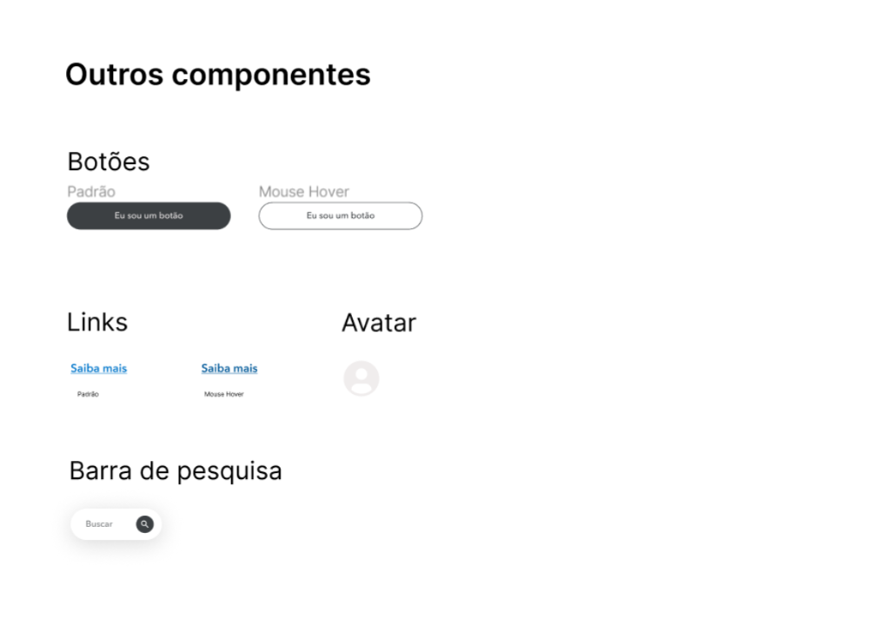

<h6 align="center"> Fonte: Elaborado pelo grupo Fly </h6>

&emsp;&emsp; A acessibilidade em nosso design system é reforçada pela escolha cuidadosa de outros componentes, como botões, links, avatares e barras de pesquisa. Cada elemento foi desenhado com o objetivo de criar uma experiência de usuário fluida e intuitiva, facilitando a interação de todos os usuários, independentemente de suas habilidades.

&emsp;&emsp; Os botões possuem um design claro e um feedback visual, como a mudança de cor no mouse hover, que orienta o usuário sobre a possibilidade de ação, contribuindo para a compreensão imediata de sua funcionalidade. Isso é particularmente útil para pessoas com dificuldades cognitivas, pois oferece uma pista visual imediata de interatividade.

&emsp;&emsp; Os links são apresentados de forma a se destacarem do texto circundante, com variações visuais ao serem selecionados. Isso não apenas chama a atenção para a possibilidade de navegação adicional, mas também auxilia usuários com deficiências visuais ou de leitura a identificar opções de interação.

&emsp;&emsp; O componente de avatar é simplificado, mas reconhecível, permitindo que os usuários identifiquem rapidamente suas contas ou as de outros, enquanto a barra de pesquisa é projetada para ser facilmente localizada e utilizada, com ícones sugestivos e um espaço de input claro, favorecendo a usabilidade por pessoas com diferentes níveis de habilidade técnica.

&emsp;&emsp; Todos esses elementos juntos criam um ambiente digital inclusivo, reduzindo as barreiras à navegação e promovendo uma experiência de usuário coesa e acessível.

### Logotipos

<h6 align="center"> Figura 30: Logotipos - Design System </h6>

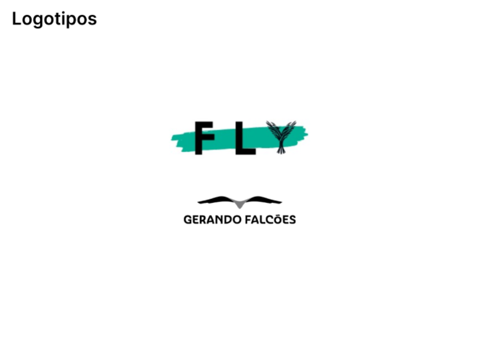

<h6 align="center"> Fonte: Elaborado pelo grupo Fly </h6>

<h6 align="center"> Figura 31: Logotipos - Design System </h6>

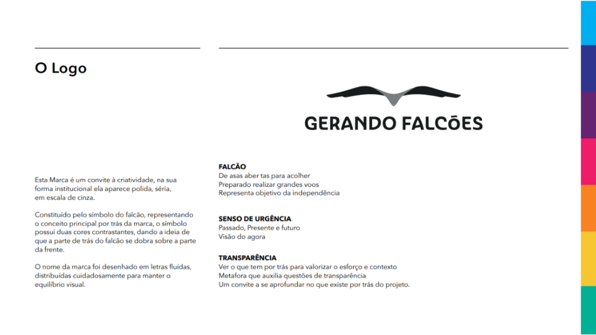

<h6 align="center"> Fonte: Elaborado por Gerando Falcões </h6>

&emsp;&emsp; A logo da Fly foi meticulosamente criada para evocar a imagem de ascensão e liberdade, que é intrínseca ao nome e à missão do grupo. A letra 'Y', estilizada para assemelhar-se a um pássaro com as asas abertas, não apenas reflete a ideia de voo mas também simboliza a ampla gama de possibilidades e oportunidades que a plataforma se propõe a oferecer. O traço que acompanha a logo simboliza a conexão e a continuidade entre as diversas etapas e ações sociais monitoradas pela plataforma, ressaltando a visão integrada e holística que a Fly adota.

&emsp;&emsp; Ademais, o uso da cor presente no design system da Gerando Falcões não é apenas uma questão de estética, mas uma decisão estratégica que reforça o alinhamento e a coesão com os valores e a identidade da parceira. Essa escolha contribui para uma experiência de marca unificada e reconhecível, que facilita a identificação e a associação pelos usuários e pelas ONGs parceiras.

## 7.2 Projeto de Interface (Wireframes) 

&emsp;&emsp;Podemos definir um wireframe como um esqueleto, um protótipo ou uma versão bastante primitiva da interface visual de um projeto. Ele consiste na representação visual em escala de cinza da estrutura e funcionalidade de uma página web ou tela de aplicativo móvel. Os wireframes são usados no início do processo de desenvolvimento para estabelecer a estrutura básica de uma página antes de adicionar o design visual e o conteúdo. Com base nesse conceito, foi elaborado o seguinte wireframe para este projeto:

### Tela de login

<h6 align="center"> Figura 32: Tela de Login </h6>

<h6 align="center"> Fonte: Elaborado pelo grupo Fly </h6>

&emsp;&emsp;A primeira tela é o login, que será realizado através do email e da senha, fornecidos pelo líder ou responsável do Gerando Falcões, dependendo do usuário.

### Tela inicial

<h6 align="center"> Figura 33: Tela inicial para Funcionário da GF </h6>

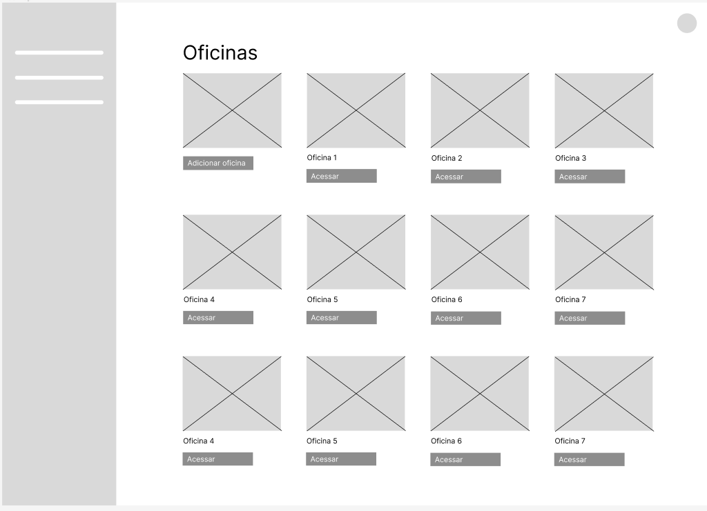

<h6 align="center"> Fonte: Elaborado pelo grupo Fly </h6>

<h6 align="center"> Figura 34: Tela inicial para Líder/Professor de ONG </h6>

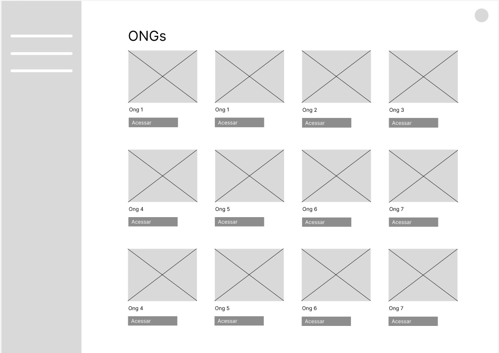

<h6 align="center"> Fonte: Elaborado pelo grupo Fly </h6>

&emsp;&emsp;Após o login, o usuário será direcionado à tela inicial, que pode ter duas variações, dependendo do tipo de usuário: Representante do Gerando Falcões ou Líder/Professor. Nessa tela, o usuário terá uma visão geral de todas as ONGs ou oficinas sob sua responsabilidade, com acesso fácil a elas.

### Tela de indicadores por oficinas
<h6 align="center"> Figura 35: Tela de indicadores por Oficinas </h6>

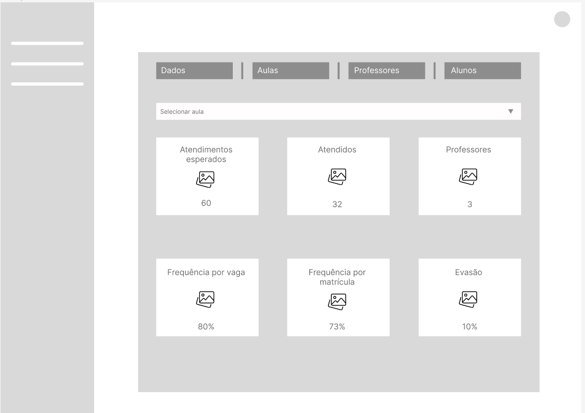

<h6 align="center"> Fonte: Elaborado pelo grupo Fly </h6>

&emsp;&emsp;Ao acessar uma oficina, o Líder/Professor terá acesso a uma nova tela, onde poderá visualizar dados da oficina, como o número de atendimentos esperados e a quantidade de professores cadastrados.

### Tela de indicadores por ONGs
<h6 align="center"> Figura 36: Tela de indicadores por ONGs </h6>

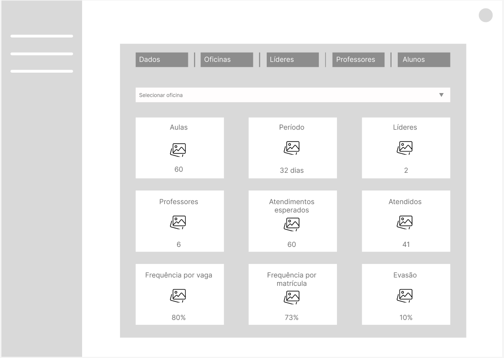

<h6 align="center"> Fonte: Elaborado pelo grupo Fly </h6>

&emsp;&emsp;Diferentemente das oficinas, ao acessar uma determinada ONG, o representante do Gerando Falcões terá acesso a uma tela com mais dados, fornecendo um panorama geral da ONG. Além disso, o usuário poderá visualizar os dados por oficina.

### Tela para cadastro de aulas e presença de alunos
<h6 align="center"> Figura 37: Tela de cadastro de aulas </h6>

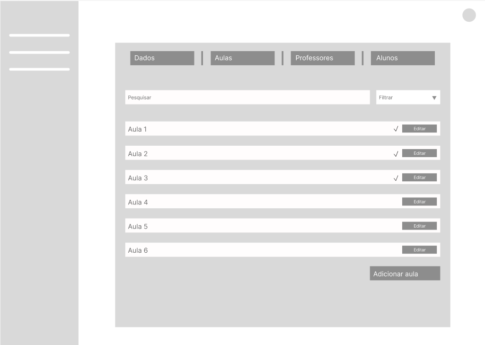

<h6 align="center"> Fonte: Elaborado pelo grupo Fly </h6>

<h6 align="center"> Figura 38: Tela de presença </h6>

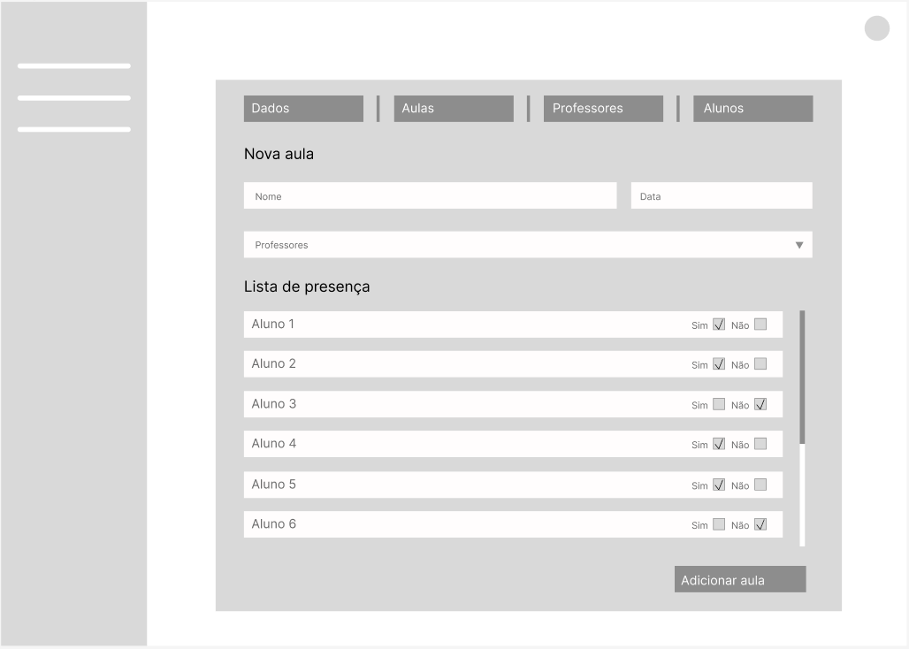

<h6 align="center"> Fonte: Elaborado pelo grupo Fly </h6>

&emsp;&emsp;Ao selecionar a aba das aulas da oficina selecionada, o usuário poderá cadastrar novas aulas, editar aulas existentes e marcar a presença dos alunos.
Tela para cadastro de professores (Gerando Falcões/Líderes)

### Tela para cadastro de professores (Gerando Falcões/Líderes)
<h6 align="center"> Figura 39: Tela de cadastro de professores</h6>

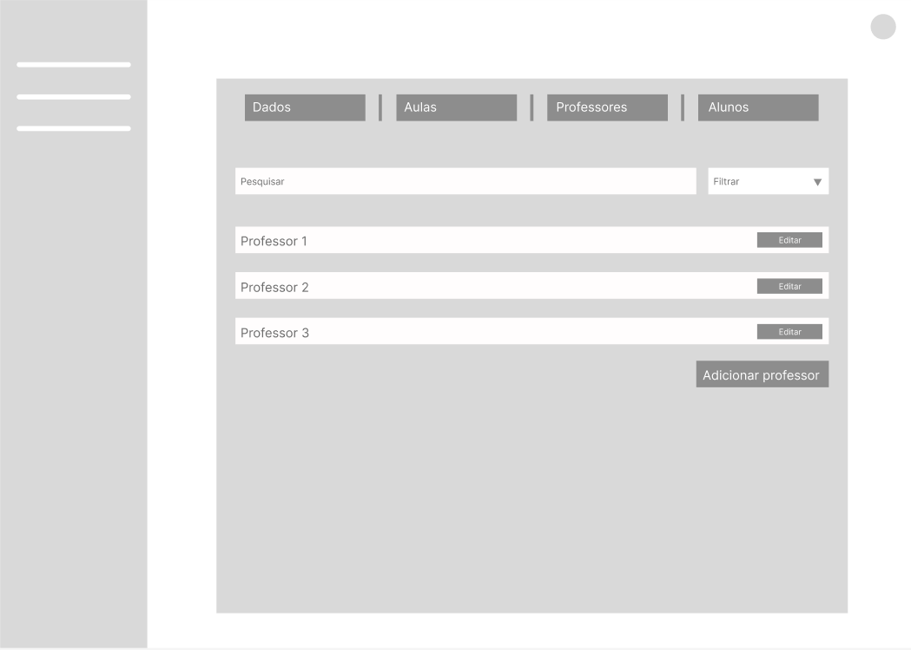

<h6 align="center"> Fonte: Elaborado pelo grupo Fly </h6>

&emsp;&emsp;Na aba dos professores, o usuário poderá encontrar todos os professores cadastrados na oficina selecionada, além de poder cadastrar novos professores.
Tela para cadastro de alunos

### Tela para cadastro de alunos
<h6 align="center"> Figura 40: Tela para visualizar alunos </h6>

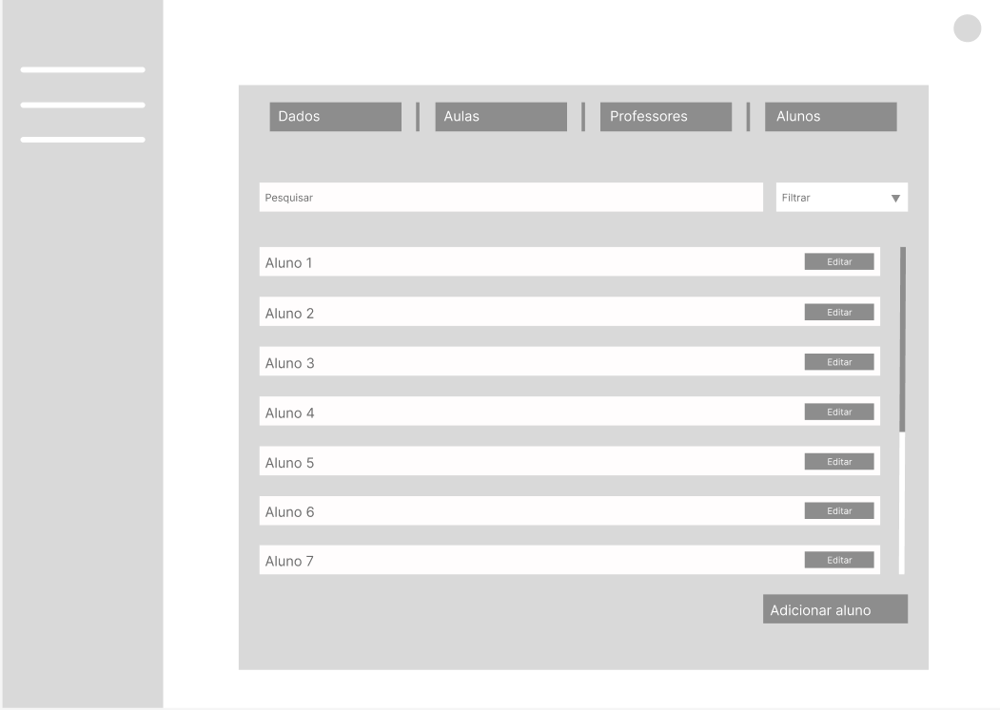

<h6 align="center"> Fonte: Elaborado pelo grupo Fly </h6>

<h6 align="center"> Figura 41: Tela para cadastrar alunos </h6>

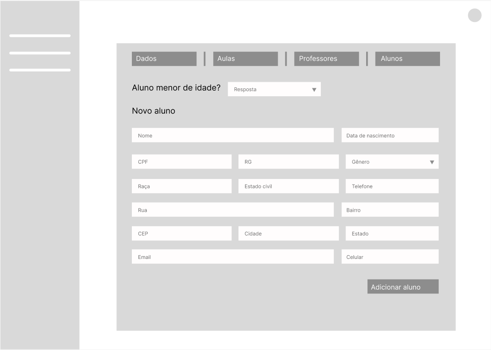

<h6 align="center"> Fonte: Elaborado pelo grupo Fly </h6>

<h6 align="center"> Figura 42: Tela de cadastro de aluno menor de idade </h6>

<h6 align="center"> Fonte: Elaborado pelo grupo Fly </h6>

&emsp;&emsp;Acessando a aba dos alunos, o usuário conseguirá encontrar todos os alunos cadastrados, além de poder adicionar novos alunos, com a condição de adicionar um responsável legal caso o aluno seja menor de idade.

### Tela para cadastro de líderes (Apenas para a Gerando Falcões)
<h6 align="center"> Figura 43: Tela para visualizar líderes </h6>

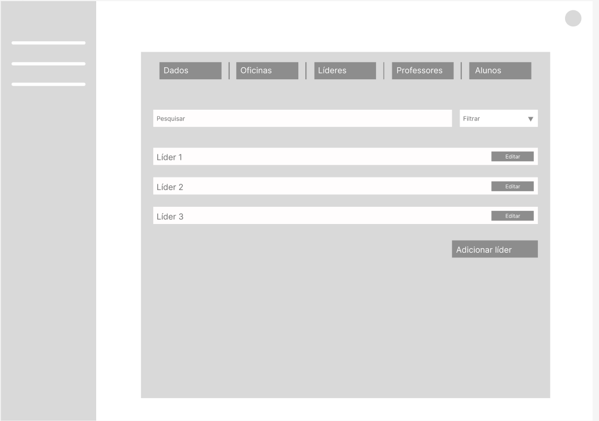

<h6 align="center"> Fonte: Elaborado pelo grupo Fly </h6>

<h6 align="center"> Figura 44: Tela para cadastrar líder </h6>

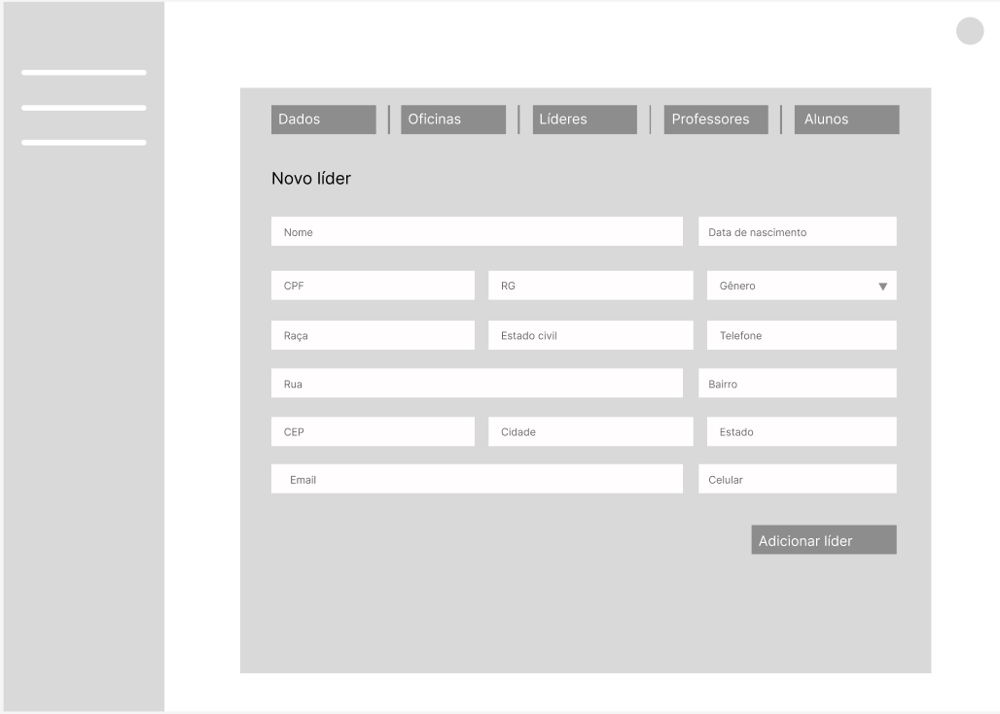

<h6 align="center"> Fonte: Elaborado pelo grupo Fly </h6>

&emsp;&emsp;Na aba de Líderes, os representantes do Gerando Falcões poderão encontrar todos os líderes cadastrados na ONG selecionada e cadastrar novos líderes.

## 7.3 Frontend

&emsp;&emsp;Com o objetivo de aprimorar a experiência do usuário e manter um desenvolvimento atualizado, foram selecionadas as ferramentas a serem utilizadas. Para este projeto, definiu-se a utilização do React.js e do Styled Components como as principais tecnologias para criar e estilizar os componentes da aplicação.

&emsp;&emsp;O React.js, uma biblioteca JavaScript, possibilita a criação de interfaces de usuário interativas e dinâmicas, baseadas em componentes reutilizáveis e isolados. Esses componentes podem conter seu próprio estado, lógica e estilo, e são compostos para formar componentes mais complexos. Essa abordagem proporciona vantagens como modularidade, reutilização, testabilidade e performance. Além disso, o React.js oferece hooks, que são funções para gerenciar o estado e o ciclo de vida dos componentes sem a necessidade de classes.

&emsp;&emsp;O Styled Components é uma biblioteca que permite escrever CSS em JavaScript, utilizando template literals. Essa abordagem dinâmica possibilita definir os estilos dos componentes com base nas props ou no tema da aplicação. Além disso, o Styled Components gera nomes de classes únicos para cada componente, evitando conflitos e sobrescritas de estilos. Essa metodologia simplifica o desenvolvimento, tornando-o mais legível e personalizável.

&emsp;&emsp;Ao combinar o React.js e o Styled Components, uma interface de usuário consistente, intuitiva e atraente é criada, atendendo às necessidades e expectativas dos usuários. Essas ferramentas também facilitam o trabalho em equipe, otimizando o uso de tempo e recursos. A partir disso, foram criadas as seguintes telas:

### Tela de login

<h6 align="center"> Figura 45: Tela de login </h6>

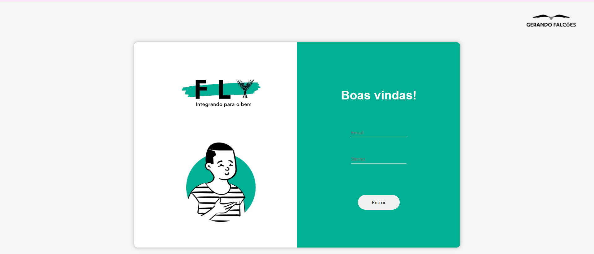

<h6 align="center"> Fonte: Elaborado pelo grupo Fly </h6>

&emsp;&emsp;A página de login solicita o email e a senha do usuário, que são verificados pelo sistema para confirmar se ele está registrado no banco de dados e qual é o seu papel (Gerando Falcões, Líder ou Professor). Dependendo do seu papel, o usuário é redirecionado para a tela inicial adequada. Essa página cumpre o requisito não funcional 1 (Controle de Acesso Baseado em Papéis (RBAC)) e o requisito não funcional 3 (Interface de Usuário Simplificada e Intuitiva).

### Página inicial

<h6 align="center"> Figura 46: Página inicial </h6>

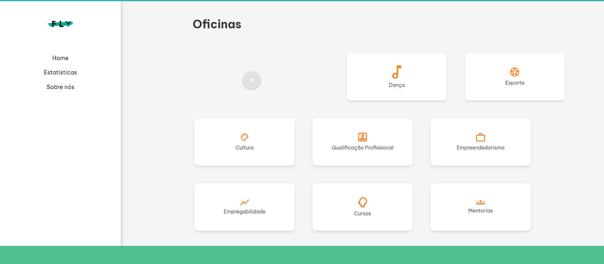

<h6 align="center"> Fonte: Elaborado pelo grupo Fly </h6>

&emsp;&emsp;Ao acessar a tela inicial, o usuário consegue encontrar todas as oficinas cadastradas em sua ONG, bem como uma barra lateral com "home", "estatísticas" e "sobre nós", que permite que o usuário navegue para outras páginas. Além disso, também é possível adicionar uma nova oficina à ONG selecionando o ícone "+". Essa página contempla o requisito funcional 7 (O sistema deve prover visualizações simples e unificadas) e o requisito não funcional 3 (Interface de Usuário Simplificada e Intuitiva).

### Dados das oficinas

<h6 align="center"> Figura 47: Dados das oficinas </h6>

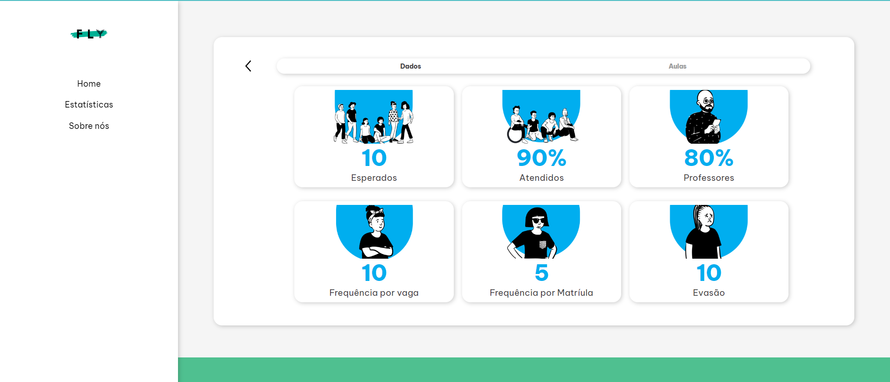

<h6 align="center"> Fonte: Elaborado pelo grupo Fly </h6>

&emsp;&emsp;Ao selecionar uma oficina na tela inicial, o usuário é direcionado para a seção de informações específicas da mesma. A primeira aba do menu, chamada "Dados", exibe os indicadores pertinentes àquela oficina, tais como: número de atendimentos esperados, atendidos, professores, frequência por vaga, frequência por matrícula e taxa de evasão. Essa página satisfaz o requisito funcional 7 (O sistema deve prover visualizações simples e unificadas) e o requisito não funcional 3 (Interface de Usuário Simplificada e Intuitiva).

### Aulas cadastradas

<h6 align="center"> Figura 48: Aulas cadastradas </h6>

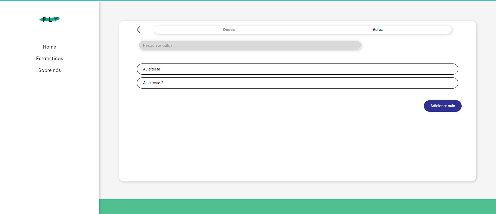

<h6 align="center"> Fonte: Elaborado pelo grupo Fly </h6>

<h6 align="center"> Figura 49: Adicionar aulas </h6>

<h6 align="center"> Fonte: Elaborado pelo grupo Fly </h6>

&emsp;&emsp;Ao selecionar a aba "Aulas", o usuário pode acessar todas as aulas cadastradas naquela oficina. Ele também tem a opção de filtrá-las, organizando-as das mais recentes para as mais antigas e vice-versa. Além disso, é possível adicionar uma nova aula ao clicar no botão "Adicionar aula", que abrirá um pop-up para o usuário cadastrar uma nova aula, incluindo nome, data, professores e turma designada. Essa tela atende aos requisitos funcionais 7 (O sistema deve prover visualizações simples e unificadas) e não funcional 3 (Interface de Usuário Simplificada e Intuitiva), além do requisito não funcional 4 (Sistema de Gerenciamento de Aulas).

### Informações das aulas

<h6 align="center"> Figura 50: Informações das aulas </h6>

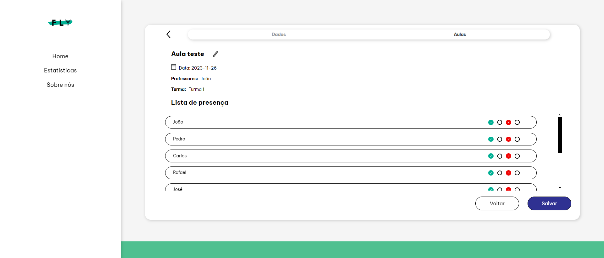

<h6 align="center"> Fonte: Elaborado pelo grupo Fly </h6>

&emsp;&emsp;Ao selecionar uma aula na aba anterior, o usuário pode acessar as informações específicas daquela aula, como o nome, a data, os professores designados e a turma referente. Além disso, ele pode encontrar todos os alunos cadastrados na turma e responder à lista de presença do dia daquela aula por meio de uma interface muito acessível, utilizando checkboxes, proporcionando uma experiência de usuário mais intuitiva. Ao clicar em salvar, o usuário consegue registrar a aula como realizada e quais alunos estavam presentes. Esta tela atende aos requisitos funcionais 2 (O sistema deve registrar presença e frequência dos alunos), 7 (O sistema deve prover visualizações simples e unificadas) e ao requisito não funcional 3 (Interface de Usuário Simplificada e Intuitiva).

&emsp;&emsp;Buscou-se desenvolver um frontend que aprimorasse a experiência do usuário e garantisse um ambiente atualizado, utilizando ferramentas como o React.js e o Styled Components para criar interfaces dinâmicas e visualmente atrativas, com uma base de código organizada e eficiente. As telas apresentadas na documentação foram projetadas para atender aos requisitos funcionais e não funcionais do sistema, gerenciando o acesso dos usuários com base em seus papéis e exibindo dados das oficinas e aulas de forma simples, unificada e fácil de usar. Com a aplicação dessas tecnologias e metodologias, foi possível não apenas satisfazer as necessidades funcionais do sistema, mas também oferecer uma interface amigável e intuitiva para os usuários, demonstrando o compromisso contínuo em proporcionar uma experiência superior para todos os envolvidos no projeto.

# 8. Projeto de Banco de Dados
<conteúdo>
## 8.1 Modelo Conceitual
<conteúdo>
## 8.2 Modelo Lógico
<conteúdo>
# 9. Testes de Software
<conteúdo>
## 9.1 Demonstração da integração

### 9.1.1 Testes das rotas de Api

&emsp;&emsp; Nesta seção, será abordado as imagens dos testes de rotas do backend do sistema web que está em desenvolvimento. Para isso, os testes de rotas no backend, realizados na ferramenta "Postman", são fundamentais para garantir que o sistema esteja funcionando conforme o esperado antes de ser implantado em um ambiente de produção. Esses testes ajudam a identificar e corrigir erros ou falhas no código do backend, bem como garantir a integração adequada entre os diferentes componentes do sistema. Desse modo, temos os seguintes testes: 

### Servidor

<h6 align="center"> Figura 51: Teste do servidor </h6> 

<h6 align="center"> Fonte: Elaborado pelo grupo Fly </h6>

&emsp;&emsp; Na imagem acima, temos um teste no método "GET" na url "http://localhost:3333/" que, caso o servidor esteja definido e funcional, a mensagem "Server is running" aparecerá. Isso porque o método GET é usado para solicitar dados de um recurso específico do servidor. Quando solicitado uma página da web, por exemplo, o navegador envia uma solicitação GET para o servidor para obter o conteúdo da página (neste caso é a mensagem dita acima). E isso servirá como base para as próximas rotas desenvolvidas ao longo do projeto.

<h6 align="center"> Figura 52: Teste do servidor </h6> 

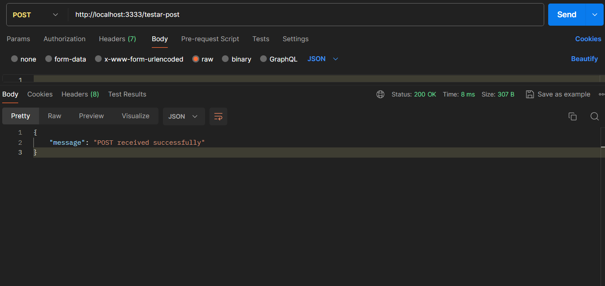

<h6 align="center"> Fonte: Elaborado pelo grupo Fly </h6>

&emsp;&emsp; Já neste caso acima, temos o método "POST", sendo utilizado para enviar dados de um cliente para o servidor. Neste exemplo, definimos a rota "/testar-post" para que, caso esteja funcionando, a mensagem "POST received successfully" aparece. No método POST, os dados enviados não são visíveis na URL, pois são enviados no corpo da solicitação.

### Login

<h6 align="center"> Figura 53: Teste do Login </h6> 

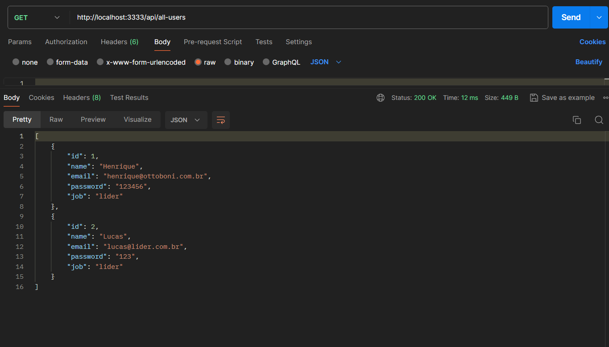

<h6 align="center"> Fonte: Elaborado pelo grupo Fly </h6>

&emsp;&emsp; No caso do Login, temos a seguinte situação:
a equipe Fly foi informada que na aplicação não deveríamos colocar tela de cadastro, ou seja, apenas usuários já autênticados pela Gerando Falcões teriam acesso. Desse modo, definimos dois exemplos fixos, como o Henrique e o Lucas. Cada um apresenta um ID, name, email, password e job. Vale destacar que esse campo "job" representa a função que tal usuário tem dentro da ONG. Como nessa sprint 2 trabalhamos apenas com a jornada do líder, definimos que os dois usuários (líderes) consigam acessar a plataforma.

<h6 align="center"> Figura 54: Teste do Login </h6> 

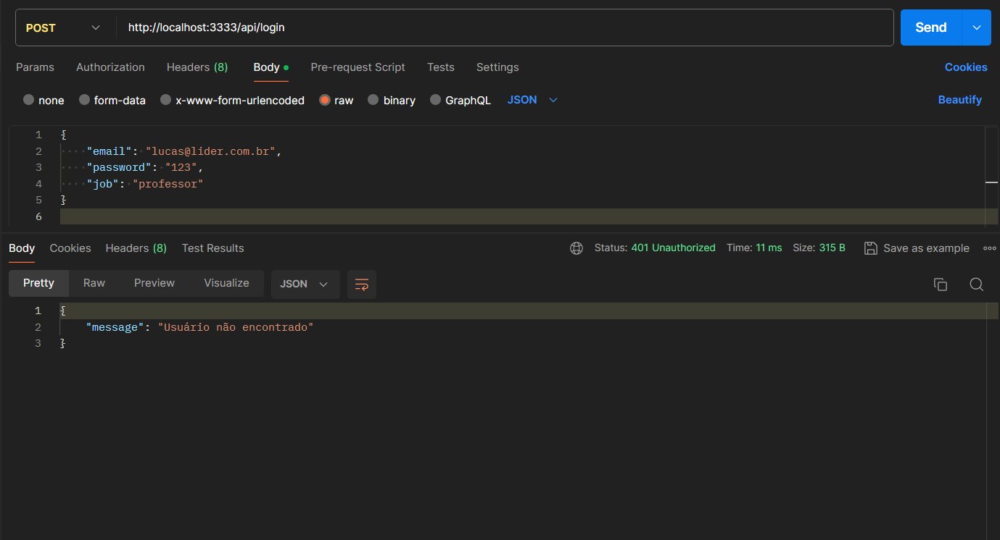

<h6 align="center"> Fonte: Elaborado pelo grupo Fly </h6>

&emsp;&emsp; Acima, o exemplo para mostrar que, como trabalhamos com a jornada do líder, quando um usuário que não está definido como líder tenta acessar a plataforma, o sistema retorna "Usuário não encontrado". Isso demonstra a funcionalidade da lógica implementada apenas para liberar acesso para líderes nesse momento. Vale destacar que essa mensagem aparecerá quando qualquer campo for digitado incorretamente, seja o email ou a senha, por exemplo.

### Workshops

<h6 align="center"> Figura 55: Teste do Workshop </h6> 

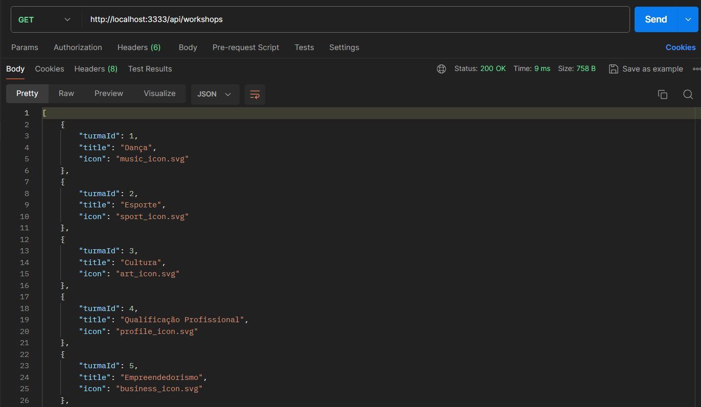

<h6 align="center"> Fonte: Elaborado pelo grupo Fly </h6>

<h6 align="center"> Figura 56: Teste do Workshop </h6> 

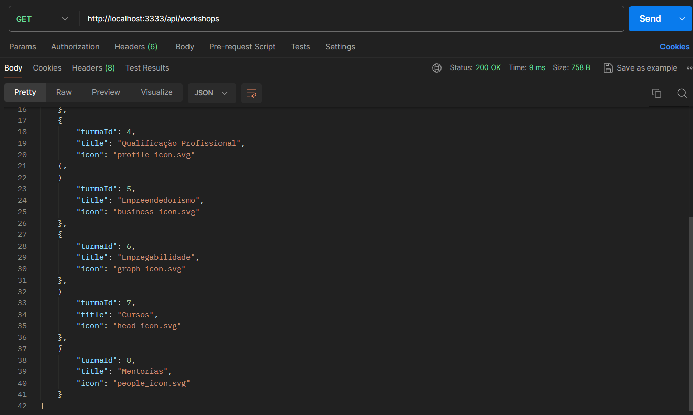

<h6 align="center"> Fonte: Elaborado pelo grupo Fly </h6>

&emsp;&emsp; Nas duas imagens acima, temos os testes dos workshops, que aparecem logo após quando o líder efetua com sucesso o login. Neste teste, vemos que todas as oficinas estão devidamente cadastradas com a TurmaID, o título e o ícone para representar cada oficina. Vale destacar que cada oficina está relacionada com uma determinada turma, como mostra o turmaID.

### Dashboard

<h6 align="center"> Figura 57: Teste do Dashboard </h6> 

<h6 align="center"> Fonte: Elaborado pelo grupo Fly </h6>

&emsp;&emsp; No teste de dashboard, encontramos os campos turmaId, esperados, atendidos, professores, freqVaga (frequência por vaga), freqMatrícula (frequência por matrícula) e evasão. Esse dashboard é acessado após o líder selecionar uma determinada oficina no sistema web. É importante destacar que as informações mostradas no dashboard variam de acordo com cada oficina, como mostra o campo turmaID.

### Classes

<h6 align="center"> Figura 58: Teste de Classes </h6> 

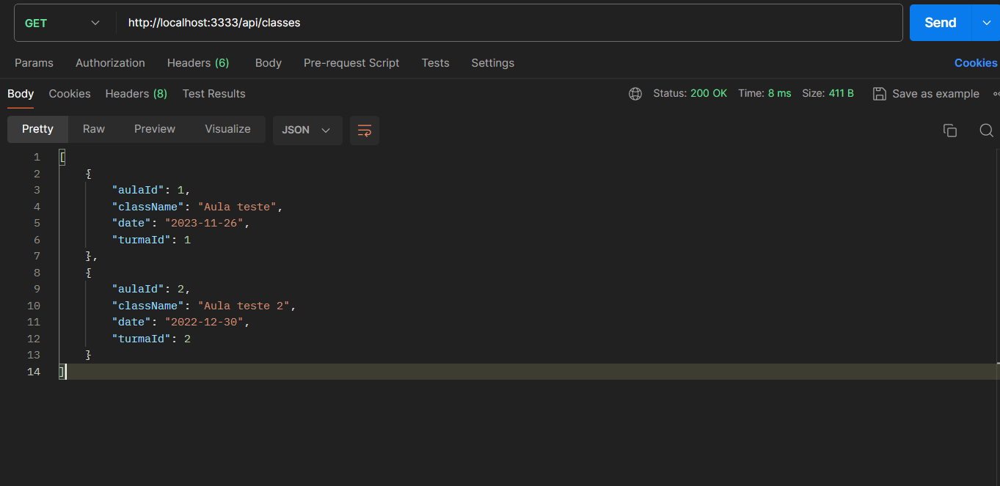

<h6 align="center"> Fonte: Elaborado pelo grupo Fly </h6>

&emsp;&emsp; Quando o líder acessar a tela de dashboard de uma determinada oficina, ele também conseguirá acessar o campo "Aulas", na qual ele poderá visualizar as aulas e criá-las. No entanto, para essa sprint 2 foi desenvolvida apenas a funcionalidade de visualização de aulas existentes. Para isso, definimos Aula teste e Aula teste 2. Além disso, aula apresenta seu ID, seu className, a data e a turmaID, para referenciar qual turma tem aquela aula específica.

### Alunos

<h6 align="center"> Figura 59: Teste de Alunos </h6> 

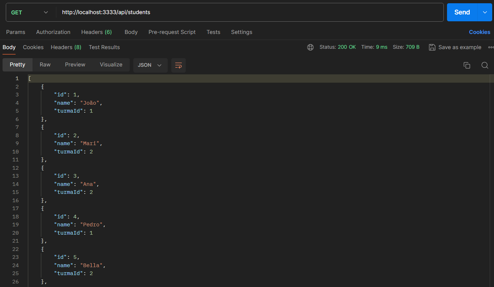

<h6 align="center"> Fonte: Elaborado pelo grupo Fly </h6>

<h6 align="center"> Figura 60: Teste de Alunos </h6> 

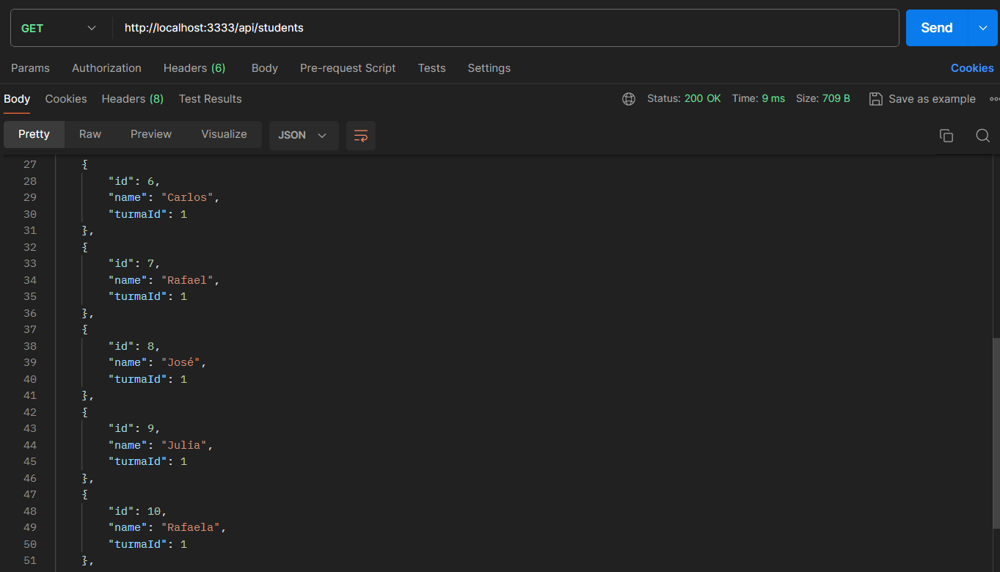

<h6 align="center"> Fonte: Elaborado pelo grupo Fly </h6>

<h6 align="center"> Figura 61: Teste de Alunos </h6> 

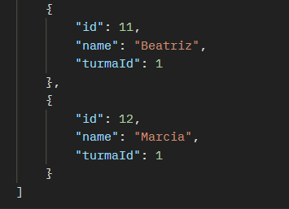

<h6 align="center"> Fonte: Elaborado pelo grupo Fly </h6>

&emsp;&emsp; Quando o líder selecionar uma determinada aula, ele poderá ter acesso a algumas informações, dentre elas, a de alunos para registrar a lista de presença. Como mostra nas imagens acima, foi definido o ID do aluno, o nome e suas respectivas turmas para que a atribuiçãi da presença futuramente seja assertiva.

### Professores

<h6 align="center"> Figura 62: Teste de Professores </h6> 

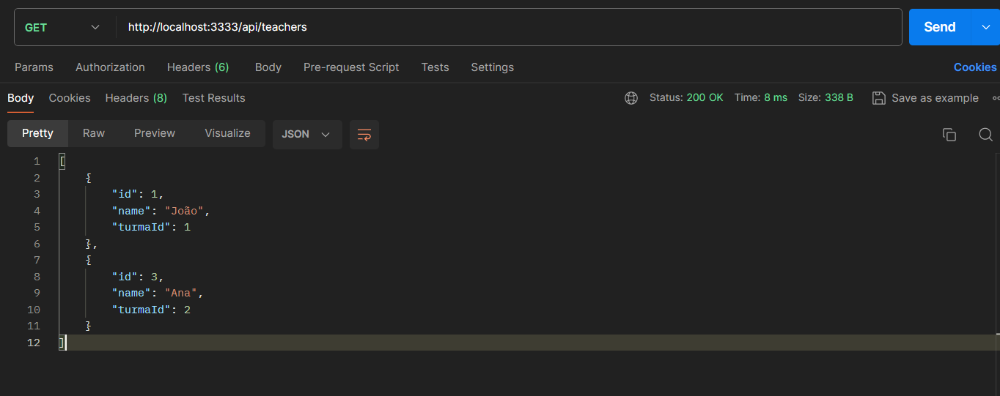

<h6 align="center"> Fonte: Elaborado pelo grupo Fly </h6>

&emsp;&emsp; Por fim, o teste de professores, estando bastante relacionado às aulas e oficinas. Como mostrado nas imagens, definimos o ID de cada professor, seu nome e a turma, para que possamos cadastrar tal professor extamente na turma de determinada oficina que queremos. Assim, finalizando todos os testes de rotas criadas na sprint 2.

### 9.1.2 Processo de implantação do backend e frontend na instância EC2

Para começar, foram criadas duas instâncias EC2 com o intuito de abrigar o frontend em uma delas e o backend em outra, a partir disso foi realizado o seguinte processo:

### 1. Criar Instância EC2 na AWS

Ao acessar o console da AWS, selecionamos a opção "Criar Máquina Virtual com EC2". Isso nos levou à tela inicial do processo de criação da instância.

<h6 align="center"> Figura 63: Criar Instância EC2 </h6>

<h6 align="center"> Fonte: Elaborado pelo grupo Fly</h6>

### 2. Nomear a Instância

Após selecionar a opção "Criar Máquina Virtual com EC2", foi solicitado que nomeássemos a instância. Optamos por nomeá-la como "Minha ponderada semana 03".

<h6 align="center"> Figura 64: Nomear a Instância </h6>

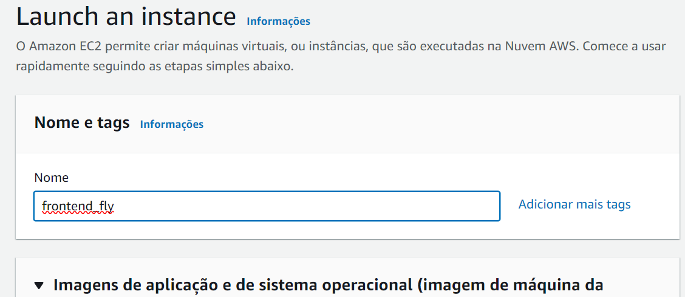

<h6 align="center"> Fonte: Elaborado pelo grupo Fly </h6>

### 3. Selecionar o Sistema Operacional

Escolhemos o sistema operacional Ubuntu devido à sua versatilidade e facilidade de uso.

<h6 align="center"> Figura 65: Selecionar o Sistema Operacional </h6>

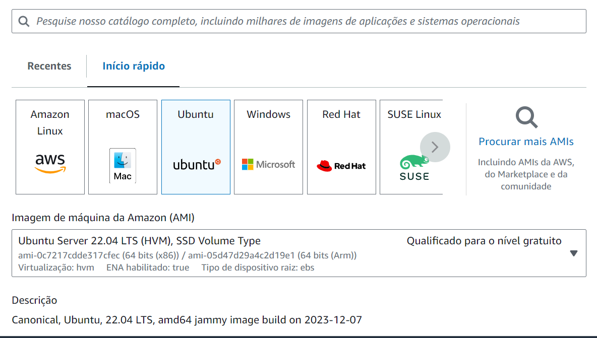

<h6 align="center"> Fonte: Elaborado pelo grupo Fly </h6>

### 4. Criar Chave SSH

Foi necessário criar uma chave privada SSH para garantir a segurança do acesso ao projeto.

<h6 align="center"> Figura 66: Criar Chave SSH </h6>

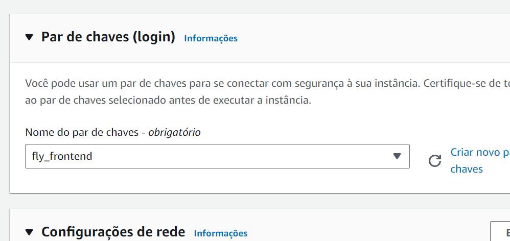

<h6 align="center"> Fonte: Elaborado pelo grupo Fly </h6>

### 5. Criar Grupo de Segurança

Selecionamos as permissões para SSH, HTTPS e HTTP para permitir o acesso por esses meios.

<h6 align="center"> Figura 67: Criar Grupo de Segurança </h6>

<h6 align="center"> Fonte: Elaborado pelo grupo Fly </h6>

### 6. Tela de Carregamento da Instância

Após clicar em "Executar Instância", foi exibida uma tela de carregamento enquanto a instância era inicializada.

<h6 align="center"> Figura 68: Tela de Carregamento da Instância </h6>

<h6 align="center"> Fonte: Elaborado pelo grupo Fly </h6>

### 7. Instância Criada com Sucesso 

A instância foi criada com sucesso e estava pronta para ser utilizada.

<h6 align="center"> Figura 69: Instância Criada com Sucesso </h6>

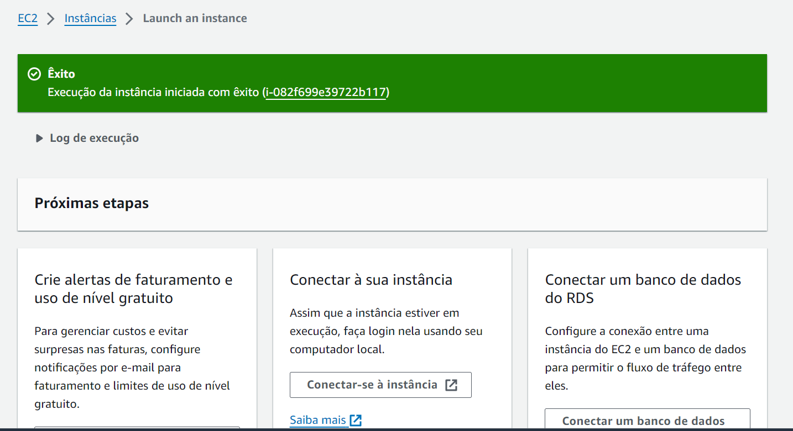

<h6 align="center"> Fonte: Elaborado pelo grupo Fly </h6>

### 8. Detalhes da Instância 

Visualizamos os detalhes da instância, incluindo seu ID, endereço IP público e privado.

<h6 align="center"> Figura 70: Detalhes da Instância </h6>

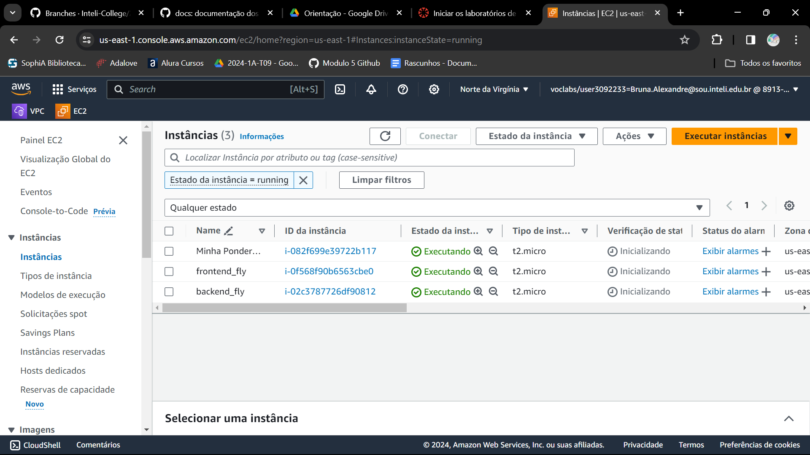

<h6 align="center"> Fonte: Elaborado pelo grupo Fly </h6>

### 9. Acesso ao Servidor via Terminal

Utilizamos o cliente SSH para acessar localmente nossa instância, logo, devemos ir até a instância EC2 e copiar o comando para colar no terminal, nesta etapa vamos utilizar a chave privada criada na intância.

<h6 align="center"> Figura 71: Comando SSH na aws </h6>

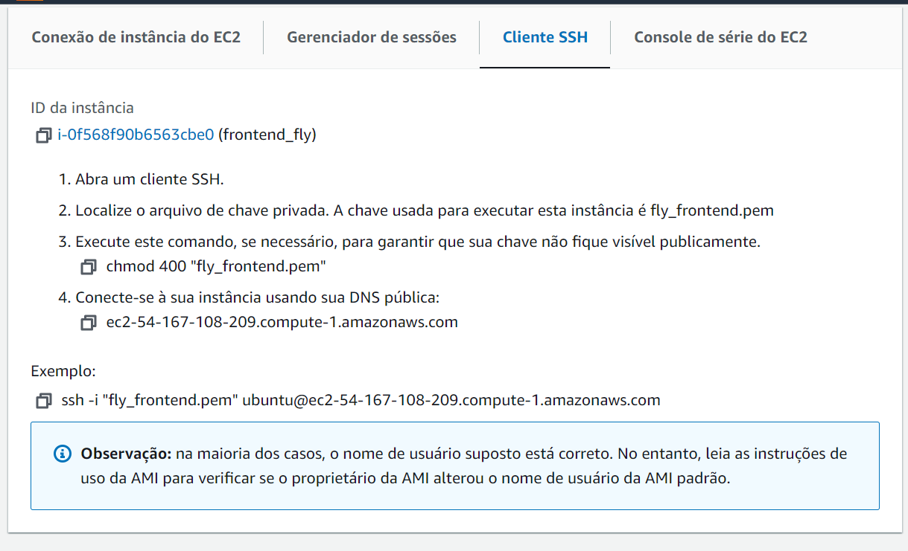

<h6 align="center"> Fonte: Elaborado pelo grupo Fly </h6>

<h6 align="center"> Figura 9: Acesso ao Servidor via Terminal Utilizando Chave Privada </h6>

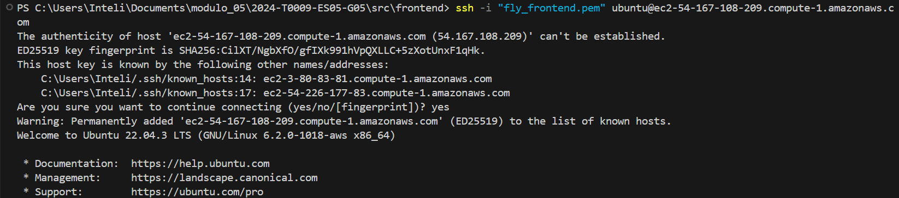

<h6 align="center"> Fonte: Elaborado pelo grupo Fly </h6>

### 10. Confirmação de Entrada no Servidor

Confirmamos a entrada no servidor via terminal, onde pudemos iniciar o uso do sistema operacional da máquina virtual para outras finalidades, como conectar-se ao repositório do GitHub e construir nossa API.

<h6 align="center"> Figura 72: Confirmação de Entrada no Servidor </h6>

<h6 align="center"> Fonte: Elaborado pelo grupo Fly </h6>

Dessa maneira, concluímos o processo de criação e configuração da instância EC2 na AWS para o desenvolvimento da nossa aplicação. Logo, a máquina virtual já está sendo acessada localmente.

### 11. Configurar Segurança da Chave SSH

Após a criação da instância EC2, foi necessário configurar a segurança da chave SSH para garantir acesso seguro à instância. Isso incluiu desabilitar a herança e aplicar as permissões adequadas à chave SSH.

<h6 align="center"> Figura 73: Configurar Segurança da Chave SSHl </h6>

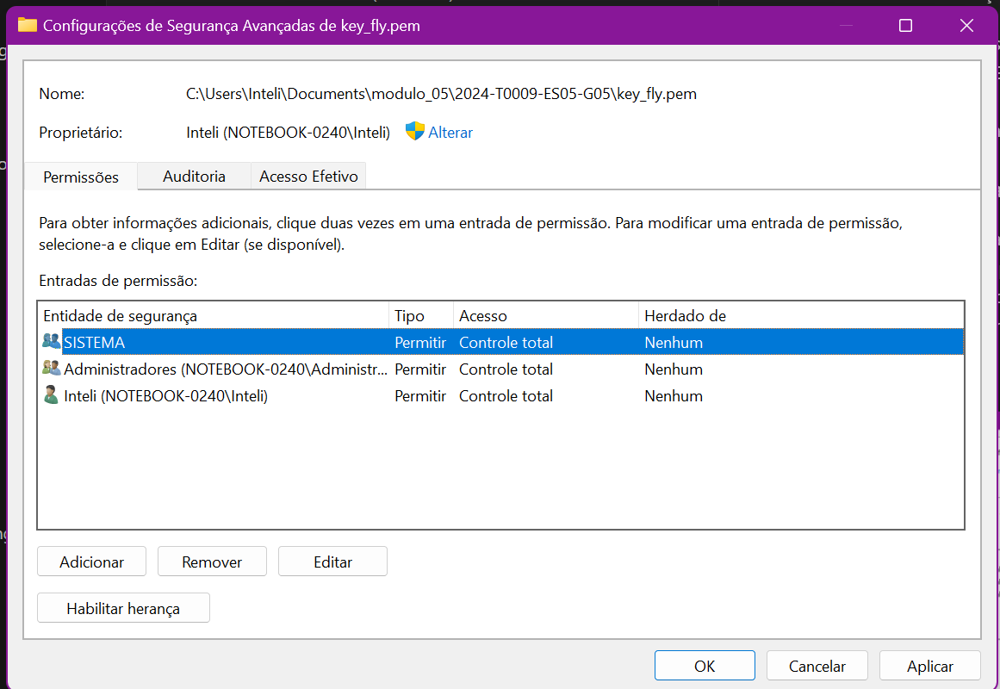

<h6 align="center"> Fonte: Elaborado pelo grupo Fly </h6>

### 12. Atualizar Instância EC2

Após configurar a segurança da chave SSH, procedemos com a atualização da instância EC2 para garantir que todos os pacotes e softwares estivessem atualizados.

<h6 align="center"> Figura 74: Atualizar Instância EC2 </h6>

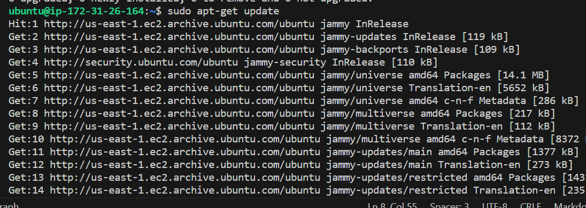

<h6 align="center"> Fonte: Elaborado pelo grupo Fly </h6>

### 13. Instalar npm (Node Package Manager)

Um passo crucial foi a instalação do npm para gerenciar as dependências do projeto e facilitar o desenvolvimento da aplicação/API.

<h6 align="center"> Figura 75: Instalar npm </h6>

<h6 align="center"> Fonte: Elaborado pelo grupo Fly </h6>

### 14. Instalar Node.js

Além do npm, também instalamos o Node.js, que é uma plataforma de execução de código JavaScript que permite executar aplicações do lado do servidor.

<h6 align="center"> Figura 76: Instalar Node.js </h6>

<h6 align="center"> Fonte: Elaborado pelo grupo Fly </h6>

Esses passos foram essenciais para preparar o ambiente de desenvolvimento e configurar a instância EC2 para execução da aplicação/API. Com essas etapas concluídas, estávamos prontos para prosseguir com o desenvolvimento e implantação da nossa aplicação. Após concluir a configuração da instância EC2 e preparar o ambiente de desenvolvimento, procedemos com o clonagem do repositório do GitHub contendo o código-fonte da nossa aplicação/API. Em seguida, instalamos as dependências do projeto e utilizamos a biblioteca PM2 para realizar o deploy da API. Abaixo, detalhamos cada etapa do processo de implementação:

<h6 align="center"> Figura 77: Clonagem do Repositório no GitHub </h6>

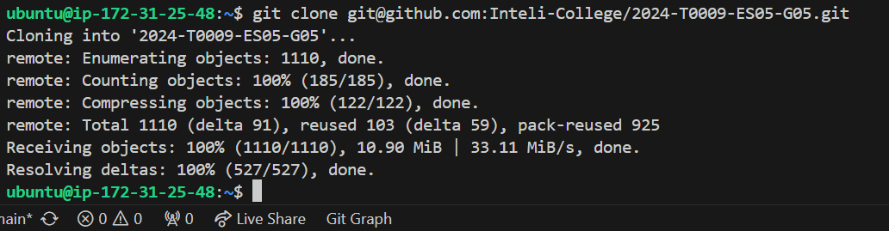

<h6 align="center"> Fonte: Elaborado pelo grupo Fly </h6>

Após configurar a instância e preparar o ambiente, procedemos com a clonagem do repositório contendo o código-fonte da aplicação/API do GitHub. Isso nos permitiu ter acesso ao código atualizado e pronto para implantação.

<h6 align="center"> Figura 78: Instalação das Dependências do Projeto </h6>

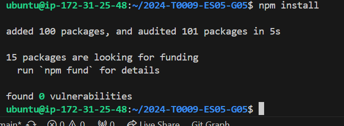

<h6 align="center"> Fonte: Elaborado pelo grupo Fly </h6>

Em seguida, acessamos a pasta do projeto e instalamos todas as dependências necessárias para o correto funcionamento da aplicação/API. Isso incluiu bibliotecas, frameworks e outros pacotes necessários para o desenvolvimento e execução do projeto.

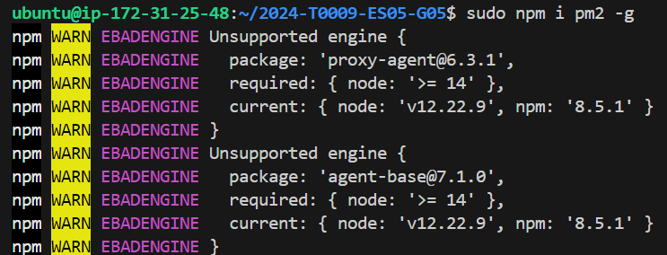

<h6 align="center"> Figura 79: Utilização do PM2 para Deploy da API </h6>

<h6 align="center"> Fonte: Elaborado pelo grupo Fly </h6>

Utilizamos a biblioteca PM2 para realizar o deploy da API, garantindo um processo de implantação simplificado e eficiente. Configuramos o PM2 para iniciar o arquivo principal da aplicação/API e monitoramos o seu funcionamento.

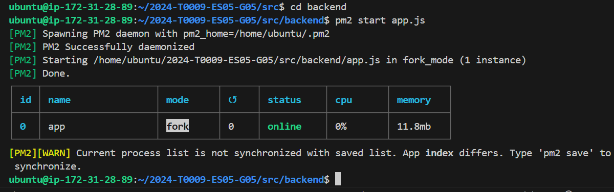

<h6 align="center"> Figura 16: Inicialização da Aplicação/API com PM2 </h6>

<h6 align="center"> Fonte: Elaborado pelo grupo Fly </h6>

Por último o frontend sendo inicializado no terminal.

<h6 align="center"> Figura 80: Inicialização do Frontend na instância</h6>

<h6 align="center"> Fonte: Elaborado pelo grupo Fly </h6>

Por fim, iniciamos a aplicação/API utilizando o PM2 e verificamos que ela estava ativa e funcionando corretamente. Isso foi confirmado pela mensagem de sucesso exibida pelo PM2 após a inicialização da aplicação/API.

Essas etapas foram cruciais para a implementação bem-sucedida da nossa aplicação/API na instância EC2 da AWS. Com isso, nossa aplicação estava pronta para ser acessada e utilizada conforme necessário.

## 9.2 Teste de Integração
<conteúdo>
## 9.3 Testes automatizados
<conteúdo>
## 9.4 Testes de Usabilidade
<conteúdo>

## 9.5 Testes de Requisitos Não Funcionais

&emsp;&emsp; Os Testes de Requisitos Não Funcionais (RNF) são uma parte crucial do processo de desenvolvimento de software, focando na avaliação de aspectos que não estão diretamente relacionados às funcionalidades específicas do sistema, mas que são essenciais para garantir sua qualidade, eficiência e satisfação do usuário. Esses testes abordam características como usabilidade, confiabilidade, desempenho, segurança, entre outros, e sua realização é vital para identificar e corrigir problemas precocemente no ciclo de vida do desenvolvimento, garantindo a solidez e a estabilidade da plataforma desde o início. A seguir, é possível observar alguns testes referentes aos requisitos não funcionais (RNF) citados na seção [5.2](https://github.com/Inteli-College/2024-T0009-ES05-G05/blob/feature/teste-de-requisitos-nao-funcionais/documentos/index.md#52-requisitos-n%C3%A3o-funcionais-sprint-1---descri%C3%A7%C3%A3o-o-teste-deve-ser-colocado-no-t%C3%B3pico-de-testes) 

<h6 align="center"> Tabela x: Testes de Requisitos Não Funcionais  </h6>

| ID | Requisito Não Funcional | Descrição de Teste | Critérios de Aceitação |
|----|-------------------------|--------------------|------------------------|
| RNF01 | Controle de Acesso Baseado em Papéis (RBAC) | **Pré-condição:** Usuários autenticados e com cadastro.  **Procedimento de Teste:** Acessar a plataforma em sua respectiva área conforme seu papel específico: líder da ONG, professor ou membro da equipe da Gerando Falcões.  **Resultado Esperado:** Login na plataforma com sucesso.  **Pós-condição:** Usuários conseguem navegar tranquilamente na plataforma conforme a permissão do seu login. |A plataforma restringe e permite acesso às funcionalidades baseando-se nos papéis dos usuários conforme as políticas de RBAC.|
| RNF02 | Dashboards Interativos |**Pré-condição:** Usuário logado com permissões adequadas para visualizar dashboards interativos.  **Procedimento de Teste:** Usuário seleciona diferentes filtros e opções de visualização de dados no dashboard interativo.  **Resultado Esperado:** O dashboard exibe os dados corretos com base nos filtros aplicados.  **Pós-condição:** O dashboard mostra um conjunto de dados atualizado que corresponde exatamente aos critérios de filtro aplicados pelo usuário. |Os dados no dashboard devem ser precisos e refletir em tempo real as alterações feitas, sem erros técnicos ou atrasos no processamento.|
| RNF03 |  Interface de Usuário Simplificada e Intuitiva |**Pré-condição:** Usuário com baixo letramento digital logado na plataforma.  **Procedimento de Teste:** Usuário tenta realizar uma tarefa básica na plataforma, como cadastrar um novo participante em uma oficina.  **Resultado Esperado:** O usuário consegue completar a tarefa sem dificuldades, seguindo instruções claras e diretas fornecidas pela interface.  **Pós-condição:** O novo participante é cadastrado no sistema. | A tarefa é completada com sucesso pelo usuário sem erros, confusões ou necessidade de ajuda adicional, demonstrando a eficácia da interface simplificada e intuitiva.|
| RNF04 | Sistema de Gerenciamento de Aulas |**Pré-condição:** Usuário logado com perfil de líder da oficina/ONG com permissões para gerenciar aulas. **Procedimento de Teste:** Usuário cria uma nova aula, define o horário e aloca um professor.  **Resultado Esperado:** A aula é criada e agendada com sucesso em determinada oficina.  **Pós-condição:** A nova aula aparece no calendário de aulas da plataforma, com todas as informações corretamente atribuídas e acessíveis.| O sistema de gerenciamento de aulas demonstra ser intuitivo e flexível, permitindo a organização eficaz das aulas sem erros, confusões ou necessidade de suporte técnico adicional.|
| RNF05 | Estabilidade e Precisão no Gerenciamento de Dados |**Pré-condição:** Dados previamente inseridos na plataforma, incluindo detalhes das aulas, informações dos professores e registros de progresso dos alunos.  **Procedimento de Teste:** Realizar uma série de operações de atualização, exclusão e consulta aos dados no sistema para verificar a estabilidade e precisão.  **Resultado Esperado:** Todas as operações de dados são executadas sem erros, os dados atualizados refletem as mudanças corretamente, nenhuma perda de dados ocorre durante o processo, e as consultas retornam informações precisas e atuais.  **Pós-condição:** O sistema mantém a integridade e a precisão dos dados após múltiplas operações, demonstrando a estabilidade do ambiente de gerenciamento de dados.| A plataforma demonstra alta confiabilidade no gerenciamento e armazenamento de dados, com zero perda de informação e precisão nos detalhes das aulas, informações dos professores e progresso dos alunos.|

<h6 align="center"> Fonte: Elaborado por grupo Fly </h6>

&emsp;&emsp; A execução cuidadosa dos testes de requisitos não funcionais desempenha um papel significativo na construção de uma base sólida para o projeto. Ao validar aspectos como segurança, usabilidade e confiabilidade desde as fases iniciais, é possível melhorar a qualidade geral do produto. Esses testes contribuem para a entrega de uma plataforma que não só cumpre com suas funcionalidades prometidas, mas também excede as expectativas dos utentes em termos de desempenho e facilidade de uso, fortalecendo a confiança e a satisfação do usuário final.

# 10. Procedimento de Implantação da Solução
<conteúdo>
## 10.1 Procedimento de Implantação do Sistema
<conteúdo>
## 10.2 Procedimento de Implantação do Banco de Dados
<conteúdo>
## 10.3 Documentação Automática do Sistema (Swagger)
<conteúdo>
# Referências

[1]: Portal do Impacto. "Como a tecnologia pode ajudar as ONGs". Portal do Impacto, 2021. Disponível em: www.portaldoimpacto.com/como-a-tecnologia-pode-ajudar-as-ongs. Acesso em: 15 fev. 2024.

[2]: Funraise. "Sobre o relatório | Relatório Global de Tecnologia de ONGs de 2019". Funraise, 2019. Disponível em: www.funraise.org/techreport-pt. Acesso em: 15 fev. 2024.

[3]: Memori Digital. "Parceria entre empresas: por que investir e como fazer?". Memori Digital, 2021. Disponível em: www.linkedin.com/pulse/parceria-entre-empresas-por-que-investir-memoribr/?originalSubdomain=pt. Acesso em: 15 fev. 2024.

[4]: Business Research Insights. "Tamanho do mercado de ONGs e organizações de caridade [2024 a 2031] Participação, crescimento e análise da indústria". Business Research Insights, 2024. Disponível em: www.businessresearchinsights.com/pt/market-reports/ngos-and-charitable-organizations-market-102744. Acesso em: 15 fev. 2024.

[5]: Portal do Impacto. "Como a tecnologia pode tornar sua ONG mais efetiva". Portal do Impacto, 2021. Disponível em: https://www.portaldoimpacto.com/como-a-tecnologia-pode-tornar-sua-ong-mais-efetiva. Acesso em: 15 fev. 2024.

[6] AMAZON WEB SERVICES. Usando o Amazon VPC. [S.l.], [s.d.]. Disponível em: <2>. Acesso em: 13 fev. 2024.

[7] Elastic Compute Cloud - Amazon EC2 - AWS. Disponível em: <https://aws.amazon.com/pt/ec2/>. Acesso em: 12 fev. 2024.

[8] AWS Academy. 
Disponível em: <https://awsacademy.instructure.com/courses/71789/modules/items/6416354>. Acesso em: 12 fev. 2024.
‌
[9] Computação em nuvem para negócios empresariais – AWS. Disponível em: <https://aws.amazon.com/pt/enterprise/#:~:text=Goldman%20Sachs%2C%20Coca%2DCola%2C>. Acesso em: 12 fev. 2024.

[10] Playstudio. O que é o Canvas de Proposta de Valor e como preenchê-lo? Disponível em: www.playstudio.io/blog/o-que-e-proposta-de-valor-e-como-encontrar#:~:text=Proposta%20de%20valor%20%C3%A9%20o,do%20seu%20produto%20ou%20servi%C3%A7o. Acesso em: 16 fev. 2024.

[11] ANALISTA MODELOS DE NEGÓCIOS. Canvas da Proposta de Valor em PDF. Disponível em: https://analistamodelosdenegocios.com.br/downloads/canvas-da-proposta-de-valor-em-pdf/. Acesso em: 17 fev. 2024.
‌

# Apêndice
